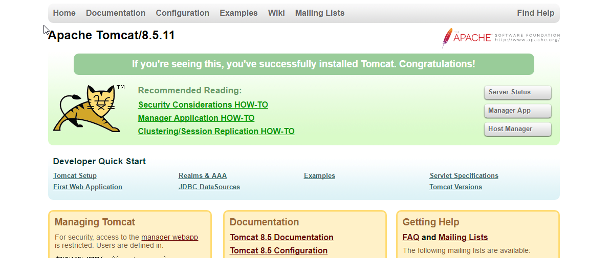
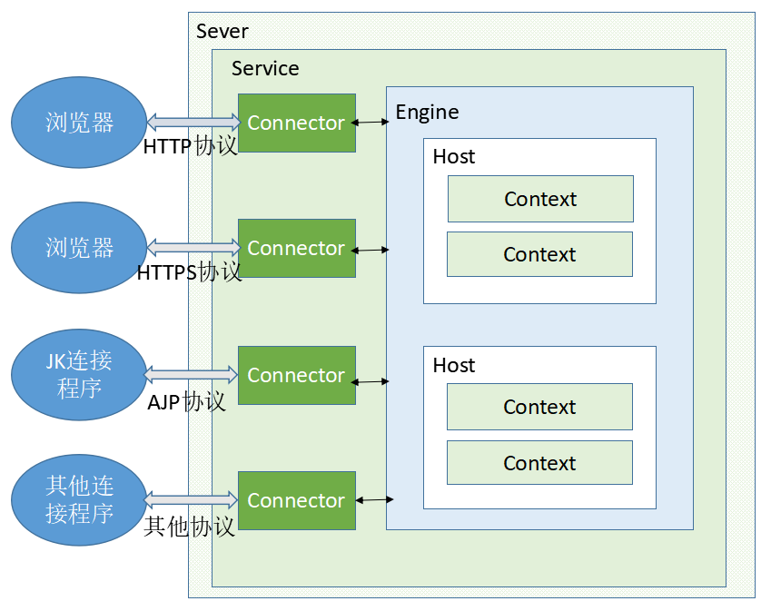
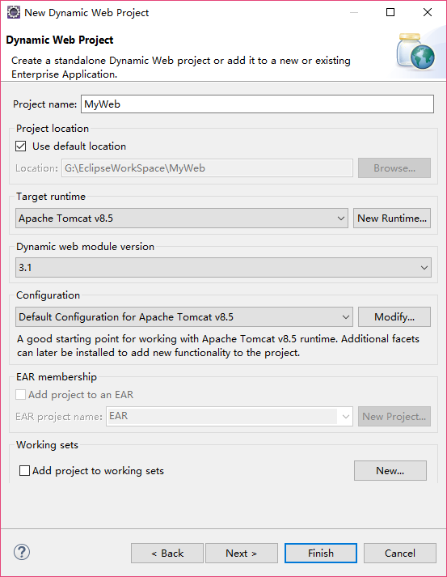
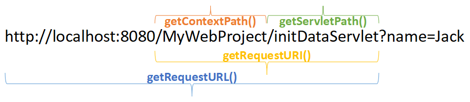

# 1. Web开发概念

　　之前学习Java SE时，编写的程序是本地应用程序，符合C/S结构。Web开发就是开发网页应用程序，网页应用不仅包含用于展现网页内容和效果的HTML页面、CSS样式和JS脚本，还包含应用后端的具体功能的实现。而采用Java EE就可编写后端程序，属于B/S结构。

　　学习Web开发，必须先掌握Java SE知识和基本的前端知识。

## 1.1 服务器和Web服务软件

　　服务器就是在网络上提供服务的设备，如一台配置较好的计算机就能在网络上提供服务。

　　Web服务软件运行在服务器上，它的作用就是把本地的资源共享给外部访问。比如有了Web服务软件，用户就能访问服务器上的网页和文件等资源。

　　进行Java Web开发，也需要用合适的Web服务软件，来将我们开发好的网页应用提供给客户使用。目前常用的Java Web服务器软件有：

　　（1）Tomcat：Apache组织的产品，开源免费，支持大部分Java EE规范，可满足中小型应用的开发。（Java EE就是用Java开发企业级应用的一系列规范。）

　　（2）Jetty：可作为一个嵌入的服务器。

　　（3）JBoss：Redhat公司的产品。

　　另外，还有Resin、WebLogic和WebSphere等适合Java EE的产品。在目前学习阶段，使用的是Tomcat。

　　实际上学习了网络编程后，完全可以用Java SE自行实现一个简单的Web服务器软件，比如我们使用TCP协议监听本机8080端口，当有请求过来时，就用流输出一些数据。那么我们使用浏览器访问该端口时，就会得到这些数据。（必须使用可靠的TCP协议，这是显而易见的）

## 1.2 网址中的一些概念

　　我们使用浏览器访问网页，如果要访问百度的首页，则访问的地址是“ http://www.baidu.com/index.html ”。服务器一般用80端口对外提供HTTP访问，因此完整的地址是：

```
http://www.baidu.com:80/index.html
```

　　只不过浏览器地址栏中不显示默认的80端口，如果不是80端口，则会正常显示。当然，现在很多网站提供的是HTTPS协议，比HTTP更加安全，HTTPS默认使用的端口是443，因此现在的百度首页地址实际是（对于HTTPS协议，浏览器也不会显示默认的443端口）：

```
https://www.baidu.com:443/index.html
```

　　我们现在对网址进行分析，其中：

　　（1）“ http:// ”或者“ https:// ”代表使用的是HTTP或者HTTPS协议；

　　（2）“www.baidu.com”是主机名，而“baidu.com”是域名。域名是通过DNS服务器找到其对应的IP的。一个域名下可以有多个主机，例如“music.baidu.com”、“zhidao.baidu.com”等；

　　（3）“:80”就指明了连接的端口，一般是80，但我们下面使用的Tomcat默认的端口是8080，因此需要指明。

　　（4）最后就是指明要请求的主机的资源了，就是要请求“index.html”这个资源。

# 2. Tomcat服务器

　　开发Web应用，首先要在本机搭建一个服务器，以便在本机部署、运行和查看开发的Web应用。我们选用Tomcat。

## 2.1 安装和运行

　　首先到apache的tomcat官网http://tomcat.apache.org/ 下载最新稳定版本的安装包。我们选择Download中的Tomcat 8，目前是8.5.11版本。在Core里面有很多版本，前两个压缩包是各平台通用的，后三个使用于Windows平台。我们选择windows-x64.zip压缩包即可。若项目在Windows平台上投入运行时，可选择最后一个安装版本，方便使用。

　　下载完后，直接将文件解压到某个目录中，这个自行确定。这时就完成了“安装”。我们进入Tomcat安装目录下的bin目录，里面提供了一些程序。

　　双击运行startup.bat即可运行Tomcat服务器软件，注意运行时，不要关闭此窗口。若想关闭Tomcat服务器，则双击运行shutdown.bat即可。

　　开启Tomcat后，可在浏览器中访问http://localhost:8080地址以验证Tomcat服务开启成功。若开启成功，访问此地址会顺利进入Tomcat页面。即：



　　因为Tomcat默认监听的端口就是本机的8080端口。

　　常见的Tomcat不能启动的问题：

　　（1）Tomcat基于Java开发，因此要确保本机Java环境安装正确，否则就会闪退。

　　（2）端口占用错误：8080端口可能已经被其他应用占用了。方法一就是找到占用端口的进程，杀掉此进程。方法二是修改Tomcat默认的端口：打开Tomcat安装目录下conf目录下的server.xml文件，修改Connector标签中的port属性，比如改为8090。这样就能修改Tomcat监听端口为8090，启动后，访问地址也为localhost:8090。

　　（3）查看系统中是否有CATALINA_HOME这个环境变量，如果有，删除它。因为该变量的作用是设置Tomcat的根目录。如果之前安装过tomcat的Windows安装版程序，该程序会自动设置好该环境变量。这样此时启动Tomcat时，仍然会到CATALINA_HOME设置的目录中启动Tomcat，因此导致启动不成功。不设置该变量的话，默认就启动当前目录下的tomcat。

## 2.2 Tomcat的目录结构

　　bin：存放可执行命令。

　　conf：存放配置文件；其中server.xml是核心配置文件。

　　lib：存放Tomcat服务器的核心类库。如果需要扩展Tomcat的功能，也可以将第三方类库复制到该路径下。

　　logs：存放Tomcat产生的日志文件。系统产生的异常信息都会保存在日志文件中，因此如果Tomcat不能启动或者项目出错，都能在日志文件中查看到详情。

　　temp：用于存放临时文件。

　　webapps：该路径用于部署Web应用。将Web应用复制在该路径下，Tomcat就会自动部署该应用。应用资源不能直接放在webapps目录下，必须在webapps中新建一个文件夹，将资源放入文件夹中，访问时要带上该文件夹名。比如将1.html放在webapps/mytest下，则访问路径是：localhost:8080/mytest/1.html。

　　work：tomcat的运行目录。JSP运行时产生的临时文件就存放在这里。

## 2.3 体验Tomcat的作用

　　我们先写一个静态HTML页面，比如叫index.html。现在目的是通过Tomcat发布此页面，让本机浏览器和本机所在局域网中的其他人能访问该页面。步骤如下：

　　（1）应用要放在webapps目录下，一定要新建一个文件夹再将这些资源放进去。该文件夹就相当于该应用的“应用名”。比如新建的文件夹是exp。

　　（2）开启Tomcat服务器，访问地址：http://localhost:8080/exp/index.html 即可。如果你改过端口号，还要把8080改成你设置的端口。如果局域网其他人想访问此页面，只要将localhost换成你的机器的IP地址即可。

　　实际上浏览器访问的流程如下：

　　浏览器先找到系统的hosts文件，看里面有没有域名对应的ip地址。比如hosts里面定义了localhost的ip地址是127.0.0.1，localhost是本地域名。如果有，则直接按照hosts里对应的IP直接访问，如果没有，再向外面请求域名服务器DNS。

## 2.4 Tomcat的架构分析

　　Tomcat的架构图如下：



　　从图中可以看出：

　　整个Tomcat服务器通过一个Service向外界提供服务。在服务Service中维护了一个Engine和多个Connector（连接器）。

　　连接器Connector的作用是接收外界连接，并将连接信息交给Engine，Engine负责处理请求，最后Engine将资源返回给Connector，Connector再返回数据给客户端。Connector连接器就相当于客户端和服务器资源之间的“桥梁”。Tomcat中可配置多个连接器，每个连接器会占用端口以提供服务。例如Tomcat默认配置有一个基于HTTP的Connector和一个基于AJP协议的Connector，其中HTTP协议的Connector占用8080端口，因此我们开启服务器后可访问8080端口访问服务器资源。其中的AJP协议占用的是8009端口，JK连接程序就使用AJP协议与Tomcat通信。当然，这些默认的配置都是可以更改的。并且我们也能自行添加多个连接器（注意占用的端口不能冲突），例如（参照默认的配置）：

```xml
<Connector port="8081" protocol="HTTP/1.1" connectionTimeout="20000" redirectPort="8443" />
```

　　这样可以使用多个端口和Tomcat通信，既可以用浏览器访问8080端口，又可以访问8081端口。

　　Tomcat中，Engine只有一个，因此多个连接器与同一个Engine通信。Engine下可配置多个虚拟主机Host。例如我们配置一个名为“www.zhang.com”的主机：
```xml
<Host name="www.zhang.com"  appBase="zhangwebs" unpackWARs="true" autoDeploy="true">
    <!-- 这里的Valve标签用于配置该主机输出的日志文件 -->
    <Valve className="org.apache.catalina.valves.AccessLogValve" directory="logs" prefix="localhost_access_log" suffix=".txt" pattern="%h %l %u %t &quot;%r&quot; %s %b" />
</Host>
```

　　当Engine接收到Connector的连接信息时，就会分析该连接请求的是哪个主机，如果请求的是“www.zhang.com”主机，就会将该主机下对应的资源响应回去（该主机的资源根目录是配置的“zhangwebs”）。那为什么我们之前没有配置主机名，直接通过IP地址（或localhost）也能访问Tomcat资源呢？那是因为Tomcat默认有个名为localhost的主机：

```xml
<Host name="localhost"  appBase="webapps" unpackWARs="true" autoDeploy="true">
    <Valve className="org.apache.catalina.valves.AccessLogValve" directory="logs" prefix="localhost_access_log" suffix=".txt" pattern="%h %l %u %t &quot;%r&quot; %s %b" />
</Host>
```

　　并且Engine节点中使用的默认主机（defaultHost）就是这个名为“localhost”的主机：

```xml
<Engine name="Catalina" defaultHost="localhost">
```

　　因此默认访问的就是localhost这个主机。而这个主机的appBase（应用的根目录，是相对于Tomcat根目录的相对路径）为“webapps”，所以我们之前会把应用部署在webapps目录下。现在我们配置了“www.zhang.com”这个主机，该主机对应的应用根目录appBase是“zhangwebs”，因此我们也可在Tomcat中新建“zhangwebs”目录，然后在“zhangwebs”目录下存放应用，这样我们访问“ http://www.zhang.com:8081/应用名 ”时就能访问到“zhangwebs”下的应用。当然，前提是客户端访问“zhang.com”时，能跳转到本机IP地址，这是需要DNS解析服务器支持的。

　　一般域名提供商会提供相应的服务，让你选择域名和对应的二级域名分别解析到哪个IP地址上。如果不指定的话，所有的二级域名默认指向的是一级域名的IP地址，因此可以自行指定多个二级域名分别指向哪些IP地址。当Tomcat服务器接收到这些请求时，就会根据二级域名的主机名请求各个虚拟主机的内容。

　　上述就是HOST的作用。我们能体会到主机名有两个用途：

　　（1）查找IP地址

　　（2）在服务器中查找要访问的主机。

　　这里还有一个问题，就是我们访问“localhost:8080”时，并没有指明应用名，为什么也能访问资源呢？那他访问的是哪个应用呢？当不指定应用名时，Tomcat默认会请求虚拟主机中ROOT目录中的应用，也就是说我们访问“localhost:8080”时，逻辑上访问的地址是“localhost:8080/ROOT”，但实际上并不能指明ROOT目录。如果我们在zhangwebs目录下新建ROOT目录，其中有index.html页面，那我们访问“ http://www.zhang.com:8081 ”时访问的应用就是该index.html页面。当前前提还是客户端访问该域名时能指向该服务器的IP（下面我们会使用host文件进行模拟）。

　　上述的架构图其实就是Tomcat的server.xml配置文件的层次结构图。

## 2.5 Tomcat的访问流程

　　从客户端开始。例如客户端访问“exp.zhang.com”，先找本机的host文件看有无“exp.zhang.com”对应的IP地址，若没有，就从DNS服务器解析域名得到IP。通过IP和端口就能访问到服务器上的Tomcat，Tomcat的Connector接收请求，发给Engine处理，Engine找到相应主机对应的资源并返回。

## 2.6 设置Tomcat虚拟目录的三种方式

　　虚拟目录就是虚拟主机中应用的目录。Tomcat中有以下三种方式部署应用（设置虚拟目录）：

　　第一种：将应用文件夹直接放到主机名对应的appBase应用根目录下，这是最普通的方式。例如我们将应用文件夹放入webapps目录下，访问时直接用“ http://主机名:端口/应用文件夹名 ”即可。如果配置多个主机，将应用放入对应的应用根目录下即可，比如“zhangwebs”目录。

　　这种方式是将应用资源放入Tomcat目录中了，有时我们并不想将应用放入Tomcat目录中，比如Tomcat在D盘，我的应用在E盘，我想直接把E盘的应用部署到Tomcat中。Tomcat是支持这样部署的，需要在Tomcat中进行配置，一般使用以下两种方式进行配置：

　　第二种：在Tomcat的server.xml配置文件中，在对应主机Host节点下，添加Context的节点配置。在Context中需要配置两个属性，一个是path，即指明该应用在主机中的访问路径，另一个是docBase，即指明该应用的目录。例如在名为“localhost”的主机中添加如下Context节点：

```xml
<Context path="/myCtx" docBase="E:\MyExtProject" />
```

　　那么启动Tomcat后直接访问“localhost:8080/myCtx”即可。

　　第三种：在Tomcat的conf/Catalina目录下，还有主机名目录，在对应的主机名目录（例如localhost）下，新建一个xml文件，文件名就是待访问的应用名，文件内容写Context标签，加上docBase应用位置这个属性即可。例如新建一个myCtx2.xml文件，内容为：

```xml
<Context docBase="E:\MyExtProject" />
```

　　那么启动Tomcat后直接访问“localhost:8080/myCtx2”即可。

## 2.7 山寨百度

　　最后我们基于上述的知识，做一个“山寨百度”的实战。需要实现的效果：本机浏览器输入“ http://www.baidu.com ”后，直接跳转到我们在Tomcat上山寨的“百度”页面。

　　下面是实现的步骤：

　　（1）首先，为了能使我们浏览器访问“www.baidu.com”时访问的是本机的IP，应该修改本机的hosts文件，因为DNS服务器我们是修改不了的。Windows中，hosts文件所在目录是：“C:\Windows\System32\drivers\etc”。由于hosts文件是系统重要文件，修改时需要管理员权限，因此我们用管理员权限打开notepad++，然后在notepad++中编辑此文件，添加一行内容为：

```
127.0.0.1 www.baidu.com
```

　　让请求“www.baidu.com”时指向本机IP。

　　（2）在Tomcat中，配置Connector的HTTP端口为80，并配置一个名为“www.baidu.com”的虚拟主机，应用根目录为baidu：

```xml
<Host name="www.baidu.com"  appBase="baidu" unpackWARs="true" autoDeploy="true">
    <Valve className="org.apache.catalina.valves.AccessLogValve" directory="logs" prefix="localhost_access_log" suffix=".txt" pattern="%h %l %u %t &quot;%r&quot; %s %b" />
</Host>
```

　　（3）在Tomcat目录中新建baidu目录，并在baidu目录下创建ROOT应用目录，在ROOT目录中新建index.html文件，内容如下：

```html
<!DOCTYPE html>
<html lang="zh-CN">
<head>
    <meta charset="UTF-8">
    <title>百度一下，你就知道</title>
    <style type="text/css">
        .center {
            text-align: center;
        }
    </style>
</head>
<body>
<div class="center">
    <h1>百度一下，你就知道</h1>
    <input type="text"><button>百度一下</button>
</div>
</body>
</html>
```

　　这样，开启Tomcat，本机直接访问“www.baidu.com”就能访问到我们的山寨页面了。

　　总结一下：修改hosts是为了访问“www.baidu.com”时能跳转到本机IP，然后就是配置Tomcat的端口和主机，并在主机对应的“baidu”文件夹下创建ROOT文件夹，再将index.html放入ROOT中，因为ROOT是默认访问的应用。实际不配置“www.baidu.com”主机名也行，因为默认也会访问“localhost”主机名，这里这样做是为了加深对Tomcat配置的理解。

# 3. 动态资源开发技术：Servlet

　　动态资源就是用程序的来控制输出不同内容的HTML页面。Servlet是用Java语言开发动态网站的技术。比如一个页面将用户的登录信息发送给后端Servlet，Servlet中有Java代码连接数据库验证用户信息的合法性，最后根据结果返回不同内容的HTML。这些工作就是后端来做的。

## 3.1 第一个Servlet程序

　　Oracle只提供了Servlet的规范，具体的由各个服务器厂商实现。Tomcat的lib目录的servlet-api.jar就是实现Servlet的jar包。现在我们在项目中引入此包，完全可以在Java SE项目下开发第一个Servlet程序。

　　引入jar包后，新建一个Servlet类，名叫MyServlet，要求Servlet继承自HttpServlet。Servlet中可以重写doGet()和doPost()方法，分别用于处理网页的GET和POST请求。示例如下：

```java
public class MyServlet extends HttpServlet {
    @Override
    protected void doGet(HttpServletRequest req, HttpServletResponse resp) {
        
    }

    @Override
    protected void doPost(HttpServletRequest req, HttpServletResponse resp) {
        
    }
}
```

　　由于Servlet是在Tomcat服务器中运行的，因此并不要写main主方法。方法中有两个参数，分别是HttpServletRequest和HttpServletResponse对象，其中就用于封装网络请求和响应。

　　现在我们正式写好第一个Servlet类：

```java
package com.zhang.test;

import javax.servlet.http.HttpServlet;
import javax.servlet.http.HttpServletRequest;
import javax.servlet.http.HttpServletResponse;
import java.io.IOException;
import java.util.Date;

public class MyServlet extends HttpServlet {
    @Override
    protected void doGet(HttpServletRequest request, HttpServletResponse response) throws IOException {
        // 现在只处理GET请求
        // 用response对象设置返回的响应数据

        // 设置响应编码为utf-8，防止中文乱码
        response.setContentType("text/html;charset=UTF-8");
        // 想浏览器输出内容
        response.getWriter().write("你好，当前时间为：" + new Date());
    }
}
```

　　该Servlet处理类返回了当前服务器时间。现在，需要把该类放到Tomcat中运行，并能接收浏览器请求返回相应数据。步骤如下：

　　（1）首先在webapps目录下新建一个文件夹，比如叫DynamicWeb，即我们的“网站”就叫DynamicWeb，然后我们需要将资源全部放在此目录下。

　　（2）Java Web应用的资源是有规范的，首先应该在DynamicWeb下创建一个WEB-INF文件夹，该文件夹下创建一个web.xml文件和一个classes目录。该web.xml用于配置该网络应用，而classes目录下专门用于存放Java代码生成的字节码文件。

　　（3）首先拿到我们MyServlet的字节码文件MyServlet.class，因为IDE会自动编译保存的Java文件，所以在IDE中很容易拿到。然后将MyServlet.class放入classes目录下，注意的是，由于MyServlet类是在包com.zhang.test中的，因此必须要在classes下新建com/zhang/test目录，然后把字节码放入test目录中，否则无效。

　　温馨小提示：如果我们不依赖IDE的自动编译，自己如何手动基于jar包（例如本例中的servlet-api.jar）来编译该MyServlet.java文件呢？应该编译时指定classpath：

```
javac -cp .;C:\Tomcat\lib\servlet-api.jar -d . MyServlet.java
```

　　或者在执行javac之前设置一下临时classpath：

```
set classpath=%classpath%;C:\Tomcat\lib\servlet-api.jar
```

　　其实自己要清楚IDE只是帮助我们完成了这些步骤，而并不是通过什么神奇的手段。相关具体信息可以参见书籍《Java学习笔记》第二章。

　　（4）配置web.xml文件，主要就是配置该Servlet的访问路径（映射）。例子：

```xml
<?xml version="1.0" encoding="UTF-8"?>
<!-- Schema约束 -->
<web-app xmlns:xsi="http://www.w3.org/2001/XMLSchema-instance" xmlns="http://xmlns.jcp.org/xml/ns/javaee"
         xsi:schemaLocation="http://xmlns.jcp.org/xml/ns/javaee http://xmlns.jcp.org/xml/ns/javaee/web-app_3_1.xsd"
         id="WebApp_ID" version="3.1">
    <!-- 欢迎页列表。可配置多个欢迎页面。如果存在欢迎页面，则访问该项目根目录时，会直接显示该欢迎页。 -->
    <welcome-file-list>
        <welcome-file>index.html</welcome-file>
        <welcome-file>index.jsp</welcome-file>
    </welcome-file-list>
    <!-- servlet标签用于配置程序中的一个servlet -->
    <servlet>
        <!-- 定义该Servlet的名称 -->
        <servlet-name>MyFirstServlet</servlet-name>
        <!-- 指定Servlet所在的类 -->
        <servlet-class>com.zhang.test.MyServlet</servlet-class>
    </servlet>
    <!-- servlet-mapping用于配置一个Servlet的访问路径 -->
    <servlet-mapping>
        <!-- servlet的名称，和上面的一致 -->
        <servlet-name>MyFirstServlet</servlet-name>
        <!-- 指定该servlet的访问路径，就是浏览器访问的路径。一定要写上斜杠 -->
        <url-pattern>/hello</url-pattern>
    </servlet-mapping>
</web-app>
```

　　web.xml中指明了可以用/hello路径来访问此Servlet。

　　（5）最后，我们启动Tomcat，在浏览器中输入：localhost:8080/DynamicWeb/hello 即可得到响应结果。至此我们完成了第一个Servlet的开发。

　　我们一般说Tomcat是Servlet/WEB容器，从上面可见一斑。因为Tomcat能运行处理Servlet类和JSP页面（JSP实际也是Servlet）。Servlet的本质就是具备一定功能的java 类，利用Servlet能产生动态的HTML页面。

## 3.2 在Eclipse中开发Servlet

### 3.2.1 在Eclipse配置Tomcat

　　上述的过程只是为了简单了解Servlet是如何运作的，当然实际开发中不可能这么做。IDE中对Java Web开发提供了很好的支持，能够提升开发效率。下面讲如何在Eclipse中进行开发。当然，你选择的版本一定要是Eclipse IDE For Java EE Developers版本，而不是“For SE”版本。

　　首先在Eclipse中配置好Tomcat。点击Window -> Proferences ，选择左边树状菜单中Server中的“Runtime Environments”一项。点击右侧界面的“Add...”按钮，选择Apache下的对应的Tomcat版本（这里选择v8.5），随后点击“Next”，浏览选择我们Tomcat的安装目录。最后Finish完成。

　　随后在Eclipse中新建一个Tomcat服务器实例。点击Window -> Show View -> Servers，显示服务器选项卡。点击Servers中的蓝色链接新建一个服务器，就选择新建一个Tomcat v8.5，其他保持默认，点击Finish完成。

　　最后，双击新建完成的服务器，进行如下配置：在Server Locations中选择“Use Tomcat installation”一项，并且修改Deploy Path为webapps。这样才算完成Tomcat配置。如果不进行最后这项配置，也能运行项目，但是默认不会把项目部署到Tomcat的安装路径。为了直观就这样配置，方便查看。如果以后采用了Maven管理项目，就无所谓了。

### 3.2.2 新建Java Web项目

　　首先新建一个Project，选择Web下的Dynamic Web Project，点击Next，输入项目名，下面各项选择和Tomcat有关的最新版本，例如：



　　点击Next，不变，再点击Next，把“Generate web.xml deployment description”勾选上，这样会自动帮我们创建web.xml文件。此页面的Content directory可以不改，不过以前人们喜欢改成“WebRoot”。最后点击Finish完成。

　　提示：如果发现点击Finish后，Eclipse卡在“installing dynamic web module facet”，则先断开网络连接，重新新建项目即可。

　　建好项目以后，发现项目的WebContent文件夹下和我们需要复制到Tomcat目录下的文件结构基本一致。实际上项目运行时，Eclipse会自动把工作空间中WebContent目录下的内容复制到Tomcat对应的我们的应用文件夹中。这里的WebContent就相当于一个“虚拟目录”。这样的话，进行开发部署调试就很方便。因为IDE自动把项目部署到本地服务器上。

　　WebContent目录中可新建资源文件和文件夹，比如HTML等，因为运行项目时，此目录下资源会被复制到Tomcat/webapps/我们的应用目录下。其中，WEB-INF/lib文件夹中专门用于存放项目中需要使用的第三方jar包。Web项目中，直接把第三方jar包复制到此目录中即可完成jar包导入，是自动的。

　　新建好项目，即可编写Servlet了。在项目上右键New可直接新建Servlet等，但是不推荐这样用（设置较繁杂且生成垃圾代码多），还是自己新建Class类自行编写配置。

　　可以按照第一个Servlet示例编写Servlet和web.xml文件。编写完毕后，选中Servers选项卡中我们新建好的服务器，右键“Add and Remove...”，把项目添加到右边中，这样就完成部署了，最后右键服务器点击“Start”即启动项目。启动完毕我们即可在浏览器中浏览了。

## 3.3 使用Servlet注解

　　在上述开发Servlet时，我们使用web.xml文件配置了Servlet的访问路径。每个Servlet都要在web.xml中写相应的配置，这样比较麻烦。我们之前学习过注解，可以用来简化配置。在Servlet中也可以使用注解，现在Servlet的最新版本是3.1（我们新建项目时选择的Dynamic Web module version就是3.1版本），对注解有很好的支持。

　　在Servlet类上使用@WebServlet注解来配置此Servlet。@WebServlet中用name属性表示此Servlet名称，用urlPatterns属性表示此Servlet的映射地址。其中urlPatterns必须要写，否则无法访问。urlPatterns类型是数组，说明可以让多个地址访问同一个Servlet。

　　例子：

```java
package com.zhang.test;

import javax.servlet.annotation.WebServlet;
import javax.servlet.http.HttpServlet;
import javax.servlet.http.HttpServletRequest;
import javax.servlet.http.HttpServletResponse;
import java.io.IOException;
import java.util.Date;

@WebServlet(urlPatterns = {"/hello", "/world"})
public class MyServlet extends HttpServlet {
    @Override
    protected void doGet(HttpServletRequest request, HttpServletResponse response) throws IOException {
        response.setContentType("text/html;charset=UTF-8");
        response.getWriter().write("你好，当前时间为：" + new Date());
    }
}
```

　　之后就能通过localhost:8080/你的应用名/hello或者/world进行访问此Servlet了。注意，不能同时用注解和web.xml进行Servlet的配置。可以感觉到使用注解确实简化了配置。

# 4. Servlet处理请求和响应

## 4.1 HTTP协议

　　HTTP协议就是客户端（浏览器）和服务器之间传输数据的协议规范。HTTP通信基于TCP协议，它包含了HTTP请求和响应。我们用Servlet处理的也主要是请求和响应的数据。

　　先了解下HTTP请求。客户端会发送HTTP请求服务器网页资源，比如HTML，请求的格式和内容基本如下：

```
POST /MyApps/test.html HTTP1.1     -- 第一行是请求行。以下都是请求头（即多个键值）。
Host: localhost:8080              -- 请求的主机地址（主机:端口）
Accept: text/html,image/*         -- 浏览器接受的数据类型，包括html文本和各种格式的图像(因为用了通配符*)
Referer: http://www.it.org/index.html    -- 表示当前请求来自该网络地址
User-Agent: Mozilla/5.0 (Windows NT 10.0; Win64; x64) AppleWebKit/537.36 (KHTML, like Gecko) Chrome/56.0.2924.76 Safari/537.36  -- 表示客户端浏览器类型等信息
Cookie: name=eric                 -- 浏览器保存的cookie信息
Connection: keep-alive             -- 表示保持连接
                                --请求头结束，要有一个空行
Name=123&age=23                -- 实体内容，即传递到服务器的参数数据，是可选的
```

　　说明：

　　（1）第一行是请求行，其中说明了请求方式（GET或者POST）、请求的资源和HTTP协议版本。现在基本都会使用1.1版本，HTTP2 也会日渐流行。

　　（2）请求行的下面就是请求头了。请求头可有多个，每个请求头都是一个“键值对”，注意规范的格式是冒号后面要有一个空格再写值。表中列出了常见的请求头。

　　（3）请求头结束以后，如果有请求参数，那么需要空一行再写请求参数。各请求参数用&符号分隔。

　　（4）目前我们可用表单提交POST和GET请求，这点在学习HTML时已经很清楚。POST和GET就是用不同的方式向服务器传递参数数据，马上就学习如何在Servlet中得到数据并处理。两种请求区别在于：表单提交GET方式时，地址栏会将显示请求的数据，例如“/test?name=ABC”之类的，不利于保密；且GET请求内容大小不能超过1KB。而使用POST提交时，数据不会显示在地址栏中，而是在请求实体内容中传递。且POST请求内容没有大小限制。

　　（5）POST后面使用的是URI路径。需要注意URI和URL的区别：

　　URI是统一资源标记符。可用于标记任何位置的资源，包括互联网、本地文件系统和局域网的资源，比如：//192.168.14.10/book/css.pdf。

　　URL是统一资源定位器。比如http://localhost:8080/day/tes.html。URL用于说明如何找到该资源，比如说明了是HTTP协议，能容易的找到资源。URL是URI的子集。

　　同样，HTTP响应也包含了响应行、响应头和实体内容，比如：

```
HTTP/1.1 200 OK                  -- 响应行（下面开始是响应头）
Server: Apache-Coyote/1.1          -- 服务器名称
Content-Length: 24                -- 表示服务器发送给浏览器的数据长度
Date: Fri, 30 Jan 2015 01:54:57 GMT  -- 服务器时间。注意服务器返回的时间时GMT时间，即格林尼治当地标准时间，该时间和我们东八区的时间相差8小时。因此不要以为是服务器的时间错误。
Content-Type: text/html; charset=UTF-8  -- 表示服务器响应数据的类型和编码
Set-Cookie: name=eric; path=/search  -- 表示服务器设置给浏览器的Cookie信息
                                 -- 一个空行，下面是实体内容，比如HTML数据
<html>This is HTML.</html>                  -- 实体内容
```

　　需要说明的是响应行中返回的状态。200就是响应的状态码，状态码后面是对此状态码的描述。常用的状态码有：

|状态码   |       含义       |
|:-------:|:-----------------|
|200      |   表示响应成功   |
|302      |  表示资源重定向  |
|404      |    找不到资源    |
|500      |  服务器内部错误  |

　　HTTP请求可以使用“Fiddle”软件进行查看。Fiddle能拦截本机所有的HTTP请求和响应，Fiddle界面的左侧是连接列表，右侧选择查看的详情。一般在“Inspectors”中查看详情，其中的“Raw”选项卡中显示了HTTP的原始数据。

## 4.2 Servlet获得请求头和请求参数

　　在doGet和doPost方法中，有两个参数，其中HttpServletRequest对象req就专门用于封装请求信息，包括请求头和请求的参数等信息。

　　如果客户端发送的是GET请求，那么执行的就是doGet()方法，若发送的是POST请求，则会执行doPost()方法。

　　（1）用req获得请求行信息：

　　req.getMethod()：获得请求方式（POST 或GET）

　　req.getProtocol()：获得请求的协议名称。比如HTTP/1.1。

　　req.getScheme()：获得请求的Scheme。比如http、https、ftp等。

　　（2）用req获得请求头信息：

　　req.getHeader(String arg)：获取指定的请求头值。比如req.getHeader(“User-Agent”)。

　　req.getHeaderNames()：获得请求中所有的请求头名字。返回的是Enumeration<String>集合。通过此方法能得到所有的请求头名字，再通过getHeader()方法就能得到所有请求头键值。

　　（3）获取请求参数：

　　req.getParameter("参数名")：获取指定参数名的参数值。注意，此方法只能获取一个参数的值。有时复选框会上传通过参数的多个值，就要用下面的方法：

　　req.getParameterValues("参数名")：即根据参数名获取参数值数组，这样就能获得checkbox的多个值。

　　req.getParameterNames()：获取所有参数名称列表，返回的还是Enumeration<String>。

　　对于GET请求，可直接用req.getQueryString()方法获得请求中传输的字符串；

　　对于POST请求，需要用req.getInputStream()方法获得请求中传输的实体数据。然后用流的方式读取数据。

（4）其他信息：

　　request.getContentType()：获得请求体的MIME类型，实际上就是返回Content-Type请求头内容，相当于request.getHeader("Content-Type")。因为请求也是可以发送这些头信息的，可以在Postman中测试。如果没有发送Content-Type头，则返回null。

　　request.getComtentLength()：获得请求体的长度。对于GET请求无请求体，则返回-1。

　　request.getLocale()：返回客户端优先接收的区域信息，该信息实际上是基于Accept-Language请求头的，如果无该请求头，返回默认的区域信息。比如返回“zh_CN”这个区域信息。

　　request.getRemoteAddr()：获得客户端IP地址

　　request.getRemoteHost()：获得客户端主机名称

　　request.getRemotePort()：获得客户端的连接端口

　　request.getServerName()：获得服务器主机名称

　　request.getServerPort()：获得服务器的连接端口。

　　（5）request中几个获得路径API的说明：

　　request对象提供了getRequestURL()、getRequestURI()、getServletPath()和getContextPath()几个方法，他们都用于获得请求的路径信息，但有区别。下面以访问“ http://localhost:8080/MyWeb/initData?name=Jack ”作为示例讲解。其中MyWeb是应用名，initData可以映射到我们开发的一个Servlet，因此可以访问。其后的“?name=Jack”是请求参数。

　　request.getRequestURL()：返回不带请求参数的URL路径。即“ http://localhost:8080/MyWeb/initData ”。

　　request.getRequestURI()：将上述的部分URL信息以URI返回。示例返回的结果是“/MyWeb/initData”，更多示例请参考API文档。即从域名（或IP地址）的端口后的第一个“/”一直截取到最后一个“/”，不带请求参数。

　　request.getContextPath()：获得应用的路径。本示例中，返回的是“/MyWeb”。

　　request.getServletPath()：获得本Servlet的路径。本示例中，返回的是“/initData”。

　　示意图如下：



## 4.3 请求对象HttpServletRequest的应用

### 4.3.1 请求头的应用

　　上述讲了request对象的常用方法，现在进行实际应用。

　　例1：获得请求头信息。根据user-agent请求头判断用户的浏览器。

```java
package com.zhang.test;

import java.io.IOException;
import java.util.Enumeration;

import javax.servlet.ServletException;
import javax.servlet.annotation.WebServlet;
import javax.servlet.http.HttpServlet;
import javax.servlet.http.HttpServletRequest;
import javax.servlet.http.HttpServletResponse;

@WebServlet(urlPatterns = {"/checkBrowser"})
public class MyServlet extends HttpServlet {
    @Override
    protected void doGet(HttpServletRequest req, HttpServletResponse resp) throws ServletException, IOException {
        // 首先设置响应类型和编码
        resp.setContentType("text/html;charset=utf-8");
        // 获得所有请求头名称集合
        Enumeration<String> headerNames = req.getHeaderNames();
        // 遍历，输出
        while (headerNames.hasMoreElements()) {
            String headerName = headerNames.nextElement();
            resp.getWriter().write("请求头名称：" + headerName + " 请求头值：" + req.getHeader(headerName) + "<br>");
        }
        
        // 获得user-agent请求头
        String userAgent = req.getHeader("user-agent");
        if (userAgent.contains("Chrome")) {
            resp.getWriter().write("您使用的是Chrome浏览器");
        } else if (userAgent.contains("Firefox")) {
            resp.getWriter().write("您使用的是Firefox浏览器");
        } else if (userAgent.contains("Triden")) {
            resp.getWriter().write("您使用的是IE浏览器");
        } else {
            resp.getWriter().write("未知");
        }
    }
}
```

　　例2：判断请求的来源页面。很多页面要求用户浏览了广告后才能看本页面内容。

　　面对这样的需求，我们需要拿到请求头Referer的值。该请求头记录了请求的来源页面。如果没有Referer请求头或者Referer请求头的值不是广告页面，我们即可判断用户没有看过广告。

　　先写好广告页面（可直接在WebContent目录下写HTML，名叫ad.html）：

```html
<!DOCTYPE html>
<html>
    <head>
        <title>广告</title>
    </head>
    <body>
        这是广告页面。<a href="http://localhost:8080/MyTest/view">点击</a>查看精彩内容。
    </body>
</html>
```

　　下面写访问地址为view的Servlet：

```java
package com.zhang.test;

import java.io.IOException;

import javax.servlet.ServletException;
// ...

@WebServlet(urlPatterns = {"/view"})
public class MyServlet extends HttpServlet {
    @Override
    protected void doGet(HttpServletRequest req, HttpServletResponse resp) throws ServletException, IOException {
        resp.setContentType("text/html;charset=utf-8");
        // 获得referer请求头
        String originUrl = req.getHeader("referer");
        if ("http://localhost:8080/MyTest/ad.html".equals(originUrl)) {
            resp.getWriter().write("这是精彩内容！");
        } else {
            resp.getWriter().write("未浏览广告，不给看内容");
        }
    }
}
```

　　这样我们只有在广告页面点击链接才能查看内容，否则直接访问view的话是不会显示内容的。

### 4.3.2 获取请求参数（解决乱码问题）

　　在Web开发中，最常用的就是获取请求的参数了，因为请求的参数中有传递的数据信息。Java Web中，参数就被封装在request中。

　　在前面我们知道，对于GET请求，它的请求参数直接在请求路径的问号后面，直接使用“request.getQueryString()”就能拿到这个查询字符串，例如“name=Tom&age=18”。如果是POST请求，这个查询字符串是在请求体中的，需要通过“request.getInputStream()”拿到并处理。下面是示例：

　　首先写发起请求的HTML页面：

```html
<!DOCTYPE html>
<html>
<head>
    <!-- 以UTF-8编码 -->
    <meta charset="UTF-8" />
    <title>请求数据</title>
</head>
<body>
<form method="POST" action="http://localhost:8080/WebDemo/getData">
    <p>姓名：<input name="name" type="text" /> </p>
    <p>
        爱好：
        <input name="hobby" type="checkbox" value="read" />看书
        <input name="hobby" type="checkbox" value="run" />跑步
        <input name="hobby" type="checkbox" value="dance" />跳舞
    </p>
    <p>
        <input type="submit" />
    </p>
</form>
</body>
</html>
```

　　页面中使用的是GET请求，在测试中，可自行改为POST请求。下面在对应的Servlet中分别写好GET和POST处理方法，用于得到查询字符串：

```java
package com.zhang.test;
// import ...;

@WebServlet(urlPatterns = {"/getData"})
public class MyServlet extends HttpServlet {
    @Override
    protected void doGet(HttpServletRequest req, HttpServletResponse resp) throws ServletException, IOException {
        // 获得GET请求的查询字符串：
        System.out.println(req.getQueryString());
    }

    @Override
    protected void doPost(HttpServletRequest req, HttpServletResponse resp) throws IOException {
        // 通过流的方式读取请求的参数
BufferedReader br = new BufferedReader(new InputStreamReader(request.getInputStream()));
        String line = null;
        while ( (line = br.readLine()) != null ) {
            System.out.println(line);
        }
    }
}
```

　　在页面中输入数据，点击“提交”，该Servlet就能接收到请求参数。页面的“姓名”文本框中可以输入文字，当我们输入英文时，无论时GET还是POST请求都处理正确，当输入中文（比如“你好”）时，Servlet的GET和POST都出现了一串相同的“乱码”，即显示：

```
name=%E4%BD%A0%E5%A5%BD
```

　　为什么有这样的情况呢？我们使用Chrome开发者工具的“Network”项查看网络请求，发现GET提交时，URL其实就是“ http://localhost:8080/WebDemo/getData?name=%E4%BD%A0%E5%A5%BD ”。原来在URL中，只允许出现字母、汉字和一些特殊符号，除此之外的符号都需要进行编码。一般，URL编码就是将要编码的符号按照某字符集（如UTF-8）编码成十六进制字符串，十六进制字符串之间用“%”分隔，这样就形成了URL编码字符串，再进行网络请求。那么到底是按照那种字符集编码呢？这是由网页的编码决定的。

　　例如上述的网页编码是UTF-8，当要请求“ http://localhost:8080/WebDemo/getData?name=你好 ”时，发现“你好”需要编码。先将“你”按照UTF-8编码，如何形成十六进制字符串呢？我们知道一个汉字对应三个字节的数据，而一个字节（8位）需要使用两位十六进制数表示（因为一个十六进制最大表示四个二进制），因此把每两位十六进制作为一组分隔。“你”字使用UTF-8编码以十六进制表示的话，每个字节是“E4 BD A0”，而“好”字则是“E5 A5 BD”，把这些十六进制用“%”连在一起就形成了URL编码的字符串。最终，查询字符串就编码为（数字、字母和一些符号不编码）：

```
name=%E4%BD%A0%E5%A5%BD
```

　　在表单提交的POST请求中，请求参数也是经过URL编码再提交的，因此我们在Servlet中拿到的其实是URL编码的请求参数。而我们有时在Chrome中看到的直接是中文显示，那是因为Chrome开发者工具有时会默认将请求参数用URL解码后显示的，点击“view source”就会看到真实的URL编码。但Chrome开发者工具只会解码以UTF-8字符集编码的URL编码，如果我们将网页的编码换成GBK，那就无法自动解析显示了。当然，换成GBK后，“你好”就被URL编码为“%C4%E3%BA%C3”，因为GBK中每个汉字编码只占用两个字节，即对应两组十六进制数，所以“你好”两个字就表现为四个十六进制数。这样在Servlet中接收到的数据也会是“name=%C4%E3%BA%C3”，读者可自行验证。

　　在JavaScript中，可以使用encodeURI()和decodeURI()方法对URL进行编码和解码，使用的字符集是UTF-8，例如：

```js
var encodeUri = encodeURI("ABC中文路径");
console.log(encodeUri); // 输出的是 ABC%E4%B8%AD%E6%96%87%E8%B7%AF%E5%BE%84
var decodeUri = decodeURI("ABC%E4%B8%AD%E6%96%87%E8%B7%AF%E5%BE%84");
console.log(decodeUri); // 输出的是 ABC中文路径
```

　　当然在JAVA中提供了更为灵活的API。JAVA中可以使用下面方法进行URL编码和解码：

　　URLEncoder.encode(String s, String enc)：对字符串s进行URL编码，基于字符集enc。

　　URLDecoder.decode(String s, String enc)：对字符串s进行URL解码，基于字符集enc。

　　例如：

```java
public class Main {
    public static void main(String[] args) throws UnsupportedEncodingException {
        String encodeURL = URLEncoder.encode("ABC中文路径", "GBK"); // 当然也可用UTF-8
        System.out.println(encodeURL); // 输出的是 ABC%D6%D0%CE%C4%C2%B7%BE%B6
        String decodeURL = URLDecoder.decode("ABC%D6%D0%CE%C4%C2%B7%BE%B6", "GBK");
        System.out.println(decodeURL); // 输出的是 ABC中文路径
    }
}
```

　　因此有了上述的知识，稍加改动Servlet就能正确显示中文：

```java
@WebServlet(urlPatterns = "/getData")
public class DemoServlet extends HttpServlet {
    @Override
    protected void doGet(HttpServletRequest req, HttpServletResponse resp) throws ServletException, IOException {
        String urlStr = req.getQueryString();
        // 解码
        System.out.println(URLDecoder.decode(urlStr, "UTF-8"));
    }

    @Override
    protected void doPost(HttpServletRequest req, HttpServletResponse resp) throws ServletException, IOException {
        StringBuffer sb = new StringBuffer();
        BufferedReader br = new BufferedReader(new InputStreamReader(req.getInputStream()));
        String str = null;
        while ( (str = br.readLine()) != null  ) {
            sb.append(str);
        }
        // 解码
        String urlReal = URLDecoder.decode(sb.toString(), "UTF-8");
        System.out.println(urlReal);
    }
}
```

　　当然，以后页面是GBK编码的也不怕，只要改变解码编码为GBK即可。

　　得到解码后的提交参数后，我们还要解析每个参数对应的值，因为这是开发中最常用的，比如我们想直接得到name参数的值“你好”。如果自己解析这些参数，太麻烦了，我们可直接利用request本身提供的getParameter()和getParameters()方法，这些方法能直接得到参数数据。这些方法在上面提过，现在实际使用。

　　首先要注意的是，在POST中，getInputStream()和getParameter()只能选择一个使用，因为他们都要读取流数据，流数据读完就结束了，因此只能一个读取。如果同时使用，后使用的必然得不到任何数据。

　　现在我们使用getParameter()方法分别得到GET和POST请求的name参数数据：

```java
@WebServlet(urlPatterns = "/getData")
public class DemoServlet extends HttpServlet {
    @Override
    protected void doGet(HttpServletRequest req, HttpServletResponse resp) throws ServletException, IOException {
        System.out.println(req.getParameter("name"));
    }

    @Override
    protected void doPost(HttpServletRequest req, HttpServletResponse resp) throws ServletException, IOException {
        // 这时doPost的代码和doGet的代码是一样的，直接调用上述方法即可。
        // 这是普遍做法
        this.doGet(req, resp);
    }
}
```

　　我们发现，这时使用GET请求时，接收的name中文参数时正常的，而POST请求的中文参数是“??????”这样的乱码。

　　首先我们分析GET为什么不会乱码。首先要知道一点，只要编码和解码的数据一致，就不会乱码！不论是GET还是POST请求，请求的数据已经使用了网页编码（我们上述的网页编码是UTF-8）进行了URL编码传送。而GET方法不乱码的原因就是Tomcat解码URL时，也是基于UTF-8编码的。

　　我们可以根据需要，自行在Tomcat的server.xml配置文件中设置Tomcat解码URI时使用的编码。在连接器Connector节点中，通过“URIEncoding”属性设置URL使用的解码字符集，例如：

```xml
<Connector port="8080" protocol="HTTP/1.1" connectionTimeout="20000" URIEncoding="UTF-8" redirectPort="8443" />
```

　　Tomcat中默认没有设置URIEncoding属性，那我们怎么知道Connector有这个属性，并且他的默认值是UTF-8的呢？这就需要查看Tomcat的官方文档了。打开Tomcat官网，左侧“Document”栏目下可以选择查看不同版本Tomcat的文档。我们以Tomcat 8.0为例。点击进入“Tomcat 8.0”文档，在左侧导航中选择“Reference”下的“Configuration”文档链接，进入后再选择左侧导航中“Connectors”下的“HTTP”一项。这样在该页面的“Attributes”下就能看到基于HTTP的连接器都能支持哪些属性。其中就有一个属性叫“URIEncoding”，他的意思就是URL的解码编码，并且说如果不指明的话，默认使用UTF-8编码。

　　按照同样的步骤我们再查看Tomcat 7.0的文档，发现这时文档说它默认使用的编码是ISO-8859-1。这样就能理解为什么Tomcat 8.0的文档中还加了一句说明：

```
 If not specified, UTF-8 will be used unless the org.apache.catalina.STRICT_SERVLET_COMPLIANCE system property is set to true in which case ISO-8859-1 will be used.
```

　　这个意思就是Tomcat 8.0提供了兼容Tomcat 7.0及其之前版本的方式，就是将“STRICT_SERVLET_COMPLIANCE”这个系统属性定义为true，就会使用ISO-8859-1编码，这个我们就不研究了。也就是说，从Tomcat 8.0开始，URIEncoding默认使用的是UTF-8。如果将我们的上述代码放在Tomcat下运行，GET方式还是会中文乱码的。因此为了避免不同版本Tomcat出现的这种情况，建议直接在server.xml的Connector中指明编码设置。如果在开发中你没有权限设置，下面提供一个小技巧来解决Tomcat 7.0及以前版本默认使用ISO-8859-1进行编码导致的中文乱码。

　　因为Tomcat 7.0使用了ISO-8859-1对原来的URL编码字符串进行了解码，我们可以再讲该字符串用ISO-8859-1进行编码，这样就“原路返回”得到了原来没有进行解码的字符串，这样再按照正确的编码（例如UTF-8）解码即可，例如：

```java
String name = req.getParameter("name");
// 编码(ISO-8859-1)再解码(UTF-8)
String realName = URLDecoder.decode(URLEncoder.encode(name, "ISO-8859-1"), "UTF-8");
System.out.println(realName);
```

　　或者直接用：

```java
String name = new String(req.getParameter("name").getBytes("ISO-8859-1"), "utf-8");
System.out.println(name);
```

　　经过上述的讲解，GET编码问题就解决了。

　　现在解决POST乱码问题。POST乱码解决就比较简单了。对于浏览器使用的编码还是网页编码，但服务器端解码就和Tomcat中设置的URIEncoding没有关系了，因为URIEncoding只是针对请求的路径，而POST的请求参数是在实体中的。对于POST请求，   Tomcat使用request.setCharacterEncoding()方法所设置的编码来处理，如果未设置，则使用默认的iso-8859-1编码。

　　因此，解决POST乱码问题很简单，直接在使用getParameter()方法之前使用setCharacterEncoding()设置编码即可，例如：

```java
@Override
protected void doPost(HttpServletRequest req, HttpServletResponse resp) throws ServletException, IOException {
    req.setCharacterEncoding("UTF-8");
    System.out.println(req.getParameter("name"));
}
```

　　如果我们要获得checkbox的多个值，就需要使用req.getParameterValues("参数名")方法。例如：

```java
@Override
protected void doPost(HttpServletRequest req, HttpServletResponse resp) throws ServletException, IOException {
    req.setCharacterEncoding("UTF-8");
    String[] hobbies = req.getParameterValues("hobby"); // 获得爱好复选框选择的值
    System.out.println("选择的爱好有：" + Arrays.toString(hobbies));
}
```

　　如果在页面选择了“看书”和“跑步”，后台就能拿到对应的值。

　　涉及到获得表单参数的方法还有：

　　Map<String, String[]> getParameterMap()：获得服务器保存表单参数的容器，就是一个Map集合。集合的键类型是字符串，值类型是字符串数组，因为一个参数可能有多个值，比如上述的复选框。

　　Enumeration getParameterNames()：获得提交的所有键

　　String[] getParameterValues(String name)：根据键获得值，有一个键对应多个值的情况，因此返回数组。

## 4.4 Servlet 获得响应头和设置响应数据

　　HttpServletRequest对象封装了请求相关信息，同样，HttpServletResponse就专门设置响应的相关信息，并会被传送给浏览器客户端，这样就得到了响应的数据。

　　我们在Servlet中设置响应的数据同样通过resp对象。主要有以下方法：

　　（1）响应行

　　resp.setStatus(int code)：设置响应的状态码。

　　（2）响应头

　　resp.setHeader(String name, String value)：设置一个响应头的键值对。如果key已经存在，就会覆盖该键值对。

　　resp.addHeader(String name, String value)：添加响应头。即使该响应头已存在，还是会添加一个。

　　实际上，在HTML的meta标签中，其中的http-equiv属性就可用来模拟Content-Type响应头和Refresh响应头，例如：

```html
<!DOCTYPE html>
<html lang="zh-CN">
<head>
    <meta http-equiv="Content-Type" content="text/html;charset=UTF-8" />
    <meta http-equiv="Refresh" content="3;http://www.baidu.com">
    <title>Document</title>
</head>
<body>
内容
</body>
</html>
```

　　（3）实体内容

　　resp.getWriter.write(String data)：可响应字符实体内容，比如HTML内容等，如resp.getWriter.write("<html><h4>标题</h4></html>")。

　　resp.getOutputStream().write(data)：可响应字节实体内容，比如文件等。比如resp.getOutputStream.write("你好".getBytes())。

　　前面我们用getWriter().write()很多，但是注意，上面两个输出方法不能同时使用，否则会运行时出错。

## 4.5 响应对象HttpServletResponse的应用

### 4.5.1 状态码和响应头的应用

　　（1）可设置404状态，用程序方式使页面“找不到”。即resp.setStatus(404)。例如：

```java
protected void doGet(HttpServletRequest req, HttpServletResponse resp) throws IOException {
    resp.setContentType("text/html;charset=utf-8");
    resp.setStatus(404);
    resp.getWriter().write("404-找不到资源");
}
```

　　一般也会使用resp.sendError(404)，这时会使用Tomcat的404界面。

　　（2）页面的重定向。可设置状态码为302，设置location请求头的值为跳转路径，即可网浏览器跳转到其他页面。例如：

```java
protected void doGet(HttpServletRequest req, HttpServletResponse resp) throws IOException {
    resp.setStatus(302);
    resp.setHeader("location", "http://www.baidu.com");
}
```

　　实际上网页重定向可用一句话实现：resp.sendRedirect(网址)。

　　（3）设置网页3秒后跳转到另一个页面。使用refresh响应头实现。该响应头值中可设置秒数和网址。若不设置网址，则网站会定时刷新。

```java
protected void doGet(HttpServletRequest req, HttpServletResponse resp) throws IOException {
    resp.setHeader("refresh", "3; http://www.baidu.com");
}
```

### 4.5.2 响应数据（文本）的编码问题

　　现在来具体研究一下响应数据（文本数据）编码的问题。服务器端利用response对象有两种方式返回文本数据，一种是使用字节流，一种是使用字符流。如果碰到了乱码的问题，一定要善于分析，无非就是服务器返回数据的编码和浏览器解析数据的编码不一致！分析原因并解决问题后，就能确实地保证不会产生乱码。

　　（1）使用字节流发送中文数据。例如：

```java
@WebServlet(urlPatterns = "/demoServlet")
public class DemoServlet extends HttpServlet {
    @Override
    protected void doGet(HttpServletRequest req, HttpServletResponse resp) throws ServletException, IOException {
        resp.getOutputStream().write( "你好".getBytes() );
    }

    @Override
    protected void doPost(HttpServletRequest req, HttpServletResponse resp) throws ServletException, IOException {
        this.doGet(req, resp);
    }
}
```

　　对于响应，无需针对GET和POST区别处理，只要让返回数据编码和浏览器解码一致即可。我们访问上述的Servlet，在浏览器中并不会乱码。但是我们在代码中并没有指定任何的编码。这是因为：由于在中文Windows环境下，JVM和浏览器都默认使用GB2312作为编码和解码的码表，也就是说Java代码的getBytes()默认使用的是GB2312编码数据，因此服务器返回数据编码是GB2312，而浏览器也默认使用GB2312解码，因此数据不会乱码。

　　但为了确保数据传输不会乱码，我们指明数据的编码，例如UTF-8编码。为了让服务器返回UTF-8编码，将代码改变如下：

```java
resp.getOutputStream().write( "你好".getBytes("UTF-8") );
```

　　指明数据以UTF-8编码返回，那么如何让浏览器也以UTF-8编码解析呢？我们需要设置一个“Content-Type”响应头，其中指定返回数据的类型和编码：

```java
resp.setHeader("Content-Type", "text/html;charset=utf-8");
```

　　浏览器接收到这个头就会以UTF-8解析数据，这样数据不会乱码。如果没有这个头，数据肯定会乱码，可以自行测试。当然，如果返回的是HTML页面，也可直接在HTML的head中用meta标签指明编码，能达到一样的效果。

　　由于Content-Type这个头很常用，response对象专门提供了一个setContentType()方法来设置Content-Type头的内容，即我们也可以这样：

```java
resp.setContentType("text/html;charset=utf-8");
```

　　（2）使用字符流发送中文数据。例如：

```java
@WebServlet(urlPatterns = "/demoServlet")
public class DemoServlet extends HttpServlet {
    @Override
    protected void doGet(HttpServletRequest req, HttpServletResponse resp) throws ServletException, IOException {
        resp.getWriter().write("你好");
    }
    @Override
    protected void doPost(HttpServletRequest req, HttpServletResponse resp) throws ServletException, IOException {
        this.doGet(req, resp);
    }
}
```

　　访问该Servlet，发现浏览器显示乱码了，并且是“??”乱码。出现这样的乱码一般是使用该编码找不到对应的文字了，基本上是服务器使用了ISO-8859-1编码，因为该编码不支持显示中文，且浏览器默认使用GB2312编码。

　　如何解决问题呢？经过分析，我们还是从控制服务器输出文本的编码和浏览器解码的编码来控制。对于控制浏览器解码的问题，很简单，还是设置Content-Type请求头中的编码即可。那如何控制Servlet中字符流返回数据的编码呢？实际response对象提供了一个名叫setCharacterEncoding()的方法，我们设置该编码即可。则完整的示例代码为：

```java
@WebServlet(urlPatterns = "/demoServlet")
public class DemoServlet extends HttpServlet {
    @Override
    protected void doGet(HttpServletRequest req, HttpServletResponse resp) throws ServletException, IOException {
        resp.setContentType("text/html;charset=UTF-8");
        resp.setCharacterEncoding("UTF-8");
        resp.getWriter().write("你好");
    }
    @Override
    protected void doPost(HttpServletRequest req, HttpServletResponse resp) throws ServletException, IOException {
        this.doGet(req, resp);
    }
}
```

　　这样再访问就不会出现乱码了。实际上，我们发现仅仅使用setContentType()就能使数据不乱码，而不需使用setCharacterEncoding()方法，这是因为设置了setContentType()后，服务器自动帮我们使用正确的编码。

　　综上所述，我们知道了处理编码的原理，以后遇到乱码能很好地解决。对于响应文本数据，不论是GET还是POST请求，都要设置Content-Type，如果使用的是字节流，再设置一下响应数据的编码即可。

　　对于使用response对象响应文本数据，还需要注意以下两点：

　　（1）一定要在发送数据之前设置Content-Type或者setCharacterEncoding()，否则设置的编码不生效；

　　（2）字节流和字符流不能一起使用，否则会抛出异常。

### 4.5.3 图片显示和文件下载

　　例1：使用Servlet发送图片。如果要自己开发Servlet发送图片，则需要使用字节流发送图片数据。这里有个问题，既然Tomcat默认的Servlet就能处理图片（例如我们能直接访问到应用根目录下的图片文件），为什么要自己开发Servlet来响应图片呢？

　　这是因为自行开发Servlet能够进行权限控制，例如禁止某些IP地址访问该资源、只有经过认证才能访问资源等。而默认的Servlet是不提供这样的功能的。

　　首先我们把图片资源（例如demo.jpg）文件放在应用的WEB-INF目录下，因为所有Java Web应用中的WEB-INF目录下的资源是无法通过网址直接访问的（这是规定），而其他目录下的资源是可以通过网址直接访问的。

　　接下来我们就在Servlet中利用本机路径找到该资源并返回给浏览器（虽然外界不能通过网址访问WEB-INF下内容，但利用代码直接在本机路径中找到是没有问题的，因为文件在文件系统是真实存在的），这样就完成了响应，示例代码如下：

```java
@Override
protected void doGet(HttpServletRequest req, HttpServletResponse resp) throws ServletException, IOException {
    // 权限控制代码....
    // 1. 还是利用Content-Type这个头响应给浏览器，告诉浏览器这是什么样的数据资源
    // 即jpg的MIME类型。这里的image/jpeg就是jpg的MIME类型。
    resp.setContentType("image/jpeg");
    // 2. 获得图片的输入流
    InputStream is = getServletContext().getResourceAsStream("/WEB-INF/demo.jpg");
    // 3. 利用输出流输出
    OutputStream os = resp.getOutputStream();
    byte[] buff = new byte[1024];
    int length = 0;
    while ( (length = is.read(buff)) != -1 ) {
        os.write(buff, 0, length);
    }
    is.close();
}
```

　　这时访问该Servlet就能查看到图片了。

　　我们之前在Tomcat的web.xml中看到其中提供了很多MIME类型，我们可以查找使用。实际上，ServletContext对象本身就提供了一个名叫“getMimeType(文件扩展名)”的方法，利用该方法可以获得Tomcat的web.xml中定义的某个MIME类型的字符串。即上述代码可以改为：

```java
resp.setContentType( getServletContext().getMimeType(".jpg") );
```

　　例2：使用字节流发送文件(文件下载)

　　同样虽然默认Servlet能够直接提供文件下载，但是无法提供权限控制，因此我们也自行开发Servlet。例如将WEB-INF下的demo.exe提供下载（步骤基本都是一样的）：

```java
@Override
protected void doGet(HttpServletRequest req, HttpServletResponse resp) throws ServletException, IOException {
    // 1. 设置ContentType
    resp.setContentType( getServletContext().getMimeType(".exe") );
    // 下面的步骤都是和前面一样的。
    // 2. 获得输入流
    InputStream is = getServletContext().getResourceAsStream("/WEB-INF/demo.exe");
    // 3. 利用输出流输出
    OutputStream os = resp.getOutputStream();
    byte[] buff = new byte[1024];
    int length = 0;
    while ( (length = is.read(buff)) != -1 ) {
        os.write(buff, 0, length);
    }
    is.close();
}
```

　　我们发现访问该Servlet可以下载文件，但是下载的文件名就是Servlet的地址名，这时不友好的，我们应该告诉浏览器该文件的名字是什么。还是通过一个名叫“Content-Disposition”响应头来说明，该响应头的内容应该是“attachment;filename=文件名”，例如应该再添加代码：

```java
resp.setHeader("Content-Disposition", "attachment;filename=demo.exe");
```

　　这样下载文件时文件名就正确了。关于文件下载的更多内容，以后还会有介绍。