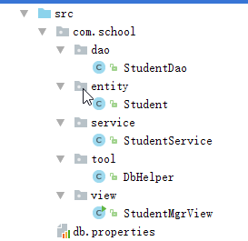

# 1. JDBC进阶操作

## 1.1 用CallableStatement执行存储过程

　　要执行存储过程，就先用Connection对象获得CallableStatement，然后执行存储过程，结果依然在结果集ResultSet中，用案例讲解执行存储过程。

　　例1：带有输入参数（或者无参数）的存储过程的执行，该存储过程中有对表的查询。

　　比如之前的例子：

```sql
delimiter $;
create procedure proTest(in empId int) -- 参数格式：in/out/inout 参数名 参数类型
begin
  select * from employee where eid = empId;
END $;

-- 调用
call proTest(1);
```

　　程序代码：

```java
package com.zhang.test;

import java.sql.*;

public class Demo {
    public static void main(String[] args) throws ClassNotFoundException, SQLException {
        String url = "jdbc:mysql://localhost:3306/mytest?useSSL=false&useUnicode=true&characterEncoding=utf8";
        Class.forName("com.mysql.jdbc.Driver");
        Connection conn = DriverManager.getConnection(url, "root", "123456");
        // 用prepareCall()获得CallableStatement对象
        // 也是预编译的SQL
        CallableStatement stmt = conn.prepareCall("call proTest(?)");
        // 设置参数
        stmt.setInt(1, 1);
        // 同样调用executeQuery()获得结果集
        ResultSet rs = stmt.executeQuery();
        while(rs.next()) {
            // 输出查到的员工编号
            System.out.println(rs.getInt(1));
            // 输出查到的员工姓名
            System.out.println(rs.getString(2));
        }
        // 关闭连接
        rs.close();
        stmt.close();
        conn.close();
    }
}
```

　　可以看出，对于有输入参数或者无参数的存储过程，使用方法也简单，和之前的步骤一样，只是用ResultSet获得结果集，如果有输入参数，直接用占位符先代替，之后设置即可。

　　当有输出参数的时候，就需要先用CallableStatement注册输出参数，用executeQuery()或executeUpdate()执行完存储过程后，再用CallableStatement的getXxx()方法获得输出结果。CallableStatement的getXxx()方法专门用于获得输出参数结果的。

　　例子如下：

　　使用的存储过程：

```sql
delimiter $;
create procedure testIf(in num int, out str varchar(20))
begin
  if num = 1 then
    set str = '星期一';
  elseif num = 2 then
    set str = '星期二';
  elseif num = 3 then
    set str = '星期三';
  else
    set str = '输入错误';
  end if;
end $;
-- 调用示例
call testIf(4, @str);
```

　　程序代码：

```java
package com.zhang.test;

import java.sql.*;

public class Demo {
    public static void main(String[] args) throws ClassNotFoundException, SQLException {
        String url = "jdbc:mysql://localhost:3306/mytest?useSSL=false&useUnicode=true&characterEncoding=utf8";
        Class.forName("com.mysql.jdbc.Driver");
        Connection conn = DriverManager.getConnection(url, "root", "123456");
        CallableStatement stmt = conn.prepareCall("call testIf(?, ?)");
        // 设置参数1
        stmt.setInt(1, 2);
        // 参数2是输出参数，调用registerOutParameter注册输出参数
        // 方法参数指定了哪个参数是输出参数，并且是什么类型
        stmt.registerOutParameter(2, Types.VARCHAR);
        // Types类是java.sql提供的类，其中的静态变量描述了数据库中的数据类型


        // 调用executeQuery()或者executeUpdate()执行
        stmt.executeUpdate();
         // 最后还是通过stmt得到输出参数的结果，index要和上面注册的索引匹配
        String result = stmt.getString(2);
        System.out.println(result);

        stmt.close();
        conn.close();
    }
}
```

## 1.2 批处理

　　有时需要执行多个相同的SQL语句，那么就可以使用批处理提高效率。比如程序中要连续插入100条员工记录，这时SQL语句是相同的，只是数据不一样。

　　如果直接在循环中每次都执行executeUpdate()的话，效率低，因此学习使用批处理，来一次提交多条SQL语句执行，这样来提高数据库吞吐量。

　　例子：用批处理在数据库中插入数条员工数据。在程序中，这些数据保存在List< Employee >对象中。

　　（1）员工类

```java
package com.zhang.bean;

public class Employee {
    private int id; // 员工编号
    private String name;
    public Employee(int id, String name) {
        this.id = id;
        this.name = name;
    }

    public int getId() {
        return id;
    }

    public void setId(int id) {
        this.id = id;
    }

    public String getName() {
        return name;
    }

    public void setName(String name) {
        this.name = name;
    }
}
```

　　（2）主类

```java
package com.zhang.test;

import com.zhang.bean.Employee;

import java.sql.*;
import java.util.ArrayList;
import java.util.List;

public class Demo {
    public static void main(String[] args) throws Exception{
        List<Employee> empList = new ArrayList<>();
        // 创建21个员工对象
        for(int i = 1; i <= 21; i++) {
            empList.add(new Employee(i, "员工" + i));
        }
        // 将员工数据插入到数据库中
        addEmployees(empList);
        System.out.println("成功插入数据");
    }

    public static void addEmployees(List<Employee> empList) throws Exception {
        String url = "jdbc:mysql://localhost:3306/mytest?useSSL=false&useUnicode=true&characterEncoding=utf8";
        Class.forName("com.mysql.jdbc.Driver");
        Connection conn = DriverManager.getConnection(url, "root", "123456");
        // 预编译SQL
        String sql = "insert into employee values(?,?)";
        // 准备PreparedStatement对象
        PreparedStatement ps = conn.prepareStatement(sql);
        // 不一样的只是在循环中，不是每次都执行executeUpdate。
        // 而是设置好ps参数后，调用addBatch()方法把当前ps加到批处理中
        // 当满足一定数量，再执行批处理，使用executeBatch()方法。
        for(int i = 0; i < empList.size(); i++) {
            // 设置参数
            ps.setInt(1, empList.get(i).getId());
            ps.setString(2, empList.get(i).getName());
            // 添加到批处理
            ps.addBatch();
            // 若有5条，则执行一次批处理
            if(i % 5 == 0) {
                // 执行批处理
                ps.executeBatch();
                // 注意执行完了要清空
                ps.clearBatch();
            }
        }
        // 循环外，还要执行一次批处理，防止有剩余的没有满足5条的批处理
        ps.executeBatch();
        ps.clearBatch();
        // 关闭资源
        ps.close();
        conn.close();
    }
}
```

　　即用Statement维护批处理。执行批处理后不要忘了清空批处理。

## 1.3 获取自增长值

　　比如部门表和员工表，部门表的主键是自增长的。有一种情况：在程序中添加了一个部门信息后，需要马上得到该部门自增长的主键，然后给该部门添加员工。

　　那么此时获得自增长键就十分有必要。现在就用程序获得部门表自增长的键值。

　　（1）部门表SQL：

```sql
create table dept(
  did int primary key auto_increment,
  dname varchar(20)
);
```

　　（2）程序代码：

```java
package com.zhang.test;

import com.zhang.bean.Employee;

import java.sql.*;
import java.util.List;

public class Demo {
    public static void main(String[] args) throws Exception{
        String url = "jdbc:mysql://localhost:3306/mytest?useSSL=false&useUnicode=true&characterEncoding=utf8";
        Class.forName("com.mysql.jdbc.Driver");
        Connection conn = DriverManager.getConnection(url, "root", "123456");
        String sql = "insert into dept(dname) values(?)";
        // 这里调用prepareStatement方法时，用参数2表示需要获得执行此SQL完毕的自增长键的值
        PreparedStatement ps = conn.prepareStatement(sql, Statement.RETURN_GENERATED_KEYS);
        // 设置ps参数
        ps.setString(1, "系统研发部");
        // 先执行完ps
        ps.executeUpdate();
        // 然后用ps的getGeneratedKeys()方法获得自增长的结果集
        ResultSet rs = ps.getGeneratedKeys();
        int keys = 0;
        while(rs.next()) {
            keys = rs.getInt(1);
        }
        System.out.println("获得的自增长键是：" + keys);
        ps.close();
        conn.close();
    }
}
```

　　注意的是，获得自增长键调用的是Statement的方法。（PreparedStatement继承了Statement，CallableStatement继承了PreparedStatement。）

## 1.4 事物

　　事物的一个案例就是银行转账。A给B转账，那么A的存款减少和B的存款增加这两件事必须是原子性的，即要么都成功，转账就成功，要么都失败，转账就失败。不允许出现只有一方成功或者失败。

　　组成事务的一部分必须全部成功，否则整个操作就回滚。事物在数据库中非常重要。在上述的操作中，我们执行的操作都是自动提交的。我们可调用Connection的setAutoCommit()方法，设置自动提交为false，实现自己手动控制事物提交。

　　手动提交事物常用：

　　（1）void commit()：手动提交事物，一切正常，就可提交，提交后不可回滚；

　　（2）void rollback()：回滚，出现异常时，已执行但未提交的代码可回退到事务开始前的状态；

　　（3）可调用setSavepoint()方法设置一个保存点，可指定回滚到该点。方法返回一个Savepoint对象。

　　例子：

　　（1）账户表

```sql
create table account(
  name varchar(20),
  money int
);
-- 添加两个人
insert into account values('张三', 5000);
insert into account values('李四', 5000);
```

　　（2）程序代码。

```java
package com.zhang.test;

import java.sql.*;

public class Demo {
    public static void main(String[] args) throws Exception{
        String url = "jdbc:mysql://localhost:3306/mytest?useSSL=false&useUnicode=true&characterEncoding=utf8";
        Class.forName("com.mysql.jdbc.Driver");
        Connection conn = DriverManager.getConnection(url, "root", "123456");
        // 首先设置手动提交
        conn.setAutoCommit(false);
        // 张三给李四转账1000
        String zs = "update account set money = money - 1000 where name = '张三'";
        String ls = "update account set money = money + 1000 where name = '李四'";
        PreparedStatement ps = null;
        try {
            // 执行第一条SQL
            ps = conn.prepareStatement(zs);
            ps.executeUpdate();
            int a = 1 / 0; // 如果不加这句，转账即成功。如果不使用事物的话，那么就会张三少了1000，而李四没有增加1000
            // 执行第二条SQL
            ps = conn.prepareStatement(ls);
            ps.executeUpdate();
        } catch(Exception e) {
            // 出现异常，则回滚
            conn.rollback();
        }
        // 无异常，则提交
        conn.commit();
        ps.close();
        conn.close();
    }
}
```

　　案例2：使用Savepoint，并且rollback(sp)。

```java
package com.zhang.test;

import java.sql.*;

public class Demo {
    public static void main(String[] args) throws Exception {
        String url = "jdbc:mysql://localhost:3306/mytest?useSSL=false&useUnicode=true&characterEncoding=utf8";
        Class.forName("com.mysql.jdbc.Driver");
        Connection conn = DriverManager.getConnection(url, "root", "123456");
        conn.setAutoCommit(false);
        // 张三给李四转账1000
        String zs = "update account set money = money - 1000 where name = '张三'";
        String ls = "update account set money = money + 1000 where name = '李四'";
        // 第一次转账
        PreparedStatement ps = conn.prepareStatement(zs);
        ps.executeUpdate();
        ps = conn.prepareStatement(ls);
        ps.executeUpdate();
        // 第一次转账后可设置个保存点。可回滚到此位置
        Savepoint sp = conn.setSavepoint();
        try {
            // 第二次转账
            ps = conn.prepareStatement(zs);
            ps.executeUpdate();
            int a = 1 / 0;
            ps = conn.prepareStatement(ls);
            ps.executeUpdate();
        } catch (Exception e) {
            conn.rollback(sp);
        }
        // 无异常，则提交
        conn.commit();
        ps.close();
        conn.close();
    }
}
```

## 1.5 元数据Metadata

　　有时想获得所连接数据库的一些信息，比如数据库版本、名称等信息，或者获得结果集的列信息。想要获得这些信息，就需要用到“元数据”。

　　JDBC提供了三种元数据对象，分别是数据库元数据、参数元数据和结果集元数据。见案例。

　　案例1：数据库元数据。通过Connection对象的getMetaData方法即可得到DatabaseMetaData，可从中获取数据库有关信息。

　　代码：

```java
package com.zhang.test;

import java.sql.Connection;
import java.sql.DatabaseMetaData;
import java.sql.DriverManager;
import java.sql.SQLException;

public class Demo {
    public static void main(String[] args) throws ClassNotFoundException, SQLException {
        String url = "jdbc:mysql://localhost:3306/mytest?useSSL=false&useUnicode=true&characterEncoding=utf8";
        Class.forName("com.mysql.jdbc.Driver");
        Connection conn = DriverManager.getConnection(url, "root", "123456");
        // 得到数据库元对象
        DatabaseMetaData metaData = conn.getMetaData();
        System.out.println(metaData.getUserName()); //获得用户名
        System.out.println(metaData.getURL()); //获得连接字符串url
        System.out.println(metaData.getDatabaseProductName()); // 数据库名称
        System.out.println(metaData.getDatabaseProductVersion()); // 数据库版本号
        System.out.println(metaData.getDriverName()); // 驱动名称
        System.out.println(metaData.getDriverVersion()); // 驱动版本
        System.out.println(metaData.isReadOnly()); // 是否只读的
        conn.close();
    }
}
```

　　案例2：参数元数据，可调用PreparedStatement对象的getParameterMetaData()方法得到元数据对象。可获得参数个数。

```java
package com.zhang.test;

import java.sql.*;

public class Demo {
    public static void main(String[] args) throws ClassNotFoundException, SQLException {
        String url = "jdbc:mysql://localhost:3306/mytest?useSSL=false&useUnicode=true&characterEncoding=utf8";
        Class.forName("com.mysql.jdbc.Driver");
        Connection conn = DriverManager.getConnection(url, "root", "123456");
        PreparedStatement ps = conn.prepareStatement("insert into account values(?,?)");
        ps.setString(1, "zhang");
        ps.setInt(2, 1);
        // 得到参数元数据对象
        ParameterMetaData pmd = ps.getParameterMetaData();
        System.out.println(pmd.getParameterCount()); // 获得参数个数
        ps.close();
        conn.close();
    }
}
```

　　案例3：结果集元数据。通过ResultSet的getMetaData()方法得到，可获得当前列的个数和名称等信息。 

```java
package com.zhang.test;

import java.sql.*;

public class Demo {
    public static void main(String[] args) throws ClassNotFoundException, SQLException {
        String url = "jdbc:mysql://localhost:3306/mytest?useSSL=false&useUnicode=true&characterEncoding=utf8";
        Class.forName("com.mysql.jdbc.Driver");
        Connection conn = DriverManager.getConnection(url, "root", "123456");
        PreparedStatement ps = conn.prepareStatement("select * from account");
        ResultSet rs = ps.executeQuery();
        ResultSetMetaData rsmd = rs.getMetaData();
        // getColumnCount()获得有多少列。由于索引从1开始，因此遍历就从1开始
        // 这里遍历列，在循环中获得每列信息
        for(int i = 1; i <= rsmd.getColumnCount(); i++) {
            System.out.println(rsmd.getColumnLabel(i)); // 列名
            System.out.println(rsmd.getColumnClassName(i)); // 列在Java中的类型
            System.out.println(rsmd.getColumnTypeName(i)); // 列在数据库中的类型
        }
        rs.close();
        ps.close();
        conn.close();
    }
}
```

# 2. DbUtils组件

　　commons-dbutils 是 Apache 组织的一个开源类库，它对JDBC进行了简单的封装。开发者使用DbUtils能提高开发效率，简化代码。

　　Apache的DbUtils项目地址：http://commons.apache.org/proper/commons-dbutils/ 。可自行下载工具包，然后在Java项目中引入“commons-dbutils-1.6.jar”这个JAR包。当然，不能忘了引入数据库驱动包。

　　使用DbUtils组件的一般步骤：

　　（1）创建一个QueryRunner对象；

　　（2）调用QueryRunner对象的方法来操作数据库，如update()方法，方法需要传递数据库连接、预编译的SQL和参数等信息。

　　（3）调用DBUtils的静态方法close()来关闭数据库连接。

　　下面进行详细讲解。

## 2.1 用QueryRunner的update()方法执行增删改操作

　　实例代码：

```java
package com.zhang.test;

import org.apache.commons.dbutils.DbUtils;
import org.apache.commons.dbutils.QueryRunner;

import java.sql.*;

public class Demo {
    public static void main(String[] args) throws Exception {
        String url = "jdbc:mysql://localhost:3306/mytest?useSSL=false&useUnicode=true&characterEncoding=utf8";
        Class.forName("com.mysql.jdbc.Driver");
        // 同样，先得到数据库连接对象
        Connection conn = DriverManager.getConnection(url, "root", "123456");
        // 创建QueryRunner对象
        QueryRunner qr = new QueryRunner();
        // 调用qr的update()方法
        int rows = qr.update(conn, "insert into account values(?, ?);", "王五", 1000);
        System.out.println("影响行数：" + rows);
        // 关闭连接
        DbUtils.close(conn);
    }
}
```

　　其中update()方法可执行增删改操作，常用的重载（也是上述用的）：

　　public int update(Connection conn, String sql, Object... params)

　　参数1是数据库连接，参数2是预编译的SQL，最后一个可变参数，就是依次设置预编译SQL中的各个参数，可传递Object类型，DbUtils自行处理。发现使用DBUtils相比之前方便很多。

## 2.2 用batch()方法执行批处理操作

　　批处理操作也适合于增删改。使用batch()方法，原型为：

　　public int[] batch(Connection conn, String sql, Object[][] params)；同样参数1是数据库连接，参数2是SQL，参数3这时是一个二维数组，二维数组中有几个一维数组，就表示执行几次SQL，而一维数组中的数据就是设置SQL参数值的。

　　例子：

```java
package com.zhang.test;

import org.apache.commons.dbutils.DbUtils;
import org.apache.commons.dbutils.QueryRunner;

import java.sql.*;

public class Demo {
    public static void main(String[] args) throws Exception {
        String url = "jdbc:mysql://localhost:3306/mytest?useSSL=false&useUnicode=true&characterEncoding=utf8";
        Class.forName("com.mysql.jdbc.Driver");
        Connection conn = DriverManager.getConnection(url, "root", "123456");
        QueryRunner qr = new QueryRunner();
        qr.batch(conn, "insert into account values(?,?)", new Object[][]{
                {"张三", 1000},
                {"李四", 2000},
                {"王五", 3000}
        });
        DbUtils.close(conn);
    }
}
```

## 2.3 使用query()方法查询数据库

　　QueryRunner对象提供了query()方法用于获得SQL查询结果。query()的原型是：

```java
public <T> T query(Connection conn, String sql, ResultSetHandler<T> rsh, Object... params)
```

　　参数1：数据库连接

　　参数2：预编译SQL

　　参数3：ResultSetHandler对象

　　参数4：预编译SQL的参数，若SQL无参数，则不写此参数，因为query()有三个参数的重载。

　　重点讲解的就是参数3。ResultSetHandler<T>是一个接口，因此我们要用它的一个实现类。实现类需要重写下列方法：

　　T handle(ResultSet rs)，即在此方法中，我们能拿到DbUtils传递过来的ResultSet结果集，我们自行处理即可。

　　query()和handler()中都使用了泛型T，说明我们实现ResultSetHandler时使用什么类型，那么query()的返回值就是什么类型。我们只要在handler()中操作结果集，返回我们想要的数据类型即可。

　　比如，查询的SQL是select * from Account，那么返回的数据类型应该是List<Account>，我们循环遍历ResultSet数据来封装一下实体类即可。

　　再比如，查询的SQL是select * from Employee where eid=?，由于是主键查询，返回的只应该是一个实体类Employee类(若无数据就返回null)，此时就不用循环结果集，直接用if(rs.next())...即可。

　　下面就实现上面的案例。

　　案例1：实现select * from Account。

　　（1）Account实体类

```java
package com.zhang.bean;

public class Account {
    private String name;
    private int money;

    public Account(String name, int money) {
        this.name = name;
        this.money = money;
    }
    public String getName() {
        return name;
    }
    public void setName(String name) {
        this.name = name;
    }
    public int getMoney() {
        return money;
    }
    public void setMoney(int money) {
        this.money = money;
    }
    @Override
    public String toString() {
        return "Account{" +
                "name='" + name + '\'' +
                ", money=" + money +
                '}';
    }
}
```

　　（2）AccountHandler实现ResultSetHandler接口

```java
package com.zhang.test;

import com.zhang.bean.Account;
import org.apache.commons.dbutils.ResultSetHandler;

import java.sql.ResultSet;
import java.sql.SQLException;
import java.util.ArrayList;
import java.util.List;

// 由于query()的返回值要是List<Account>，因此这里的泛型参数就用List<Account>
public class AccountHandler implements ResultSetHandler<List<Account>> {
    @Override
    public List<Account> handle(ResultSet rs) throws SQLException {
        List<Account> accList = new ArrayList<>();
        while(rs.next()) {
            accList.add(new Account(rs.getString(1), rs.getInt(2)));
        }
        return accList;
    }
}
```

　　（3）主类

```java
package com.zhang.test;

import com.zhang.bean.Account;
import org.apache.commons.dbutils.DbUtils;
import org.apache.commons.dbutils.QueryRunner;

import java.sql.*;
import java.util.List;

public class Demo {
    public static void main(String[] args) throws Exception {
        String url = "jdbc:mysql://localhost:3306/mytest?useSSL=false&useUnicode=true&characterEncoding=utf8";
        Class.forName("com.mysql.jdbc.Driver");
        Connection conn = DriverManager.getConnection(url, "root", "123456");
        QueryRunner qr = new QueryRunner();
        // query()的参数3就用AccountHandler对象，并且返回值是List<Account>。
        List<Account> accountList =  qr.query(conn, "select * from account", new AccountHandler());
        System.out.println(accountList);
        DbUtils.close(conn);
    }
}
```

　　案例2：实现select * from Employee where eid=?

　　（1）Employee实体类

```java
package com.zhang.bean;

public class Employee {
    private int eid; // 编号
    private String ename; //姓名
    public Employee(int eid, String ename) {
        this.eid = eid;
        this.ename = ename;
    }
    public int getEid() {
        return eid;
    }
    public void setEid(int eid) {
        this.eid = eid;
    }
    public String getEname() {
        return ename;
    }
    public void setEname(String ename) {
        this.ename = ename;
    }
    @Override
    public String toString() {
        return "Employee{" +
                "eid=" + eid +
                ", ename='" + ename + '\'' +
                '}';
    }
}
```

　　（2）SingleEmployeeHandler实现ResultSetHandler接口

```java
package com.zhang.test;

import com.zhang.bean.Employee;
import org.apache.commons.dbutils.ResultSetHandler;

import java.sql.ResultSet;
import java.sql.SQLException;

// 返回的就是一个Employee实体，因此直接用<Employee>
public class SingleEmployeeHandler implements ResultSetHandler<Employee> {
    @Override
    public Employee handle(ResultSet rs) throws SQLException {
        Employee emp = null;
        if(rs.next()) {
            emp = new Employee(rs.getInt(1), rs.getString(2));
        }
        return emp;
    }
}
```

　　（3）主类

```java
package com.zhang.test;

import com.zhang.bean.Employee;
import org.apache.commons.dbutils.DbUtils;
import org.apache.commons.dbutils.QueryRunner;

import java.sql.*;

public class Demo {
    public static void main(String[] args) throws Exception {
        String url = "jdbc:mysql://localhost:3306/mytest?useSSL=false&useUnicode=true&characterEncoding=utf8";
        Class.forName("com.mysql.jdbc.Driver");
        Connection conn = DriverManager.getConnection(url, "root", "123456");
        QueryRunner qr = new QueryRunner();
        // query()的参数3就用SingleEmployeeHandler
        Employee emp = qr.query(conn, "select * from employee where eid = ?", new SingleEmployeeHandler(), 12);
        System.out.println(emp);
        DbUtils.close(conn);
    }
}
```

　　也可以直接给参数3传递一个匿名内部类，实现其中的方法。此方式适用于此ResultSetHandler只需要使用一次的时候。例子：

```java
package com.zhang.test;

import com.zhang.bean.Employee;
import org.apache.commons.dbutils.DbUtils;
import org.apache.commons.dbutils.QueryRunner;
import org.apache.commons.dbutils.ResultSetHandler;

import java.sql.*;

public class Demo {
    public static void main(String[] args) throws Exception {
        String url = "jdbc:mysql://localhost:3306/mytest?useSSL=false&useUnicode=true&characterEncoding=utf8";
        Class.forName("com.mysql.jdbc.Driver");
        Connection conn = DriverManager.getConnection(url, "root", "123456");
        QueryRunner qr = new QueryRunner();
        // query()的参数3就用SingleEmployeeHandler
        Employee emp = qr.query(conn, "select * from employee where eid = ?", new ResultSetHandler<Employee>() {
            @Override
            public Employee handle(ResultSet rs) throws SQLException {
                Employee emp = null;
                if(rs.next()) {
                    emp = new Employee(rs.getInt(1), rs.getString(2));
                }
                return emp;
            }
        }, 12);
        System.out.println(emp);
        DbUtils.close(conn);
    }
}
```

　　上述使用DbUtils实现了简单的对象关系映射（对象关系映射，即ORM，Object Relational Mapping），把数据库中的数据封装到对象中，实现用面向对象的方法操作数据。以后还会学习更强大的ORM框架，比如Hibernate和Mybatis。

# 3. 优化数据库连接：使用连接池

　　我们之前的案例中，会频繁打开和关闭一个数据库连接对象。而且在实际应用中，同时可能有多个数据库连接在使用，比如有n个用户正在查询自己的信息。

　　数据库连接资源是十分宝贵的，频繁打开关闭连接会耗费资源，并且实际中我们还需要管理多个连接资源。为了对数据库连接进行有效的管理，需要使用连接池技术：预先创建多个数据库连接（即连接池），当需要用到连接时，就从池中取出一个使用，用完后再放回池中。

　　可定义数据库连接池的“初始化连接数”、“最大连接数”等，并记录“当前连接数”，这样我们也能自行编写实现连接池的代码：当需要新连接时，若池中有空闲的，则直接从池中取；否则就新建连接，但是总连接数不能超过最大连接数，否则创建不成功，只能等待其他连接使用完毕才能获得连接。

　　实际上JDK已经规定了连接池的一系列规范，比如：连接池需要实现接口javax.sql.DataSource，这个DataSource是数据源，用于给外部提供数据库连接，这样就更加简化了我们获得数据库连接的方式。

　　自己实现连接池比较麻烦，一般使用第三方开源的连接池。常用的有DBCP和C3P0连接池。

　　注意，DBCP和C3P0只负责提供DataSource和管理数据库连接，并不是像DBUtils那样对JDBC操作进行了封装，因此为了简化数据库操作，可以结合连接池使用DBUtils。即连接池给DBUtils提供DataSource数据源。可以使用QueryRunner的构造函数重载QueryRunner(DataSource ds)，来通过数据源获得连接，这样update()、batch()和query()方法都不需要传递数据库连接对象Connection了，DBUtils提供了这样的重载。而且使用DataSource也不需要考虑手动关闭Connection连接，因为这些事是连接池做的。这样结合使用十分方便。

　　如果不使用DBUtils，单纯的使用DataSource对象的getConnection()方法也能轻松得到Connection连接对象。

## 3.1 DBCP连接池

　　DBCP是Apache的开源连接池实现，要使用DBCP，除了应该在项目中引入DBCP的jar包外，还应引入DBCP的两个依赖jar包，即commons-pool.jar和commons-logging.jar，这都是Apache的产品，可在Apache官网寻找下载。

　　DBCP可通过properties配置文件来配置数据库连接的参数，比如在src下新建db.properties文件，内容如下：

```properties
# 配置数据库驱动类
driverClassName=com.mysql.jdbc.Driver
# 连接的URL
url=jdbc:mysql://localhost:3306/mytest?useSSL=false&useUnicode=true&characterEncoding=utf8
# 用户名
username=root
# 密码
password=123456
# 设置初始化连接数
initialSize=5
# 最大连接数
maxActive=10
# 最大空闲时间。若超过这个时间此连接还是空闲，则回收此连接
maxIdle=6000
```

　　使用配置的好处就是可根据需要来配置数据库，而不需要重新更改代码并且重新编译代码。而之前的方式都是“硬编码”，即把所有的信息都在代码中写死的。我们也可通过自行通过IO方式来实现自己读取配置文件。以后大部分信息都是在配置文件中配置的，这样使得系统更加灵活。

　　在程序中，使用DBCP核心类BasicDataSourceFactory得到DataSource数据源。以下是结合DBUtils使用的案例：

```java
package com.zhang.test;

import org.apache.commons.dbcp2.BasicDataSourceFactory;
import org.apache.commons.dbutils.QueryRunner;

import javax.sql.DataSource;
import java.io.InputStream;
import java.util.Properties;

public class Demo {
    public static void main(String[] args) throws Exception {
        // 加载db.properties配置文件。为何使用ClassLoader.getSystemResourceAsStream()？参见本章附录。
        InputStream in = ClassLoader.getSystemResourceAsStream("db.properties");
        // 创建Properties对象装载配置文件
        Properties props = new Properties();
        // 装载
        props.load(in);
        // 使用BasicDataSourceFactory的方法，根据props对象得到数据源
        DataSource ds = BasicDataSourceFactory.createDataSource(props);
        // 可使用数据源创建QueryRunner
        QueryRunner qr = new QueryRunner(ds);
        int row = qr.update("insert into account values(?,?)", "王五", 10000);
        System.out.println(row);
        // 数据库连接无需自己关闭，由连接池管理
    }
}
```

　　在程序运行中，DBCP会自动维护连接池。当然程序结束之后，维护的连接也会随之关闭。我们可以在QueryRunner那一行设置一个断点，调试程序。当程序运行停在此断点处时，在MySQL中执行“show processlist”查看当前所有的数据库连接，可以看到连接池管理的所有连接的状态。

## 3.2 C3P0连接池

　　C3P0也是常用的连接池。C3P0的网址: http://www.mchange.com/projects/c3p0/ 。可在对应的Github上下载最新的C3P0文件：https://github.com/swaldman/c3p0/releases 。

　　使用C3P0需要引入lib目录下的jar包，如果不是连接Oracle数据库，则不用引入“c3p0-oracle-thin-extras-0.9.5.2.jar”文件，只需引入另两个文件。

　　C3P0使用xml文件来配置数据库连接。C3P0默认自动加载classpath路径下的c3p0-config.xml文件，因此我们在项目src目录下新建一个c3p0-config.xml文件，因为项目编译时，src目录下的配置文件会自动被复制到classpath路径下。配置内容如下：

```xml
<?xml version="1.0" encoding="utf-8" ?>
<c3p0-config>
    <!-- default-config节点中的是默认配置，C3P0默认会加载此配置 -->
    <default-config>
        <!-- 配置连接URL。注意，在XML中，连接字符串中的&符号需要转义成&amp;否则出错 -->
        <property name="jdbcUrl">
            jdbc:mysql://localhost:3306/mytest?useSSL=false&amp;useUnicode=true&amp;characterEncoding=utf8
        </property>
        <property name="driverClass">com.mysql.jdbc.Driver</property>
        <property name="user">root</property>
        <property name="password">123456</property>
        <property name="initialPoolSize">3</property>
        <property name="maxPoolSize">6</property>
        <property name="maxIdleTime">6000</property>
    </default-config>
    <!-- 在default-config同级节点下，也能配置其他数据库连接，比如SQL Server的 -->
    <!-- 这里只是示例 -->
    <named-config name="sqlServer">
        <property name="jdbcUrl">jdbc:sqlserver://localhost:1433;databaseName=mytest</property>
        <property name="driverClass">com.microsoft.sqlserver.jdbc.SQLServerDriver</property>
        <property name="user">sa</property>
        <property name="password">123456</property>
        <property name="initialPoolSize">3</property>
        <property name="maxPoolSize">6</property>
        <property name="maxIdleTime">6000</property>
    </named-config>
</c3p0-config>
```

　　C3P0直接用核心类ComboPooledDataSource创建对象，该对象就能当做DataSource使用，因为此类最终还是实现了DataSource接口。代码：

```java
package com.zhang.test;

import com.mchange.v2.c3p0.ComboPooledDataSource;
import org.apache.commons.dbutils.QueryRunner;

public class Demo {
    public static void main(String[] args) throws Exception {
        // 创建ComboPooledDataSource对象，实际上就是数据源
        ComboPooledDataSource ds = new ComboPooledDataSource();
        //ComboPooledDataSource默认使用XML中default-config节点中的信息。
        //如果想使用非默认的配置节点信息，则创建此对象时要传入该配置的名字，即：
        //ComboPooledDataSource dataSource = new ComboPooledDataSource("sqlserver");
        
        // 用ds创建QueryRunner
        QueryRunner qr = new QueryRunner(ds);
        qr.update("insert into account values(?,?)", "张三", 130000);
        System.out.println("OK");
    }
}
```

　　程序运行中，控制台会输出一系列的红色信息，这并不是警告和错误，而是C3P0提供的日志信息。日志中提供了时间和其他的信息，日志也能提供调试、警告和错误等信息，在开发过程中使用能清晰的知道系统运行的状况。

　　总结：推荐以后的应用都使用连接池，即方便开发又提高效率。

# 4 项目实战（三层架构）

　　数据库操作非常重要，我们以后重点学习的JavaWeb，也会大量进行数据库操作。在真实的企业项目中，为了便于项目管理和维护，一般采用三层架构，这样使得项目的结构清晰可观，易于扩展维护。

## 4.1 三层架构概念

　　三层架构就是“数据访问层”、“业务逻辑层”和“表示层”。各层各司其职，专注各自职责，分工如下：

　　数据访问层：该层专门用于和数据库进行交互，执行数据增删改查等操作。本层主要操作数据对象的，比如把数据库中查询到的数据封装到实体类对象中（实体类就对应数据库中的实体，用于数据的封装和传输等）、将实体对象的数据拿出来添加到数据库中等。所以该层也称作DAO层（Data Access Object）。

　　业务逻辑层：用于实现业务操作，比如用户登录、获得用户登录信息、添加用户等。该层基本使用数据访问层提供的功能来完成业务。

　　表示层：负责直接跟用户进行交互，一般也就是指系统的界面，比如显示用户信息、显示登录成功页面等。该层基本使用业务逻辑层提供的功能。

　　从上述概念可知，采用三层架构实现了“高内聚、低耦合”，易于处理复杂项目。

## 4.2 项目实战

　　我们以简单的例子来学习三层架构。创建dbtest数据库，其中有一张“学生”表：

```sql
CREATE TABLE student(
  id INT PRIMARY KEY AUTO_INCREMENT, -- 编号
  stuName VARCHAR(10), -- 姓名
  gender VARCHAR(10) -- 性别
)
```

　　我们就用三层架构实现对学生的各种操作。

　　一般把不同层的类放在不同的包下。因此先建立以下四个包：

　　（1）com.school.entity：存放实体类；

　　（2）com.school.dao：存放数据访问层相关类；

　　（3）com.school.service：存放业务逻辑层相关类；

　　（4）com.school.view：存放表示层相关类；

　　（5）com.school.tool：存放相关工具类简化开发。

　　在项目中引入DBUtils、JDBC驱动相关jar包。参照上面的知识写好db.properties文件。

　　首先在entity层中新建学生实体类：

```java
package com.school.entity;

public class Student {
    private int id;
    private String stuName;
    private String gender;
    
    public Student(){}

    public Student(int id, String stuName, String gender) {
        this.id = id;
        this.stuName = stuName;
        this.gender = gender;
    }

    public int getId() {
        return id;
    }

    public void setId(int id) {
        this.id = id;
    }

    public String getStuName() {
        return stuName;
    }

    public void setStuName(String stuName) {
        this.stuName = stuName;
    }

    public String getGender() {
        return gender;
    }

    public void setGender(String gender) {
        this.gender = gender;
    }

    @Override
    public String toString() {
        return "Student{" +
                "id=" + id +
                ", stuName='" + stuName + '\'' +
                ", gender='" + gender + '\'' +
                '}';
    }
}
```

　　在tool包中写DbHelper类以便简化数据库操作：

```java
package com.school.tool;

import org.apache.commons.dbcp2.BasicDataSourceFactory;
import org.apache.commons.dbutils.QueryRunner;

import javax.sql.DataSource;
import java.util.Properties;

public class DbHelper {
    private static DataSource ds = null;
    // 获取ds
    static {
        Properties props = new Properties();
        try {
            props.load(ClassLoader.getSystemResourceAsStream("db.properties"));
            ds = BasicDataSourceFactory.createDataSource(props);
        } catch (Exception e) {
            e.printStackTrace();
        }
    }
    // 该方法直接返回queryRunner
    public static QueryRunner getQueryRunner() {
        return new QueryRunner(ds);
    }
}
```

　　在dao里面新建StudentDao写数据访问层：

```java
package com.school.dao;

import com.school.entity.Student;
import com.school.tool.DbHelper;
import org.apache.commons.dbutils.ResultSetHandler;

import java.sql.ResultSet;
import java.sql.SQLException;
import java.util.ArrayList;
import java.util.List;

public class StudentDao {
    // 新增一个Student
    public int addStudent(Student student) throws SQLException {
        return DbHelper.getQueryRunner().update("insert into student values(?, ?, ?)", student.getId(), student.getStuName(), student.getGender());
    }
    // 按主键删除学生
    public int deleteStudentById(int id) throws SQLException {
        return DbHelper.getQueryRunner().update("delete from student where id = ? ", id);
    }
    // 查询所有的学生
    public List<Student> getAllStudents() throws SQLException {
        return DbHelper.getQueryRunner().query("select * from student ", new ResultSetHandler<List<Student>>() {
            @Override
            public List<Student> handle(ResultSet rs) throws SQLException {
                List<Student> studentList = new ArrayList<>();
                while (rs.next()) {
                    studentList.add(new Student(rs.getInt(1), rs.getString(2), rs.getString(3)));
                }
                return studentList;
            }
        });
    }
}
```

　　然后在service中写业务方法。这里的业务比较简单，基本和dao一样，但是大项目中，需要处理的逻辑就比较复杂了。

```java
package com.school.service;

import com.school.dao.StudentDao;
import com.school.entity.Student;

import java.sql.SQLException;
import java.util.ArrayList;
import java.util.List;

public class StudentService {
    // 创建一个studentDao属性来使用
    private StudentDao studentDao = new StudentDao();
    // 新增一个Student。是否添加成功
    public boolean addStudent(Student student) {
        boolean flag = false;
        try {
            int row = studentDao.addStudent(student);
            if (row == 1) {
                flag = true;
            }
        } catch (SQLException ex) {
        }
        return flag;
    }
    // 按主键删除学生
    public boolean deleteStudent(int id) {
        boolean flag = false;
        try {
            int row = studentDao.deleteStudentById(id);
            if (row == 1) {
                flag = true;
            }
        } catch (SQLException ex) {
        }
        return flag;
    }
    // 查询所有的学生
    public List<Student> getAllStudents() {
        List<Student> studentList = new ArrayList<>();
        try {
            studentList = studentDao.getAllStudents();
        } catch (SQLException ex) {
        }
        return studentList;
    }
}
```

　　下面就是处理用户界面的了。在view层中新建类StudentMgrView类：

```java
package com.school.view;

import com.school.entity.Student;
import com.school.service.StudentService;

import java.io.BufferedReader;
import java.io.IOException;
import java.io.InputStreamReader;

public class StudentMgrView {

    // service
    public static StudentService studentService = new StudentService();

    // 主类
    public static void main(String[] args) throws IOException {
        int i = 0;
        do {
            i = showMenu();
            switch (i) {
                case 1: showStudents(); break;
                case 2: addStudent(); break;
                case 3: deleteStudent(); break;
            }
        } while (i != 4);
    }
    // 显示菜单，并且返回菜单数字
    public static int showMenu() throws IOException {
        System.out.println("1. 显示所有学生");
        System.out.println("2. 添加学生");
        System.out.println("3. 删除学生");
        System.out.println("4. 退出系统");
        System.out.print("请选择：");
        BufferedReader br = new BufferedReader(new InputStreamReader(System.in));
        String input = br.readLine();
        return Integer.parseInt(input);
    }

    // 显示学生
    public static void showStudents() {
        System.out.println(studentService.getAllStudents());
    }

    // 删除学生
    public static void deleteStudent() throws IOException {
        System.out.println("输入删除的编号：");
        BufferedReader br = new BufferedReader(new InputStreamReader(System.in));
        String id = br.readLine();
        studentService.deleteStudent(Integer.parseInt(id));
    }

    // 添加学生
    public static void addStudent() throws IOException {
        BufferedReader br = new BufferedReader(new InputStreamReader(System.in));
        System.out.println("请输入编号：");
        String id = br.readLine();
        System.out.println("请输入姓名：");
        String name = br.readLine();
        System.out.println("请输入性别：");
        String gender = br.readLine();
        studentService.addStudent(new Student(Integer.parseInt(id), name, gender));
    }
}
```

　　上述就简单的做了一个三层架构的例子，其中没有做验证之类的判断，否则service层可加更多东西，大家可自行理解实现。项目的结构如下：



　　可以看到结构非常清晰。

## 4.3 使用接口

　　在实际项目中，还会用到面向接口编程，即会将dao层和service层写好接口，比如写个接口IStudentDao（接口以I开头用于标识），里面定义了Student数据访问层的所有方法，然后开发者根据接口写实现类，比如StudentDaoImpl，该实现类在com.school.dao.impl包下用于区分。

　　同样service层也这样做，那么service层就通过：IStudentDao studentDao = new StudentDaoImpl()开创建数据访问层对象。使用接口的好处是先定义一套规范，这样系统的前后端能够同时开发，方便协作。

# 附1：JDBC连接SQL Server数据库

　　步骤如下：

　　（1）下载适用于SQL Server的JDBC驱动，网址：https://www.microsoft.com/zh-CN/download/details.aspx?id=11774 。下载tar.gz压缩包即可。下载前可看看页面上的说明。在“系统要求”中可知道，若使用Java8，则可使用Sqljdbc42.jar包，支持的数据库版本是SQL Server2008——2016。

　　（2）解压压缩包，拿到jre8目录中的jar文件，引用到项目中。

　　（3）然后即可正常写Java代码。注意的是：数据库连接url格式为：jdbc:sqlserver://IP地址:端口;databaseName=数据库名；需要加载的驱动类为：com.microsoft.sqlserver.jdbc.SQLServerDriver。SQLServer默认端口是1433。

　　（4）Java代码中使用sa账户和密码验证。这时可成功连接数据库。示例代码：

```java
Class.forName("com.microsoft.sqlserver.jdbc.SQLServerDriver");
Connection conn = DriverManager.getConnection("jdbc:sqlserver://localhost:1433;databaseName=MyTest", "sa", "123456");
```

　　有时不能正常连接数据库，则检查SQL Server服务是否打开了，并且还要保证SQL Server的网络配置正常：打开“Sql Server Configuration Manager”，设置“MSSQLSERVER的协议”中，TCP/IP为“启用”状态，如图：


　　若使用外界的计算机访问本地数据库，即远程访问，那么本机也需要在防火墙中配置1433端口为“允许入站”，方法和MySQL配置时方法一致。

　　另外，学习过.Net的人还会使用Windows连接验证方式，这样无需使用密码，但是不推荐这样做，并且这样做较麻烦。步骤如下：

　　（1）数据库连接url使用Windows验证，即加上“integratedSecurity=true”，比如：“jdbc:sqlserver://localhost:1433;databaseName=MyTest;integratedSecurity=true”。

　　（2）Java代码中无需写用户名和密码，即：“DriverManager.getConnection(url)”即可。

　　（3）仅仅上述步骤会出错。还需要向Windows系统注册一个“sqljdbc_auth.dll”的文件。该文件在压缩包的auth文件夹中已经提供了。根据自己电脑位数选择合适的版本注册。有两种注册的方法：1.把该dll所在文件夹添加为Path环境变量；2.把该dll文件添加到“C:/Windows/System32”文件夹中。

　　温馨提示：连接SQL Server数据库时，也能使用DBUtils组件和连接池技术（DBCP和C3P0）。只是需要注意下述问题：

　　使用DBUtils时，SQL Server不能正确识别处理预编译的SQL语句，需要在创建QueryRunner对象时，提供一个knowParaType参数，此参数类型是boolean，设置为true即可。比如：

　　QueryRunner qr = new QueryRunner(true)；

　　当使用数据库连接池提供的DataSource数据源时，也别忘了提供此参数：

　　QueryRunner qr = new QueryRunner(ds, true);
