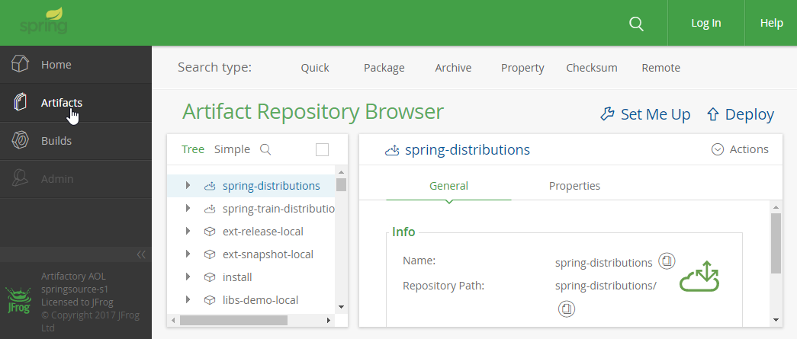

# 1. Spring介绍和下载

## 1.1 Spring概述

　　Spring是Java开发人员必须掌握的框架，因为Spring基本上提供了Java项目的一整套解决方案，Spring主要的模块有：

　　（1）Spring Core：核心功能，如提供IoC容器，处理对象的创建和对象之间的依赖关系；

　　（2）Spring Web：Spring对Web支持的模块，如提供Spring和Struts整合的功能。以后还会学习其中的SpringMVC框架，这是Spring提供的基于MVC设计模式的框架，现在一般使用SpringMVC而非Struts。

　　（3）Spring AOP：Spring提供的面向切面编程AOP。

　　除此之外，Spring还提供了ORM、JDBC等的支持。

　　没有Spring之前，Java企业级项目的开发遵循Java EE的制定的规范，即大型网站开发使用EJB规范。但是EJB非常繁杂，这催生了Spring框架。现在使用Spring 框架非常广泛，甚至评论“Spring是Java EE的事实标准”，因此掌握Spring非常重要。

　　读者对上述的说明可能还是似懂非懂，可在以后的讲解中慢慢体会，总之Spring这一套东西值得研究。

## 1.2 下载Spring框架

　　在Spring官网上没有Spring下载地址，需要导到Spring的官方仓库上下载。网址：https://repo.spring.io/webapp/#/home 。首先展开页面左侧的导航栏，点击“Artifacts”，此时右边就会显示树状结构目录。比如：



　　然后，依次选择节点：“libs-release-local” - “org” - “springframework” - “spring” - “选择最新版本（我们使用4.3.7.RELEASE版本）”，这样就能选择“spring-framework-4.3.7.RELEASE-dist.zip”这个包了，这个包就包含了Spring所有模块的资源，包括学习文档等。选中这个包，右侧页面的右上角就会有“Download”按钮，点击下载即可。

　　下载后解压即可获得JAR包和Spring官方学习文档等资料。学习文档位置：docs/spring-framework-reference，该目录下的不同文件夹中分别提供了不同格式的文档，比如有网页格式的（html和htmlsingle，htmlsingle是值提供一个HTML文件）、epub（电子书）格式的和pdf格式的。

　　终归，还是应该学好英文，看好官方文档，才是真正的深入研究和理解。

# 2. Spring的核心——IoC容器

## 2.1 基本概念

　　Spring的核心功能就是创建对象并维护对象之间的依赖关系。而这些功能的实现是通过IOC容器实现的。

　　为何要用Spring创建对象并维护关系？这就涉及到控制反转（Inversion of Control，即IoC）。

　　“反转”是相对于“正向”而言的。以前，我们要在一个类中（如A类）使用一个B类的对象时，是通过new关键字自己创建出来的，这就是常规的“正向”情况。什么是反向呢？就是A类不再主动获取B实例，而是等待IOC容器获取一个B实例，然后容器将实例反向地注入到A类中以提供使用。

　　即控制反转（IoC）的意思就是将对象的创建交由外部容器来创建，不再自己创建所需对象。这个注入的过程就是对程序中所用到的依赖的注入过程，因此也叫作依赖注入（Dependency Injection），依赖注入就用来处理对象之间的依赖关系。

　　其实依赖注入和控制反转是对同一件事情的不同描述，即它们描述的角度不同。依赖注入是从应用程序的角度描述：应用程序依赖容器创建并注入它所需要的外部资源；而控制反转是从容器的角度在描述：容器控制应用程序，由容器反向的向应用程序注入应用程序所需要的外部资源。

　　那么到底为何要使用IoC/DI呢？

　　IoC/DI对编程带来的改变不仅体现在代码上，更是体现在思想上，使程序开发发生了“主从换位”的变化。原本，应用程序是“主动出击”获取所需资源，但在IoC/DI思想中，应用程序变成被动等待容器来创建并注入它所需要的资源。

　　这样的改变其实是编程思想的一个大进步，能有效的分离对象和它所需要的外部资源，降低程序的耦合性，有利于功能复用。更重要的是，这使得程序的体系结构变得非常灵活。

　　【注：上述描述参见网址：http://blog.csdn.net/doris_crazy/article/details/18353197 】

　　比如在项目中，BaseServiceImpl这个接口实现类需要调用DAO层对象，以往我们使用“private IBaseDao baseDao = new BaseDaoImpl();”来获得DAO层的实现类对象，其实这就产生了耦合，因为代码中要指明具体的DAO层实现类对象，也导致项目不灵活。而采用了IoC/DI后，BaseServiceImpl中只要定义下成员“private IBaseDao baseDao;”即可，至于具体对象的创建交由我们配置的IOC容器对象来完成，这样明显降低了耦合性，增加了灵活性，并且容器自身创建的对象有利于复用。

## 2.2 Spring第一个案例——用IOC创建对象

　　首先新建项目，引入引入Spring的jar包。Spring的jar包在libs目录下。可以发现，Spring中每个模块的jar包都提供了三个jar包，一个是可直接使用的jar包，一个是Javadoc文档jar包，还有一个是源码jar包。我们只要导入可直接使用的jar包即可。在本例中，需要导入以下jar包，这也是Spring的基础的jar包：

```
spring-aop-4.3.7.RELEASE.jar
spring-beans-4.3.7.RELEASE.jar
spring-context-4.3.7.RELEASE.jar 
spring-core-4.3.7.RELEASE.jar
spring-expression-4.3.7.RELEASE.jar
```

　　Spring的libs目录下只提供了Spring的jar包，并没有提供Spring所依赖的jar包，因此我们需要自行引入所需依赖。对于本基础项目，还需要引入Apache的一个日志组件包：commons-logging.jar。

　　搭建好环境（Java SE项目即可）后，就可以写第一个Spring案例了。我们用该案例实现从IoC容器中拿到一个我们配置的、指示Spring生产的一个实例对象。

　　（1）首先创建一个Student类：

```java
package com.zhang.test;

public class Student {
    private String name; // 姓名
    private int age; // 姓名

    // setter、getter和toString()方法
}
```

　　（2）建立Spring配置文件，来配置需要创建的实例。在src目录下新建一个applicationContext.xml文件（名称是可变的，可自己定义），内容如下：

```xml
<?xml version="1.0" encoding="UTF-8"?>
<beans xmlns="http://www.springframework.org/schema/beans"
       xmlns:xsi="http://www.w3.org/2001/XMLSchema-instance"
       xsi:schemaLocation="http://www.springframework.org/schema/beans http://www.springframework.org/schema/beans/spring-beans.xsd">
    <!-- 在beans节点中可用bean节点来配置IoC容器要创建的对象 -->
    <!-- 这里配置一个Person类型的实例。id属性可唯一标识该对象实例。在下述代码中，就是通过id值拿到该对象的 -->
    <bean id="myPersonInstance" class="com.zhang.test.Person" />
</beans>
```

　　（3）在主类中获得Spring帮助我们创建的对象：

```java
package com.zhang.test;

import org.springframework.context.ApplicationContext;
import org.springframework.context.support.ClassPathXmlApplicationContext;

public class Demo {
    public static void main(String[] args) {
        // 先用ApplicationContext加载配置文件。
        // ClassPathXmlApplicationContext这个实现类就是下载classpath路径下的xml文件。
        // 这里直接指定为applicationContext.xml文件。
        // 当然，配置文件也能写在包名下，比如在com.zhang包下，那么传递的参数就为：
        // "com/zhang/applicationContext.xml"
        ApplicationContext ac = new ClassPathXmlApplicationContext("applicationContext.xml");
        // 用ac的getBean()方法得到对应id的对象
        Person person = (Person)ac.getBean("myPersonInstance");
        // 打印对象。由于我们并没有配置具体内容，因此成员变量是默认的初始值
        // 即：Person{name='null', age=0}
        System.out.println(person);
    }
}
```

# 3. 详解对象的创建

## 3.1 在bean节点设置创建对象的细节

　　在bean节点中，可设置对象创建的细节。比如：何时创建对象，创建的对象是否是单例。

　　（1）scope属性：用于设置创建的对象是单例还是多例。

　　该属性默认值是“singleton（单例）”，即容器中始终只有该配置的一个对象，而无论在程序中获取多少次这个对象。例如配置：

```xml
<bean id="person1" scope="singleton" class="com.zhang.test.Person" />
```

　　程序中多次获取该“person1”对象都是同一个对象：

```java
public class Demo {
    public static void main(String[] args) {
        ApplicationContext ac = new ClassPathXmlApplicationContext("applicationContext.xml");
        Person person = (Person)ac.getBean("person1");
        Person person1 = (Person)ac.getBean("person1");
        System.out.println(person == person1); // true
    }
}
```

　　注意，这里和以前讲的“单例模式”不太一样，“单例模式”是在程序运行过程中，只有此类的一个实例存在。而Spring中配置的单例对象，只是这个对象唯一的存在IoC容器中。若配置了此类的多个相同的单例对象，它们之间也是不相等的。例如配置：

```xml
<bean id="person1" scope="singleton" class="com.zhang.test.Person" />
<bean id="person2" scope="singleton" class="com.zhang.test.Person" />
```

　　在程序中分别拿到对象，虽然它们都是单例，但是不相等，因为容器中会存在id为person1和person2的两个对象，只是这个“对象”是唯一的：

```java
public class Demo {
    public static void main(String[] args) {
        ApplicationContext ac = new ClassPathXmlApplicationContext("applicationContext.xml");
        Person person = (Person)ac.getBean("person1");
        Person person1 = (Person)ac.getBean("person2");
        System.out.println(person == person1); // false
    }
}
```

　　和singleton相反，scope属性值还可设置为“prototype”，表示对象是多例的，即每次通过该bean的配置拿到的此实例都是不相同的。如配置：

```xml
<bean id="person" scope="prototype" class="com.zhang.test.Person" />
```

　　程序每次拿到的对象都不同：

```java
public class Demo {
    public static void main(String[] args) {
        ApplicationContext ac = new ClassPathXmlApplicationContext("applicationContext.xml");
        Person p1 = (Person)ac.getBean("person");
        Person p2 = (Person)ac.getBean("person");
        System.out.println(p1 == p2); // false
    }
}
```

　　（2）设置对象的创建时机：

　　容器中，单例对象默认会在容器初始化前就创建好该对象，而多例对象是在使用对象时创建好对象。

　　我们可设置单例对象的初始化时机，即设置单例对象延迟加载，当使用到该对象时再创建对象。而不能设置多例对象的初始化时机，只能使用时才创建，这是多例的模式决定的，因为多例的每个对象不同，需要耗费内存创建他，而容器并不知道程序将会使用多少次该对象。

　　使用lazy-init属性设置单例对象是否延迟初始化。设置为true表示延迟初始化，用到单例对象时再创建。而设置为false就不采用延迟初始化，这是默认的。

　　（3）Spring容器支持在一个对象创建之后和销毁之前，执行指定的方法。通过下面属性配置：

　　通过设置 init_method="方法名" 来指定对象创建之后需要执行的方法；

　　通过设置 destroy_method="方法名" 来指定对象销毁之前需要执行的方法。

　　比如在Student类中增加m1和m2两个无参实例方法，然后配置：

```xml
<bean id="student" class="com.zhang.test.Student" init-method="m1" destroy-method="m2" />
```

　　测试程序：

```java
public class Demo {
    public static void main(String[] args) {
        ClassPathXmlApplicationContext ac = new ClassPathXmlApplicationContext("applicationContext.xml");
        Student stu = (Student)ac.getBean("student");
        // 只有手动销毁容器，才会执行对象销毁前要执行的方法(destroy-method)
        // 并且，只有ClassPathXmlApplicationContext类有destroy方法，它的接口ApplicationContext是没有这个方法的
        // 所以我们这里用了实现类ClassPathXmlApplicationContext
        ac.destroy(); // 销毁容器
        ac.close(); // 关闭容器
    }
}
```

　　可以看到两个方法分别在Student对象创建之后和销毁之前被执行了。也可以执行类中的静态方法，但无论是静态方法还是实例方法，都不能执行带有参数的方法。

## 3.2 创建对象

　　创建对象常见有两种方式，一种是直接用构造器创建对象，另一种就是用工厂类创建对象。

　　（1）用构造器创建对象。之前所配置的bean，其创建对象的方式实际就是用无参构造器创建对象的。若构造器中含有参数，就需要设置参数了。比如Student的带参构造器：

```java
public Student(String name, int age) {
    this.name = name;
    this.age = age;
}
```

　　当然之前的无参构造也要保留，否则以前配置的bean将无法使用。

　　这时可这样配置bean：

```xml
<bean id="student" class="com.zhang.test.Student">
    <!-- 用constructor-arg配置构造参数值。index代表参数顺序，type表示类型（对于引用类型，必须写全名，如java.lang.String）value表示参数值 -->
    <constructor-arg index="0" type="java.lang.String" value="张三" />
    <constructor-arg index="1" type="int" value="100" />
</bean>
```

　　获取对象的方式和以前是一样的，这时得到的对象就是有指定的值的了。

　　前面说依赖注入能实现资源利用，这里也能使用一下。因为上述的String对象（“张三”）也是一个对象资源，可以先单独用bean配置一个String对象，然后用引用（ref）的方式，在Student构造的配置中引用该资源。同样，这个单独配置的String资源也能被重复利用。

　　例如如下配置：

```xml
<!-- 先配置一个String资源。同样，这个字符串资源还是用一个参数的构造函数创建的。 -->
<bean id="zs" class="java.lang.String">
    <constructor-arg index="0" type="java.lang.String" value="张三" />
</bean>

<bean id="student" class="com.zhang.test.Student">
    <!-- Student中，构造参数的值就可直接引用上述资源了。使用ref属性指向对应的bean -->
    <constructor-arg index="0" type="java.lang.String" ref="zs" />
    <constructor-arg index="1" type="int" value="100" />
</bean>
```

　　在程序中：

```java
public class Demo {
    public static void main(String[] args) {
        ClassPathXmlApplicationContext ac = new ClassPathXmlApplicationContext("applicationContext.xml");
        // 获取Student对象
        Student stu = (Student)ac.getBean("student");
        System.out.println(stu); // Student{name='张三', age=100}
        // 可重复利用字符串资源
        String zs = (String)ac.getBean("zs"); // 张三
        System.out.println(zs);
    }
}
```

　　类似使用这种“引用”的方式非常广泛，比如Controller引用Service层对象，Service层引用DAO层对象等。

　　（2）用工厂类创建对象，包括用工厂的静态方法和实例方法创建对象。

　　例如学生的工厂类就有专门创建对象的方法（包括了静态和实例的）：

```java
public class StudentFactory {
    // 静态方法
    public static Student getStaticInstance() {
        return new Student();
    }
    // 实例方法
    public Student getInstance() {
        return new Student();
    }
}
```

　　接下来配置：

```xml
<!-- 用静态方法创建对象。class为工厂类，用factory-method指明静态方法 -->
<bean id="getStudentStatic" class="com.zhang.test.StudentFactory" factory-method="getStaticInstance" />
<!-- 下面配置工厂的实例方法创建对象。由于要使用实例方法先要有对象，因此要先配置一个该工厂的实例 -->
<!-- 配置工厂实例 -->
<bean id="personFactory" class="com.zhang.test.StudentFactory" />
<!-- 配置实例方法。factory-bean指向上述的工厂实例，factory-method指明实例方法 -->
<bean id="getStudentInstance" factory-bean="personFactory" factory-method="getInstance" />
```

　　测试代码：

```java
public class Demo {
    public static void main(String[] args) {
        ClassPathXmlApplicationContext ac = new ClassPathXmlApplicationContext("applicationContext.xml");
        // 用工厂静态方法得到对象
        Student stu1 = (Student)ac.getBean("getStudentStatic");
        System.out.println(stu1);
        // 用工厂实例方法得到对象
        Student stu2 = (Student)ac.getBean("getStudentInstance");
        System.out.println(stu2);
    }
}
```

## 3.3 处理对象依赖

　　在三层架构中就体现了对象的依赖关系，例如Service层依赖DAO层的资源，体现在Service类中有DAO层接口类型的属性成员存在，例如“private IBaseDao baseDao;”。

　　Spring提供了依赖注入功能，因此我们可以利用依赖注入来维护对象间的关系，直观的讲，就是给类的成员“赋值”，提供类的实例所需要的资源，如上述的Service实现类中，需要我们提供IBaseDao资源。

　　Spring中，主要通过以下方式配置对象间的依赖关系。

### 3.3.1 利用setter方法注入

　　利用setter方法注入，就是使用类成员提供的setter方法来注入该资源。这就要求需要注入的对象成员一定要写setter方法，而getter方法是可省略的。

　　例如现在用setter方式给Student对象注入name的属性值为张三，则配置可这样写（之前，属性值是创建对象时，通过构造函数传递进去的，而现在是通过setter方法）：

```xml
<bean id="student" class="com.zhang.test.Student">
    <property name="name" value="张三" />
    <property name="age" value="12" />
</bean>
```

　　property节点中就用来配置属性。这时程序中可通过“student”拿到该对象，并且值已经赋好。同样，资源也是可以通过ref属性来指明引用的，例如：

```xml
<!-- 先定义字符串资源 -->
<bean id="str" class="java.lang.String">
    <constructor-arg index="0" value="张三" type="java.lang.String" />
</bean>
<!-- 再引用 -->
<bean id="student" class="com.zhang.test.Student">
    <property name="name" ref="str" />
    <property name="age" value="12" />
</bean>
```

　　可实现同样的效果。

　　在比如在三层架构中，对象间使一层一层引用的关系，可以使用ref来进行配置，例如：

```xml
<!-- action -> service -> dao 的案例（以操作user为例） -->
<!-- 先配置dao对象。 -->
<bean id="userDao" class="project.UserDao" />
<!-- 再配置service对象 -->
<bean id="userService" class="project.UserService">
    <!-- 其中的userDao属性要引用dao对象 -->
    <property name="userDao" ref="userDao" />
</bean>
<!-- 最后配置action -->
<bean id="userAction" class="project.UserAction">
    <!-- 其中的userService属性要引用service对象 -->
    <property name="userService" ref="userService" />
</bean>
```

　　之后Web容器拿到Action对象即可，无需我们创建对象，只需要写好类中属性以及setter方法即可。具体的配置以后会讲。

### 3.3.2 使用内部bean注入依赖

　　同样，以实现三层架构为例：

```xml
<bean id="userAction" class="project.UserAction">
    <!-- 下面都是嵌套的内部bean -->
    <property name="userService">
        <bean class="cproject.UserService">
            <property name="userDao">
                <bean class="project.UserDao"></bean>
            </property>
        </bean>
    </property>
</bean>
```

　　这样虽然能减少配置，是层次的结构，但是看起来较复杂。内部bean也能配置自己的property和constructor-arg等节点来设置值。当然，使用内部bean也要求成员属性拥有setter方法。总之，只要想实现注入的功能，基本都要写好setter方法，下述的也一样。

### 3.3.3 使用p名称空间配置注入

　　使用此方法需要引入p名称空间，实例如下：

```xml
<?xml version="1.0" encoding="UTF-8"?>
<beans xmlns="http://www.springframework.org/schema/beans"
       xmlns:xsi="http://www.w3.org/2001/XMLSchema-instance" xmlns:p="http://www.springframework.org/schema/p"
       xsi:schemaLocation="http://www.springframework.org/schema/beans http://www.springframework.org/schema/beans/spring-beans.xsd">
    <!-- 正常配置所需资源 -->
    <bean id="str" class="java.lang.String">
        <constructor-arg index="0" value="张三"/>
    </bean>
    <!-- 只要在需注入资源的对象上配置相关引用属性。 -->
    <!-- 该属性名规则：“p:对象属性名-ref”，使用了p名称空间，属性值指向所引用资源 -->
    <bean id="student" class="com.zhang.test.Student" p:name-ref="str"/>
</beans>
```

　　另外，可直接给属性赋值，例如：

```xml
<bean id="student" class="com.zhang.test.Student" p:name="张三" p:age="12"></bean>
```

　　三层架构例子：

```xml
<bean id="userDao" class="project.UserDao"></bean>
<bean id="userService" class="project.UserService" p:userDao-ref="userDao"></bean>
<bean id="userAction" class="project.UserAction" p:userService-ref="userService"></bean>
```

### 3.3.4 使用注解配置注入

　　使用注解能简化XML配置，Spring对注解提供了很好的支持，配置方便。

　　使用注解配置前，首先要在Spring的配置文件中开启注解扫描（需要引入context名称空间）。开启注解扫描就是指定对哪些包中的类进行注解扫描，这样，这些类中的注解才会生效，否则不起作用。

　　即我们在applicationContext.xml中只需要这样配置即可：

```xml
<?xml version="1.0" encoding="UTF-8"?>
<beans xmlns="http://www.springframework.org/schema/beans"
       xmlns:xsi="http://www.w3.org/2001/XMLSchema-instance"
       xmlns:context="http://www.springframework.org/schema/context"
       xsi:schemaLocation="http://www.springframework.org/schema/beans http://www.springframework.org/schema/beans/spring-beans.xsd http://www.springframework.org/schema/context http://www.springframework.org/schema/context/spring-context.xsd">
    <!-- 开启注解扫描
      base-package是指定开始扫描的位置。这里指定为com.zhang
      即com.zhang下的类及其子包下的类都能被扫描到
    -->
    <context:component-scan base-package="com.zhang" />
</beans>
```

　　其余就什么也不要配置，因为接下来我们用注解进行配置。

　　我们主要使用@Component和@Resource这两个注解，作用分别如下：

　　（1）@Component的作用：指定把该类的一个实例加入到IOC容器中，该注解应用在类上，相当于配置文件中的bean节点。该注解只有一个value属性值，用于标识这个bean，相当于配置文件中bean节点的id属性或者name属性（配置文件中，id和name属性的作用是一样的，只不过我们之前都是使用id属性来标识bean。）。

　　（2）@Resource的作用：用于对类的注入相关依赖（即属性）。该注解可应用在类的字段上，或者用在字段的setter方法上。该注解有name属性，值就指向IoC容器中的bean，指明要注入的bean。

　　例子：现在有两个类：学生类Student和地址类Address。学生类的addr属性成员类型是Address，即Student依赖Address。那么可以这样使用注解：用@Component把Address的一个实例加入到容器中，例如名字叫“address”，那么则在Student的addr字段上使用@Resource(name = “address”)注解来引用Address实例。为了能在IoC容器中拿到Student实例，同样也在Student上使用@Component注解。如：

　　Student类：

```java
package com.zhang.test;

import org.springframework.stereotype.Component;

import javax.annotation.Resource;

// 因为@Component只有value属性，所以可直接写属性值
@Component("student")
public class Student {
    private String name;
    private int age;
    // 注入address。address是容器中的一个Address类实例（下面在Address类会配置）
    @Resource(name = "address")
    private Address address;
}
```

　　Address类：

```java
package com.zhang.test;

import org.springframework.stereotype.Component;

@Component("address")
public class Address {
    private String name;
    private String detail;
}
```

　　最后主类中可用ac.getBean("student");来获取对象。另外，其他说明如下：

　　（1）使用@Component注解时，可直接使用，而无需写属性。Spring会默认将名字为类名（类名首字母小写）的bean注入到容器中，时符合习惯的。

　　（2）当@Resource注解应用在字段上时，并不需要为字段添加setter和getter方法。同样，@Resource注解也可省略写name属性，此时，当@Resource用在字段上时，Spring默认会引用容器中和该字段变量名相同的bean完成装配；当@Resource用在setter方法上时，Spring默认会引用容器中和该setter方法参数名相同的bean完成装配。另外，当@Resource用在字段上时，也可用注解@Autowired完成自动装配。

　　（3）另外，还可在字段上使用Value注解，这可以给成员属性设置值。使用value属性设置值，类型是字符串，但是会根据真实类型进行转换，比如应用到int类型的age成员属性时，会自动将属性值“12”转为整型12存储。

　　基于上述几点，我们可将例子改为：

　　Student类：

```java
package com.zhang.test;

import org.springframework.beans.factory.annotation.Autowired;
import org.springframework.beans.factory.annotation.Value;
import org.springframework.stereotype.Component;

// @Component会自动在容器中注册一个名为“student”的bean
@Component
public class Student {
    // 设置值
    @Value("张三")
    private String name;
    @Value("12")
    private int age;
    // 自动装配
    @Autowired
    private Address address;
}
```

　　Address类：

```java
package com.zhang.test;

import org.springframework.beans.factory.annotation.Value;
import org.springframework.stereotype.Component;

@Component
public class Address {
    @Value("家庭住址")
    private String name;
    @Value("帝王大街")
    private String detail;
}
```

　　在项目中，为了区分，还常用以下注解替代@Component：

　　@Repository：作用同@Component；在持久层使用。

　　@Service：作用同@Component；在业务逻辑层使用。

　　@Controller：作用同@Component； 在控制层使用。

　　这些在我们以后整合的SSH项目中会用到。