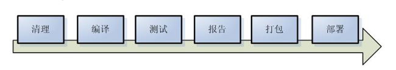
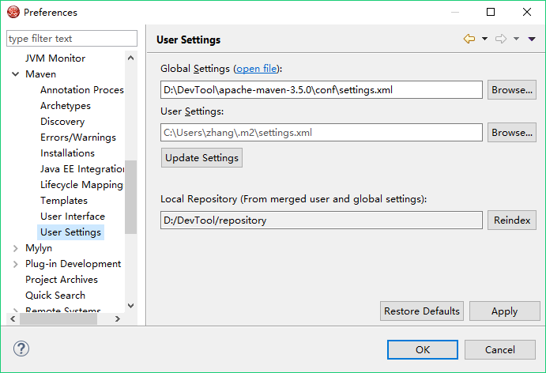
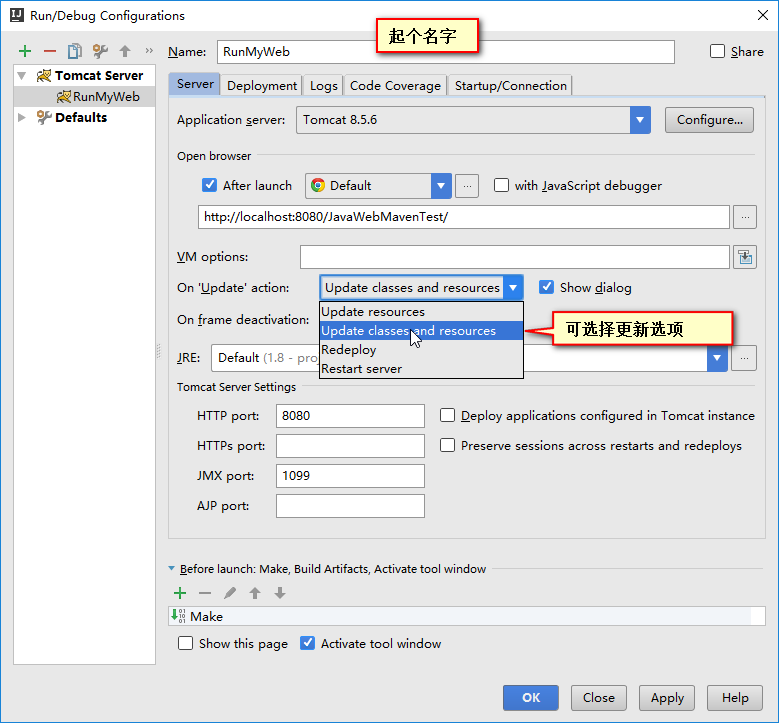
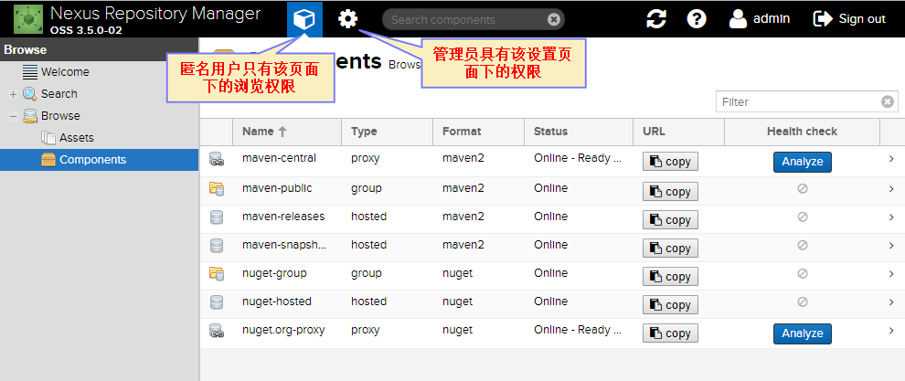

#1. Maven介绍、

## 1.1 什么是Maven

　　Maven是一个Java项目管理与构建工具。一个软件开发完毕后，就需要编译、测试和部署该软件，这就是一个软件的构建生命周期。一般，构建生命周期包含以下几个阶段：



　　图1-1 软件构建的生命周期

　　通过构建工具，能自动化处理上图中所示的工作。Maven工具通过一个简单的命令即可完成所有操作。采用Maven能对项目进行自动构建，而Maven的重点内容之一在于解决项目的依赖关系：

　　在项目中，通常用到很多jar包，以往是手动复制jar包到项目中，但是这样容易出错，并且难于管理。

　　此外，针对Java项目的构建工具还有Ant和Gradle等，不过现在Ant已经被淘汰了，有兴趣的同学也可学习下Gradle。

## 1.2 安装Maven

　　Maven是Apache维护的软件，并且也由Java语言编写，因此安装Maven的首要条件是有Java环境。

　　到Apache官网下载Maven安装包并解压到一个目录，将其中的bin目录添加到PATH环境变量，以便在命令行中使用。这样就完成了Maven的安装。

　　完成后，在命令行中使用mvn -v命令测试是否安装成功。如果显示出Maven的版本信息，则说明安装成功。

　　maven安装目录说明：

　　（1）bin文件夹：存放maven的命令文件（mvn等）。

　　（2）boot文件夹：其中只有一个plexus-classworlds-2.5.2.jar文件，该文件用于下载所需的jar包。

　　（3）conf文件夹：存放配置文件，其中settings.xml是重要的配置文件。

　　（4）lib文件夹：存放maven运行时所依赖的jar包。

# 2. Maven项目的创建

## 2.1 Maven的约定

　　“Convention Over Configuration”，即约定优于配置。Maven约定好了项目的目录结构，使所有开发者都遵循这个约定，这样项目的管理就会变得简单很多。现在很多流行的框架中都使用了这个概念。Maven约定项目的目录结构如下：

```
src
| - - main
|    | - - java目录
|    | - - resources目录
| - - test
|    | - - java目录
|    | - - resources目录
| - - target目录
| - - pom.xml文件
```

　　上述的目录和文件结构解释如下：

|     目录或文件     |   说明                           |
|:-------------------|:---------------------------------|
| src/main/java      | 存放项目的java源文件             |
| src/main/resources | 存放项目的资源文件，如配置文件等 |
| src/test/java      | 存放项目的java测试源文件         |
| src/test/resources | 存放测试用的资源文件件           |
| target  |项目构建的输出位置，即存放编译（测试、打包等）项目时生成的各种文件|
| pom.xml            | maven项目的配置文件              |

　　上述目录不一定都要存在，比如，如果不需要测试的话，则可以没有测试文件夹；再比如，如果清理了项目的构建，那么target目录将被删除。

## 2.2 第一个Maven项目以及POM介绍

　　现在编写第一个Maven示例项目。在此示例中，为了演示Maven是如何处理jar包的依赖的，我们在项目代码中使用了alibaba的fastjson包（只是代码中使用其提供的类，并非把fastjson包复制过来使用，这正是Maven要解决的问题）。

　　首先按照约定，在项目文件夹（自己定义该文件夹，比如叫demo）下新建上述约定的文件夹和文件。随后，在src/main/java文件夹下再新建包文件夹com/javademo/mvn，并在其中创建Demo类文件Demo.java，内容为：

```java
package com.javademo.mvn;

import java.util.Map;
import com.alibaba.fastjson.JSON;

public class Demo {
    // 将map集合转化成JSON数据返回。依赖fastjson。
    public String toJson(Map<String, String> map) {
        return JSON.toJSONString(map);
    }
}
```

　　在src/test/java测试文件夹下也新建com/javademo/mvn包文件夹，并创建TestDemo类，内容如下：

```java
package com.javademo.mvn;

import java.util.Map;
import java.util.HashMap;
import org.junit.Test;

// 测试类
public class TestDemo {
    @Test
    public String testToJson() {
        Map<String, String> map = new HashMap<String, String>();
        map.put("name", "张三");
        map.put("age", "12");
        // 直接使用Demo类，无需import包，因为都是在"com.javademo.mvn"包中
        String jsonStr = new Demo().toJson(map);
        System.out.println(jsonStr);
    }
}
```

　　我们这里没有资源文件，因此不需使用resources目录。

　　接下来直接编写pom.xml文件。POM就是项目对象模型（Project Object Model），即把项目也当成是对象，“万物皆对象”。pom.xml中配置了该项目的所有构建信息，包括项目的描述和依赖等。

　　在本项目中，要注意项目不仅依赖了fastjson，还依赖了junit，这是junit只在测试时会用到。这里的pom.xml配置内容如下：

```xml
<project xmlns="http://maven.apache.org/POM/4.0.0" xmlns:xsi="http://www.w3.org/2001/XMLSchema-instance" xsi:schemaLocation="http://maven.apache.org/POM/4.0.0 http://maven.apache.org/xsd/maven-4.0.0.xsd">
    <!-- 以上是pom.xml的约束，该文件的根元素是project -->

    <!-- pom.xml项目模型对象配置文件版本 -->
    <modelVersion>4.0.0</modelVersion>
    <!-- 下面描述此项目信息 -->

    <!-- groupId，组id，相当于公司名称 -->
    <groupId>com.javademo</groupId>
    <!-- artifactId，构建物id，相当于项目名称/产品名称，一个公司有多个项目。 -->
    <artifactId>mvn-demo</artifactId>
    <!-- 版本号。SNAPSHOT表示快照版本，RELEASE表示发行版本 -->
    <version>1.0.0-SNAPSHOT</version>
    <!-- 打包方式，一般为jar或者war。 -->
    <packaging>jar</packaging>
    <!-- name相当于描述性质的项目名称 -->
    <name>my first maven demo</name>
    <!-- 项目的url。name和url这两项是无所谓的，可不配置 -->
    <url>www.zhang.com</url>

    <!-- 下面配置项目依赖的jar包。所有的依赖配置在dependencies节点中 -->
    <dependencies>
        <!-- 每个dependency节点就是一个依赖项 -->
        <!-- fastjson的依赖 -->
        <dependency>
            <groupId>com.alibaba</groupId>
            <artifactId>fastjson</artifactId>
            <version>1.2.32</version>
            <scope>compile</scope>
        </dependency>
        <!-- junit的依赖 -->
        <dependency>
            <groupId>junit</groupId>
            <artifactId>junit</artifactId>
            <version>4.12</version>
            <scope>test</scope>
        </dependency>
    </dependencies>
</project>
```

　　从配置中可看出：

　　在描述该项目时，用groupId、artifactId和version唯一地标识了该项目。Maven就是用这三个信息标识一个项目的。因为在后面的dependency描述依赖的项目时，就是用这三个信息确定了一个依赖的jar包。我们也把这三个信息叫做jar包的“坐标”，通过坐标即可找到确定的jar包。

　　dependency中的scope节点信息用于管理依赖的作用域。scope中常用如下值：

　　（1）compile。这是依赖项默认的作用范围。当不指定scope时，默认就是compile。compile范围表示依赖项在所有情况下都是有效的，包括编译、测试和运行时。

　　（2）test。表示依赖项只在测试时使用，用于编译和运行测试代码，不会随项目发布。例如junit一般就是作为test作用域的依赖项。

　　（3）provided。表示该依赖项将由JDK或者运行容器在运行时提供。该依赖项只有在编译和测试时才会有效，而打包时不会将此依赖项包含在打包文件中。例如servlet-api.jar就适合采用provided作用域。因为WEB项目代码中会用到Servlet的API，因此编译时必须拥有servlet包的依赖。而当我们把项目打成war包时，并不希望servlet也包含其中，避免与WEB容器的冲突。provided作用域正好满足要求，而以前都是IDE帮助我们完成这些事情的，因此现在要自行这样配置pom.xml。

　　（4）runtime。表示该依赖项只有在运行时才是需要的，在编译的时候不需要。如JDBC驱动适用于使用runtime。因为项目只要在运行时能加载JDBC驱动即可，Java代码中使用的都是JDK提供的接口而不是JDBC的实现类。

　　（5）system。表示该依赖项是我们自己提供的，不需要Maven到仓库里面去找。指定scope为system需要与另一个元素systemPath一起使用，它表示该依赖项在当前系统的位置，使用的是绝对路径，即需要显式提供依赖的jar包。例如：

```xml
<dependency>
    <groupId>com.cym</groupId>
    <artifactId>mytest</artifactId>
    <version>1.0.0</version>
    <scope>system</scope>
    <systemPath>E:/Java开发/CyJsonView.jar</systemPath>
</dependency>
```

　　依赖的传递：

　　需要注意的是，作用域为test的包不会进行依赖传递，但不是test的包就会进行依赖传递。例如A项目依赖junit，它的作用域是test。现在有一个B项目依赖A项目，但如果B项目要使用junit包，则必须自己重新定义junit的依赖。但如果该包不是test作用域，那么就不需要重新定义了，因为会传递依赖。

## 2.3 使用Maven构建第一个项目

　　上述完成了Maven项目的创建和配置，但是还没有使用Maven的功能。现在，我们使用Maven提供的mvn命令，对项目进行编译、测试、打包等工作。

　　执行mvn命令时，Maven工具首先会寻找目录下的pom.xml文件，只有存在pom.xml文件，Maven才认为该目录下是一个Maven项目，否则报错。

　　因此我们首先要进入项目目录下准备执行命令。常用的命令如下：

　　（1）mvn clean清理命令：对项目的构建内容进行清理，会删除target目录。

　　（2）mvn compile编译命令：用于编译项目，并生成target文件夹，会将src/main/java目录下的源文件编译成字节码，并将字节码文件（带有包目录）存入target/classes目录下。同时将src/main/resources中资源文件复制到target/classes目录下（如果在target/classes目录下运行编译后的Java项目，那么实际上资源文件就是被复制进classpath目录中了）。

　　（3）mvn test测试命令：会编译测试类。即会将测试代码（src/test/java）及其资源文件存入target/test-classes目录下，同时会执行全部的junit的测试方法并生成结果报告，非常方便。

　　（4）mvn package打包命令：将项目打包成jar文件。

　　target生成目录的解释：

　　classes：存放编译后的字节码文件

　　test-classes：存放编译后的测试类字节码文件

　　surefire-reports：测试报告目录

　　maven-archiver：执行package时生成的归档文件

　　（5）mvn install安装命令：将本项目发布到本地仓库（仓库的概念下面讲），使本机其他项目能依赖此本项目生成的jar包。

　　（6）mvn deploy远程部署命令。可将项目远程部署到私服上以便局域网其他用户使用（了解）。

　　执行每个命令时，都会先把在这之前的命令执行完毕。比如执行mvn compile，则会先clean再compile；执行mvn package时，则会先清空、编译和测试，再进行打包。读者可针对第一个项目运行上述命令查看效果。

　　在初次执行上述各个命令时，用户会看到Maven会下载许多jar包，其实这是Maven在下载插件包。Maven的构建是基于插件的，即compile编译、test测试等功能都有相应的插件来完成，而Maven本身并不集成这些插件，因此初次使用命令时Maven会从网上下载对应的插件到本地仓库中以便执行命令。Maven会在本地仓库中保存下载的jar包，这样下次再执行命令时，由于仓库中已经有了这些插件包，就无需再次下载了。

　　当Maven构建项目时，首先根据pom.xml文件，把xml转化成项目对象模型(POM)，然后解析依赖关系。此时Maven就知道项目需要哪些依赖，Maven就会去本地仓库中寻找依赖的jar包，如果找不到，就会从网上下载再存到本地仓库以便下次使用。

　　另外，至于我们是如何知道jar包的坐标、以及jar包是存储在哪里的，下面讲。

## 2.4 Maven的仓库

　　由pom.xml可知，Maven通过声明式完成对jar包的依赖管理。那么这些在pom.xml中声明的jar包是如何找到的呢？就是通过“仓库”来找到的。

　　Maven有仓库的概念。Maven默认会将“${user.home}/.m2/repository”目录（${user.home}代表用户的目录）作为本机的Maven仓库，该仓库专门用于存储jar包。

　　Maven不会将项目所需jar包复制到项目中（除非是发布带有依赖包的运行文件，比如生成war包），而是“引用”jar包，即项目的jar包引用指向仓库中。这样便于整体管理并且计算机无需在每个项目都保存jar包。

　　一开始本机仓库中是没有存储任何jar包的，那么jar包从哪里得到呢？Maven寻找jar包的方式是先在本地仓库查找，如果没有就去中央仓库找。中央仓库是Maven官方维护的，其中基本涵盖了所有的开源jar包。

　　在maven安装目录的lib目录下，maven-model-builder-3.5.0.jar包中，org/apache/model/pom-4.0.0.xml文件中定义了jar包和第三方插件下载的中央仓库地址：

```xml
<!--第三方jar包下载地址-->
<repositories>
    <repository>
        <id>central</id>
        <name>Central Repository</name>
        <url>https://repo.maven.apache.org/maven2</url>
        <layout>default</layout>
        <snapshots>
            <enabled>false</enabled>
        </snapshots>
    </repository>
</repositories>
<!--Maven插件下载地址-->
<pluginRepositories>
<pluginRepository>
    <id>central</id>
    <name>Central Repository</name>
    <url>https://repo.maven.apache.org/maven2</url>
    <layout>default</layout>
    <snapshots>
        <enabled>false</enabled>
    </snapshots>
    <releases>
        <updatePolicy>never</updatePolicy>
    </releases>
</pluginRepository>
</pluginRepositories>
```

　　但有时中央仓库由于有GFW的存在，速度很慢，我们可以在conf/settings.xml中配置一个阿里云的maven仓库镜像，使得Maven从阿里云上下载jar包，这样速度会很快。配置方法是在settings.xml文件的mirrors节点中添加以下内容：

```xml
<mirror>
    <id>alimaven</id>
    <name>aliyun maven</name>
    <url>http://maven.aliyun.com/nexus/content/groups/public/</url>
    <mirrorOf>central</mirrorOf>
</mirror>
```

　　实际上阿里云也是用了Nexus私服（私服在后面讲）。

　　有时，我们并不想将${user.home}/.m2/repository作为本机的Maven仓库。这是可以通过conf/settings.xml文件设置的。即将文件中的localRepository节点取消注释，内容换成自己配置的仓库目录即可。如：

```xml
<localRepository>D:/DevTool/repository</localRepository>
```

　　这样进行配置实际是全局配置Maven仓库，如果每个用户想拥有自己不同的仓库，那么将修改好的配置文件复制一份放到${user.home}/.m2目录下即可。

　　那么是如何找到一个jar包的maven坐标的呢？比如我想在项目中使用JUnit，那么怎样知道JUnit的坐标？一般有两种方式：（1）进入jar包开发者的官网（或对应的GitHub地址），在网站介绍中就会提及最新的Maven坐标以及告诉你如何使用。我们只要复制过来即可。（2）进入中央仓库搜索地址：http://search.maven.org/ ，搜索想要的包，在结果中找到合适的版本，直接使用其提供的Maven坐标即可。有时上述网站访问较慢，也可以进行网站http://mvnrepository.com/ 进行搜索，用法类似（推荐后一个网站）。

# 3. 常见的案例及配置

## 3.1 依赖本地项目

　　上述讲的都是依赖开源项目，这些项目都已在中央仓库提供了，因此很好使用。下面介绍如何在项目中依赖本地项目（比如本项目依赖自己在本地开发的类库）。

　　我们现在创建本地项目mvn-demo2，使mvn-demo2依赖之前创建的Maven项目mvn-demo。

　　（1）首先要将mvn-demo项目“安装”到本地仓库中以便被依赖，否则其他项目是无法依赖的。

　　由于mvn-demo已经创建好了，我们只需运行命令“mvn install”，该命令就会将mvn-demo项目安装到本地仓库。命令执行成功后，就可在仓库中找到本项目的目录，其中有对应的jar包和pom.xml等配置文件。后面的项目如果依赖mvn-demo，直接通过这里的配置文件就能知道mvn-demo的坐标。

　　（2）创建mvn-demo2项目并依赖mvn-demo项目。为了简单，mvn-demo2项目只在src/java/main的包com.javademo.mvn2中创建一个Demo2类，然后在该类中使用一下Demo类和JSON类，证明依赖成功，并且有依赖传递（因为可使用fastjson的JSON类）。但是JUnit是不能使用的，除非自己添加JUnit依赖，因为JUnit在mvn-demo中是test作用域。

　　Demo2类内容如下：

```java
package com.javademo.mvn2;

import java.util.Map;
import java.util.HashMap;
import com.alibaba.fastjson.JSON;
import com.javademo.mvn.Demo;

public class Demo2 {
    public static void main(String[] args) {
        Map map = new HashMap<String, String>();
        new Demo().toJson(map);
        JSON.toJSONString(map);
    }
}
```

　　其中pom.xml如下：

```xml
<project xmlns="http://maven.apache.org/POM/4.0.0" xmlns:xsi="http://www.w3.org/2001/XMLSchema-instance" xsi:schemaLocation="http://maven.apache.org/POM/4.0.0 http://maven.apache.org/xsd/maven-4.0.0.xsd">
    <modelVersion>4.0.0</modelVersion>
    <groupId>com.javademo</groupId>
    <artifactId>mvn-demo2</artifactId>
    <version>1.0.0-SNAPSHOT</version>
    <packaging>jar</packaging>

    <dependencies>
        <!-- 只依赖一个mvn-demo -->
        <dependency>
            <groupId>com.javademo</groupId>
            <artifactId>mvn-demo</artifactId>
            <version>1.0.0-SNAPSHOT</version>
            <scope>compile</scope>
        </dependency>
    </dependencies>
</project>
```

　　这样，依赖于本地项目的Maven项目就创建好了，使用mvn compile成功通过编译。

## 3.2 依赖的继承管理

　　Maven对jar包的管理方式有两种，第一种是前面讲的依赖管理，第二种就是继承管理。

　　什么是继承管理？现在考虑一种情况：公司有好几个项目都需要用到A、B和C三个jar包，如果每个项目都添加A、B和C的依赖，就比较麻烦。这时就可以创建一个空的Maven项目，在其pom.xml中配置依赖上述的A，B和C三个包，并且设置本项目的打包方式为pom方式，即&lt;packaging&gt;pom&lt;/packaging&gt;，最后通过mvn install命令将本“空项目”发布到本地仓库。

　　这样，公司的项目中如果都用到了A，B和C三个包，那么这个项目只需要“继承”这个“空Maven项目”即可。这是通过parent节点配置的，即在parent节点里面写这个空项目的坐标信息。

## 3.3 其他常见配置

　　（1）在对上面的Maven项目运行构建命令时，常会出现以下警告：

　　[WARNING] Using platform encoding (GBK actually) to copy filtered resources, i.e. build is platform dependent!

　　意思是提醒我们项目的文件编码应该用与平台无关的编码，例如UTF-8。因此，一般在pom.xml中配置源码编码为UTF-8，这样就不会出现上述警告。配置方法（在project节点中）：

```xml
<properties>
    <project.build.sourceEncoding>UTF-8</project.build.sourceEncoding>
</properties>
```

　　（2）Maven默认采用JDK 1.5版本来编译Java文件，这样将导致代码无法使用高版本特性。我们需要通过maven-compiler-plugin插件来设置Maven采用指定的JDK版本来编译Java文件。比如设置用Java 8编译源文件，那么pom.xml增加如下配置（在project节点中）：

```xml
<build>
    <pluginManagement>
        <plugins>
            <plugin>
                <groupId>org.apache.maven.plugins</groupId>
                <artifactId>maven-compiler-plugin</artifactId>
                <version>3.6.1</version>
                <configuration>
                    <source>1.8</source>
                    <target>1.8</target>
                    <encoding>UTF-8</encoding>
                </configuration>
            </plugin>
        </plugins>
    </pluginManagement>
</build>
```

　　（3）Maven允许在POM中设置常量，以便统一修改和使用。比如可将上述的“1.8”设置为常量（常量也在properties的节点中设置，可自定义节点名称，该节点的名称就是常量名），然后通过“${常量名}”方式引用。例如：

```xml
<properties>
    <!-- 设置编码 -->
    <project.build.sourceEncoding>UTF-8</project.build.sourceEncoding>
    <!-- 设置常量“jdk.version” -->
    <jdk.version>1.8</jdk.version>
</properties>
<build>
    <pluginManagement>
        <plugins>
            <plugin>
                <groupId>org.apache.maven.plugins</groupId>
                <artifactId>maven-compiler-plugin</artifactId>
                <version>3.6.1</version>
                <configuration>
                    <!-- 引用jdk.version常量 -->
                    <source>${jdk.version}</source>
                    <target>${jdk.version}</target>
                    <encoding>UTF-8</encoding>
                </configuration>
            </plugin>
        </plugins>
    </pluginManagement>
</build>
```

　　项目中常会用到常量，比如项目中要使用SpringMVC和SpringORM的包，那么在项目中他们的版本肯定要用一样的，比如都是Spring 3.8.1 RELEASE版本的，那么就可指定一个常量spring-version的值为“Spring 3.8.1 RELEASE”，然后SpringMVC和SpringORM包的version配置都使用spring-version这个常量。这样就能做到以后只修改一处就能修改所有的Spring版本，非常方便。

　　除此之外，Maven还内置了一些常量，可以直接使用，大家可自行研究。

　　（4）跳过单元测试

　　有时，我们想要配置Maven使其跳过单元测试。比如有一个很大的系统，如果运行整个单元测试，需要花费大量时间，而我们在使用时，并不想进行单元测试，而仅仅想要生成一个该项目的jar包。这时我们就想跳过单元测试，并且并不关心系统能否通过所有的单元测试。

　　Maven提供了跳过单元测试的能力，我们可以直接使用如下参数来表示跳过测试：

```
$ mvn 任务 -D maven.test.skip=true
```

　　例如：

```
$ mvn package -D maven.test.skip=true
```

　　上述就表示执行package时，跳过单元测试。重要的是“-D maven.test.skip=true”这个参数。

　　除了上述使用命令的方式来跳过单元测试外，我们还可利用配置“surefire”这个Maven插件的方式来跳过单元测试。只要在pom.xml加上如下配置即可：

```xml
<build>
    <plugins>
        <plugin>
            <artifactId>maven-surefire-plugin</artifactId>
            <version>2.20</version>
            <configuration>
                <skip>true</skip>
            </configuration>
        </plugin>
    </plugins>
</build>
```

　　这样运行Maven的构建命令时，也会跳过单元测试。

# 4. Maven与IDE的集成

## 4.1 在Eclipse中使用Maven

　　首先在Eclipse中配置Maven。打开“Window - Preferences”窗口，在“Maven - Installations”中点击“Add...”按钮添加本机的Maven目录。随后启用这个Maven（不使用Eclipse集成的Maven），如下图所示：


　　图4-1 设置Maven

　　然后在“Maven - User Settings”中点击“Browse...”来加载“Global Settings”文件，即Maven的全局配置文件settings.xml，以便找到全局配置的仓库。如图4-2所示。



　　图4-2 加载Global Settings文件

　　最后点击“OK”即可完成Maven的集成。

　　接下来就是在Eclipse中创建Maven项目了。无论是新建普通的Java项目还是WEB项目，在新建Project时，都选择Maven中的“Maven Project”。在弹出的第一个界面中勾选上“Create a simple project(skip archetype selection)”，即创建一个不使用Archetype的简单Maven项目。

　　那么Archetype是什么呢？Archetype是骨架的意思，Archetype是别人根据不同需要，按照基本的Maven规范建立的“骨架”。开发者可利用Archetype快速创建Maven项目。我们这里不使用Archetype，因为这些Archetype不完全符合我们的要求。

　　点击Next后，出现以下界面，即输入创建Maven项目的信息，如图4-3所示。


　　图4-3 创建Maven项目

　　这里必须填写的是Group Id、Artifact Id、Version和Packaging。其中Packaging有三个选项，分别是jar、war和pom。由于我们以创建WEB项目为例，所以这里选择war。如果是普通Java项目，则选择jar。如果是为了处理依赖的继承，则选择pom。

　　点击Finish后即创建项目。我们发现创建的项目中，除了有src/main/java、src/main/resources、src/test/java和src/test/resources文件夹外，另外还有一个“src/main/webapp”文件夹。这个文件夹是WEB项目特有的，其实该文件夹就是以前WEB普通项目中的“WebContent”目录，webapp目录和之前的WebContent一样用即可，只是在Maven项目中习惯用webapp目录而已。我们发现项目的pom.xml报错，提示是没有web.xml文件，那么我们直接在webapp下面建立“WEB-INF/web.xml”文件及其文件夹即可。但是无需建立WEB-INF/lib目录，因为jar包这时是采用Maven管理的。只有在对项目打包时，Maven才会在war中加入lib目录及所需包。

　　这时就能进行开发了吗？我们试验一下。在src/main/java中创建包并创建类，写一个简单的Servlet。发现写的时候，项目根本找不到Servlet相关的API。这是为什么呢？我们以前创建WEB项目时，创建之时就选择了目标的服务器，而目标服务器中已经提供了Servlet API的包（例如Tomcat/lib中的servlet-api.jar），IDE会自动引用其中提供的我们需要使用的这个包。因此我们没有关心是否引入了Servlet API包。现在不同了，采用Maven管理后，我们需要自己引入Servlet API的依赖，否则项目是无法编译的。提醒一下，引入Servlet API的包，作用范围设置为“provided”即可，因为此包只在编译时使用，当项目运行时，Tomcat中已经提供了相应的包，就不用包含了。这点在前面已经提过了。

　　可引入如下依赖，这是Oracle官方提供的：

```xml
<dependency>
    <groupId>javax.servlet</groupId>
    <artifactId>javax.servlet-api</artifactId>
    <version>3.1.0</version>
    <scope>provided</scope>
</dependency>
```

　　当然也可直接依赖Tomcat自己提供的Servlet API，这个会随着Tomcat的更新而更新，用匹配的版本即可。比如：

```xml
<dependency>
    <groupId>org.apache.tomcat</groupId>
    <artifactId>tomcat-servlet-api</artifactId>
    <version>8.5.6</version>
    <scope>provided</scope>
</dependency>
```

　　也许项目中还会用到JSTL、JDBC的包，都需要自己引入。这些包的坐标自行在网站中搜索，并且考虑scope用哪种作用域。

　　对于将项目调试部署在Tomcat运行，和之前的操作方式是一样的。

## 4.2 IDEA集成Maven

　　首先在IDEA中新建项目。选择左侧的“Maven”，直接点击Next输入项目信息，再点击两次Next完成项目的创建。

　　IDEA是在项目创建之后再设置IDEA使用自己安装的Maven的。否则每次新建的项目都会使用IDEA集成的Maven。在IDEA中打开“File - Settings...”，在弹出的界面中选择“Build，Execution，Deployment” - “Build Tools” - “Maven”。在“Maven home directory”中选择自己的Maven目录即可。注意观察下面的“Local Repository”是否是自己配置的仓库地址。如果是自己的仓库地址，表示配置成功。

　　接下来在pom.xml中配置打包方式为war，并且需要自己在src/main中建立webapp文件夹。在IDEA中，src/main/webapp是不会被单独列出来的，这样也比较好看一点。同样，WEB-INF等也需要自己创建。在pom.xml添加Servlet API依赖等配置后，就能写一个Servlet进行测试了。下面就针对如何在IDEA中运行调试该WEB项目进行介绍。

　　首先了解在Idea中有Facets和Artifacts的概念。Facets表示某个Module有的特征，比如web、strtus2、spring、hibernate等。Artifacts表示某个Module要如何打包，例如war exploded、war、jar等打包形式。当部署到服务器时，也是通过Artifacts部署的，部署时war时，还分为war exploded和war两种模式：

　　（1）war模式 - 将WEB工程打成war包，再传到服务器上运行，服务器会解压。生产环境常用；

　　（2）war exploded模式 - 将WEB工程以当前文件夹的位置关系直接上传到服务器，开发环境常用，速度较快。

　　下面进行服务器的配置，使项目可运行。

　　在IDEA中点击Run – Edit Configurations…来配置项目的运行。先点击“+”新建一个运行环境（这里选择了Tomcat - Local）：


　　图4-4 选择服务器

　　选好之后在界面中先设置Deployment选项卡，这是先选择项目的打包方式：


　　图4-5 选择Artifacts

　　然后弹框中选择war exploded一项，因为这是开发环境。


　　图4-6 选择Artifacts模式

　　然后在界面中设置context为“/项目名”，比如“/dsm”，那么这样访问项目的时候就是“localhost:8080/dsm/index.jsp”了，而如果不配置的话，访问的地址就是“localhost:8080/index.jsp”。随后点击Apply，再进入Server选项卡中设置：



　　图4-7 配置Server

　　这样在点击“Apply”和“OK”就好了。最后点击绿色箭头在Tomcat中运行即可。

　　说明一下，这些项目最好都在pom.xml中加上之前建议的配置。并且IDE因为有了Maven管理，就不会再自行生成和IDE相关的输出目录了（比如Eclipse的输出目录是bin，IDEA的输出目录是out），而是直接使用target目录。

# 5. 搭建Nexus私有服务器

　　公司一般会搭建自己的Maven私有服务器。配置了私服，那么公司局域网中各个计算机的Maven环境在寻找jar包时，会先在本地仓库找，如果没有，再请求私服中的jar包，如果私服中也没有此jar包，私服再去网络（例如中央仓库）中下载。只要本地或者私服中没有该包，本地仓库或者私服都会把包下载，这样下次使用就不必再下载了。

　　使用私服的好处是保证局域网中也能使用Maven构建项目，而且使用私服使局域网中资源更加稳定，也避免了局域网中每个计算机都要从中央仓库下载需要的包。

## 5.1 搭建Nexus私服

　　我们一般使用Nexus这个免费的软件来搭建Maven私有服务器。该软件由Sonatype提供，下载地址是： https://www.sonatype.com/download-oss-sonatype 。我们要下载和使用的就是“Nexus Repository Manager OSS 3.x”，就是Nexus3版本。（小提示：Nexus3不仅支持Maven，也支持npm、Nuget等，这些是在JavaScript和.net中使用的，但我们目前没有必要了解）

　　下载好Nexus3后直接解压即可，无需安装（我们这里介绍的是Windows环境的安装，且示例版本是Nexus3.5.0-02）。解压完后其中有两个目录，一个是软件目录，即“nexus-3.5.0-02-win64”目录，一个是nexues3的工作目录，即“sonatype-work”。我们只需进入“nexus-3.5.0-02-win64”下面的bin目录，并执行命令：

```
nexus.exe -run
```

　　即可启动Nexus3。但是在实际中一般不这样做，因为一直有运行界面。我们可以把Nexus安装为Windows的服务，执行以下命令：

```
nexus.exe -install
```

　　这样就安装了Windows服务了，默认安装的服务名称就是“nexus”，可以在Windows中启动该服务（或者使用sc/net start nexus命令）。当然，如果想要删除nexus服务，只要执行“nexus -uninstall”命令即可。

　　我们通过访问nexus在本机提供的WEB服务来管理nexus。nexus默认监听的端口是8081，如果想改变nexus的这些默认配置，则需要修改“nexus-3.5.0-02-win64/nexus-3.5.0-02/etc”文件夹下的nexus.default.properties文件，然后再重启nexus。

　　不管是运行nexus还是启动nexus服务，nexus都需要花费几分钟的时间准备就绪，因此等待2分钟后，我们开始访问“localhost:8081”，就能成功进入nexus3的界面了。nexus3有严格的账户控制，匿名用户只能浏览，因此我们点击右上角的“Sign in”按钮登录系统默认的管理员账号admin，其密码是admin123，登录后就能操作nexus3了。如下图：



　　能见到上述图，就说明nexus的环境搭建好了。

## 5.2 管理nexus仓库

　　浏览页面中的“Search”面板用于进行搜索，“Assets”和“Components”面板页面都显示了nexus目前维护的仓库，其页面都提供了搜索功能，不同的是“Assets”页面选择一个仓库后，可直接看到仓库的所有文件，而“Components”页面选择仓库后，先查看到仓库下有哪些包的分类，然后再进入包中具体的文件，以后有了文件后就知道是什么情况了。

　　在浏览页面我们看到nexus3默认就创建并维护了几个仓库，其中，以“nuget”开头的仓库不是我们需要的（这个会在.net中用到），因此我们在管理页面把以“nuget”开头的仓库全部删除。删除方法：进入管理页面，在“Repository - Repositories”面板中，选择“nuget”开头的仓库，在接下来的页面中，点击“Delete repository”就删除了该仓库。

　　这样，nuxes3中只剩下了四个仓库，它们分别是：

　　（1）maven-central：它的类型是proxy，表示该仓库起代理的作用，当有需要时，它会从指定的中央仓库下载需要的包并存储到nexus3的工作目录中，以便局域网其他用户使用。因此这相当是nexus使用的中央仓库。

　　（2）maven-releases和maven-snapshots：这两个仓库的类型都是hosted（宿主），都用于存储私有的包。例如公司自行开发的包，在互联网上是不存在的，此时就需要将公司的包发布在私服上以供使用。maven-releases仓库就用于存储私有的稳定版本的包，maven-snapshots就用于存储私有的不稳定版本的包。

　　（3）maven-public：这个仓库的类型是group，该类型的仓库表示把多个仓库添加到一个group仓库中，然后由group仓库提供服务即可。什么意思呢？就是该maven-public相当于引用了上述的三个仓库，这样，局域网的用户在使用的时候，就不必区分地使用nexus中的某个仓库，只要直接使用maven-public仓库即可，因为maven-public仓库内容就包含了所有的仓库内容。

　　上述的仓库是nexus默认提供的，我们可以在管理页面的“Repository - Repositories”选项卡中查看各个仓库的具体设置，证明上述所言属实：maven-central确实有中央仓库地址的配置，且maven-public确实包含了其余仓库作为它的成员（Member）。在该页面中，也同样可以更改仓库属性和添加我们需要的仓库（同类型的仓库可以重复，根据需要来）等。如果想要提高nexus中央仓库的速度，同样可以在maven-central仓库的设置中，将其默认中央仓库代理（Proxy）地址设置为阿里云的地址 “ http://maven.aliyun.com/nexus/content/groups/public/  ”。

　　对于仓库的管理，其实非常简单，只要理解上述几个默认的仓库和仓库不同类型（proxy、hosted和group）的作用即可。

## 5.2 权限管理

　　在nexus的管理页面中，最常用的除了Repository外，这里再介绍Security安全模块。在该模块中能设置权限（Privileges）、角色（Roles）和用户（Users）。

　　权限一般无需自行设置，nexus提供了众多的权限，常用的就是设置角色和用户。创建角色时，就是给指定的角色分配权限，而创建用户时，就是给指定的用户分配角色，最终知道这个用户拥有什么样的权限。

　　至于其他模块的各个管理功能，请自行摸索体会，一些高级的功能暂无需了解。

## 5.3 使用nexus私服

　　搭建了私服后，就可以在一个Maven项目中指定该项目使用该私服获取jar包。我们可在Maven项目的pom.xml根节点project下加上如下内容：

```xml
<repositories>
    <repository>
        <id>nexus</id>
        <name>maven-public</name>
        <url>http://localhost:8081/repository/maven-public/</url>
        <snapshots>
            <enabled>true</enabled>
        </snapshots>
        <releases>
            <enabled>true</enabled>
        </releases>
    </repository>
</repositories>
<pluginRepositories>
    <pluginRepository>
        <id>nexus</id>
        <name>maven-public</name>
        <url>http://localhost:8081/repository/maven-public/</url>
        <releases>
            <enabled>true</enabled>
        </releases>
        <snapshots>
            <enabled>false</enabled>
        </snapshots>
    </pluginRepository>
</pluginRepositories>
```

　　上述就配置了本项目使用的远程仓库和远程插件仓库，都是使用nexus私服的地址。该地址在nexus浏览页面“Components”面板中，点击指定仓库的“Copy”按钮就能复制过来。这里配置允许使用远程仓库（私服）的releases和snapshots版本，但Maven插件只允许使用releases版本。

　　上述只是在某个项目中使用私服，是局部设置，如果想要本机的所有Maven项目都使用私服，就在Maven的settings.xml文件中加入如下内容：

```xml
<profiles>
    <profile>
        <id>dev</id>
        <!-- 这其中和之前项目pom.xml设置相同 -->
        <repositories>
            <repository>
                <id>nexus</id>
                <name>maven-public</name>
                <url>http://localhost:8081/repository/maven-public/</url>
                <snapshots>
                    <enabled>true</enabled>
                </snapshots>
                <releases>
                    <enabled>true</enabled>
                </releases>
            </repository>
        </repositories>
        <pluginRepositories>
            <pluginRepository>
                <id>nexus</id>
                <name>maven-public</name>
                <url>http://localhost:8081/repository/maven-public/</url>
                <releases>
                    <enabled>true</enabled>
                </releases>
                <snapshots>
                    <enabled>false</enabled>
                </snapshots>
            </pluginRepository>
        </pluginRepositories>
    </profile>
</profiles>
<activeProfiles>
    <activeProfile>dev</activeProfile>
</activeProfiles>
```

　　在settings.xml中设置的就是全局设置了。这样每个本机的Maven项目都会使用私服。当然，我们也还是可以利用mirror设置镜像的方式，直接将镜像地址设置为私服地址，用私服镜像替换掉默认的中央仓库，因为私服也可以设置从阿里云服务器获取包，并且本机只要直接与私服打交道即可，这样，连上述的全局设置都不用了，整个settings.xml文件为：

```xml
<?xml version="1.0" encoding="UTF-8"?>
<settings xmlns="http://maven.apache.org/SETTINGS/1.0.0"
          xmlns:xsi="http://www.w3.org/2001/XMLSchema-instance"
          xsi:schemaLocation="http://maven.apache.org/SETTINGS/1.0.0 http://maven.apache.org/xsd/settings-1.0.0.xsd">
    <!-- 本地仓库 -->
    <localRepository>D:\DevTool\repository</localRepository>
    <!-- 私服镜像 -->
    <mirrors>
        <mirror>
            <id>nexus</id>
            <name>maven-public</name>
            <url>http://localhost:8081/repository/maven-public/</url>
            <mirrorOf>*</mirrorOf>
        </mirror>
    </mirrors>
</settings>
```

　　即可。构建项目，当本地无jar包时就会请求私服，如果私服也没有jar包，则会下载，最后存储在私服、返回包给本地仓库，本地仓库再存储。此时，私服中有了包，我们就能在浏览页面中看到详细的信息，可以好好利用，也能利用nexus下载已经存储在私服上的jar包。

　　特别注意：我之前一直在Maven中阿里云镜像，这样下载到本地仓库快一点，但没有使用私服。如今使用了私服，却发现：当本地仓库有了某包而私服中没有，本Maven项目会出错，原因是解决不了这个包依赖！具体出错原因是：

```
[ERROR] Failed to execute goal on project webtest: Could not resolve dependencies for project com.test:webtest:war:1.0-SNAPSHOT: The following artifacts could not be resolved: javax.servlet:jstl:jar:1.2: Failure to find javax.servlet:jstl:jar:1.2 in http://localhost:8081/repository/maven-public/ was cached in the local repository, resolution will not be reattempted until the update interval of my-org-repo has elapsed or updates are forced -> [Help 1]
```

　　解决办法就是在使用私服前，将本地仓库清空，这样就保证了本地仓库不会存在私服中没有的包。这样的问题很奇葩啊！

## 5.4 将项目发布到私服

　　之前我们讲过使用mvn install命令将项目发布到本地仓库，现在使用了私服后，为了使局域网的用户都能使用公司开发的这个项目，需要将该项目发布到私服中。

　　第一步，首先在Maven的settings.xml中，在servers节点添加私服的认证信息：

```xml
<servers>
    <server>
        <id>nexus</id>
        <username>admin</username>
        <password>admin123</password>
    </server>
</servers>
```

　　这样，settings.xml的完整配置就是：

```xml
<?xml version="1.0" encoding="UTF-8"?>
<settings xmlns="http://maven.apache.org/SETTINGS/1.0.0"
          xmlns:xsi="http://www.w3.org/2001/XMLSchema-instance"
          xsi:schemaLocation="http://maven.apache.org/SETTINGS/1.0.0 http://maven.apache.org/xsd/settings-1.0.0.xsd">
    <localRepository>D:\DevTool\repository</localRepository>
    <servers>
        <server>
            <id>nexus</id>
            <username>admin</username>
            <password>admin123</password>
        </server>
    </servers>
    <mirrors>
        <mirror>
            <id>nexus</id>
            <name>maven-public</name>
            <url>http://localhost:8081/repository/maven-public/</url>
            <mirrorOf>*</mirrorOf>
        </mirror>
    </mirrors>
</settings>
```

　　第二步，在项目pom.xml中添加发布的配置：

```xml
<distributionManagement>
    <repository>
        <id>nexus</id>
        <url>http://localhost:8081/repository/maven-releases/</url>
    </repository>
    <snapshotRepository>
        <id>nexus</id>
        <url>http://localhost:8081/repository/maven-snapshots/</url>
    </snapshotRepository>
</distributionManagement>
```

　　注意，这里的id节点值要和所配置的认证信息server的id一致，都是nexus，否则无法认证。其他的配置就是配置releases和snapshots版本分别要发布的私服仓库地址等。这样配置好后，在项目目录下运行“mvn deploy”命令，就能将项目发布到私服中，并且能在私服中看到。至于发布的是releases还是snapshots，就得看项目本身的版本号是不是以snapshot结尾了。

　　备注：这第五章的利用nexus3搭建私服的教程，我是在网上查找了大量的资料才整理完毕，我觉得整理的还是比较清楚和详细的。网上资源有的并不十分详细和严谨，且直接摘抄的多，实践的少，因此有些问题也还是原本模样，并无解决，且网上资源也参差不齐。因此给出如下建议：

　　（1）明确问题，精确搜索；

　　（2）做事踏实，注重实践，实践时头脑灵活点，想多种办法解决问题；

　　（3）懂得鉴别材料、需要耐心、不断翻阅资料，不要轻易放弃。我完成这教程基本是浏览了二十几篇博客才明白地写成。

　　最终你解决了问题，就会很舒服。
