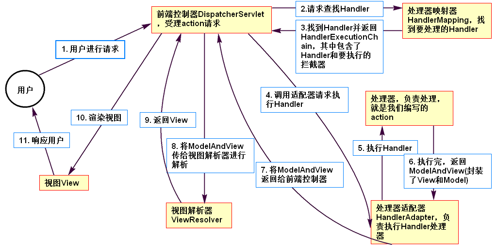

# 1. SpringMVC及其工作原理

　　SpringMVC是Spring框架中Web模块的一部分，因此SpringMVC可以和Spring框架无缝整合，一般都是配合使用。

　　SpringMVC也是基于MVC设计的，在表现层当中充当Controller，这点和Struts的功能是相同的。只不过现在Struts 2已经日渐衰落，更多的人转向使用SpringMVC，并且Spring全家桶也开始流行。了解完SpringMVC后，我们再对SpringMVC和Struts 2进行比较。

　　现在，再解释一下B/S（浏览器/服务器）下的MVC架构，如图1-1所示：


　　图1-1 MVC架构

　　实际上，模型Model是表示应用程序的核心，它包含了调用Service和DAO等提供的功能；Controller只用于数据的简单处理和传递（即转发的功能）；View用于展示数据。

　　下面就介绍SpringMVC的工作原理图，如图1-2所示：



　　图1-2 Spring MVC工作原理

　　从图中可以看出：

　　（1）主要由前端控制器DispatcherServlet负责转发。

　　（2）SpringMVC运行时涉及到的共有四个主要的组件，即处理器类、处理器映射器、处理器适配器和视图解析器。

-        处理器类可以说是核心。图中的Handler其实就是处理器类，即Controller，是真正写处理代码的地方。

-        其他的组件“围绕”处理器类运转。解释如下：1. 处理器映射器用于按照指定的规则，根据请求路径找到对应的处理器类。2. 处理器适配器用于执行处理器类，它可以指定什么样的类才是处理器类。如果处理器映射器找到的处理器类不符合指定的规则（比如，该处理器适配器指定实现Controller接口的类才是处理器类），那么适配器将拒绝执行。3. 视图解析器作用是根据指定的规则来查找对应的视图。

# 2. 第一个SpringMVC示例

　　（1）新建项目。由于我们学习了Maven，这里新建项目时就采用Maven项目进行管理。其中，pom.xml文件配置如下：

```xml
<?xml version="1.0" encoding="UTF-8"?>
<project xmlns="http://maven.apache.org/POM/4.0.0"
         xmlns:xsi="http://www.w3.org/2001/XMLSchema-instance"
         xsi:schemaLocation="http://maven.apache.org/POM/4.0.0 http://maven.apache.org/xsd/maven-4.0.0.xsd">
    <modelVersion>4.0.0</modelVersion>
    <!-- 项目基本描述 -->
    <groupId>com.zhang</groupId>
    <artifactId>mvcdemo</artifactId>
    <version>1.0-SNAPSHOT</version>
    <packaging>war</packaging>
    <!-- 依赖 -->
    <dependencies>
        <!-- SpringMVC -->
        <dependency>
            <groupId>org.springframework</groupId>
            <artifactId>spring-webmvc</artifactId>
            <version>4.3.8.RELEASE</version>
            <scope>compile</scope>
        </dependency>
        <!-- Servlet API -->
        <dependency>
            <groupId>org.apache.tomcat</groupId>
            <artifactId>tomcat-servlet-api</artifactId>
            <version>8.5.12</version>
            <scope>provided</scope>
        </dependency>
        <!-- 可能会用到JSTL -->
        <dependency>
            <groupId>javax.servlet</groupId>
            <artifactId>jstl</artifactId>
            <version>1.2</version>
            <scope>compile</scope>
        </dependency>
    </dependencies>
    <!-- 编码配置 -->
    <properties>
        <project.build.sourceEncoding>UTF-8</project.build.sourceEncoding>
    </properties>
    <!-- 编译配置 -->
    <build>
        <pluginManagement>
            <plugins>
                <plugin>
                    <groupId>org.apache.maven.plugins</groupId>
                    <artifactId>maven-compiler-plugin</artifactId>
                    <version>3.6.1</version>
                    <configuration>
                        <source>1.8</source>
                        <target>1.8</target>
                        <encoding>UTF-8</encoding>
                    </configuration>
                </plugin>
            </plugins>
        </pluginManagement>
    </build>
</project>
```

　　（2）在web.xml中配置前端控制器DispatcherServlet，如下：

```xml
<!DOCTYPE web-app PUBLIC
        "-//Sun Microsystems, Inc.//DTD Web Application 2.3//EN"
        "http://java.sun.com/dtd/web-app_2_3.dtd" >
<web-app>
    <!-- 用Servlet配置SpringMVC的核心控制器。即SpringMVC的入口就是该Servlet -->
    <servlet>
        <servlet-name>springmvc</servlet-name>
        <servlet-class>org.springframework.web.servlet.DispatcherServlet</servlet-class>
        <init-param>
            <!-- 用contextConfigLocation参数来指定SpringMVC的配置文件。 -->
            <!-- 这里即指定SpringMVC的配置文件是classpath路径下的springmvc.xml文件 -->
            <!-- 如果无该参数配置，则SpringMVC默认会加载下述配置文件： -->
            <!-- /WEB-INF/<DispatcherServlet的name>-servlet.xml -->
            <!-- 在本项目中，即会默认加载/WEB-INF/springmvc-servlet.xml文件 -->
            <param-name>contextConfigLocation</param-name>
            <param-value>classpath:springmvc.xml</param-value>
        </init-param>
        <load-on-startup>1</load-on-startup>
    </servlet>
    <servlet-mapping>
        <servlet-name>springmvc</servlet-name>
        <!-- 配置只有以.action结尾的路径才能进入SpringMVC的核心控制器，即才能被SpringMVC处理 -->
        <url-pattern>*.action</url-pattern>
    </servlet-mapping>
</web-app>
```

　　（3）在src/main/resources目录下新建springmvc.xml配置文件。还文件就是本项目的SpringMVC配置文件了。在该文件中，我们先配置好处理器映射器、处理器适配器和视图解析器。

```xml
<?xml version="1.0" encoding="UTF-8"?>
<beans xmlns="http://www.springframework.org/schema/beans"
       xmlns:xsi="http://www.w3.org/2001/XMLSchema-instance"
       xsi:schemaLocation="http://www.springframework.org/schema/beans http://www.springframework.org/schema/beans/spring-beans.xsd">
    <!-- 1. 处理器映射器
        这里配置的处理器映射器为BeanNameUrlHandlerMapping。
        那么该映射器是怎样根据请求路径找到对应的处理器类的呢？
        该映射器把请求路径当做处理器类bean的name，继而找到对应的处理器类。
        什么意思呢？即稍后，我们写完处理器类后，会配置处理器的bean，比如这样配置：
        <bean name="/demo.action" class="处理器类" />
        那么当用户的请求路径是/demo.action时，该处理器映射器就会根据路径"/demo.action"，找到bean中name是"/demo.action"的类，就把这个类（即class属性配置的处理器类）当做该请求路径的处理器类。
     -->
    <bean class="org.springframework.web.servlet.handler.BeanNameUrlHandlerMapping" />
    <!-- 2. 处理器适配器
        这里配置的适配器是SimpleControllerHandlerAdapter。
        该适配器表示只有实现Controller接口的处理器类才是适配器执行的对象，否则不予执行。
        且执行的是处理器类中的handleRequest方法。
        因此下面我们写处理器类时需要实现Controller接口，并且重写handleRequest方法。
    -->
    <bean class="org.springframework.web.servlet.mvc.SimpleControllerHandlerAdapter" />
    <!-- 3. 视图解析器
        该视图解析器用于将ModelAndView中的逻辑地址转换成真实地址。下面写完了处理器类就会明白
    -->
    <bean class="org.springframework.web.servlet.view.InternalResourceViewResolver" />
</beans>
```

　　（4）编写处理器类。如下：

```java
package com.mvc.demo;

import org.springframework.web.servlet.ModelAndView;
import org.springframework.web.servlet.mvc.Controller;

import javax.servlet.http.HttpServletRequest;
import javax.servlet.http.HttpServletResponse;
// 实现Controller接口
public class DemoController implements Controller {
    /*
    重写handleRequest方法。说明：适配器会调用这个方法。
    方法中有两个参数，分别是request和response。适配器在执行该方法前会将这两个参数传递过来，以便开发者使用。
    而方法的返回值类型是ModelAndView，该类是对模型数据和视图的封装。
     */
    @Override
    public ModelAndView handleRequest(HttpServletRequest request, HttpServletResponse response) throws Exception {
        // 1. 可自行创建ModelAndView对象以便返回
        ModelAndView modelAndView = new ModelAndView();
        // 2. 调用addObject方法，该方法实际上用于向request域对象中添加数据。
        modelAndView.addObject("msg", "hello world");
        // 即上述语句相当于：request.setAttribute("msg", "hello world");
        // 这样，页面就能使用这个数据。
        // 3. 在modelAndView中设置返回的视图信息。这里写的地址称作逻辑视图名，由视图解析器将逻辑视图名转换成真正的地址。
        modelAndView.setViewName("/WEB-INF/demo.jsp");
        // 返回ModelAndView
        return modelAndView;
    }
}
```

　　（5）接下来在springmvc.xml中对上述的处理器类进行配置：

```xml
<bean name="/demo.action" class="com.mvc.demo.DemoController" />
```

　　上述配置处理器类bean时，name名称直接就是对应的访问路径名称。因为通过我们之前配置的处理器映射器，可正确地根据访问路径找到这个bean对应的处理器类。

　　（6）现在，我们在WEB-INF目录下新建demo.jsp文件，写以下内容：

```jsp
<%@page isELIgnored="false" language="java" pageEncoding="UTF-8" %>
<!doctype html>
<html lang="zh-CN">
<head>
    <meta charset="UTF-8">
    <title>Demo</title>
</head>
<body>
    ${msg}
</body>
</html>
```

　　这样，我们就完成了第一个案例。现在在项目中启动Tomcat服务器，访问demo.action的请求地址，我们就能看到“hello world”字样。

　　关于视图解析器的说明：

　　在上面的例子中，我们并没有看出视图解析器有何明显的效果。为了展示视图解析器的作用，我们现在在视图解析器中加上一些配置，即如下配置：

```xml
<bean class="org.springframework.web.servlet.view.InternalResourceViewResolver">
    <!-- 配置解析器前缀属性 -->
    <property name="prefix" value="/WEB-INF/" />
    <!-- 配置解析器后缀属性 -->
    <property name="suffix" value=".jsp" />
</bean>
```

　　上述在视图解析器中配置了前缀和后缀。他们的作用是会在逻辑视图地址的基础上，加上我们配置的前缀和后缀。那么这样，我们在Controller处理器中，设置视图名时，就可直接写为：

```java
modelAndView.setViewName("demo");
```

　　程序运行后还是会转发到/WEB-INF/demo.jsp页面，因为这是真是地址是由视图解析器中的前后缀拼接而成的。

# 3. 使用注解开发

　　通过第一个例子我们体验了SpringMVC中各个组件的作用。除了上述提到的处理器映射器、处理器适配器和视图解析器外，SpringMVC还为这些组件提供了多个类以适应不同需要。但是在企业中，一般使用注解的方式进行SpringMVC的开发，因此下面主要介绍注解开发。

　　使用注解开发，可直接在处理器类中指定请求路径和接收参数信息，让开发者集中精力在Controller类的处理上。

## 3.1 第一个例子

　　使用注解开发，引用的依赖和web.xml配置还是相同的，不同点在于springmvc.xml中各组件的配置和Controller的开发。

　　（1）首先在springmvc.xml中配置：组件扫描（通过组件扫描将发现Controller注解的类，并将其注入到spring容器）、注解的映射器和适配器，以及和之前一样的视图解析器：

```xml
<?xml version="1.0" encoding="UTF-8"?>
<beans xmlns="http://www.springframework.org/schema/beans"
       xmlns:xsi="http://www.w3.org/2001/XMLSchema-instance"
       xmlns:context="http://www.springframework.org/schema/context"
       xsi:schemaLocation="http://www.springframework.org/schema/beans http://www.springframework.org/schema/beans/spring-beans.xsd http://www.springframework.org/schema/context http://www.springframework.org/schema/context/spring-context.xsd">
    <!-- 组件扫描。base-package指定要扫描的类所在包 -->
    <context:component-scan base-package="com.mvc.demo" />
    <!-- 注解的映射器 -->
    <bean class="org.springframework.web.servlet.mvc.method.annotation.RequestMappingHandlerMapping" />
    <!-- 注解的适配器 -->
    <bean class="org.springframework.web.servlet.mvc.method.annotation.RequestMappingHandlerAdapter" />
    <!-- 视图解析器 -->
    <bean class="org.springframework.web.servlet.view.InternalResourceViewResolver" />
</beans>
```

　　其中上面的视图解析器也可按照自己的需求配置。

　　（2）开发处理器类。使用注解时，处理器类无需继承任何类和实现任何接口，但是要给处理器类加上@Controller注解（表明这是控制器bean）。另外，需要在处理请求的方法上使用@RequestMapping注解，该注解的value值就是方法要处理的访问路径。

```java
package com.mvc.demo;

import org.springframework.stereotype.Controller;
import org.springframework.web.bind.annotation.RequestMapping;
// 处理器类必须添加@Controller注解
@Controller
public class DemoController {
    @RequestMapping("/demo.action")
    public String demo() {
        return "/WEB-INF/demo.jsp";
    }
}
```

　　启动Tomcat服务器访问demo.action即可转到demo.jsp页面。从代码中可以看出，处理器中的处理方法是自己定义的，若方法返回值是String类型，则直接返回一个逻辑视图地址即可（也可在springmvc.xml中配置视图解析器前后缀）。当然，方法同样也可返回ModelAndView类型，比如：

```java
@Controller
public class DemoController {
    @RequestMapping("/demo.action")
    public ModelAndView demo() {
        ModelAndView modelAndView = new ModelAndView();
        modelAndView.setViewName("demo");
        modelAndView.addObject("name", "张三");
        return modelAndView;
    }
}
```

## 3.2 @RequestMapping注解

　　RequestMapping注解主要用于设置处理方法的访问路径，就是通过设置注解的value属性值实现的。使用@RequestMapping注解需要关注以下点：

　　（1）查看源代码发现value属性是字符串数组类型，意思是一个方法可处理多个访问请求。又因为如果只设置value一项属性的话，value属性是可以省略的，即比如：

```java
@RequestMapping({"demo", "exp"})
public String demo() {
    return "/WEB-INF/demo.jsp";
}
```

　　说明：路径中只写了“demo”和“exp”（“/”和“.action”都是可以省略的），即通过/demo.action和/exp.action都是可以访问到本demo方法的。

　　@RequestMapping可以什么属性都不写，那么默认的访问路径就是对应的方法名。

　　（2）一个类中可自定义多个方法使用@RequestMapping注解，以达到用一个类处理多个不同请求的目的。

　　（3）@RequestMapping可使用“根路径+子路径”模式。即在处理类上也可使用@RequestMapping，类上的@RequestMapping对类中所有带有@RequestMapping方法生效，这样，一个方法的真实访问路径是：/根路径/子路径.action。比如：

```java
@Controller
@RequestMapping("sysadmin")
public class DemoController {
    @RequestMapping("add")
    public String demo() {
        return "/WEB-INF/demo.jsp";
    }
}
```

　　demo方法的访问路径就是“/sysadmin/add.action”。

　　（4）限定请求方式。在@RequestMapping中通过写method属性值来限定POST/GET请求，即：

　　method = RequestMethod.POST表示只能进行POST请求；

　　method = RequestMethod.GET表示只能进行GET请求；

　　method = {RequestMethod.POST, RequestMethod.GET}表示GET和POST方式都可进行请求。

　　例如：

```java
@RequestMapping(value = "add", method = RequestMethod.POST)
public String demo() {
    return "/WEB-INF/demo.jsp";
}
```

　　则该demo方法只能用POST请求访问。如果采用GET方式，那么页面会出现405错误，即“Method Not Allowed”。

## 3.3 用方法参数来接收数据

　　使用注解开发，SpringMVC支持在自定义的处理方法中，通过形参来接收数据。用户可自定义多个形参，常用的较简单的参数类型有：

　　（1）SpringMVC默认支持的参数类型。

　　这些类型有HttpServletRequest、HttpServletResponse、HttpSession、Model和ModelMap。

　　比如你想在处理方法中使用request对象，那么只要在方法形参中写上该参数，就能在方法中使用，比如：

```java
@RequestMapping("demo")
public String demo(HttpServletRequest request) {
    request.setAttribute("msg", "你好");
    return "/WEB-INF/demo.jsp";
}
```

　　在方法中可直接使用request。如果想使用其他对象，也是同样的做法，添加方法参数即可。上述提到的Model和ModelMap对象其实也是用来操作request域对象中的数据的，如：

```java
@RequestMapping("demo")
public String demo(Model model) {
    model.addAttribute("msg", "hello");
    return "/WEB-INF/demo.jsp";
}
```

　　（2）常用数据类型。

　　常用数据类型支持整型、浮点型、布尔型、字符串类型。例如页面请求时会提交姓名name和年龄age参数，我们只要在处理方法上加上对应参数名的形参，就能获取到数据，并能进行上述类型的自动转换。

　　例如：

```java
@RequestMapping("demo")
public String demo(String name, int age, HttpServletRequest request) {
    request.setAttribute("name", name);
    request.setAttribute("age", age);
    return "/WEB-INF/demo.jsp";
}
```

　　这样访问的路径示例为“/demo.action?name=张三&age=12”。

　　但是使用基本类型的话，该参数是必须传递的，否则出错，因为不能给基本类型变量赋值为null，但如果使用对应的包装类型就可以不传递该参数。即比如“Integer age”，这样age参数可以不传递。

　　上述讲的几种情况，传递的数据转换成想要的数据类型是比较简单的，下面讲一些比较复杂的情况。

### 3.3.1 使用Date类型接收参数

　　SpringMVC默认只支持接收如下日期格式的字符串，并能转换成Date类型：

　　（1）yyyy-MM-dd HH:mm:ss

　　（2）yyyy-MM-dd HH:mm

　　（3）yyyy-MM-dd

　　如果我们想要处理方法支持自定义的时间格式，那么就需要在该处理器类中写如下代码：

```java
@InitBinder
private void initBinder(HttpServletRequest request, ServletRequestDataBinder binder) {
    //注册一个自定义编辑器，参数1表示是转化的类型，参数2表示如何转化。参数2中的参数1传递SimpleDateFormat，输入格式即可，参数2表示是否可为空。
    binder.registerCustomEditor(Date.class, new CustomDateEditor(new SimpleDateFormat("yyyy年MM月dd日"), true));
}
```

　　这样，该类中的所有处理方法就都能使用Date作为参数类型来接收自定义格式的日期字符串了。但是这样的处理方法只适用于该类，如果别的类也想使用，那么别的类也要复制上面的代码。

### 3.3.2 使用自定义对象接收参数

　　如果页面传递多个数据，比如传递学生的姓名name、年龄age和性别gender信息，那么按照之前的做法，处理方法只要写成这样：

```java
public String demo(String name, int age, String gender) { }
```

　　页面的提交表单只要写成这样：

```jsp
<form action="${pageContext.request.contextPath}/demo.action" method="get">
    <input type="text" name="name" />
    <input type="text" name="age" />
    <input type="text" name="gender" />
    <input type="submit" />
</form>
```

　　就能成功上传并接收数据。

　　实际上我们想让SpringMVC能像Struts2那样，能直接用对象接收参数。我们只要在创建Student类（其中有name，age和gender属性），然后在处理方法中使用Student类接收即可，即：

```java
public String demo(Student student) { }
```

　　注意和Struts2不同，这里页面不需改动，还是直接用name、age和gender参数上传，而不是用“student.name”等参数上传。

　　也就是说，SpringMVC会把上传的参数直接注入到自定义接收对象的属性中去。即：如果Student类中一个属性叫“address”，且address属性的类型是自定义类Address。而这个Address类中又有一个属性叫“name”。那么这时，如果想让student中的address属性正确接收到参数，那么此时上传的参数才需要使用“address.name”。

　　当然，如果这个处理方法接收两个自定义类型，比如Student和Teacher，而Teacher中也有name属性，如：

```java
public String demo(Student student, Teacher teacher) { }
```

　　此时，页面上的一个name参数值会被两个参数student和teacher都接收到。

　　我们并不想是上述的处理方式，会产生“混乱”，因为有时我们的确需要上传很多字段的数据，可能涉及多个实体。因此为了避免产生混乱，一般在处理方法中，接收数据的参数类型都是一个新建的包装类型。比如上述的情况，我们会将Student和Teacher包装成一个Vo类，把Student和Teacher对象作为Vo类的属性（别忘了给Vo和相关的Student和Teacher类提供所需字段的getter和setter方法）。在处理方法中，就使用Vo作为参数类型：

```java
public String demo(Vo vo) {}
```

　　此时请求参数为（示例）：

```
student.name=Jack&teacher.name=Rose
```

### 3.3.3 使用Map对象接收参数

　　注意不能直接在处理方法中使用Map类型作为接收参数，而只能将Map类型作为属性使用在包装对象中。例如Vo类为：

```java
package com.mvc.demo;
import java.util.Map;
public class Vo {
    private Map<String, String> map;

    public Map<String, String> getMap() {
        return map;
    }

    public void setMap(Map<String, String> map) {
        this.map = map;
    }
}
```

　　处理方法为：

```java
@RequestMapping("demo")
public String demo(Vo vo) {
    // 遍历集合
    for (Map.Entry entry : vo.getMap().entrySet()) {
        System.out.println(entry.getKey() + " --> " + entry.getValue());
    }
    return "WEB-INF/demo.jsp";
}
```

　　这时，传递的参数就为（示例）：

```
map[name]=Jack
也可带有多个map键值对（这样集合中就有多个键值对）：
map[name]=Jack&map[age]=12
```

### 3.3.4 使用数组接收参数

　　一般使用整型数组或者字符串数组接收参数，数组是可以直接写在处理方法形参中的，例如：

```java
@RequestMapping("demo")
public String demo(String[] ids) {
    for (String id : ids) {
        System.out.println(id);
    }
    return "WEB-INF/demo.jsp";
}
```

　　那么上传的参数为（示例）：

```
ids=111&ids=222
```

　　可用于批量提交数据，例如批量的编号，可结合checkbox使用，例如：

```html
<form action="" method="POST">
    <input type="checkbox" name="empId" value="1">张三<br />
    <input type="checkbox" name="empId" value="2">李四<br />
    <input type="checkbox" name="empId" value="3">王五<br />
    <input type="submit">
</form>
```

### 3.3.5 使用List集合接收参数

　　使用List接收参数也用于接收批量数据。但是与上述使用数组不同的是，使用List可接收批量的对象数据，即可使用“List<POJO>”，比如使用List<Student>可提交批量学生信息。此外，List类型也不能直接作为处理方法的参数，也要作为包装类型的属性。

　　例如，此时Vo类代码为：

```java
package com.mvc.demo;
import java.util.List;
public class Vo {
    private List<Student> studentList;

    public List<Student> getStudentList() {
        return studentList;
    }

    public void setStudentList(List<Student> studentList) {
        this.studentList = studentList;
    }
}
```

　　处理方法为：

```java
@RequestMapping("demo")
public String demo(Vo vo) {
    // 遍历其中的学生列表
    for (Student student : vo.getStudentList()) {
        System.out.println(student.getName());
        System.out.println(student.getAge());
        System.out.println(student.getGender());
    }
    return "WEB-INF/demo.jsp";
}
```

　　那么页面传递的参数为（示例）：

```
demo.action?studentList[0].name=Jack&studentList[0].age=12&studentList[0].gender=Male&studentList[1].name=Rose...
```

## 3.4 URL模板映射

　　使用URL模板映射可以开发出Restful风格的URL访问路径。

　　例如之前用name和age参数表示上传的姓名和年龄，那么访问路径为：

```
demo.action?name=Jack&age=12
```

　　现在，如果改为Restful风格，那么访问路径直接为：

```
demo/Jack/12.action
```

　　那么在SpringMVC中如何实现能正确地拿到Restful风格路径中的数据呢？我们需要在方法参数之前使用@PathVariable注解，并在@RequestMapping注解中写明对应信息。例如：

```java
@RequestMapping("demo/{name}/{age}")
public String demo(@PathVariable String name, @PathVariable Integer age) {
    System.out.println(name);
    System.out.println(age);
    return "WEB-INF/demo.jsp";
}
```

　　这样就能直接使用“demo/Jack/12.action”这样的路径了。

## 3.5 @RequestParam注解

　　@RequestParam注解用于绑定单个请求参数，该注解用在处理方法的参数前面，主要作用是可以使请求的参数和处理方法的形参变量名称不一致。

　　该注解有三个属性：

　　（1） value属性：指定页面传递过来的参数名称。

　　（2）required属性：该参数是否是必须的。

　　（3） defaultValue属性：设置参数的默认值，如果该参数没有传递值，则使用默认值。

　　例如：

```java
@RequestMapping("demo")
public String demo(@RequestParam(value = "myname", required = true,defaultValue = "Jack") String name) {
    System.out.println(name);
    return "WEB-INF/demo.jsp";
}
```

　　如果想得到“姓名”，则页面上传的参数必须为“myname”，否则，“姓名”的值默认为“Jack”。但是建议包装类型不要使用@RequestParam注解，因为不好传递参数。

# 4. 页面跳转

　　页面跳转分为转发和重定向。在SpringMVC使用注解开发中，直接“return 路径”就是转发到相应的页面。实际上这是省略了单词“forward”，即：

```java
@RequestMapping("demo")
public String demo(String name) {
    return "forward:/WEB-INF/demo.jsp";
}
```

　　但是有时候我们也需要使用重定向，那么就在路径前面加上“redirect”，即：

```java
@RequestMapping("demo")
public String demo(String name) {
    System.out.println(name);
    return "redirect:https://www.baidu.com";
}
```

# 5. SpringMVC返回JSON数据

　　现在JSON用的越来越广泛，很多情况下要求进行网络请求后返回JSON数据，以便其他平台使用（例如手机端、其他平台等）。在SpringMVC处理方法中返回JSON数据也十分简单，只需要以下步骤：

　　（1）引入Java的处理JSON转换的jar包（例如fastjson、Gson和Jackson等，都可以，下面以fastjson为例，这里使用Maven加载即可），并在springmvc.xml中进行如下配置，以便使SpringMVC能够使用第三方包中类，将各种Java对象转成JSON字符串：

```xml
<mvc:annotation-driven>
    <mvc:message-converters register-defaults="true">
        <!--配置fastjson支持-->
        <bean class="com.alibaba.fastjson.support.spring.FastJsonHttpMessageConverter">
            <property name="supportedMediaTypes">
                <list>
                    <value>text/html;charset=utf-8</value>
                    <value>application/json</value>
                </list>
            </property>
        </bean>
    </mvc:message-converters>
</mvc:annotation-driven>
```

　　提示：实际上配置了mvc:annotation-driven节点后，注解的映射器和适配器配置就能删除了，因为该节点就是配置了注解驱动，无需单独配置注解映射器和适配器。如果以后使用SpringMVC的注解配置，也可不配置映射器和适配器，直接写上mvc:annotation-driven节点即可。

　　（2）只需要在处理方法的返回值类型前面加上@ResponseBody注解即可返回JSON数据。例如：

```java
@RequestMapping("demo")
public @ResponseBody Map<String, String> demo(String name) {
    Map<String, String> map = new HashMap<>();
    map.put("kay", "value");
    return map;
}
```

　　那么返回的JSON数据就是“{"kay":"value"}”。处理方法的返回值可以是任意类型，最终返回的是由第三方包处理好的JSON字符串数据。

　　一般页面直接通过AJAX请求JSON数据，具体的，页面中如何处理JSON数据，则由前端处理。

# 6. SpringMVC的拦截器

　　SpringMVC中也有拦截器。从第一章的图示中可知，处理器映射器（Mapping）返回了拦截器链（HandlerExecutionChain），拦截器链中的拦截器会顺序执行。

　　SpringMVC的拦截器是针对Mapping配置的拦截器。即我们可配置一些拦截器只对某些Mapping有效，比如这样配置：

```xml
<bean class="org.springframework.web.servlet.handler.BeanNameUrlHandlerMapping">
    <property name="interceptors">
        <list>
            <ref bean="handlerInterceptor1" />
            <ref bean="handlerInterceptor2" />
        </list>
    </property>
</bean>
```

　　那么进行这样的配置，上述的两个拦截器只会对符合这个BeanNameUrlHandlerMapping的Mapping有效。

　　但大部分情况下，我们希望拦截器对所有的action都有效，那么就需要配置全局拦截器。SpringMVC框架会自动将全局拦截器配置注入到所有的mapping中。全局拦截器是这样配置的：

```xml
<!-- 拦截器 -->
<mvc:interceptors>
    <!-- 多个拦截器,顺序执行 -->
    <mvc:interceptor>
        <mvc:mapping path="/**" />
        <bean class="com.mvc.demo.MyInterceptor1"></bean>
    </mvc:interceptor>
    <mvc:interceptor>
        <mvc:mapping path="/**" />
        <bean class="com.mvc.demo.MyInterceptor2"></bean>
    </mvc:interceptor>
</mvc:interceptors>
```

　　那么如何编写拦截器类呢？只需要自定义类继承HandlerInterceptor接口即可。拦截器要实现三个方法，分别在例子中进行讲解：

```java
package com.mvc.demo;
import org.springframework.web.servlet.HandlerInterceptor;
import org.springframework.web.servlet.ModelAndView;
import javax.servlet.http.HttpServletRequest;
import javax.servlet.http.HttpServletResponse;

public class MyInterceptor1 implements HandlerInterceptor {

    /**
     * 此方法是在handler（即处理方法）执行之前执行
     * 参数1是request，参数2是response
     * 参数3obj就表示要执行的handler
     * 此方法应用场景：用户权限的拦截、请求参数编码设置等。
     * 返回值说明：
     * 返回false表示就此拦截，后续的拦截器将不再执行；
     * 如果返回true，则表示放行，会再执行后续的拦截器。
     *
     */
    @Override
    public boolean preHandle(HttpServletRequest request, HttpServletResponse response, Object obj) throws Exception {
        System.out.println("preHandle1");
        // 直接放行
        return true;
    }

    /**
     * 此方法是在进行handler之后，在返回ModelAndView（即视图）之前执行
     * 参数1-3分别还是指request、response和执行的handler。
     * 参数4就是handler还未返回的ModelAndView对象。
     * 场景：对modelAndView进行修改，比如统一添加页面导航等页面公用数据。
     */
    @Override
    public void postHandle(HttpServletRequest request, HttpServletResponse response, Object obj, ModelAndView modelAndView) throws Exception {
        System.out.println("postHandle1");
    }

    /**
     * 此方法是在执行完handler并且返回ModelAndView之后执行。
     * 参数1-3还是指request、response和obj
     * 场景：在这里记录执行的时间，并在preHandle方法中也记录执行的开始时间，这样即可统计出Action的执行时间，用于监视执行的性能。
     * 还可用于记录日志、统一进行异常处理。
     */
    @Override
    public void afterCompletion(HttpServletRequest request, HttpServletResponse response, Object obj, Exception e) throws Exception {
        System.out.println("afterCompletion1");
    }
}
```

　　上面提供了第一个拦截器，并放行了。现在再写第二个拦截器，代码和说明如下：

```java
package com.mvc.demo;
import org.springframework.web.servlet.HandlerInterceptor;
import org.springframework.web.servlet.ModelAndView;
import javax.servlet.http.HttpServletRequest;
import javax.servlet.http.HttpServletResponse;

public class MyInterceptor2 implements HandlerInterceptor {

    @Override
    public boolean preHandle(HttpServletRequest request, HttpServletResponse response, Object obj) throws Exception {
        System.out.println("preHandle2");
        // 这里即使不放行，MyInterceptor1的afterCompletion也会执行
        // 一旦执行到了第二个拦截器，不管这个拦截器放不放行，拦截器1的preHandle和afterCompletion都会执行。
        // 如果这里不放行，返回false，那么两个拦截器的postHandle都不会执行，
        // 如果这里放行，返回true，那么两个拦截器的postHandle都会执行。
        // 执行流程就像栈。
        return false;
    }

    @Override
    public void postHandle(HttpServletRequest request, HttpServletResponse response, Object obj, ModelAndView modelAndView) throws Exception {
        System.out.println("postHandle2");
    }

    @Override
    public void afterCompletion(HttpServletRequest request, HttpServletResponse response, Object obj, Exception e) throws Exception {
        System.out.println("afterCompletion2");
    }
}
```

　　即有了上述的拦截器（相关配置已经在springmvc.xml配置了），访问一个action时，输出的结果是：

```
preHandle1
preHandle2
afterCompletion1
```

　　并且Action不会成功返回结果。如果将第二个拦截器的preHandle返回值改为true，那么就能成功访问一个Action，并且结果为：

```
preHandler1
preHandler2
postHandler2
postHandler1
afterCompletion2
afterCompletion1
```

　　使用拦截器可进行用户登录的拦截等。

　　提示：如果遇到上传参数乱码问题，就可以用拦截器（但一般不会乱码）。

# 7. SpringMVC和Struts2的比较

　　（1）SpringMVC的入口是一个servlet，即前端控制器；而Struts入口是一个filter过滤器。

　　（2）SpringMVC基于方法开发，传递参数是通过方法形参传递的。因此SpringMVC一般设计为单例（没有必要设计成多例）。为了防止多线程并发问题，不要在Controller类中定义方法需要使用的成员变量。【对于在类中定义service对象是可以的，因为用的还是service中的方法】。而Struts是基于类开发的，传递参数是通过类的属性，在多线程的网络请求下，只能设计为多例。

　　（3）Struts采用值栈存储请求和响应的数据，而SpringMVC通过方法形参传递数据，将响应数据和页面封装成ModelAndView对象。
