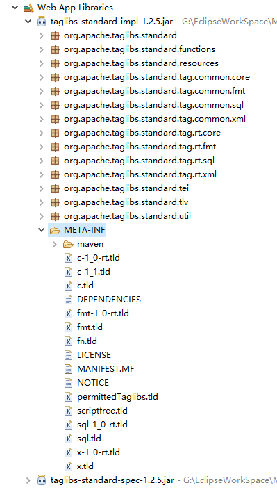

# 1. 会话管理

　　Web应用中的一次会话是指：用户从打开浏览器访问此Web应用开始，到用于将此次访问的浏览器关闭。这个过程就是一次会话的过程。一般的场景比如有记住用户的登录信息。

　　常用的会话技术有：

　　（1）Cookie：会话数据会保存在客户端使用的浏览器中。服务器可让浏览器以Cookie的形式保存用户数据，当用户使用该浏览器再去访问此Web应用时，浏览器就会携带该网站保存的Cookie数据一起请求该Web应用资源。这样服务器可拿到Cookie数据。

　　（2）Session：会话数据保存在服务器端。服务器在运行时，可以为每一个用户的浏览器创建一个其独享的session对象。

　　使用会话主要就是设置会话的数据和获取会话的数据，细节下面讲解。

## 2.1 Cookie

### 2.1.1 使用Cookie

　　向浏览器设置Cookie信息的步骤如下：

　　（1）用Cookie类创建对象，构造中传入要保存的Cookie的名字和值，即new Cookie(String name, String value)。

　　（2）设置Cookie对象的属性，如setValue(String value)可重新设置值；setMaxAge(int expiry)可设置此Cookie的有效时间，单位是秒

　　（3）使用response的addCookie(Cookie cookie)方法，将此Cookie发送到客户端浏览器保存。

　　那么设置完Cookie后，以后再访问该网站，服务器端就能获取该Cookie，拿到其中的数据进行处理了。

　　服务器端接收Cookie的方法是调用request的getCookies()方法，该方法返回Cookie数组，其中可存储多个Cookie。

　　例子：使用Cookie显示用户最近一次访问该网站的时间。

```java
@WebServlet(urlPatterns = {"/start"})
public class MyServlet extends HttpServlet {
    @Override
    protected void doGet(HttpServletRequest req, HttpServletResponse resp) throws IOException {
        // 说明：用名为"lastTime"的Cookie记录用户上次的访问时间
        Cookie timeCookie = null; // 声明此Cookie
        // 获得当前时间字符串。
        SimpleDateFormat sdf = new SimpleDateFormat("yyyy年M月d日  hh:mm:ss");
        // Cookie中不能存储中文和特殊字符(包括空格等)，因此可用URL编码。读取时再解码。
        String currentTimeStr = URLEncoder.encode(sdf.format(new Date()), "UTF-8");
        // 先查看是否有了该Cookie。
        // 如果用foreach，那么一定要进行为空判断。因此浏览器第一次访问时，没有cookie。
        Cookie[] cookies = req.getCookies();
        for (int i = 0; i < cookies.length; i++) {
            if (cookies[i].getName().equals("lastTime")) {
                // 找到了该Cookie。
                timeCookie = cookies[i];
            }
        }
        resp.setContentType("text/html;charset=UTF-8");
        // 判断timeCookie
        if (timeCookie != null) {
            // 存在此Cookie。显示信息，并且要重新设置时间
            // 这样下次访问时就会显示本次的访问时间
            String dateStr = URLDecoder.decode(timeCookie.getValue(), "UTF-8");
            resp.getWriter().write("上次访问时间：" + dateStr);
            timeCookie.setValue(currentTimeStr);
        } else {
            // 不存在，则是第一次访问。则新建Cookie对象
            String dateStr = URLDecoder.decode(currentTimeStr, "UTF-8");
            resp.getWriter().write("你是第一次访问！" + dateStr);
            timeCookie = new Cookie("lastTime", currentTimeStr);
        }
        // 最后，都要发送该Cookie到客户端
        resp.addCookie(timeCookie);
    }
}
```

　　以上就是基本使用，也可以自行实现记住用户信息功能。

### 2.1.2 Cookie细节

　　（1）服务器设置cookie到浏览器使用addCookie()方法，实际上服务器时通过设置Set-Cookie响应头来发送Cookie的。比如Set-Cookie: name=eric。可以在Chrome中查看网络响应发现。而后浏览器会将Set-Cookie响应值作为键值对保存在浏览器中。并且浏览器在下次访问服务器时，会带着cookie信息（信息也是在一个叫Cookie的请求头中）。

　　（2）Cookie中setPath(String uri)的介绍：本方法设置cookie的有效访问路径。浏览器只有在访问有效路径中的地址时，才会把符合这个路径的Cookie送给服务器。默认Cookie的有效路径是应用的根目录，比如应用名是MyWeb，那么Cookie的path默认就是MyWeb，和设置cookie.setPath(“/MyWeb”)是一样的。

　　（3）void setMaxAge(int expiry)：设置cookie的有效时间。单位是秒。若设置成负整数，那么此Cookie会在浏览器关闭时就被销毁。此值默认就是-1。所以如果想浏览器关闭后Cookie还生效，则要设置正整数。如果想删除本Cookie，需要将此值设置成0并发送给浏览器。

　　（4）Cookie不能存储中文等数据，因此 上述代码中我们用URL编码。另外，Cookie的大小也有限制，不能超过4KB。

## 2.2 Session

### 2.2.1 使用Session

　　在服务器中设置和获得Session的数据使用的是HttpSession对象。session存储的数据和cookie不同，session就是保存在服务器端的数据，可保存任意类型对象，而cookie只能是字符串形式保存在浏览器中。

　　设置Session数据步骤如下：

　　（1）首先调用request的getSession()方法得到HttpSession对象：HttpSession session = request.getSession()。

　　（2）设置session：如设置session中数据使用setAttribute(String name, Object value)；设置有效时间：setMaxInactiveInterval(int interval)。

　　这样就完成了保存数据。而想获得数据时：

　　（1）同样也是先获得session对象，但是是通过request的getSession()方法。

　　（2）调用getAttribute(String name)方法。

　　另外还提供了下面的方法：

　　void invalidate()：销毁session对象；

　　String getId()：获得此Session的编号；

　　void removeAttribute(String name)：清除某个session数据。

　　session的使用和域对象使用类似，比如我们在一处保存了Session，另一处就能拿到。这个就不演示了。

### 2.2.2 Session的细节

　　（1）Session也用于保存当前客户端的信息，不过Session的数据是保存的服务器中的，并且数据在页面间可共享，即多个Servlet都能拿到Session中的值。Session的一次会话以浏览器关闭为结束，重启该浏览器访问后，不能再现以前该客户端保留的Session数据。

　　那么Session怎么实现只保存当前用户信息的呢？实际上是配合Cookie实现的。用户初次访问应用时，Tomcat会自动创建session对象和一个叫做JSESSIONID的Cookie（该Cookie的值就是这个session的编号，这样就能通过客户端的JSESSIONID值唯一标识服务器的session），并会把JSESSIONID这个Cookie保存在客户端。

　　当客户第二次访问时，服务器就能拿到JSESSIONID的值，并能通过该值找到该客户端对应的session。

　　上述就是Session实现的原理。因为JSSESSIONID的有效时间是-1，因此浏览器关闭后会话即结束。若想使该Session在重启浏览器后也有效，那么可在程序中手动获得JSESSIONID这个Cookie，自行设置有效时间，例如：

```java
protected void doGet(HttpServletRequest req, HttpServletResponse resp) {
    //设置session有效时长为1小时
    // 值必须设置为session的id，否则值不匹配，是那不到正确的session的。
    Cookie cookie = new Cookie("JSESSIONID", req.getSession().getId());
    cookie.setMaxAge(60 * 60);//1小时
    resp.addCookie(cookie);
}
```

　　上述设置了有效时间是一小时，那么在此期间内，即使重启浏览器访问，还是能获得以前session的信息，因为通过JSESSIONID能够找到正确的session。

　　（2）还可在本次会话中设置Session的有效时间（和上述通过JSESSIONID设置时间有区别）。通过setMaxInactiveInteval(int interval)设置。默认情况下，半小时就会自动销毁session，数据就没有了，也可在web.xml中配置本应用的session有效时间，单位是分钟：

```xml
<!-- 修改session全局有效时间:分钟 -->
<session-config>
    <session-timeout>1</session-timeout>
</session-config>
```

# 2. JSP

## 2.1 简介

　　JSP是Java Server Page的缩写。我们之前写的是Servlet，可以用Servlet输出网页内容，比如：resp.getWriter().write(“<html>...</html>”)。但是这样在Servlet中写网页相关内容非常麻烦，而且结构不清晰，不易阅读。

　　而JSP页面就是解决这样问题的，在JSP中可直接写HTML内容，也能写Java代码，这样也能符合开发动态页面的要求。但是JSP需要交给Tomcat来运行。在IDE中，直接把JSP页面写在WebContent目录下即可。JSP文件以jsp作为扩展名。

　　可用以下方式在JSP页面中写入Java代码：

　　（1）直接在<% %>中写Java代码。可以有多个<% %>代码片段，他们之间是可相互访问的，就是一个整体。

　　（2）JSP表达式：<%=变量或表达式%>，用于直接显示变量的值或表达式计算的结果。注意不要加上分号，直接是一个表达式。

　　（3）JSP的声明：<%! 变量或方法 %>，可声明JSP的变量或者方法。

　　另外，JSP页面的注释是写在“<%--  --%>”中的。注意，JSP中，HTML的注释会显示在浏览器中，JSP注释在JSP编译时，直接被忽略掉，页面上是看不到的。

　　JSP的例子，在WebContent下新建hello.jsp，内容如下：

```jsp
<%@ page language="java" import="java.text.*, java.util.*" pageEncoding="utf-8"%>
<!DOCTYPE html>
<html>
<head>
    <title>第一个JSP页面</title>
</head>
<body>
<%
    // Java代码
    SimpleDateFormat sdf = new SimpleDateFormat();
    out.write("当前时间："+ sdf.format(new Date())); //输出用的
%>
循环输出h1-h5:
<%-- 以下输出h1到h5标签 --%>
<%! int i; %>
<%
    for(i=0;i<5;i++){
%>
<h<%=(i+1) %>>你好啊</h<%=(i+1) %>><br />
<%
    }
%>
</body>
</html>
```

　　我们通过浏览器访问localhost:8080/应用名/hello.jsp即可得到结果了。

## 2.2 JSP的实质

　　JSP的实质就是Servlet。实际JSP是需要被编译成Servlet的，只不过Tomcat帮我们自动执行了。JSP的执行过程如下：

　　（1）当用户初次访问hello.jsp时，Tomcat扫描到该文件，并自动把JSP文件“翻译”成Java源文件。实际上翻译的过程，大部分就是把JSP页面用Servlet来拼接字符串并输出到页面。Tomcat会把源文件存放在以下目录：“Tomcat根目录/work/Catalina/localhost/应用名/包名(org.apache.jsp)/”。

　　（2）Tomcat将Java源文件编译成class字节码文件，同样存放在上述目录下。

　　（3）最后，Tomcat加载生成的“Servlet”，用户即可正常访问“JSP”内容。

　　只有用户初次访问JSP或者JSP文件受到修改时，Tomcat会执行“翻译、编译和加载”过程，当后续访问时，Tomcat只需正常“执行”JSP即可，不需重复翻译和编译。

　　为了证实上述所说，我们查看上述JSP生成的Java文件，主要内容如下：

```java
/*
 * Generated by the Jasper component of Apache Tomcat
 * Version: Apache Tomcat/8.5.11
 * Generated at: 2017-03-05 07:23:21 UTC
...
 */
package org.apache.jsp;

import javax.servlet.*;
//...

public final class hello_jsp extends org.apache.jasper.runtime.HttpJspBase
      implements org.apache.jasper.runtime.JspSourceDependent,
      org.apache.jasper.runtime.JspSourceImports {

   int i;
   public void _jspService(final javax.servlet.http.HttpServletRequest request, final javax.servlet.http.HttpServletResponse response)
         throws java.io.IOException, javax.servlet.ServletException {

      final java.lang.String _jspx_method = request.getMethod();
      if (!"GET".equals(_jspx_method) && !"POST".equals(_jspx_method) && !"HEAD".equals(_jspx_method) && !javax.servlet.DispatcherType.ERROR.equals(request.getDispatcherType())) {
         response.sendError(HttpServletResponse.SC_METHOD_NOT_ALLOWED, "JSPs only permit GET POST or HEAD");
         return;
      }
      try {
         response.setContentType("text/html;charset=utf-8");
         pageContext = _jspxFactory.getPageContext(this, request, response,
               null, true, 8192, true);
         _jspx_page_context = pageContext;
         application = pageContext.getServletContext();
         config = pageContext.getServletConfig();
         session = pageContext.getSession();
         out = pageContext.getOut();
         _jspx_out = out;

         out.write("\r\n");
         out.write("<!DOCTYPE html>\r\n");
         out.write("<html>\r\n");
         out.write("<head>\r\n");
         out.write("    <title>第一个JSP页面</title>\r\n");
         out.write("</head>\r\n");
         out.write("<body>\r\n");

         // Java代码
         SimpleDateFormat sdf = new SimpleDateFormat();
         out.write("当前时间："+ sdf.format(new Date())); //输出用的

         out.write("\r\n");
         out.write("循环输出h1-h5:\r\n");
         out.write('\r');
         out.write('\n');
         out.write('\r');
         out.write('\n');
         for(i=0;i<5;i++){
            out.write("\r\n");
            out.write("<h");
            out.print((i+1) );
            out.write(">你好啊</h");
            out.print((i+1) );
            out.write("><br />\r\n");
         }
         out.write("\r\n");
         out.write("</body>\r\n");
         out.write("</html>");
      } catch (java.lang.Throwable t) {
         if (!(t instanceof javax.servlet.jsp.SkipPageException)){
            out = _jspx_out;
            if (out != null && out.getBufferSize() != 0)
               try {
                  if (response.isCommitted()) {
                     out.flush();
                  } else {
                     out.clearBuffer();
                  }
               } catch (java.io.IOException e) {}
            if (_jspx_page_context != null) _jspx_page_context.handlePageException(t);
            else throw new ServletException(t);
         }
      } finally {
         _jspxFactory.releasePageContext(_jspx_page_context);
      }
   }
}
```

　　发现确实是通过字符串拼接的，只是一些内容作了处理，比如JSP表达式会直接用out.print(表达式)进行输出（out就是resp.getWriter()），会将JSP的声明变成此类中的成员变量和成员方法。

　　我们发现，该类继承自HttpJspBase，通过查看继承关系，知道它的父类就是HttpServlet。因此JSP本质就是一个servlet。

## 2.3 JSP的三大指令

　　JSP中，在<%@  %>里面的内容就是JSP指令。JSP有page、include和taglib三大指令。下面先讲Page指令和include指令。

### 2.3.1 Page指令

　　上述JSP例子中，第一行就是page指令。page指令用于描述此JSP的信息，使得Tomcat知道如何“翻译”。该指令中常用的设置如下：

　　（1）language="java"：表示该JSP适用于Java语言。

　　（2）import="java.util.*,java.text.*"：指示需要导入的包，各个包之间用逗号分开。

　　（3）pageEncoding="utf-8"：表示文件内容是UTF-8编码的。

　　（4）contentType="text/html;charset=UTF-8"：表示服务器发送给浏览器的数据类型和编码。实际上无需该设置，因为上述的pageEncoding已经有了编码设置，Tomcat会自动根据pageEncoding设置向浏览器发送的格式和编码。我们只需要保证文件的编码确实是UTF-8即可。不能把pageEncoding设置成UTF-8，而实际JSP文件不是UTF-8编码的。在IDE中，设置了pageEncoding后，会自动将此文件编码设置成指定的编码。

　　（5）isELIgnored="false"：设置是否忽略EL表达式，这里设置成不忽略。不久将学习EL表达式，很有用，建议设置成false不忽略。

　　（6）session="true"：是否开启session对象。若设置成false，则JSP中不能使用session对象。

　　（7）errorPage="error.jsp"：指定错误处理页面。

　　（8）isErrorPage="false"：指定当前页面是否为错误处理页面。设置为false，则不是错误处理页面，就不能使用exception内置对象；若设置为true，则是错误处理页面，可以使用exception内置对象。

　　（9）buffer="8kb"：设置JSP页面的缓冲区大小。

　　补充：可以配置应用的全局错误处理页面，主要是配置404和500错误页面。在web.xml中可设置：

```xml
<!-- 全局错误处理页面配置 -->
<error-page>
    <error-code>500</error-code>
    <location>/common/500.jsp</location>
    <!--在common文件夹下-->
</error-page>
<error-page>
    <error-code>404</error-code>
    <location>/common/404.html</location>
</error-page>
```

　　即把common文件夹下的相关页面设置成错误页面。当应用出现错误时，就会跳转到指定的页面，而不再显示Tomcat默认的错误页面了，可提升用户体验。

### 2.3.2 include指令

　　使用include指令能够在此页面中包含其他JSP页面。语法为：

　　<%@include file="JSP文件"%>

　　使用include指令进行包含叫做“静态包含”，就是源码包含。即Tomcat在翻译JSP时，会将本页面和所有包含的页面进行合并，作为一个整体翻译成一个Java源文件，再进行编译和加载。因此，被包含页面不需出现全局性的标签，例如html、body和head等，因为主体JSP中已经有了这些标签。

　　这里file文件路径直接写项目中的相对路径即可，不需要加上项目名，因为这是在服务器端内部使用的路径。

## 2.4 JSP的内置对象

　　在JSP中，会频繁使用到一些对象，例如request对象、response对象等。为了方便开发者，Web容器（例如Tomcat）会自动创建这些对象供开发者使用（可再查看JSP翻译生成的Java文件，其中维护了很多对象）。因此开发者可直接在JSP中使用这些对象，这些对象就叫做内置对象。

　　JSP中有九大内置对象，为：

|    对象名    |         类型        |         说明         |
|:-------------|:--------------------|:---------------------|
|request       |HttpServletRequest   |对应请求对象          |
|response      |HttpServletResponse  |对象响应对象          |
|config        |ServletConfig        |对应当前页面配置对象  |
|application   |ServletContext       |对应当前应用配置对象  |
|session       |HttpSession          |对象session会话对象   |
|page          |Object               |当前页面对象this      |
|out           |JspWriter            |对应输出对象          |
|pageContext   |PageContext          |JSP上下文对象         |
|exception     |Throwable            |异常对象              |

　　我们之前讲过的有request、response、config、application和session，对于page（就是本页面对象）和exception就不说了，重点讲下page和pageContext。

　　（1）out对象：是JspWriter类型，相当是带缓冲的PrintWriter。我们之前用response.getWriter.write()向浏览器输出内容，实际上out对象也是这个作用。只是out对象会先向JSP缓冲区（缓冲区就是在page指令中，使用buffer指定的大小）输出内容，当满足：缓冲区满了、刷新缓冲区（调用out的flush()方法）或者关闭缓冲区（调用close()方法）时，缓冲区的内容将被输出在浏览器上。当然，当JSP页面执行完毕，也会进行输出。

　　（2）pageContext对象：类型是PageContext，是JSP上下文对象。主要作用有：

　　A：可获取其他8个内置对象。在以后讲的自定义标签时常用。

　　B：pageContext本身就是作用范围在本页面的域对象，因此叫page域对象（要和page内置对象相互区别）。可在本页面共享数据。可调用pageContext对象的setAttribute()和getAttribute()方法分别设置域对象数据和获取域对象数据。

　　方便的是，pageContext不仅能操作自身域对象数据，还能操作其他域对象数据。使用setAttribute()和getAttribute()的重载：

　　pageContext.setAttribute(String name, Object value, int scope) 和

　　pageContext.getAttribute(String name, int scope)。

　　scope参数可传入PageContext类中的静态常量：

　　PageContext.PAGE_SCOPE：表示操作page域对象数据。

　　PageContext.REQUEST_SCOPE：表示操作request域对象数据。

　　PageContext.SESSION_SCOPE：表示操作session域对象数据。

　　PageContext.APPLICATION_SCOPE：表示操作application域对象数据。

　　也可使用findAttribute()方法，将自动在四个域对象中搜索数据，比如：

　　pageContext.findAttribute("name")。搜索的顺序是：page域 - Request域 - session域 - context域（即application域）。

　　顺便也梳理一下这四个域对象：

　　四个域对象是：pageContext、request、session和application。其中pageContext也就是page域，application也就是context域。

　　域对象的作用都是共享数据，只是作用范围不同。他们都使用setAttribute()、getAttribute()和removeAttribute()方法。主要区分作用范围：

　　page域：数据只能在当前页面使用，页面发生跳转数据即消失。

　　request域：数据只能在同一个请求中使用，可转发（Dispatcher）数据。

　　session域：数据只能在一次session会话中使用。

　　application域：数据能在该web应用范围内使用，这是全局性的。只要Tomcat不停止，其中的数据就一直进行维护，因此要控制数据量。

# 3. JSP和Servet的最佳实践

　　最佳实践(best practice)，是一个管理学概念，认为存在某种技术、方法、过程、活动或机制可以使生产或管理实践的结果达到最优，并减少出错的可能性。——百度百科

　　学习了Servlet和JSP，我们发现Servlet擅长写Java代码，处理业务逻辑；JSP擅长输出HTML内容，控制页面显示。

　　因此我们要在开发中各区所长，尽量不要在JSP中写Java代码，也避免在Servlet中写大量的HTML字符串。即主要用Servlet接收参数、处理业务逻辑再将数据保存到域对象中，最后跳转到JSP。而JSP负责展示页面内容、从域对象中取得需要的数据。

　　这就是JSP和Servlet 的最佳实践。

　　为了方便从域中获取数据、避免在JSP中使用Java代码，我们学习下面的EL表达式和JSP标签。

# 4. EL表达式（Expression Language）

　　EL表达式用于在JSP页面取出域对象的数据或者用来计算表达式。这样可避免写Java代码获取数据，并且EL表达式语法简洁清晰，用来代替JSP的表达式非常好。

　　可在JSP直接写EL表达式，首先需要在page指令中指明不忽略EL表达式，即设置isELIgnored="false"。

　　只需要将EL表达式写在“${  }”中即可。大括号中可直接写表达式或者变量，变量必须是保存在域中数据的名字。例如：（为了演示方便，在下面的JSP中，直接在JSP中写Java代码操作域对象数据，然后在此页面上用EL表达式获得数据。）

```jsp
<%@ page language="java" pageEncoding="utf-8" isELIgnored="false"%>
<!DOCTYPE html>
<html>
<head>
    <title>EL表达式</title>
</head>
<body>
<%
    // 在page域中设置一个名为name的域对象
    pageContext.setAttribute("name", "张三");
%>
EL表达式：${3 + 5 } <br />
直接取域数据：${name }
</body>
</html>
```

　　发现取域对象数据时，直接数据的键即可。EL会自动从四个域对象中拿到数据，搜索的顺序还是page - request - session - application，就相当于pageContext.findAttribute(String name)的功能。当然，也可以指定在某域对象中搜索，即在变量前面加上：pageScope、requestScope、sessionScope或者applicationScope。例如：

　　${pageContext.name }。

　　当然，用EL表达式不仅能显示字符串数据，如果域对象的数据是复杂的对象或者数组等，也能很好显示：

　　（1）域对象数据是对象，可输出对象的属性：

```jsp
<body>
<%
    pageContext.setAttribute("student", new Student("张三", 12));
%>
学生姓名：${student.name }
学生年龄：${student.age }
</body>
```

　　获得对象的属性值，需要依赖Student类的getter方法，若不提供getter方法，则JSP出错。

　　（2）域对象数据是集合（或数组）：

```jsp
<body>
<%
    // List集合
    List<Student> list = new ArrayList<>();
    list.add(new Student("李四", 13));
    list.add(new Student("王五", 14));
    pageContext.setAttribute("studentList", list);
    // Map集合
    Map<String, Student> map = new HashMap<>();
    map.put("101", new Student("007", 23));
    map.put("102", new Student("008", 54));
    map.put("103", new Student("009", 21));
    pageContext.setAttribute("studentMap", map);
%>
注意，使用的是域对象的键的名字，而不是Java代码中变量名。同样需要提供getter方法。
获取List集合（或者数组）元素：<br />
${studentList[0].name } + ${studentList[0].age } <br />
${studentList[1].name } + ${studentList[1].age } <br />

获取Map集合元素： <br />
${studentMap["101"].name } + ${studentMap["101"].age } <br />
${studentMap['102'].name } + ${studentMap['102'].age } <br />
${studentMap['103'].name } + ${studentMap['103'].age } <br />
map中，使用单双引号都可。
</body>
```

　　（3）用EL表达式进行简单的运算：

```jsp
<body>
基本运算：${ 2 + 7 }  ${ 2 / 6 } <br />
逻辑运算：${ 3 > 5 }  ${ 7 == 7 }  ${ true || false } <br />
判空和null：
<%
    String name1 = "eric";
    String name2 = null;
    String name3 = "";
    pageContext.setAttribute("name1", name1);
    pageContext.setAttribute("name2", name2);
    pageContext.setAttribute("name3", name3);
%>
判null：${ name2 == null } <br />
判空：${ name3 == "" } <br />
判空或者null：${name==null || name == "" }
判空或者null也能使用empty关键字简单写为：${ empty name3 }。
</body>
```

# 5. JSP标签

　　JSP标签是用Java定义的标签来实现功能，使得JSP更像HTML，易读易使用，避免存在Java代码。

　　JSP标签分为三大类：

　　（1）JSP内置标签（即动作标签），可在JSP中直接使用。

　　（2）JSTL标签，即JSP标准标签库，由Apache维护，使用时需要导入相关jar包。

　　（3）自定义标签：开发者可按需定义和实现自己的JSP标签。实现特需功能。

## 5.1 内置标签

　　内置标签以jsp:开头，比如<jsp:forward>用于网页转发，例如：

```jsp
<jsp:forward page="1.jsp"></jsp:forward>
```

　　若JSP中写了上述标签，则访问此JSP时，会直接跳转到1.jsp页面。

　　此外，jsp内置标签中还有操作JavaBean等的标签，不过这些标签实在不常用，不再继续了解。

## 5.2 JSTL标签

　　JSTL在JSP中是很常用的。JSTL全称是Java Standard Tag Library，即Java标准标签库。JSTL包含的标签库有：

　　（1）核心标签库，即C标签库，core。

　　（2）格式化标签库，即fmt标签库，Format。

　　（3）JSTL函数库，即fn标签库，Function。

　　（4）XML标签库，即x标签库。

　　（5）sql标签库。

　　由于JSP跟用户界面打交道，因此我们基本不会使用XML和SQL标签库。

### 5.2.1 JSTL使用步骤

　　（1）导入JSTL相关jar包。实际上此jar包在Tomcat中已经提供：进入webapps/examples/WEB-INF/lib目录下，找到两个jar包，导入到项目中。

　　Web项目如何导入jar包：直接将jar包拷贝到WEB-INF/lib文件夹下，此目录下jar包会被自动加载，不能是别的目录。而不是像以前那样要手动在IDE中将jar包设置为项目的依赖项。

　　（2）使用taglib指令在JSP中导入需要的标签库，格式为：（在page指令下就使用该指令）

```jsp
<%@ taglib prefix="标签库的前缀简称" uri="标签库的uri名称"%>
```

　　简称是可自定义的，但是对于JSTL，就用c表示核心标签库，fmt表示格式化标签库，fn表示函数标签库。

　　那么uri名称如何得知？我们需要展开jstl-standard-impl-1.2.5.jar包，在META-INF文件夹中，可以看到很多tld文件，例如c.tld文件就对应核心标签库，fmt.tld文件就对应格式化标签库。如图：



　　我们打开c.tld文件，发现这其实是一个xml文件，记录了一些信息，在根节点taglib下面，就有这样的信息：

```xml
<description>JSTL 1.2 core library</description>
<display-name>JSTL core</display-name>
<tlib-version>1.2</tlib-version>
<short-name>c</short-name>
<uri>http://java.sun.com/jsp/jstl/core</uri>
```

　　这样我们就能得到C标签库对应的uri了。因此JSP中这样写：

```jsp
<%@ taglib prefix="c" uri="http://java.sun.com/jsp/jstl/core"%>
```

　　这样准备工作就做完了，下面就能使用核心库标签了。如果以后想使用其他标签库，也这样使用。

　　注意，有时写uri时，IDE会给出提示，大家一定要仔细，不能选择“http://java.sun.com/jstl/core ”，而应该选择“http://java.sun.com/jsp/jstl/ core”。若选择了前者，则访问JSP是出错，显示“does not support runtime expressions”错误。

　　（3）使用举例：<c:out></c:out>。每个标签都有一个前缀，比如现在我们使用核心标签库，前缀是c，这是我们在prefix中声明的。当然也能换用其他的，但是使用标准的JSTL时不建议这样做。

### 5.2.2 常见的JSTL标签

　　这里只介绍核心标签库中的标签。

　　（1）在域中保存数据使用set标签：例如：

```jsp
<%--
   使用set标签：var指明存的属性名，value指明存的值，scope指明保存的域。
   默认保存在page域中
--%>
<c:set var="name" value="张三" scope="request"></c:set>
```

　　（2）使用out标签展示数据，例如：

```jsp
<%-- 
用out标签展示数据：
value属性是要展示的数据，可用EL表达式获取，
default属性是当value为空（取不到）时，默认显示的值；
escapeXml属性表示是否转义要显示的值。若设置为true，则会转义HTML内容，设置为false则页面展示的就是HTML样式
--%>
<c:out value="${requestScope.student }" default="<h3>无内容</h3>" escapeXml="true"></c:out>
```

　　（3）使用if标签进行单条件判断：

```jsp
<body>
<c:set var="msg" value="有消息"></c:set>
<%-- if标签中，用test检测判断的条件 --%>
<c:if test="${!empty msg }">
    msg不为空，值为：${msg }
</c:if>
这是总是显示的内容
</body>
```

　　有时需要在test中判断一个字符串是不是某个值，但是字符串两边也要加引号，怎么办？方式一是字符串用单引号引起来（类似于JavaScript，采用外单内双也可以），方式二是将双引号转义。例如（形式可有多种组合）：

```jsp
<body>
<c:set var="name" value="张三"></c:set>
<c:if test='${name == \'张三\' }'>
    msg不为空，值为：${name }
</c:if>
这是总是显示的内容
</body>
```

　　（4）使用choose、when和otherwise进行多条件判断：

```jsp
<body>
<c:set var="score" value="60"></c:set>
<c:choose>
    <%--在choose中包含when和otherwise进行多条件判断 --%>
    <c:when test="${score >= 90 }">优秀</c:when>
    <c:when test="${score >= 80 }">良好</c:when>
    <%-- 上述都不满足就显示otherwise内容 --%>
    <c:otherwise>继续努力</c:otherwise>
</c:choose>
</body>
```

　　（5）用forEach标签遍历集合/数组数据

```jsp
<body>
<%
    // 先准备好数据
    // list数据
    List<Student> list = new ArrayList<Student>();
    list.add(new Student("rose", 18));
    list.add(new Student("jack", 28));
    list.add(new Student("lucy", 38));
    pageContext.setAttribute("list", list);
    // map数据
    Map<String,Student> map = new HashMap<String,Student>();
    map.put("100",new Student("mark", 20));
    map.put("101",new Student("maxwell", 30));
    map.put("102",new Student("narci", 40));
    pageContext.setAttribute("map", map);
%>
<%-- 遍历list --%>
<c:forEach items="${list }" var="student" varStatus="status">
    序号：${status.count } 姓名：${student.name } 年龄：${student.age } <br />
</c:forEach>
<%--
解释：
items：指定 需要遍历的数据（集合） 
var：指定遍历时每个元素的变量名称 
varStatus：指明 当前遍历元素的状态对象的变量名。其中有count属性，表示当前位置，从1开始。
begin：指明从哪个元素开始遍历，默认从0开始。
end：指明到哪个元素结束，默认到最后一个元素。
step：指明步长，默认为1    
--%>
<%-- 再来遍历下map集合。每个条目都有key和value表示当前条目的键值 --%>
<c:forEach items="${map }" var="entry">
    序号：${entry.key } 姓名：${entry.value.name } 年龄：${entry.value.age } <br />
</c:forEach>
</body>
```

　　（6）分隔字符串并循环输出，使用forTokens：

```jsp
<c:set var="str" value="java-python-javascript"></c:set>
<%--可分割字符串。items表示要分割的数据，delims定义分割字符串，var就是单个的值的变量名  --%>
<c:forTokens items="${str }" delims="-" var="singleWord">
    ${singleWord } <br />
</c:forTokens>
```

　　（7）重定向使用redirect标签：

```jsp
<c:redirect url="http://www.baidu.com"></c:redirect>
```

## 5.3 自定义JSP标签

### 5.3.1 自定义标签例子

　　有时我们需要写自定义标签来完成特定的功能，以此确保JSP中不会出现Java代码。（实际上，用EL表达式等技术从域中获取数据就基本实现了JSP中没有代码。可以先访问Servlet，将JSP需要的数据存在域对象中，然后跳转到JSP显示数据）。

　　比如实现这样的功能：定义一个IP标签，实现显示当前用户IP地址的功能。实现完后，直接在JSP中写<IP></IP>即可显示用户的IP地址。

　　若不用标签的话，也很好实现，即在Servlet中：

```java
req.setAttribute("ip", req.getRemoteAddr());
req.getRequestDispatcher("/hello.jsp").forward(req, resp);
```

　　之后再JSP页面中取数据即可。

　　若我们想自定义标签实现功能，需要按照以下步骤实现：

　　（1）新建一个类作为标签处理器类。此类用于实现标签的具体功能。该类需要继承SimpleTagSupport类，并重写doTag()方法，在该方法中写具体实现。例如新建一个MyTag类。实现为：

```java
public class MyTag extends SimpleTagSupport {
   @Override
   public void doTag() throws JspException, IOException {
      // 首先直接调用getJspContext()方法获得一个JspContext对象
      JspContext jspContext = getJspContext();
      // 为啥要或者该对象呢？因为PageContext是JspContext的子类，
      // 可以将jspContext强转为pageContext对象。
      // 根据前面可知，我们就能通过pageContext对象得到其他的内置对象。方便使用。
      PageContext pageContext = (PageContext) jspContext;
      // 这样就能得到request对象，调用getRemoteAddr()即可得到客户IP地址
      String ip = pageContext.getRequest().getRemoteAddr();
      // 最后将ip这个数据通过pageContext得到的out对象输出到页面上。
      // 这样就完成了该标签实际上会显示为用户的ip地址。
      pageContext.getOut().write(ip);
   }
}
```

　　（2）上述只是完成了标签的处理实现，还没有定义这个标签，比如什么名字等。因此我们需要自行在WEB-INF下新建一个tld文件来定义标签。比如新建一个mytag.tld文件，内容和详细解释如下：

```xml
<?xml version="1.0" encoding="UTF-8" ?>
<taglib xmlns="http://java.sun.com/xml/ns/javaee"
        xmlns:xsi="http://www.w3.org/2001/XMLSchema-instance"
        xsi:schemaLocation="http://java.sun.com/xml/ns/javaee http://java.sun.com/xml/ns/javaee/web-jsptaglibrary_2_1.xsd"
        version="2.1">
    <!-- 该标签库版本 -->
    <tlib-version>1.0</tlib-version>
    <!-- 该标签库的简写名称。建议JSP的prefix就用这个名称 -->
    <short-name>demo</short-name>
    <!-- 该tld文件的唯一标记 -->
    <uri>http://demo.test.com</uri>

    <!-- 下面就是声明每个标签的详细信息了。现在我们只定义一个标签，所以只有一个tag标签配置 -->
    <tag>
        <!-- 配置该标签名称 -->
        <name>IP</name>
        <!-- 配置该标签对应的标签处理器的类 -->
        <tag-class>com.zhang.test.MyTag</tag-class>
        <!-- 声明标签体的内容格式。scriptless表示此标签可有标签体。当然也能设置成empty表示此标签中不能有内容 -->
        <body-content>empty</body-content>
    </tag>
</taglib>
```

　　这样就完成了标签的定义，并把标签和标签处理器进行了关联。

　　（3）最后，在JSP页面可导入自定义标签，并使用。例如：

```jsp
<%@ page language="java" pageEncoding="utf-8" isELIgnored="false"%>
<%@ taglib prefix="demo" uri="http://demo.test.com" %>
<!DOCTYPE html>
<html>
<head>
    <title>自定义标签</title>
</head>
<body>
    <demo:IP/>
</body>
</html>
```

　　可以感到，使用自定义标签使得JSP很清爽。

### 5.3.2 自定义标签的执行过程

　　（1）Tomcat启动时加载WEB-INF目录下的所有文件，例如web.xml文件和tld文件等。

　　（2）用户初次访问JSP时，Tomcat会“翻译、编译和加载”JSP对应的“Servlet”类。

　　（3）遇到JSP的taglib指令时，会按照提供的uri找到WEB-INF下对应的tld文件，若找不到，则报错。

　　（4）正常则会读到自定义标签，比如<demo:IP>，此时会查询tld文件中是否定义了IP这个标签，若定义了，则找到对应的类执行处理器类的doTag()方法，若找不到，则报错。

### 5.3.3 获取自定义标签中的其他内容

　　在自定义标签中，还可以写标签体内容、标签的属性等，并且标签还有子标签或者父标签。在处理器类中都能得到并进行处理。

　　例子：想要获得自定义标签：<showInfo value="100">数据</showInfo>里面的属性和内容。

　　对于获得标签的属性，只要在标签处理器中写上和属性名相同的成员变量，并提供getter和setter方法即可。对于获得标签的内容，要通过getJspBody()方法获得。具体看下面的代码：

　　（1）标签处理器类：

```java
package com.zhang.test;

import java.io.IOException;

import javax.servlet.jsp.JspException;
import javax.servlet.jsp.tagext.JspFragment;
import javax.servlet.jsp.tagext.SimpleTagSupport;

public class MyTag extends SimpleTagSupport {
   // value成员变量
   private Integer value;
   // getter和setter
   public Integer getValue() {
      return value;
   }

   public void setValue(Integer value) {
      this.value = value;
   }

   @Override
   public void doTag() throws JspException, IOException {
      // 通过getValue()就能得到value属性值。
      Integer value = getValue();
      // 标签体内容是封装在JspFragment中
      JspFragment jspFragment = getJspBody();
      // jspFragment是通过流来处理标签体内容的。
      // 调用invoke(Writer writer)方法就是把标签体输出到指定的字符流中
      jspFragment.invoke(null); // 传递null，就是默认用out输出到浏览器。
      // 再把属性值也显示到浏览器。不用强转成pageContext，因为jspContext也有getOut方法
      // 如果直接输出value，会显示value的ASCII字符。
      getJspContext().getOut().write(value + "");
   }
}
```

　　（2）写带有属性定义的tld文件：

```xml
<?xml version="1.0" encoding="UTF-8" ?>
<taglib xmlns="http://java.sun.com/xml/ns/javaee"
        xmlns:xsi="http://www.w3.org/2001/XMLSchema-instance"
        xsi:schemaLocation="http://java.sun.com/xml/ns/javaee http://java.sun.com/xml/ns/javaee/web-jsptaglibrary_2_1.xsd"
        version="2.1">
    <tlib-version>1.0</tlib-version>
    <short-name>demo</short-name>
    <uri>http://demo.test.com</uri>

    <tag>
        <name>showInfo</name>
        <!-- 配置该标签对应的标签处理器的类 -->
        <tag-class>com.zhang.test.MyTag</tag-class>
        <body-content>scriptless</body-content>
        <!-- 属性声明 -->
        <attribute>
            <!-- 属性名称 -->
            <name>value</name>
            <!-- 是否必填 -->
            <required>true</required>
            <!-- 属性值是否支持EL表达式 -->
            <rtexprvalue>true</rtexprvalue>
        </attribute>
    </tag>
</taglib>
```

　　（3）最后使用即可。

　　上述我们直接将标签体内容输出了，有时我们还需要改变标签体内容，那么应该先用调用invoke()，把数据存到一个Writer中，然后进行操作。操作完毕后，再用out输出（这时就不能用invoke(null)输出了，因为JspFragment中内容并没有变化）。例子（将标签体内容转换成大写）：

```java
public void doTag() throws JspException, IOException {
   // 得到标签体内容对象
   JspFragment jspFragment = getJspBody();
   // 用StringWriter接收标签体内容。这也是一个Writer。
   StringWriter sw = new StringWriter();
   jspFragment.invoke(sw);
   // 转换成大写
   String result = sw.toString().toUpperCase();
   // 最后把结果用out输出
   getJspContext().getOut().write(result);
}
```

　　另外，还提供了getParent()方法得到父标签的对象。可自行研究。