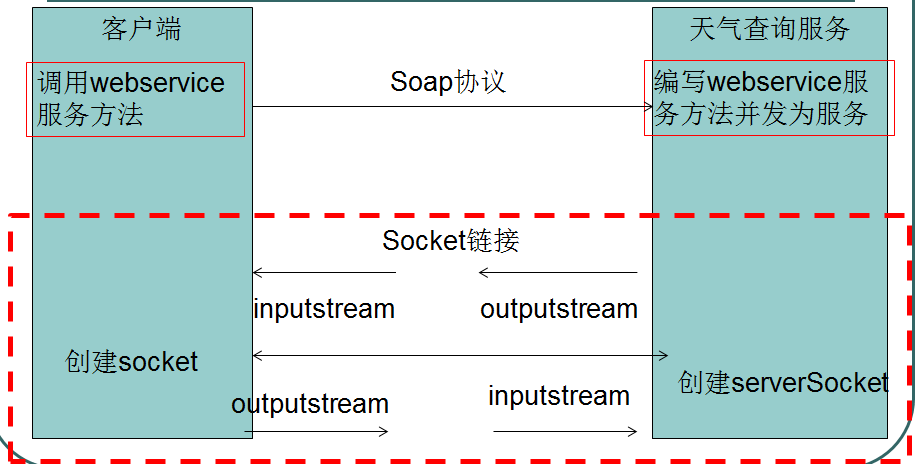
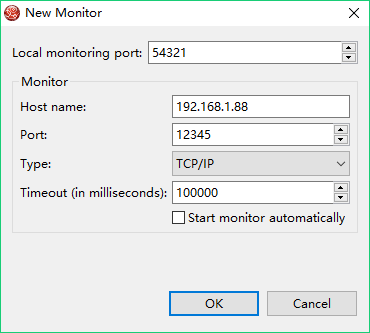

# 1. 通信的需求和Socket

　　在开发中，有时需要使用别的网站或系统提供的数据和服务，例如在本系统中展示天气信息、车票信息等，这些信息无法由开发者本身提供，只能通过和别的网站进行“通信”，才能获取数据。

　　如何实现通信呢？由于WEB项目可能是由不同的技术开发的（如Java、ASP.NET和PHP等），为了实现跨平台，通用的做法是使用Socket进行通信。网络通信都是基于Socket的，包括HTTP协议也是基于Socket，要实现可靠的通信，我们需要选择TCP协议。

　　在Java SE中已经讲过如何实现Socket通信，在真实开发Socket中需要使用IO、多线程等技术，开发起来比较麻烦，而且要自定义数据格式和解析数据。但Socket是最基础的，适合发送大量的数据，效率高。

　　下面介绍的是使用Web Service进行通信，相较于直接使用Socket简单。但现在更流行使用RestFul作为底层服务的架构，更加简单轻量，读者可自学。

# 2. Web Service

　　Web Service，网络服务，是跨平台的远程调用技术。下面先学习用Jax-ws来开发WEB Service，以及介绍Web Service相关知识。

## 2.1 使用jax-ws创建和使用Web Service

　　JAX-WS的全称为Java API for XML-Based Web Services，JDK提供了JAX-WS相关的API。。下面通过示例讲解用JAX-WS开发Web Service。

**Step1：开发服务端（WebService发布端）**

　　这里讲的服务端就是在服务器上提供Web Service服务的，即Web Service的发布端。只有发布Web Service后，其他系统或网站才能调用该Web Service服务。服务端是信息所有者开发的。这里创建普通的Java项目即可。

　　（1）编写服务端点接口SEI（Service Endpoint Interface），SEI在WebService中又叫portType。比如这里提供获取天气信息的服务，那么我们编写一个“WeatherInterface”接口，接口中提供了一个获取某城市天气的方法“getWeather”。具体如下：

```java
package com.ws.server;

public interface WeatherInterface {
    // 根据城市名获得天气情况字符串
    String getWeather(String name);
}
```

　　（2）编写接口实现类。

```java
package com.ws.server;

import javax.jws.WebService;
// 实现类需要使用@WebService注解来表示这是一个Web Service服务
@WebService
public class WeatherInterfaceImpl implements WeatherInterface {
    @Override
    public String getWeather(String name) {
        // 模拟返回天气数据
        return "晴天";
    }
}
```

　　（3）编写主类来运行程序，以便发布Web Service。

```java
package com.ws.server;

import javax.xml.ws.Endpoint;

public class Server {
    public static void main(String[] args) {
        // 调用EndPoint的publish方法发布Web Service
        // 参数1是发布的地址(端口是12345。地址一定要和本机匹配)，参数2是服务实现类。
        Endpoint.publish("http://192.168.1.88:12345/weather", new WeatherInterfaceImpl());
    }
}
```

　　至此，服务端开发完毕。运行Server主类，程序会一直运行服务。接下来就能查看发布的服务，并建立另一个新项目来调用本项目提供的服务。

　　**Step2：查看wsdl**

　　通过wsdl查看Web Service是否发布成功：在浏览器中访问 http://192.168.1.88:12345/weather?wsdl ，如果能看到xml文档，则说明发布成功。

　　wsdl是描述Web Service的说明文件，其中描述了如何调用该服务。wsdl是Web Service Description Language（网络服务描述语言）的简写。

　　如何阅读wsdl说明书：

　　从下往上读，先找到服务视图service，通过binding找到portType，通过protType就找到了要调用的webservice方法。

　　<service\>       整个webservice的服务视图，它包括了所有的服务端点
　　<binding\>       为每个端口定义消息格式和协议细节
　　<portType\>      描述 web service可被执行的操作，以及相关的消息
　　<message\>       定义操作（方法）的数据参数
　　<types\>         定义 web service 使用的全部数据类型

　　**Step3：用wsimport工具生成客户端代码**

　　wsimport是jdk自带的webservice客户端工具，它可以根据wsdl文档生成客户端调用WebService的代码（无论服务端WebService是用什么语言编写的，只要能访问wsdl即可）。

　　wsimport命令使用方法：wsimport -encoding <编码> -Xnocompile -s <目录> wsdl的url

　　示例：wsimport -encoding UTF8 -Xnocompile -s . http://192.168.1.88:12345/weather?wsdl 

　　说明：-encoding是指定输出文件的编码，-Xnocompile表示不编译生成的Java源文件，-s是指生成Java源文件，.(点)指将代码放到当前目录下，最后是wsdl说明书的URL地址。
通过上述方法可生成Java源码文件，我们需要将这些文件拷贝到项目中使用。

　　**Step4：编写调用方代码**

　　首先确保将上述生成的代码拷贝到项目中。然后编写如下代码：

```java
package com.ws.client;

import com.ws.server.WeatherInterfaceImpl;
import com.ws.server.WeatherInterfaceImplService;

public class WeatherClient {
    public static void main(String[] args) {
        // 创建服务视图。使用说明书中service节点name属性对应类创建对象
        WeatherInterfaceImplService service = new WeatherInterfaceImplService();
        // 通过服务视图得到服务端点。使用说明书中对应的port/portType标签的name属性对应类接收对象
        WeatherInterfaceImpl weatherInterface = service.getPort(WeatherInterfaceImpl.class);
        // 调用webservice服务的方法，获得数据
        String result = weatherInterface.getWeather("华冲");
        System.out.println("天气信息：" + result);
    }
}
```

　　运行后，得到的结果是“晴天”，这是从“服务端”得到的结果。这样我们第一个例子就完成了。可以看到上述的代码与wsdl说明书是关联的（从下往上看）。

## 2.2 Web Service工作原理



　　Web Service的三要素：

　　（1）SOAP

　　Web Service采用基于HTTP的SOAP协议传输数据。SOAP，即简单对象访问协议(Simple Object Access Protocal)，SOAP协议传递的内容是XML数据，所以可简单理解为SOAP=HTTP+XML。

　　注意的是，SOAP不是Web Service的专有协议，比如，SMTP也使用SOAP协议。

　　（2）WSDL

　　WSDL 是基于 XML 的用于描述Web Service的文档，即wsdl是Web Service的使用说明书。

　　（3）UDDI

　　UDDI 是一种目录服务，它提供Web Service的注册和搜索服务。企业可将自己提供的Web Service注册在UDDI上以便使用者搜索和使用，从而达到资源共享。但UDDI并不是Web Service所必需的，在实际中，UDDI使用得并不广泛。

## 2.3 手机归属地案例（使用第三方Web Service）

　　我们这里使用第三方Web Service。网站“ http://www.webxml.com.cn/zh_cn/index.aspx ”提供了Web Service服务，未付费的开发者每天可进行限量的Web Service服务请求。该网站提供了查询手机归属地的Web Service服务，其WSDL地址是：

　　http://ws.webxml.com.cn/WebServices/MobileCodeWS.asmx?wsdl

　　可以参见：http://ws.webxml.com.cn/WebServices/MobileCodeWS.asmx 查看用法。

　　首先使用wsimport生成Java代码：

　　wsimport -encoding UTF8 -Xnocompile –s . http://ws.webxml.com.cn/WebServices/MobileCodeWS.asmx?wsdl

　　将代码拷贝到一个新项目中以便使用。下面采用另一种Web Service调用方式，通过传递URL和namespace来调用Web Service，防止日后Web Service网址发生更改：

```java
package com.ws.client;
import cn.com.webxml.MobileCodeWSSoap;
import javax.xml.namespace.QName;
import javax.xml.ws.Service;
import java.net.MalformedURLException;
import java.net.URL;

public class WeatherClient {
    public static void main(String[] args) throws MalformedURLException {
        // 1. 根据说明书的url创建URL对象。
        URL url = new URL("http://ws.webxml.com.cn/WebServices/MobileCodeWS.asmx?wsdl");
        // 2. 根据命名空间地址（targetNamespace或namespace）和说明书中服务视图service名称创建QName对象。
        QName qName = new QName("http://WebXml.com.cn/", "MobileCodeWS");
        // 3. 根据url和qName创建Service对象
        Service service = Service.create(url, qName);
        // 4. 下面就一样了，调用getPort方法，拿到MobileCodeWSSoap对象。虽然说明书中定义了很多port，但是这里只使用MobileCodeWSSoap。
        MobileCodeWSSoap mobileCodeWSSoap = service.getPort(MobileCodeWSSoap.class);
        // 5. 调用getMobileCodeInfo方法拿到结果。
        // 方法传递两个参数，第一个参数是手机号，第二个参数是userID，是给付费者使用的，我们写空字符串即可。
        String res = mobileCodeWSSoap.getMobileCodeInfo("18051372090", "");
        System.out.println(res); // 输出结果为“18051372090：江苏 徐州 江苏电信CDMA卡”
    }
}
```

## 2.4 Soap1.1和Soap1.2协议

　　Soap协议使用较多的是Soap1.1和Soap1.2两个版本。以上使用的均是SOAP1.1。

　　为了了解这两个版本的协议区别，我们使用Eclipse中提供的“TCP/IP Monitor”工具监视数据传输时，SOAP协议中的内容。

　　在Eclipse中点击Window – Show View，选择TCP/IP Monitor，出现选项卡，在框中右键点击Properties，点击“Add”按钮添加一个“Monitor”，设置如下：



　　最后点击“Start”和“OK”按钮即可。

　　“TCP/IP Monitor”是如何监视端口数据的呢？实际上，TCP/IP Monitor充当了代理的角色。设置参数时，我们设置监视的端口是“12345”，正是Web Service的端口，而我们设置的“Local monitor port”是“54321”。如果想监视到“12345”端口的数据，那么访问者实际上应该访问端口“54321”，“TCP/IP Monitor”会拿到访问者的请求数据，然后它再充当“访问者”，拿着这个数据去访问端口“12345”。这样，这个监视工具就能成功拿到请求信息和相应信息，从而能帮助我们查看SOAP协议内容。当然也可利用该手段监视其他数据。

　　现在，我们启动服务端，并且调用方需要指定“54321”作为访问端口，因此需要用URL编码，则调整调用方Java代码为：

```java
public class WeatherClient {
    public static void main(String[] args) throws MalformedURLException {
        URL url = new URL("http://192.168.1.88:54321/weather?wsdl");
        QName qName = new QName("http://server.ws.com/", "WeatherInterfaceImplService");
        Service service = Service.create(url, qName);
        WeatherInterfaceImpl weatherInterface = service.getPort(WeatherInterfaceImpl.class);
        String res = weatherInterface.getWeather("city");
        System.out.println(res);
    }
}
```

　　我们运行上述程序，“TCP/IP Monitor”就能监控到收发的数据。

　　我们使用UTF-8编码查看数据，其中请求的内容为：

```
GET /weather?wsdl HTTP/1.1
User-Agent: Java/1.8.0_131
Host: 192.168.1.88:54321
Accept: text/html, image/gif, image/jpeg, *; q=.2, */*; q=.2
Connection: keep-alive

POST /weather HTTP/1.1
Accept: text/xml, multipart/related
Content-Type: text/xml; charset=utf-8
SOAPAction: "http://server.ws.com/WeatherInterfaceImpl/getWeatherRequest"
User-Agent: JAX-WS RI 2.2.9-b130926.1035 svn-revision#5f6196f2b90e9460065a4c2f4e30e065b245e51e
Host: 192.168.1.88:54321
Connection: keep-alive
Content-Length: 200

<?xml version="1.0" ?><S:Envelope xmlns:S="http://schemas.xmlsoap.org/soap/envelope/"><S:Body><ns2:getWeather xmlns:ns2="http://server.ws.com/"><arg0>city</arg0></ns2:getWeather></S:Body></S:Envelope>
```

　　可以看出在上面的XML内容中，包含了“city”参数。

　　其中服务端响应的内容为：

```
HTTP/1.1 200 OK
Date: Tue, 27 Jun 2017 09:01:24 GMT
Transfer-encoding: chunked
Content-type: text/xml;charset=utf-8

89a
<?xml version="1.0" encoding="UTF-8"?><!-- Published by JAX-WS RI (http://jax-ws.java.net). RI's version is JAX-WS RI 2.2.9-b130926.1035 svn-revision#5f6196f2b90e9460065a4c2f4e30e065b245e51e. --><!-- Generated by JAX-WS RI (http://jax-ws.java.net). RI's version is JAX-WS RI 2.2.9-b130926.1035 svn-revision#5f6196f2b90e9460065a4c2f4e30e065b245e51e. --><definitions xmlns:wsu="http://docs.oasis-open.org/wss/2004/01/oasis-200401-wss-wssecurity-utility-1.0.xsd" xmlns:wsp="http://www.w3.org/ns/ws-policy" xmlns:wsp1_2="http://schemas.xmlsoap.org/ws/2004/09/policy" xmlns:wsam="http://www.w3.org/2007/05/addressing/metadata" xmlns:soap="http://schemas.xmlsoap.org/wsdl/soap/" xmlns:tns="http://server.ws.com/" xmlns:xsd="http://www.w3.org/2001/XMLSchema" xmlns="http://schemas.xmlsoap.org/wsdl/" targetNamespace="http://server.ws.com/" name="WeatherInterfaceImplService">
<!-- 这其中就是wsdl说明书的内容，这里省略 -->
</definitions>
0

HTTP/1.1 200 OK
Date: Tue, 27 Jun 2017 09:01:25 GMT
Transfer-encoding: chunked
Content-type: text/xml; charset=utf-8

de
<?xml version="1.0" ?><S:Envelope xmlns:S="http://schemas.xmlsoap.org/soap/envelope/"><S:Body><ns2:getWeatherResponse xmlns:ns2="http://server.ws.com/"><return>晴天</return></ns2:getWeatherResponse></S:Body></S:Envelope>
0
```

　　可以看出返回的数据中包含了“晴天”字符串。由此我们可知，SOAP协议体包含下列元素：

　　（1）必需有Envelope元素，此元素是根标签。

　　（2）可选的Header元素，包含头部信息。

　　（3）必需有Body 元素，包含所有的调用和响应信息。

　　（4）可选的Fault元素，提供错误信息。

　　知道了以上的SOAP协议内容，我们也可直接编程使用HTTP请求数据，以此拿到Web Service响应信息，例如：

```java
package com.ws.client;

import java.io.ByteArrayOutputStream;
import java.io.InputStream;
import java.io.OutputStream;
import java.net.HttpURLConnection;
import java.net.URL;

public class WeatherClient {
    public static void main(String[] args) throws Exception {
        // web service地址
        String ws_url = "http://192.168.1.88:12345/weather";
        URL url = new URL(ws_url);
        // 创建http连接对象
        HttpURLConnection httpConnection = (HttpURLConnection) url.openConnection();
        // 设置请求方式为POST
        httpConnection.setRequestMethod("POST");
        // 设置Content-Type
        httpConnection.setRequestProperty("Content-Type", "text/xml; charset=utf-8");
        // 设置http可输入和输出
        httpConnection.setDoOutput(true);
        httpConnection.setDoInput(true);
        // 通过输出流发送数据
        OutputStream outputStream = httpConnection.getOutputStream();
        // 将生成的xml发送
        outputStream.write(createSoapXml("city").getBytes());
        outputStream.close();
        // 获得输入流接收响应的数据
        InputStream inputStream = httpConnection.getInputStream();
        // 输出流中的数据
        byte[] buffer = new byte[1024];
        int length = 0;
        ByteArrayOutputStream byteArrayOutputStream = new ByteArrayOutputStream();
        while( (length = inputStream.read(buffer)) != -1 ) {
            // 将buffer的数据写入到数组输出流中
            byteArrayOutputStream.write(buffer, 0, length);
        }
        // 以字符串输出流中数据
        System.out.println(byteArrayOutputStream.toString());
        byteArrayOutputStream.close();
        inputStream.close();
    }
    // 生成soap协议xml的内容
    public static String createSoapXml(String cityName) {
        return "<?xml version=\"1.0\" ?><S:Envelope xmlns:S=\"http://schemas.xmlsoap.org/soap/envelope/\"><S:Body><ns2:getWeather xmlns:ns2=\"http://server.ws.com/\"><arg0>" + cityName + "</arg0></ns2:getWeather></S:Body></S:Envelope>";
    }
}
```

　　程序运行的结果是：

```xml
<?xml version="1.0" ?><S:Envelope xmlns:S="http://schemas.xmlsoap.org/soap/envelope/"><S:Body><ns2:getWeatherResponse xmlns:ns2="http://server.ws.com/"><return>晴天</return></ns2:getWeatherResponse></S:Body></S:Envelope>
```

　　以上示例只供额外参考和学习使用HTTP，感兴趣的可继续研究OKHttp等内容。

　　下面来比较SOAP1.2与SOAP1.1协议的不同。

　　若要使用SOAP1.2协议，服务端和调用端代码都需要做些调整。下面按照步骤解释基于SOAP1.2协议的Web Service开发使用。

　　**Step1：调整服务端代码**

　　只需要在Web Service的接口实现类上加上BindingType注解即可，如：

```java
package com.ws.server;

import javax.jws.WebService;
import javax.xml.ws.BindingType;
import javax.xml.ws.soap.SOAPBinding;

@WebService
@BindingType(SOAPBinding.SOAP12HTTP_BINDING)
public class WeatherInterfaceImpl implements WeatherInterface {
    @Override
    public String getWeather(String name) {
        return "晴天";
    }
}
```

　　调整后，启动服务，查看wsdl，会发现其中有soap12标签，说明发布成功。

　　**Step2：用wsimport工具生成Java调用代码**

　　对于SOAP1.2协议，使用该命令时需要加上-extension选项，即命令为：

　　wsimport -encoding UTF8 -Xnocompile -extension -s . http://192.168.1.88:12345/weather?wsdl

　　若不加-extension选项，则会生成出错。

　　**Step3：使用上述生成的代码调用Web Service**

　　本步骤无需做任何改动，调用服务的代码和之前代码一致（不要用上面的HTTP请求代码，那是针对SOAP1.1协议的）。

　　接下来，大家可自行使用“TCP/IP Monitor”工具查看SOAP1.2的协议内容。这里我们直接介绍他们的异同。

　　（1）SOAP1.1和1.2都使用POST请求，主体XML都包括Envelope和Body标签。

　　（2）SOAP1.1的Content-Type是“text/xml”，而SOAP1.2的Content-Type是“application/soap+xml”。

　　（3）SOAP1.1的Envelope命名空间使用“http://schemas.xmlsoap.org/soap/envelope/ ”，而SOAP1.2的Envelope命名空间使用“http://www.w3.org/2003/05/soap-envelope ”。

## 2.5 自定义Web Service描述信息

　　可以使用注解自定义Web Service的描述信息，自定义的描述信息会具体表现在wsdl说明书中。常用如下注解：

　　（1）@WebService：描述服务，写在WS服务实现类上。属性有：

-        targetNamespace：指定命名空间；
-        name：portType的名称；
-        portName：port的名称；
-        serviceName：服务名称；

　　（2）@WebMethod：描述方法，写在公开方法上。

-        operationName：方法名
-        exclude：设置为true表示此方法不是web service方法，反之则表示是webservice方法，会生成到wsdl中。

　　（3）@WebResult：定义返回值，写在方法返回值前边。

-        name：返回结果值的名称

　　（4）@WebParam：定义参数，写在方法参数前边。

-        name：指定参数的名称。

　　例子（这里只展示接口实现类）：

```java
@WebService(
        targetNamespace = "http://www.zhang.com",
        serviceName = "weatherService",
        portName = "weatherServicePort",
        name = "weatherServiceInterface"
)
@BindingType(SOAPBinding.SOAP12HTTP_BINDING)
public class WeatherInterfaceImpl implements WeatherInterface {
    @WebMethod(operationName = "queryWeather")
    public @WebResult(name = "weatherResult") String queryWeather(@WebParam(name = "cityName") String cityName) {
        return "阴天";
    }
}
```

　　这时，再访问 http://192.168.1.12:8888/weather?wsdl 就会有所不同。

　　另外，用WebService传递复杂数据类型也是可以的，比如传递Java的集合类型。不同的是，在客户端使用时，接收的Date对象的类型会变成XML中的Date类型，我们需要进行转换：

　　java.util.Date date = xmlDate.getDate().toGregorianCalendar().getTime();

## 2.6 使用Web容器发布Web Service

　　实际开发中，也常将Web Service放在WEB容器中发布。步骤如下：

　　（1）创建Web工程（推荐使用Maven）。

　　（2）需要引入jaxws-rt扩展包：

```xml
<dependency>
    <groupId>com.sun.xml.ws</groupId>
    <artifactId>jaxws-rt</artifactId>
    <version>2.2.10</version>
</dependency>
```

　　（3）和之前一样，编写好Web Service接口和实现类，但不要写主类发布，因为这是在WEB中。SOAP1.1和1.2协议都可使用，只要使用正确的注解即可。

　　（4）用JDK提供的wsgen工具，预先根据Web Service实现类的字节码文件来生成wsdl文件和xsd文件。我们可在Maven项目根目录下进行如下操作：

　　先确保类已编译，执行命令：mvn clean compile；

　　再在webapp\WEB-INF目录下新建wsdl文件夹，以便存放下面生成的wsdl和xsd文件，否则下述命令执行出错；

　　最后执行生成命令：wsgen -wsdl:Xsoap1.2 -extension -cp target\classes com.ws.server.WeatherInterfaceImpl -r src\main\webapp\WEB-INF\wsdl

　　命令说明：-wsdl:[SOAP版本]指定生成的SOAP协议版本，如果是SOAP1.1，则使用“-wsdl:soap1.1”，如果是SOAP1.2，则使用“-wsdl:Xsoap1.2”，并且后面需要带上-extension参数。-cp指定查找输入类文件的位置，-r表示生成文件存放的目录。

　　生成的两个文件，一个是wsdl说明书，一个是类型说明文件xsd。

　　（5）在WEB-INF下创建sun-jaxws.xml文件，内容根据Soap版本不同而不同。

　　如果是Soap1.1：

```xml
<?xml version="1.0" encoding="UTF-8"?>
<endpoints xmlns='http://java.sun.com/xml/ns/jax-ws/ri/runtime' version='2.0'>
    <endpoint name='WeatherInterfaceImplService'
              implementation='com.ws.server.WeatherInterfaceImpl'
              wsdl='WEB-INF/wsdl/WeatherInterfaceImplService.wsdl'
              url-pattern='/webservice/weather' />
</endpoints>
```

　　如果是Soap1.2：

```xml
<?xml version="1.0" encoding="UTF-8"?>
<endpoints xmlns='http://java.sun.com/xml/ns/jax-ws/ri/runtime' version='2.0'>
    <endpoint name='WeatherInterfaceImplService'
              implementation='com.ws.server.WeatherInterfaceImpl'
              wsdl='WEB-INF/wsdl/WeatherInterfaceImplService.wsdl'
              binding="http://www.w3.org/2003/05/soap/bindings/HTTP/"
              url-pattern='/webservice/weather'/>
</endpoints>
```

　　其中，name是服务名称，implementation是实现类，wsdl指明wsdl文件地址，url-pattern指明Web Service服务地址。

　　（6）在web.xml中添加监听及servlet：

```xml
<!DOCTYPE web-app PUBLIC
        "-//Sun Microsystems, Inc.//DTD Web Application 2.3//EN"
        "http://java.sun.com/dtd/web-app_2_3.dtd" >
<web-app>
    <!-- Web Service监听器 -->
    <listener>
        <listener-class>com.sun.xml.ws.transport.http.servlet.WSServletContextListener</listener-class>
    </listener>
    <!-- Web Service的Servlet -->
    <servlet>
        <servlet-name>webservice</servlet-name>
        <servlet-class>com.sun.xml.ws.transport.http.servlet.WSServlet</servlet-class>
        <load-on-startup>1</load-on-startup>
    </servlet>
    <servlet-mapping>
        <servlet-name>webservice</servlet-name>
        <url-pattern>/webservice/*</url-pattern>
    </servlet-mapping>
</web-app>
```

　　这里的url-pattern必须能和sun-jaxws.xml中的url-pattern匹配上。通常将url-pattern定义为/ws/*，而 sun-jaxws.xml的url-pattern也配置为/ws/XXX。当访问/ws/XXX时，就能访问Web Service相关页面，并且调用者也使用这个地址访问Web Service服务。

　　这时启动Tomcat，访问“ http://localhost:8080/mbdemo/webservice/weather ”就能访问到weather相关Web Service页面。则调用者的Java代码为：

```java
public class WeatherClient {
    public static void main(String[] args) throws Exception {
        URL url = new URL("http://localhost:8080/mbdemo/webservice/weather");
        QName qName = new QName("http://server.ws.com/", "WeatherInterfaceImplService");
        Service service = Service.create(url, qName);
        WeatherInterfaceImpl im = service.getPort(WeatherInterfaceImpl.class);
        String res = im.getWeather("ci");
        System.out.println(res);
    }
}
```

　　注意点：只有发布在WEB上时，我们才能用“localhost”访问，这是没问题的，但是不是WEB发布时，只能用发布Web Service时规定的地址。

# 3. CXF框架

## 3.1 CXF简介

　　Apache CXF是一个开源的Web Service框架，CXF 支持多种协议，比如SOAP1.1、SOAP1.2、XML/HTTP和RESTful HTTP等。CXF是基于SOA总线结构的，依靠Spring完成模块的集成。

　　我们首先在官网下载CXF的包，由于以后我们需要使用CXF提供的命令，因此这里把需要设置环境变量。

　　（1）设置“CXF_HOME”环境变量为CXF所在目录。

　　（2）在“Path”环境变量中添加“%CXF_HOME%\bin”，即把bin目录加入Path环境变量中。

## 3.2 CXF示例

　　由于现在我们的服务端和调用端都使用CXF框架，因此我们需要在两个项目中都添加CXF依赖：

```xml
<dependency>
    <groupId>org.apache.cxf</groupId>
    <artifactId>cxf-rt-frontend-jaxws</artifactId>
    <version>3.1.11</version>
</dependency>
<dependency>
    <groupId>org.apache.cxf</groupId>
    <artifactId>cxf-rt-transports-http-jetty</artifactId>
    <version>3.1.11</version>
</dependency>
```

　　**Step1：服务端开发**

　　这时我们需要将@WebService写在接口上，并充分面向接口编程（在之前的例子中都是直接使用实现类的，接口就没有发挥作用，其实之前也可不使用接口）。将实现类的@WebService移到接口上后，还需要将主类代码改为如下：

```java
package com.ws.server;

import org.apache.cxf.jaxws.JaxWsServerFactoryBean;

public class Server {
    public static void main(String[] args) {
        // 使用JaxWsServerFactoryBean来发布服务
        // 1. 创建JaxWsServerFactoryBean工厂bean
        JaxWsServerFactoryBean serverFactoryBean = new JaxWsServerFactoryBean();
        // 2. 指定portType（接口类）
        serverFactoryBean.setServiceClass(WeatherInterface.class);
        // 3. 指定portType实现对象
        serverFactoryBean.setServiceBean(new WeatherInterfaceImpl());
        // 4. 指定Web Service地址
        serverFactoryBean.setAddress("http://192.168.1.88:12345/weather");
        // 5.发布服务
        serverFactoryBean.create();
    }
}
```

　　启动上述程序，即发布Web Service服务。

　　**Step2：生成调用方代码**

　　我们可以直接使用CXF提供的命令来生成Web Service的调用代码。CXF提供了“wsdl2java”命令用来生成Web Service的调用代码，它完美支持SOAP 1.1和1.2协议，不会像使用wsimport命令时会出现“不是标准的SOAP协议”警告。说明的是，使用wsimport也是可以的，但推荐使用CXF的命令。

　　我们执行：

　　wsdl2java -encoding UTF8 -d . http://192.168.1.88:12345/weather?wsdl

　　即可（其他地址使用方法相同，命令参数很容易看懂，不再赘述）。

　　**Step3：调用方代码**

　　调用方代码如下：

```java
package com.ws.client;

import com.ws.server.WeatherInterface;
import org.apache.cxf.jaxws.JaxWsProxyFactoryBean;

public class WeatherClient {
    public static void main(String[] args) throws Exception {
        // 使用JaxWsProxyFactoryBean调用webservice服务
        // 1. 创建代理工厂bean
        JaxWsProxyFactoryBean jaxWsProxyFactoryBean = new JaxWsProxyFactoryBean();
        // 2. 指定portType
        jaxWsProxyFactoryBean.setServiceClass(WeatherInterface.class);
        // 3. 指定调用服务地址
        jaxWsProxyFactoryBean.setAddress("http://192.168.1.101:12345/weather");
        // 4. 生成portType服务端点
        WeatherInterface weatherInterface = (WeatherInterface) jaxWsProxyFactoryBean.create();
        // 5. 调用portType方法
        String res = weatherInterface.getWeather("city");
        System.out.println(res);
    }
}
```

## 3.3 日志拦截器

　　可以在服务端Web Service代码中添加日志拦截器。分别在输入拦截器和输出拦截器中添加输入日志拦截器和输出日志拦截器，这样当请求和响应Web Service时，服务端会打印数据信息，方便查看。代码如下：

```java
package com.ws.server;

import org.apache.cxf.interceptor.LoggingInInterceptor;
import org.apache.cxf.interceptor.LoggingOutInterceptor;
import org.apache.cxf.jaxws.JaxWsServerFactoryBean;

public class Server {
    public static void main(String[] args) {
        // 1. 创建JaxWsServerFactoryBean工厂bean
        JaxWsServerFactoryBean serverFactoryBean = new JaxWsServerFactoryBean();
        // 2. 指定portType（接口类）
        serverFactoryBean.setServiceClass(WeatherInterface.class);
        // 3. 指定portType实现对象
        serverFactoryBean.setServiceBean(new WeatherInterfaceImpl());
        // 4. 指定Web Service地址
        serverFactoryBean.setAddress("http://192.168.1.101:12345/weather");

        // 添加输出日志拦截器
        serverFactoryBean.getOutInterceptors().add(new LoggingOutInterceptor());
        // 添加输入日志拦截器
        serverFactoryBean.getInInterceptors().add(new LoggingInInterceptor());

        // 5.发布服务
        serverFactoryBean.create();
    }
}
```

## 3.4 CXF与Spring的集成

　　这里我们基于WEB项目对CXF和Spring集成。无论是服务端还是调用端，都需要使用如下依赖：

```xml
<!-- 直接引入Spring WEB MVC，无需再引入Spring核心包了 -->
<dependency>
    <groupId>org.springframework</groupId>
    <artifactId>spring-webmvc</artifactId>
    <version>4.3.9.RELEASE</version>
</dependency>
<!-- CXF依赖 -->
<dependency>
    <groupId>org.apache.cxf</groupId>
    <artifactId>cxf-rt-frontend-jaxws</artifactId>
    <version>3.1.11</version>
</dependency>
<!-- 以下依赖在CXF与Spring整合时需要用到 -->
<dependency>
    <groupId>org.apache.cxf</groupId>
    <artifactId>cxf-rt-transports-http</artifactId>
    <version>3.1.11</version>
</dependency>
<!-- 由于是在WEB容器中，就不要之前的jetty相关依赖了 -->
```

### 3.4.1 服务器端集成

　　还是先写Web Service的接口和实现类，和之前的代码相同（@WebService写在接口上，因为使用的是CXF），这里不再重复。由于在WEB项目中，无需主类，现在改用Spring配置的方式，结合CXF来发布Web Service。

　　在WEB中使用CXF无需事先根据字节码生成wsdl等文件，直接配置即可。

　　（1）配置applicationContext.xml。这里与CXF的集成配置如下：

```xml
<?xml version="1.0" encoding="UTF-8"?>
<beans xmlns="http://www.springframework.org/schema/beans"
       xmlns:xsi="http://www.w3.org/2001/XMLSchema-instance" xmlns:jaxws="http://cxf.apache.org/jaxws"
       xsi:schemaLocation="http://www.springframework.org/schema/beans http://www.springframework.org/schema/beans/spring-beans.xsd http://cxf.apache.org/jaxws http://cxf.apache.org/schemas/jaxws.xsd">
    <!-- 1. 配置本系统中所有Web Service的实现类bean -->
    <bean id="weatherInterfaceImpl" class="com.ws.server.WeatherInterfaceImpl" />
    <!-- 2. 配置发布的Web Service -->
    <!-- jaxws:server标签就用于配置发布服务。address属性表示发布地址，serviceClass指定服务接口类。 -->
    <jaxws:server address="/weather" serviceClass="com.ws.server.WeatherInterface">
        <!-- 指定服务的bean，引用上面的实现类bean即可 -->
        <jaxws:serviceBean>
            <ref bean="weatherInterfaceImpl"/>
        </jaxws:serviceBean>
        <!-- 可配置输出日志拦截器 -->
        <jaxws:outInterceptors>
            <bean class="org.apache.cxf.interceptor.LoggingOutInterceptor" />
        </jaxws:outInterceptors>
        <!-- 可配置输入日志拦截器 -->
        <jaxws:inInterceptors>
            <bean class="org.apache.cxf.interceptor.LoggingInInterceptor" />
        </jaxws:inInterceptors>
    </jaxws:server>
</beans>
```

　　（2）配置web.xml

```xml
<!DOCTYPE web-app PUBLIC
        "-//Sun Microsystems, Inc.//DTD Web Application 2.3//EN"
        "http://java.sun.com/dtd/web-app_2_3.dtd" >
<web-app>
    <!-- 加载Spring配置 -->
    <context-param>
        <param-name>contextConfigLocation</param-name>
        <param-value>classpath:applicationContext.xml</param-value>
    </context-param>
    <!-- Spring的监听器 -->
    <listener>
        <listener-class> org.springframework.web.context.ContextLoaderListener</listener-class>
    </listener>
    <!-- CXF的Servlet。由Servlet提供Web Service的访问 -->
    <servlet>
        <servlet-name>cxf</servlet-name>
        <servlet-class>org.apache.cxf.transport.servlet.CXFServlet</servlet-class>
        <load-on-startup>1</load-on-startup>
    </servlet>
    <servlet-mapping>
        <servlet-name>cxf</servlet-name>
        <url-pattern>/ws/*</url-pattern>
    </servlet-mapping>
</web-app>
```

　　启动Tomcat，则能成功发布Web Service。由于上面的CXFServlet配置的映射路径是“/ws/*”，且applicationContext.xml中配置的“天气”Web Service路径是“weather”，那么最终此“天气”的Web Service访问地址是“localhost:8080/项目名/ws/weather”，可通过路径“/ws/weather?wsdl”查看说明书。并且在WEB中，直接访问“项目名/ws”路径可查看本系统提供的所有Web Service列表。

　　外界访问Web Service直接使用“localhost:8080/项目名/ws/weather”地址即可，之前我们写的访问端代码可正常使用。但下面我们介绍的方式是在WEB中，结合CXF和Spring访问Web Service。

### 3.4.2 调用端集成

　　首先还是要利用CXF的wsdl2java工具生成Java的调用代码。项目中需要使用这些代码。

　　我们现在的目的是利用Spring配置，最终达到：能直接在Controller类中使用Web Service对象（即服务端提供的接口对象）来调用服务提供的方法获取数据。具体见下述示例。

　　（1）先编写一个资源文件，名称可叫“ws-address.properties”，该文件用于配置Web Service资源地址，实现软编码，以防以后Web Service地址发生改变。该资源文件将在下面的Spring配置中使用。文件内容为：

```properties
weather_address=http://localhost:8080/项目名/ws/weather
```

　　（2）配置applicationContext.xml：

```xml
<?xml version="1.0" encoding="UTF-8"?>
<beans xmlns="http://www.springframework.org/schema/beans"
       xmlns:xsi="http://www.w3.org/2001/XMLSchema-instance" xmlns:jaxws="http://cxf.apache.org/jaxws"
       xmlns:context="http://www.springframework.org/schema/context"
       xsi:schemaLocation="http://www.springframework.org/schema/beans http://www.springframework.org/schema/beans/spring-beans.xsd http://cxf.apache.org/jaxws http://cxf.apache.org/schemas/jaxws.xsd http://www.springframework.org/schema/context http://www.springframework.org/schema/context/spring-context.xsd">
    <context:property-placeholder location="classpath:ws-address.properties" />
    <!-- 配置本系统调用的服务端Web Service。其中serviceClass写接口类即可 -->
    <jaxws:client id="weatherInterface" serviceClass="com.ws.server.WeatherInterface" address="${weather_address}"/>
</beans>
```

　　（3）配置springmvc.xml文件：

```xml
<?xml version="1.0" encoding="UTF-8"?>
<beans xmlns="http://www.springframework.org/schema/beans"
       xmlns:xsi="http://www.w3.org/2001/XMLSchema-instance"
       xmlns:context="http://www.springframework.org/schema/context"
       xmlns:mvc="http://www.springframework.org/schema/mvc"
       xsi:schemaLocation="http://www.springframework.org/schema/beans http://www.springframework.org/schema/beans/spring-beans.xsd http://www.springframework.org/schema/context http://www.springframework.org/schema/context/spring-context.xsd http://www.springframework.org/schema/mvc http://www.springframework.org/schema/mvc/spring-mvc.xsd">
    <!-- 注解扫描。使注解有效 -->
    <context:component-scan base-package="com.ws.client" />
    <!-- Spring MVC的配置 -->
    <mvc:annotation-driven>
        <mvc:message-converters register-defaults="true">
            <!--配置fastjson支持-->
            <bean class="com.alibaba.fastjson.support.spring.FastJsonHttpMessageConverter">
                <property name="supportedMediaTypes">
                    <list>
                        <value>text/html;charset=utf-8</value>
                        <value>application/json</value>
                    </list>
                </property>
            </bean>
        </mvc:message-converters>
    </mvc:annotation-driven>
</beans>
```

　　上述使用到了fastjson，因此还要在pom.xml中添加fastjson的依赖。

　　（4）在Controller层中直接使用weatherInterface。

```java
package com.ws.client;

import com.ws.server.WeatherInterface;
import org.springframework.beans.factory.annotation.Autowired;
import org.springframework.stereotype.Controller;
import org.springframework.web.bind.annotation.RequestMapping;
import org.springframework.web.bind.annotation.ResponseBody;
// 使用Controller注解
@Controller
public class WeatherClient {
    // 自动注入weatherInterface。因为相关服务已经在applicationContext中配置过。
    @Autowired
    private WeatherInterface weatherInterface;
    @RequestMapping("testService")
    public @ResponseBody String testService() {
        // 调用服务。
        return weatherInterface.getWeather("city");
    }
}
```

　　（5）web.xml配置：

```xml
<!DOCTYPE web-app PUBLIC
        "-//Sun Microsystems, Inc.//DTD Web Application 2.3//EN"
        "http://java.sun.com/dtd/web-app_2_3.dtd" >
<web-app>
    <!-- 加载Spring配置 -->
    <context-param>
        <param-name>contextConfigLocation</param-name>
        <param-value>classpath:applicationContext.xml</param-value>
    </context-param>
    <!-- Spring的监听器 -->
    <listener>
        <listener-class>org.springframework.web.context.ContextLoaderListener</listener-class>
    </listener>
    <!-- springmvc环境 -->
    <servlet>
        <servlet-name>action</servlet-name>
        <servlet-class>org.springframework.web.servlet.DispatcherServlet</servlet-class>
        <init-param>
            <param-name>contextConfigLocation</param-name>
            <param-value>classpath:springmvc.xml</param-value>
        </init-param>
    </servlet>
    <servlet-mapping>
        <servlet-name>action</servlet-name>
        <url-pattern>*.action</url-pattern>
    </servlet-mapping>
</web-app>
```

　　实际此时的web.xml中并无CXF相关配置。

　　其中Tomcat，访问http://localhost:端口/项目名/testService.action即可请求到Web Service。需要注意的是，由于在本机做服务端和调用端两个示例，需要在运行服务端的同时运行调用端，因此需要给每个项目的启动的Tomcat分配不同的端口，否则无法启动。

　　至此，CXF与Spring的整合就结束了。