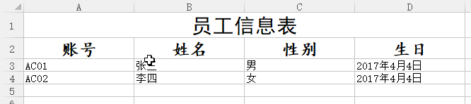

# 1. POI及其使用

## 1.1 POI作用

　　POI是Apache的一个开源项目，用于操作Microsoft Office文档，支持Office97 - 2016类型的文档。POI是“Poor Obfuscation Implementation”的缩写，意为“可怜的模糊实现”。POI中常用的模块有：

　　（1）HSSF和XSSF分别用于操作xls和xlsx文档；

　　（2）HWPF和XWPF分别用于操作doc和docx文档；

　　（3）HSLF和XSLF分别用于操作ppt和pptx文档；

　　（4）HDGF和XDGF分别用于操作vsd和vsdx文档。

　　在开发中，经常用到的需求是利用Excel文档实现数据的导入和导出，因此我们下面以操作Excel作为例子。

## 1.2 Excel操作说明

　　一个Excel文件就是一个工作簿Workbook。工作簿中可以有多张工作表，即sheet，而表是由很多个单元格Cell组成的，单元格通过行Row和列Column来确定。

　　POI也是用面向对象的方式来操作文档的，因此POI的HSSF和XSSF中也提供了相应的对象，对应关系如下：

|             对象            |          说明        |
|:----------------------------|:---------------------|
| HSSFWorkbook / XSSFWorkbook | 表示工作簿对象       |
| HSSFSheet / XSSFSheet       | 表示工作表对象       |
| HSSFRow / XSSFRow           | 表示表中的行对象     |
| HSSFCell / XSSFCell         | 表示表中的单元格对象 |

　　有了上面的对象，就能实现操作Excel中的一个单元格。具体的例子看下面的Excel操作示例。

## 1.3 Excel操作示例

　　首先在Apache POI官网下载所需包（这里使用3.15版本）。对于操作Excel，需要在在项目中引入如下jar包（也可参照jar包自行使用Maven项目）：

　　poi-3.15.jar、poi-ooxml-3.15.jar、poi-ooxml-schemas-3.15.jar、lib/commons-collection4-4.1.jar和ooxml-lib/xmlbeans-2.6.0.jar。

　　（1）生成Excel文档的例子。这里使用xlsx格式，因此我们使用的对象都是XSSF开头的。当然若要生成xls文档，则使用HSSF开头的对象。

```java
package com.export;

import org.apache.poi.xssf.usermodel.XSSFCell;
import org.apache.poi.xssf.usermodel.XSSFRow;
import org.apache.poi.xssf.usermodel.XSSFSheet;
import org.apache.poi.xssf.usermodel.XSSFWorkbook;

import java.io.File;
import java.io.FileOutputStream;
import java.io.IOException;

public class ExportDemo {
    public static void main(String[] args) throws IOException {
        // 1.创建工作簿对象
        XSSFWorkbook workbook = new XSSFWorkbook();
        // 2. 用workbook对象创建指定名称的工作表
        XSSFSheet sheet1 = workbook.createSheet("sheet1");
        // 3. 用sheet创建指定的行，行索引从0开始。表示第一行。
        XSSFRow row = sheet1.createRow(0);
        // 4. 用行对象创建指定列索引的单元格对象。得到的就是第一行第一列的单元格
        XSSFCell cell = row.createCell(0);
        // 5. 设置单元格的内容
        cell.setCellValue("hello 你好");
        // 6. 用输出流输出workbook对象。
        workbook.write(new FileOutputStream(new File("D:\\test.xlsx")));
        // 7. 关闭workbook对象
        workbook.close();
    }
}
```

　　可以看到，前期工作就是通过“workbook - sheet - row - cell”得到单元格对象，操作完毕单元格对象后，就能输出文件，并关闭流对象。

　　（2）将Excel中数据导入的过程和上述类似，只是在创建workbook对象时，说明要导入数据的Excel的位置（也可以是流对象），并且，要将上述的“create...”方法改为“get...”方法。

```java
package com.ipt;

import org.apache.poi.xssf.usermodel.XSSFCell;
import org.apache.poi.xssf.usermodel.XSSFRow;
import org.apache.poi.xssf.usermodel.XSSFSheet;
import org.apache.poi.xssf.usermodel.XSSFWorkbook;

import java.io.IOException;

public class ImportDemo {
    public static void main(String[] args) throws IOException {
        // 指定文件创建workbook对象
        XSSFWorkbook workbook = new XSSFWorkbook("D:\\test.xlsx");
        // 按照索引获得工作表。也可用getSheet(String name)按名称获取工作表
        XSSFSheet sheet = workbook.getSheetAt(0);
        // 获得行对象
        XSSFRow row = sheet.getRow(0);
        // 获得单元格
        XSSFCell cell = row.getCell(0);
        // 获得字符串值
        System.out.println(cell.getStringCellValue());
        // 关闭资源
        workbook.close();
    }
}
```

## 1.4 统一处理xls和xlsx文档

　　有时在程序中，既要处理xls文档，又要处理xlsx文档，我们希望使用统一的方法来操作这两种类型的文档。

　　通过查看API，发现其实Workbook、Sheet、Row和Cell都是接口，这样我们可以使用接口编程，实现统一处理Excel文档，而不用每次判断应该使用XSSF类型还是HSSF。

　　代码示例：

```java
package com.export;

public class ExportDemo {
    public static void main(String[] args) throws IOException {
        exportExcel("D:\\test.xls");
        exportExcel("D:\\test.xlsx");
    }

    // 返回值表示成功还是失败
    public static boolean exportExcel(String fileName) throws IOException {
        boolean is03Excel = false;
        if (fileName.endsWith("xls")) {
            is03Excel = true;
        } else if (fileName.endsWith("xlsx")) {
            is03Excel = false;
        } else {
            return false;
        }
        // 新建工作簿
        Workbook workbook = is03Excel ? new HSSFWorkbook() : new XSSFWorkbook();
        Sheet sheet = workbook.createSheet("sheet1");
        Row row = sheet.createRow(0);
        Cell cell = row.createCell(0);
        cell.setCellValue("测试成功");
        workbook.write(new FileOutputStream(new File(fileName)));
        workbook.close();
        return true;
    }
}
```

# 2. Excel的格式化

　　可以使用格式化对象来格式化Excel，即设置Excel内容的样式，例如合并单元格、设置单元格字体大小、颜色等。

　　需要注意的是，这些对象大多是通过workbook工作簿对象获得的，因为工作簿的任意表都能使用这些对象。但是这些格式化对象的应用范围是单元格，因为需要指明样式应用在哪些单元格上。

## 2.1 合并单元格

　　合并单元格需要使用CellRangeAddress对象。该对象的构造方法有四个参数：CellRangeAddress(int firstRow, int lastRow, int firstCol, int lastCol)，分别表示“起始行索引，终止行索引，起始列索引，终止列索引”。这样，就能表示合并单元格的范围了。

　　创建好CellRangeAddress对象后，调用工作表的addMergedRegion(CellRangeAddress region)方法，就能设置该工作表的合并单元格。注意，合并后，该位置就只有一个单元格，比如A1和B1合并后，只存在A1单元格，不存在B1单元格，但占据的位置是A1和B1两者的位置。

　　示例：合并A1 - D2这8个单元格（即第一行1-4列和第二行1-4列）。

```java
package com.export;

public class ExportDemo {
    public static void main(String[] args) throws IOException {
        XSSFWorkbook workbook = new XSSFWorkbook();
        XSSFSheet sheet = workbook.createSheet("sheet1");
        // 创建CellRangeAddress对象
        CellRangeAddress region = new CellRangeAddress(0, 1, 0, 3);
        // 应用到工作表
        sheet.addMergedRegion(region);
        // 可设置A1单元格
        Row row = sheet.createRow(0);
        row.createCell(0).setCellValue("A1单元格");
        // 而设置合并之前的单元格是不显示的，比如B1
        row.createCell(1).setCellValue("B1单元格");
        // 输出
        workbook.write(new FileOutputStream(new File("D:\\test.xlsx")));
        workbook.close();
    }
}
```

## 2.2 设置单元格样式

　　要设置单元格样式，首先从工作簿对象workbook中拿到CellStyle对象，然后可设置此对象的具体属性值。使用：

　　workbook.createCellStyle()方法得到CellStyle对象。

　　（1）设置单元格内容对齐方式：

　　设置水平对齐方式：cellStyle.setAlignment(对齐方式枚举)

　　设置垂直对齐方式：cellStyle.setVerticalAlignment(对齐方式枚举)

　　（2）设置单元格字体：

　　通过方法：cellStyle.setFont(Font font)进行设置。因此还要通过workbook的createFont()方法得到Font对象。以下方法对Font进行具体设置：

　　设置字体：font.setFontName(字体名称)；

　　设置字体颜色：font.setColor(字体颜色，见示例)

　　设置粗体：font.setBold(true)

　　设置字体大小：font.setFontHeightInPoints(short i)。

　　最后，设置完cellStyle对象之后，一定要记得给指定的单元格设置这个样式，否则是没有效果的，即cell.setCellStyle(CellStyle style)。

　　（3）设置列宽，是使用sheet的setColumnWidth(列索引，宽度)。

　　代码示例：

```java
package com.export;

import org.apache.poi.hssf.util.HSSFColor;
import org.apache.poi.ss.usermodel.*;
import org.apache.poi.ss.usermodel.Font;
import org.apache.poi.xssf.usermodel.XSSFWorkbook;

import java.io.File;
import java.io.FileOutputStream;
import java.io.IOException;

public class ExportDemo {
    public static void main(String[] args) throws IOException {
        Workbook workbook = new XSSFWorkbook();
        Sheet sheet = workbook.createSheet("sheet1");
        // 设置第一列列宽为6000
        sheet.setColumnWidth(0, 6000);
        // 获得样式对象
        CellStyle cellStyle = workbook.createCellStyle();
        // 设置对齐方式为水平和垂直居中
        cellStyle.setAlignment(HorizontalAlignment.CENTER);
        cellStyle.setVerticalAlignment(VerticalAlignment.CENTER);
        // 获得字体对象并设置
        Font font = workbook.createFont();
        font.setFontName("楷体");
        font.setColor(HSSFColor.RED.index);
        font.setBold(true);
        font.setFontHeightInPoints((short)18);
        // 给cellStyle设置字体
        cellStyle.setFont(font);
        // 创建一个单元格，并使用样式
        Cell cell = sheet.createRow(0).createCell(0);
        cell.setCellValue("测试样式");
        cell.setCellStyle(cellStyle);
        // 输出
        workbook.write(new FileOutputStream(new File("D:\\test.xlsx")));
        workbook.close();
    }
}
```

# 3. 案例演示导入导出

　　（1）导出：将程序中的实体对象数据导出为Excel表格形式保存。具体形式为：



　　实现的代码：

　　员工实体类Employee：

```java
package com.excel;

import java.util.Date;

public class Employee {
    private String account; // 账号
    private String name; // 姓名
    private String gender; // 性别
    private Date birthday; // 生日

    public Employee(String account, String name, String gender, Date birthday) {
        this.account = account;
        this.name = name;
        this.gender = gender;
        this.birthday = birthday;
    }
    public Employee() {}
    // setter/getter/toString
}
```

　　主类代码：

```java
package com.excel;

public class ExportExcel {
    public static void main(String[] args) throws IOException {
        // 新建实体对象
        List<Employee> employeeList = new ArrayList<>();
        Employee emp1 = new Employee("AC01", "张三", "男", new Date());
        Employee emp2 = new Employee("AC02", "李四", "女", new Date());
        employeeList.add(emp1);
        employeeList.add(emp2);
        Scanner scanner = new Scanner(System.in);
        System.out.println("输入到导出的文件名（指定路径和扩展名）：");
        String fileName = scanner.next();
        // 导出
        exportExcel(fileName, employeeList);
    }

    public static void exportExcel(String fileName, List<Employee> employeeList) throws IOException {
        boolean is2003Excel = false;
        // 简单判断示例
        if (fileName.endsWith("xls")) {
            is2003Excel = true;
        }
        Workbook workbook = is2003Excel ? new HSSFWorkbook() : new XSSFWorkbook();
        Sheet sheet = workbook.createSheet("sheet1");
        // 设置列宽(这里循环遍历时等宽了)
        for (int i = 0; i < 4; i++) {
            sheet.setColumnWidth(i, 5000);
        }
        // 1. 大标题。
        generateTitle(workbook, sheet);
        // 2. 列标题
        generateColumnTitle(workbook, sheet);
        // 3. 导出数据
        for (int i = 0; i < employeeList.size(); i++) {
            // 创建行
            Row row = sheet.createRow(i + 2); // 加2，因为前两行是标题
            row.createCell(0).setCellValue(employeeList.get(i).getAccount());
            row.createCell(1).setCellValue(employeeList.get(i).getName());
            row.createCell(2).setCellValue(employeeList.get(i).getGender());
            // 日期格式
            SimpleDateFormat sdf = new SimpleDateFormat("yyyy年M月d日");
            String birthday = sdf.format(employeeList.get(i).getBirthday());
            row.createCell(3).setCellValue(birthday);
        }
        // 4. 输出Excel文件
        workbook.write(new FileOutputStream(new File(fileName)));
        workbook.close();
    }

    // 生成大标题。要合并单元格并且有样式
    public static void generateTitle(Workbook workbook, Sheet sheet) {
        CellRangeAddress region = new CellRangeAddress(0, 0, 0, 3);
        sheet.addMergedRegion(region);
        // 样式
        CellStyle titleStyle = workbook.createCellStyle();
        // 居中
        titleStyle.setAlignment(HorizontalAlignment.CENTER);
        titleStyle.setVerticalAlignment(VerticalAlignment.CENTER);
        // 字体
        Font titleFont = workbook.createFont();
        titleFont.setFontName("黑体");
        titleFont.setFontHeightInPoints((short)22);
        // 样式应用字体
        titleStyle.setFont(titleFont);
        // 设置标题单元格文字并应用字体
        Cell titleCell = sheet.createRow(0).createCell(0);
        titleCell.setCellValue("员工信息表");
        titleCell.setCellStyle(titleStyle);
    }

    // 生成列标题
    public static void generateColumnTitle(Workbook workbook, Sheet sheet) {
        Row columnTitleRow = sheet.createRow(1);
        // 存储列标题名称的数组
        String[] columnTitle = {"账号", "姓名", "性别", "生日"};
        // 样式
        CellStyle columnTitleStyle = workbook.createCellStyle();
        columnTitleStyle.setAlignment(HorizontalAlignment.CENTER);
        columnTitleStyle.setVerticalAlignment(VerticalAlignment.CENTER);
        // 字体
        Font columnTitleFont = workbook.createFont();
        columnTitleFont.setFontName("楷体");
        columnTitleFont.setBold(true);
        columnTitleFont.setFontHeightInPoints((short)18);
        columnTitleStyle.setFont(columnTitleFont); // 设置样式字体
        for (int i = 0; i < columnTitle.length; i++) {
            Cell columnTitleCell = columnTitleRow.createCell(i);
            columnTitleCell.setCellValue(columnTitle[i]);
            columnTitleCell.setCellStyle(columnTitleStyle); // 应用样式
        }
    }
}
```

　　（2）导入，即将Excel数据导入到程序中，一般还要将数据保存到数据库中（示例不会保存到数据库中）。Excel文件还是用上述的格式。

　　Employee类无需变动，导入的主类为：

```java
package com.excel;

public class ImportExcel {
    public static void main(String[] args) throws IOException, ParseException {
        Scanner scanner = new Scanner(System.in);
        System.out.println("输入要导入的Excel文件名（指定路径和扩展名）：");
        String fileName = scanner.next();
        // 导出
        importExcel(fileName);
    }

    // 导入数据。关心的只是数据，而不用关心样式，比较简单。
    public static void importExcel(String fileName) throws IOException, ParseException {
        boolean is2003Excel = false;
        // 简单判断示例
        if (fileName.endsWith("xls")) {
            is2003Excel = true;
        }
        // 对于HHSSFWorkbook，需要传递的参数是一个FileInputStream。所以看起来麻烦一点。
        Workbook workbook = is2003Excel ? new HSSFWorkbook(new FileInputStream(new File(fileName))) : new XSSFWorkbook(fileName);
        // 得到sheet1
        Sheet sheet1 = workbook.getSheet("sheet1");
        List<Employee> employeeList = new ArrayList<>(); // 集合保存数据
        // sheet1的getLastRowNum()方法得到的是Excel中数据最后一行的索引。
        // 这样我们可以遍历有效的行。下面从第三行开始遍历。因为前两行是标题
        for (int i = 2; i <= sheet1.getPhysicalNumberOfRows(); i++) {
            // 得到该row对象。
            Row row = sheet1.getRow(i);
            // 若该行第一列（账号）不为空，则允许创建对象并赋值。其他列不做约束
            // 下面很多对象都应该进行为null判断。一层层有关联的。
            Cell accountCell = row == null ? null : row.getCell(0);
            String accountColumn = accountCell == null ? null : accountCell.getStringCellValue();
            if (accountColumn != null && !accountColumn.trim().equals("")) {
                // 可创建对象
                Employee employee = new Employee();
                employee.setAccount(accountColumn);
                employee.setName(row.getCell(1).getStringCellValue());
                employee.setGender(row.getCell(2).getStringCellValue());
                SimpleDateFormat sdf = new SimpleDateFormat("yyyy年M月d日");
                Date date = null;
                try {
                    date = sdf.parse(row.getCell(3).getStringCellValue());
                } catch (Exception ex) {
                    date = null;
                }
                employee.setBirthday(date);
                // 添加到集合
                employeeList.add(employee);
            }
        }
        // 最后输出集合查看。并关闭流
        System.out.println(employeeList);
        workbook.close();
    }
}
```

