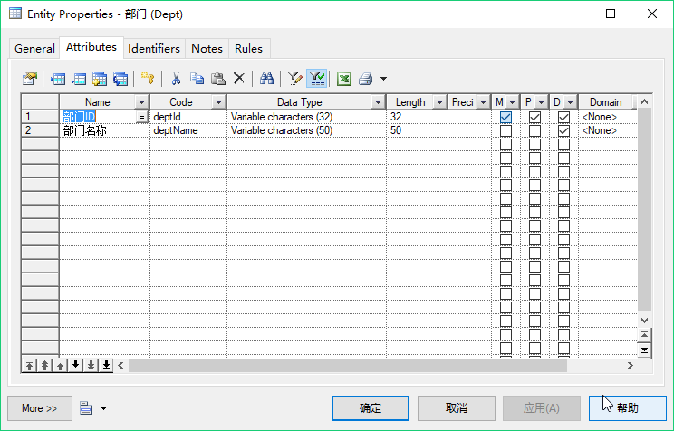
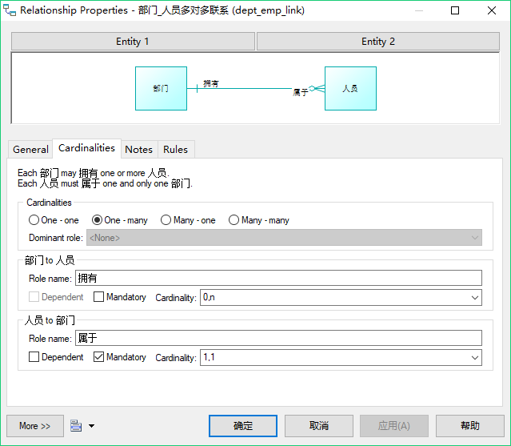
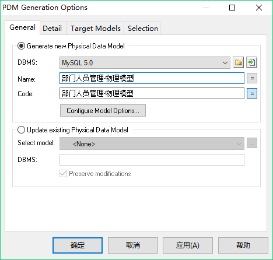

# 1. PowerDesigner简介

　　学习过“面向对象分析与设计”后，我们知道：只要按照系统需求进行完善的设计，剩下的工作就是“生成”代码了，这是一个理想的状态。我们之前使用的“逆向工程”就是“生成代码”的例子，但是目前，还没有达到完全生成系统代码的水平。

　　本次介绍的PowerDesigner就是一个设计软件，它能实现：在PowerDesigner中设计好数据库后（图的形式），能自动生成可创建该数据库表的SQL语句。这也算完成了“自动生成代码”的一部分。更为有意义的是，进行系统的分析设计，能有效地分析系统和提高系统开发的效率。

　　在实际项目中，就可先在PowerDesigner中进行数据库的分析设计，随后利用PowerDesigner生成创建数据库表的SQL，最终通过逆向工程生成系统中持久层的基本代码（DAO层的基本代码）。

　　PowerDesinger是Sybase公司的产品。PowerDesigner最初就是以数据库模型设计工具而出名的，现在PowerDesigner也支持面向对象的分析与设计。利用PowerDesigner可进行系统的分析设计。

　　目前PowerDesigner的最新版本是16.6，另外本软件的安装文件和破解说明已经提供在百度网盘：链接：http://pan.baidu.com/s/1qYmaX9i 密码：s0vc。直接按照说明安装即可。

# 2. 使用PowerDesigner

　　我们学习使用PowerDesigner进行数据库模型设计。在PowerDesinger中，主要学习概念模型（Conceptual Model）和物理模型（Physical Data）。概念模型不涉及具体的数据库，物理模型涉及到具体的数据库，可由物理模型生成和数据库相关的SQL语句。

## 2.1 概念模型

　　打开PowerDesinger，点击“File - New Model...”，选择其中的“Conceptual Data”，这就是概念模型，下方的Model name可输入模型名称，确定即可画概念模型图。这部分如图2-1所示。

　　图2-1 新建概念模型图

　　画图时，主要使用的就是右侧的Toolbox工具，如图2-2所示。

　　图2-2 概念模型相关控件

　　相关介绍如下：

　　（1）Mouse，鼠标，使用鼠标来移动概念图上各个组件的位置等。

　　（2）Entity，实体。使用Entity可在图上新建实体模型，最常用。

　　（3）Relationship，关系。Relationship用于实体之间，表示实体间的关系，例如一对一关系等。

　　（4）Inheritance，继承。若B实体继承A实体，那么B实体就会拥有A实体的所有属性，同时B实体也可拥有自己特有的属性。此时，画图时，应该将继承的“连线”从B指向A表示继承。如图2-3所示。

　　图2-3 继承示例

　　（5）Association，关联。Association主要用于描述实体间的关联关系。和relationship的最大区别在于：Association会单独生成一张表（中间表，即联系表），且会存储相关实体的所有主键（也可增加该联系表的属性）。

　　Association更像是一个关联关系表。所以我们也可以通过relationship来实现这样的关系，只需要新添加一个实体来进行多个实体之间的关联即可。

　　（6）Association Link用来关联Association和Entity的，这类似于Relationship。只是RelationShip用于Entity之间的关联。

## 2.2 部门人员管理实例

　　部门人员之间有如下关系：

　　（1）部门Dept与人员Employee之间是一对多关系；

　　（2）人员Employee与角色Role之间是多对多关系。

　　下面就用PowerDesigner画出他们的概念模型。

　　首先建立一个实体Entity，双击实体模型进行编辑。在General选项卡中，需要设置Name、Code和Comment。Name表示该模型的名称，Code表示数据库表的表名，Comment是对模型的注释。例如：

　　图2-4 Entity模型的General设置

　　随后，在Attributes选项卡中设置模型的各个属性，即表示表的字段。同样，其中的Name表示属性名称，Code表示数据库中字段名。

　　其中，Data Type表示数据类型，因为现在是概念模型，不涉及具体的数据库，因此都是比较抽象的数据类型。Length表示长度，M表示“强制的”，即是否为空，若勾选，则不可为空。P表示是否是主键，D表示是否将该属性显示在模型图上。

　　具体如图2-5所示。

　　图2-5 部门属性

　　若想给每个属性添加注释等信息，也可双击每个属性的“序号”或者右击“属性”，选择“Properties”进行编辑。

　　Identifiers选项卡中是各种约束键，也可以手动设置。

　　下面新建人员实体并写好其中的属性。要点是设置他们之间的关系。由于部门和人员是一对多的关系，因此不需要使用Association来创建一张联系表。

　　我们直接选择Relationship，将部门与人员之间进行实体连线。双击连线之间的文字设置联系的属性。同样General选项卡中还是设置Name、Code和Comment等，这些在这里不重要。重要的是设置Cardinalities，用于设置具体的关系。由于我们连线是从部门指向人员的，这里选择“One-many”，上方的图会随着选择改变而改变，很直观。

　　这里，还可进行更详细的约束。在“部门 to 人员”中，关系是部门拥有“人员”的关系，因此“Role name”可填写“拥有”，“Mandatory”是强制的意思，就是说，如果勾选的话，就表示“一个部门下必须要有一个员工”，此时Cardinality选择框中也会显示“1.n”。根据实际需要，有时部门刚成立，可能还没有人员，所以这里不勾选。

　　在“人员 to 部门”中，他们是“属于”的关系，因此Role name可填“属于”，而“Mandatory”也可勾选，即人员必须是有部门的。这里还有一个“Dependent”复选框，如果勾上说明会将部门的主键复制到人员表中，并和人员表的主键作为联合主键存在，一般不需要这样做。

　　上述的设置如图2-6所示。

　　图2-6 一对多关系设置

　　最后，来处理多对多的关系。新建一个角色实体，有角色编号、名称等。人员和角色是多对多关系，并且我们想在“人员角色表”中添加一个“状态”属性表示该人员的角色是否可用（如果说不需要加额外的属性，那么直接使用Relationship的多对多关系即可）。

　　因此我们需要画出一个“Association”来代表这个“中间表”。Association的设置名称和属性和设置Entity是类似的。设置完后，需要设置人员、角色和这个“人员角色表”的联系，这里就应该使用Association Link了，将三者连起来。同样，也可双击每个连线设置具体的关系，比如设置Role、设置是1.n还是0.n等。

　　这样，基本的案例就讲完了，就画出了一个概念模型图。

## 2.3 PowerDesigner常见问题

　　（1）常用的图标无法选择，比如图2-2中的图标无法选择。解决方法：

　　打开“Tools”——“Model Options...”,将 “Notation” 中的值设置为“E/R+Merise”，再点击“Set As Default”， 再点击“OK”即可。

　　（2）点击创建模型时出现“打印机”相关的错误提示。解决方法：

　　在“服务”中，开启“Print Spooler”服务。

　　（3）不小心关闭了“Toolbox”怎么办？解决方法：

　　点击“View”——“Toolbox”即可。

## 2.4 生成物理模型和SQL语句

　　利用我们画好的概念模型可以直接生成具体的DBMS的物理模型。点击“Tools - Generate Physical Data Model...”，在弹出框中设置具体的DBMS（如MySQL 5.0），并设置生成的物理模型的名字，点击确定即可。如图2-7所示。

　　图2-7 生成物理模型

　　若出现黄色警告，可忽略。我们发现，生成的物理模型会根据我们的设计，自动维护了表之间的关系，并生成了“人员角色表”和主外键关系（比如人员表中有部门表的外键）等。

　　双击每个图表，可双击它查看“Preview”，其中直接显示出了建表的SQL语句。我们也可随时修改Column，这时Preview中的SQL也会随之改变。

　　可以使用“Database - Generate Databases”将整个SQL存储到文件。这就是数据库的设计到自动生成代码。我们可直接把SQL放到MySQL中执行。

　　最后保存一下这些表，你可指定位置。概念模型的扩展名是cdm，物理模型的扩展名是pdm，这两个案例文件都已经在本教程的“resources/PowerDesigner”目录下提供了。