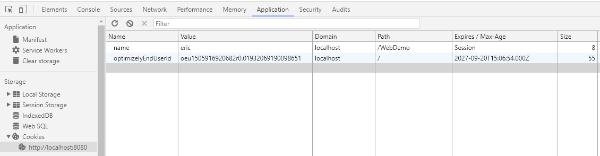

# 1. 会话管理

　　Web应用中的一次会话是指：用户从打开浏览器访问此Web应用开始，到将此次访问的浏览器关闭为止。因为HTTP协议是无状态的，即每次请求和响应都是独立的，和上次是没有关系的，因此我们在会话过程中，一般需要使用一些技术（例如下面的Cookie和Session技术）来保存本次会话的一些信息，以便下次使用。

　　比如一些网站会记住用户的登录信息，当用户下次短时间内再访问网站时，服务器就知道他不久前登录过，就不用再次登录。

　　常用的会话技术有：

　　（1）Cookie：会话数据会保存在客户端使用的浏览器中。服务器可让浏览器以Cookie的形式保存用户数据，当用户使用该浏览器再去访问此Web应用时，浏览器就会携带该网站保存的Cookie数据一起请求该Web应用资源。这样服务器可拿到Cookie数据。

　　（2）Session：会话数据保存在服务器端。服务器在运行时，可以为每一个用户的浏览器创建一个其独享的session对象。

　　使用会话主要就是设置会话的数据和获取会话的数据，细节下面讲解。

## 1.1 Cookie

### 1.1.1 使用Cookie

　　向浏览器设置Cookie信息的步骤如下：

　　（1）用Cookie类创建对象，构造中传入要保存的Cookie的名字和值，即new Cookie(String name, String value)。

　　（2）设置Cookie对象的属性，如setValue(String value)可重新设置值；setMaxAge(int expiry)可设置此Cookie的有效时间，单位是秒

　　（3）使用response的addCookie(Cookie cookie)方法，将此Cookie发送到客户端浏览器保存。

　　那么设置完Cookie后，以后再访问该网站，服务器端就能获取该Cookie，拿到其中的数据进行处理了。

　　服务器端接收Cookie的方法是调用request的getCookies()方法，该方法返回Cookie数组，其中可存储多个Cookie。

　　例子：使用Cookie显示用户最近一次访问该网站的时间。

```java
@WebServlet(urlPatterns = {"/start"})
public class MyServlet extends HttpServlet {
    @Override
    protected void doGet(HttpServletRequest req, HttpServletResponse resp) throws IOException {
        // 说明：用名为"lastTime"的Cookie记录用户上次的访问时间
        Cookie timeCookie = null; // 声明此Cookie
        // 获得当前时间字符串。
        SimpleDateFormat sdf = new SimpleDateFormat("yyyy年M月d日  hh:mm:ss");
        // Cookie中不能存储中文和特殊字符(包括空格等)，因此可用URL编码。读取时再解码。
        String currentTimeStr = URLEncoder.encode(sdf.format(new Date()), "UTF-8");
        // 先查看是否有了该Cookie。
        // 如果用foreach，那么一定要进行为空判断。因此浏览器第一次访问时，没有cookie。
        Cookie[] cookies = req.getCookies();
        for (int i = 0; i < cookies.length; i++) {
            if (cookies[i].getName().equals("lastTime")) {
                // 找到了该Cookie。
                timeCookie = cookies[i];
            }
        }
        resp.setContentType("text/html;charset=UTF-8");
        // 判断timeCookie
        if (timeCookie != null) {
            // 存在此Cookie。显示信息，并且要重新设置时间
            // 这样下次访问时就会显示本次的访问时间
            String dateStr = URLDecoder.decode(timeCookie.getValue(), "UTF-8");
            resp.getWriter().write("上次访问时间：" + dateStr);
            timeCookie.setValue(currentTimeStr);
        } else {
            // 不存在，则是第一次访问。则新建Cookie对象
            String dateStr = URLDecoder.decode(currentTimeStr, "UTF-8");
            resp.getWriter().write("你是第一次访问！" + dateStr);
            timeCookie = new Cookie("lastTime", currentTimeStr);
        }
        // 最后，都要发送该Cookie到客户端
        resp.addCookie(timeCookie);
    }
}
```

　　以上就是基本使用，也可以自行实现记住用户信息功能。

### 1.1.2 Cookie细节

　　（1）服务器端，我们调用addCookie()方法将Cookie设置到浏览器中。实际上让客户端保存Cookie的原理是：服务器会设置“Set-Cookie”响应头，响应头中就包含了要保存的Cookie内容。比如服务器会发送“Set-Cookie:name=eric”这个响应头，浏览器接收到该响应头后，就会在浏览器中保存该Cookie信息。请求头信息可以在Chrome开发者工具的网络连接中查看到。当浏览器下次再访问该网址时，浏览器的请求头中也会携带该Cookie信息，读者可自行查看。这就是Cookie实现的原理。

　　我们可以在Chrome开发者工具中查看到浏览器保存的Cookie信息。查看方法：打开开发者工具（按F12），在“Application”选项卡中，左侧菜单中有“Storage”，点击其中的“Cookie”就能看到浏览器中保存的Cookie信息。例如这里展示了两个Cookie信息：



　　其中“Name”表示Cookie的名称，“Value”表示Cookie的值，“Domain”表示Cookie的域，“Path”表示Cookie的路径，“Expires/Max-Age”表示Cookie的过期时间（或者叫最大生存时间），“Size”表示Cookie的大小。下面会对这些细节再说明。

　　（2）Cookie默认的有效时间是一次浏览器会话，即当浏览器关闭后该Cookie就失效了。上图中“name”为“eric”的这个Cookie就是这样，因为它的“Expires/Max-Age”值是“Session”，即表示只在本次会话有效。但在实际中，我们希望自定义Cookie的有效时间，比如希望用户一周内不需重新登录，那就需要设置Cookie的Max-Age为7天。

　　如何设置呢？Java Web的Cookie API提供了setMaxAge(int expiry)这个方法，该方法就用于设置Cookie的Max-Age，单位是秒。比如设置Cookie有效时间是7天，那么就是：

```java
Cookie cookie = new Cookie("name", "eric");
cookie.setMaxAge(60 * 60 * 24 * 7);
resp.addCookie(cookie);
```

　　如果设置setMaxAge()为负数，则Cookie的有效时间就是本次会话。若不设置Max-Age，默认就为-1，所以Cookie默认的Expires是“Session”，即在本次会话结束就失效。

　　如果想删除本Cookie，只要setMaxAge(0)，即设置Max-Age为0，表示本Cookie立马失效。这就利用了覆盖该Cookie的有效时间为0将此Cookie删除（Cookie的键和要删除Cookie的键相同即可）。

　　（3）浏览器什么情况下才会将Cookie数据发送给服务器端呢？当然浏览器不会把Cookie发送给任意一个请求的网址。只有当请求网址的路径是Cookie的“Path”的路径或者其子路径，浏览器才会把Cookie发送给服务器（前提是域Domain也要匹配）。

　　比如“name”为“eric”的这个Cookie，该Cookie路径Path为“/WebDemo”，域Domain为localhost。如果浏览器访问“ http://localhost:8080/WebDemo ”、“ http://localhost:8080/WebDemo/AAA ”等网址，浏览器都会把该Cookie发送给浏览器，而如果访问的地址是“ http://localhost:8080/MyDemo ”或者是其他的某些网址，浏览器就不会发送该Cookie。

　　默认Cookie的有效路径是应用的根目录，比如应用名是MyWeb，那么Cookie的path默认就是MyWeb。我们可以在Java代码中，调用setPath(String uri)方法来手动设置Cookie的访问路径。比如：

```java
Cookie cookie = new Cookie("name", "eric");
cookie.setPath(req.getRequestURI());
resp.addCookie(cookie);
```

　　上述代码是设置Cookie的访问路径是该Servlet，也就是说，以后浏览器只有在访问该Servlet及其子路径的Servlet时，才会发送该Cookie。

　　（4）Cookie不能存储中文等数据，因此 示例代码中我们用URL编码进行数据的编码。另外，Cookie的大小也有限制，不能超过4KB。

　　（5）Cookie的域（Domain）

　　现在有这样的需求：我们希望“www.baidu.com”、“music.baidu.com”和“map.baidu.com”能共享一个Cookie，如何实现？

　　这时就需要使用Cookie的“域”了。我们需要执行下面的两步操作：

　　1. 设置Cookie的域为“.baidu.com”，即使该Cookie能作用到“baidu.com”下的所有主机。代码为：

```java
cookie.setDomain(".baidu.com");
```

　　2. 设置Cookie的路径为“/”，即对应域下的所有路径都能匹配，都能使用该Cookie：

```java
cookie.setPath("/");
```

　　这就是跨主机访问Cookie，但不常用，而且在Tomcat 8.5后，不允许Domain以“.”开头。

　　（6）在Tomcat 8.5测试中，可以在Cookie的值value中存储中文等字符，但是Cookie的name不能为中文，如果非要在Cookie的键中存储中文，可以使用URL编码后再存储。Cookie的值也建议先编码再存储。

## 1.2 Session

### 1.2.1 使用Session

　　在服务器中设置和获得Session的数据使用的是HttpSession对象。session存储的数据和cookie不同，session就是保存在服务器端的数据，可保存任意类型对象，而cookie只能是字符串形式保存在浏览器中。

　　设置Session数据步骤如下：

　　（1）首先调用request的getSession()方法得到HttpSession对象：HttpSession session = request.getSession()。

　　（2）设置session：如设置session中数据使用setAttribute(String name, Object value)；设置有效时间：setMaxInactiveInterval(int interval)。

　　这样就完成了保存数据。而想获得数据时：

　　（1）同样也是先获得session对象，但是是通过request的getSession()方法。

　　（2）调用getAttribute(String name)方法。

　　另外还提供了下面的方法：

　　void invalidate()：销毁session对象；

　　String getId()：获得此Session的编号；

　　void removeAttribute(String name)：清除某个session数据。

　　long getCreationTime()：获得创建时间

　　long getLastAccessedTime()：获得最后一次访问时间

　　boolean isNew()：查看当前获得的session是否是新的。只有在第一次访问服务器时，这个session是新的。

　　int getMaxInactiveInterval()：获得session的寿命，即最大存活时间。session存活时间默认是30分钟，即1800秒，返回的单位是秒。至于为什么默认是30分钟，下面会说。

　　session的使用和域对象使用类似，比如我们在一处保存了Session，另一处就能拿到。这个就不演示了。

### 1.2.2 Session的细节

　　（1）Session也用于保存当前客户端的信息，不过Session的数据是保存的服务器中的，并且数据在页面间可共享，即多个Servlet都能拿到Session中的值。Session的一次会话以浏览器关闭为结束，重启该浏览器访问后，不能再现以前该客户端保留的Session数据。

　　那么Session怎么实现只保存当前用户信息的呢？实际上是配合Cookie实现的。用户初次访问应用时，Tomcat会自动创建session对象和一个叫做JSESSIONID的Cookie（该Cookie的值就是这个session的编号，这样就能通过客户端的JSESSIONID值唯一标识服务器的session），并会把JSESSIONID这个Cookie保存在客户端。

　　当客户第二次访问时，服务器就能拿到JSESSIONID的值，并能通过该值找到该客户端对应的session数据。

　　上述就是Session实现的原理。为什么说Session的一次会话以浏览器关闭为结束呢？因为JSSESSIONID这个Cookie的有效时间是-1，当浏览器关闭后，JSESSIONID就失效了，当再次访问服务器时，服务器拿不到JSESSIONID，自然就无法找到对应的session数据了。

　　若想使Session在重启浏览器后也有效，那么可在程序中手动获得JSESSIONID这个Cookie，自行设置有效时间，例如：

```java
protected void doGet(HttpServletRequest req, HttpServletResponse resp) {
    //设置session有效时长为1小时
    // 值必须设置为session的id，否则值不匹配，是那不到正确的session的。
    Cookie cookie = new Cookie("JSESSIONID", req.getSession().getId());
    cookie.setMaxAge(60 * 60);//1小时
    resp.addCookie(cookie);
}
```

　　上述设置了有效时间是一小时，那么在此期间内，即使重启浏览器访问，还是能获得以前session的信息，因为通过JSESSIONID能够找到正确的session。

　　JSESSIONID的路径默认就是项目名的路径，这也说明了session数据是在应用中共享的，默认我们不需设置JSESSIONID的路径。同样，session是不能“跨项目”的，这是因为session的大部分信息本身就是由服务器维护的。

　　（2）在一次会话中，Session默认有效时间是30分钟，这是因为在Tomcat的web.xml文件中，有这样的全局设置：

```xml
<session-config>
    <session-timeout>30</session-timeout>
</session-config>
```

　　上述设置的就是session的有效时间，单位是分钟，也即半小时。如果我们想改动这个默认的有效时长，可以使用下述方法：

　　1. 直接改变Tomcat中web.xml中的上述配置。例如改为1小时等。但是这会影响服务器中所有的应用。

　　2. 在应用的web.xml中覆盖配置上述的Tomcat中web.xml的配置。这样只会影响本应用中所有的session有效时长。

　　3. 在Java代码中，调用session.setMaxInactiveInterval(int interval)方法，设置单个的Session的有效时长，单位是秒。这样的话，只会影响单个Session的有效时长。

　　上述三种方法都可按需使用，只不过是“作用范围”不一样。

　　由此看出Cookie的应用对于网站来说非常重要，一些知名的网站，例如淘宝、百度等，如果浏览器拒绝使用Cookie，那么网站是无法登录上的（IE浏览器可以在“Internet选项 - 隐私”中禁用Cookie，读者可验证其登录淘宝、百度的效果），因为每访问一个链接网站就要通过Cookie来知道当前登录的用户。

### 1.2.3 session实现验证码的应用

　　现在网站上使用验证码很常见，主要是为了防止重复请求和机器人（Robot）软件暴力访问。例如在网站上注册信息时一般需要使用验证码，如果不用验证码，可能导致大量的恶意注册。

　　要实现验证码（Captcha），就要了解如何生成验证码以及如何验证。首先验证码图像是动态生成的，每次请求验证码图像都是不一样的，且每次请求后，服务器必须要保存好该验证码图像的验证码用于下次用户请求时比对是否一致。对普通开发者来讲，最好有生成验证码图像的工具，开发者只关心能得到自动生成的验证码和对应的图像，而不关心其他的（例如如何具体实现的）。开发者只要将验证码图像返回给浏览器，同时在服务器上保存验证码即可。当用户下次携带验证码访问时，应用中只要比对用户携带的验证码和服务器中保存的验证码即可。

　　关于如何生成验证码，我参考网上的示例写了一个较简单的Java生成验证码的项目，项目地址是“ https://github.com/zhang13690/captcha ”，其中也详细讲解了如何使用。实际上这个项目也很简单，只是简单的用JAVA生成了一个图像，然后封装成了一个易于使用的jar包以便使用。该jar包的下载地址： https://github.com/zhang13690/captcha/releases ，页面中的“captcha-1.0-SNAPSHOT.jar”就是该jar包。

　　现在就利用该包实现session验证码应用（因为要在服务器中存储每个会话的验证码数据，并在整个应用都能访问到，因此利用session对象存储）。

　　（1）写CaptchaServlet类，该Servlet用于响应给页面验证码图像，并将验证码保存在session中：

```java
package com.servlet.demo;

import com.zhang13690.captcha.Captcha;

import javax.servlet.ServletException;
// ...

@WebServlet(urlPatterns = "/captchaServlet")
public class CaptchaServlet extends HttpServlet {
    @Override
    protected void doGet(HttpServletRequest req, HttpServletResponse resp) throws ServletException, IOException {
        // 创建验证码对象
        Captcha captcha = new Captcha();
        // 拿到验证码
        String code = captcha.getCaptcha();
        // 可将验证码保存在session中
        req.getSession().setAttribute("code", code);
        // 调用提供的write方法，将验证码图片以流的形式输出。
        // 先设置响应头，再调用captcha的write()方法将图片输出
        resp.setContentType(getServletContext().getMimeType(".jpeg"));
        captcha.write(resp.getOutputStream());
    }
}
```

　　这样当访问“/captchaServlet”时，浏览器就能拿到验证码图像。

　　（2）编写前端的“注册”页面，signup.html。为了简单，现在我们只在页面上提交验证码信息，验证码图像就是访问“/captchaServlet”得到的，即：

```html
<!DOCTYPE html>
<html>
<head>
    <meta charset="UTF-8" />
    <title>验证码示例</title>
</head>
<body>
<!-- 表单会提交到signupServlet处理验证码是否正确 -->
<form action="/WebDemo/signupServlet" method="GET">
    验证码：<input type="text" name="captcha" />
    
    <br />
    <input type="submit">
</form>
</body>
</html>
```

　　该demo.html能正常显示内容。但是一般验证码都有“换一张”的功能，防止有些验证码用户不易识别。在验证码图像右侧加上一个按钮，点击一次按钮就更换图像，如何实现呢？方法是在JavaScript脚本中拿到img元素，重新设置src的属性。但这样简单设置还是不行的，因为生成验证码所访问的链接都是一样的，即都是captchaServlet，当浏览器意识到img元素的src属性值没有更改时，是不会再访问一次captchaServlet去加载新图像的。因此我们使用一个小技巧，将每次访问的链接都加上一个随机参数，这个参数值是利用JS生成的随机数，这个参数的作用只是让图像的src“路径”看起来不一样，而实际上服务器并不使用该参数。即这样做：

```html
<!DOCTYPE html>
<html>
<head>
    <meta charset="UTF-8" />
    <title>验证码示例</title>
</head>
<body>
    <form action="/WebDemo/signupServlet" method="GET">
        验证码：<input type="text" name="captcha" />
        
        <input id="changeCaptchaBtn" type="button" value="更换一张">
        <br>
        <input type="submit">
    </form>
</body>
<script>
    var changeCaptchaBtn = document.getElementById("changeCaptchaBtn")
    changeCaptchaBtn.onclick = function () {
        // 找到图片
        var img = document.getElementsByTagName("img")[0];
        // 路径后加上一个“_r”的随机参数，否则img图像并不会改变。
        img.src = "/WebDemo/captchaServlet?_r=" + Math.random();
    };
</script>
</html>
```

　　这样我们每点击一次按钮，验证码图像就变了，并且服务器session中保存的该验证码也随之更新。

　　（3）编写SignupServlet处理类，为了简单，该Servlet只要返回验证码是否正确的信息。需要注意的是，只要进入了该Servlet进行验证，无论验证是否成功，最后都要在session中将当前验证码重置为“null”，避免该客户端后续再以之前的验证码进行验证。验证时不区分大小写：

```java
package com.servlet.demo;
// import...

@WebServlet(urlPatterns = "/signupServlet")
public class SignupServlet extends HttpServlet {
    @Override
    protected void doGet(HttpServletRequest req, HttpServletResponse resp) throws ServletException, IOException {
        HttpSession session = req.getSession();
        // 得到session中验证码
        String sessionCaptcha = (String) session.getAttribute("code");
        System.out.println(sessionCaptcha);
        // 得到用户上传的验证码
        String captcha = req.getParameter("captcha");
        System.out.println(captcha);
        // 比较
        String msg = captcha.equalsIgnoreCase(sessionCaptcha) ? "验证码正确" : "验证码错误";
        // 重置captcha为null
        session.setAttribute("captcha", null);
        // 输出结果
        resp.setContentType("text/html;charset=UTF-8");
        resp.getWriter().write(msg);
    }
}
```

　　这样就能成功验证了。示例完毕。

### 1.2.4 Session的钝化和活化与实体类的序列化

　　session数据时保存在服务器中，当用户量大时，宝贵的服务器内存将被大量消耗。并且当服务器重启时，session的数据也会丢失。但session丢失对用户是不友好的，例如用户刚登录网站后不久，这个网站的服务器就重启了（登录信息保存在session中，重启失效了），当用户再次登录网站时，又被要求输入登录信息，导致用户体验不好。

　　而session的钝化（又叫搁置）和活化（又叫激活）就是为了解决上述的问题。当遇到以下情况时，会导致session的钝化：

　　（1）服务器内存消耗较大；

　　（2）某些HttpSession对象已经长时间不用了，但还没到销毁时间；

　　（3）服务器重启了。

　　钝化就是将session数据暂时保存到磁盘中，继而有效地利用内存空间并且保证session数据不会丢失。而当用到session数据时（例如重新启动了），再读取到磁盘中的session数据，这就是活化。

　　在Tomcat中，当session被钝化时，session数据被保存在Tomcat根目录下的“work/Catalina/主机名/项目名/SESSIONS.ser”文件中。

　　现在我们以示例说明session的钝化和活化。

　　AServlet中设置session，代码如下：

```java
@WebServlet(urlPatterns = "/aServlet")
public class AServlet extends HttpServlet {
    @Override
    protected void doGet(HttpServletRequest req, HttpServletResponse resp) throws ServletException, IOException {
        HttpSession session = req.getSession();
        session.setAttribute("student", new Student("张三", 13));
        resp.getWriter().write("save student data in session");
    }
}
```

　　BServlet中获取session，代码如下：

```java
@WebServlet(urlPatterns = "/bServlet")
public class BServlet extends HttpServlet {
    @Override
    protected void doGet(HttpServletRequest req, HttpServletResponse resp) throws ServletException, IOException {
        HttpSession session = req.getSession();
        Student student = (Student) session.getAttribute("student");
        System.out.println(student);
    }
}
```

　　开启Tomcat，先访问aServlet，再访问bServlet，能正常拿到student数据。现在我们正常关闭Tomcat服务器。正如之前所说，Tomcat会把session数据保存在“%Tomcat根目录%/work/Catalina/主机名/项目名/SESSIONS.ser”文件中。查看对应的目录，确实生成了该文件，该文件中基本就存储了session中对象的序列化数据，不易直接看懂。说明关闭Tomcat确实保存了session数据了。

　　再开启Tomcat，发现SESSIONS.ser文件消失了，这说明该文件被Tomcat读取完毕session恢复后删除了。这时我们直接访问bServlet，session中应该会输出之前的student数据的，但是并没有！为什么呢？session有效时长半小时也没过啊！

　　这是因为我们的Student类没有实现序列化接口！刚才说“SESSIONS.cer文件中存储了session中对象的序列化数据”，因此如果要想session中对象能够成功保存，它必须是可序列化的，这就要求类要实现Serializable序列化标记接口。

　　为了实现对象的传输和保存，都要先把对象数据序列化，因此在网络、IO等环境中，经常需要序列化。所以以后我们在写实体类时，一般都会都将实体类实现序列化接口，因为传输和保存的目标就是这些实体对象！

　　现在我们将Student类实现序列化后，再按照上述步骤试验session在Tomcat重启后能否保存，发现就成功了。说明所言正确。

　　注意：以上试验应该把项目打成war包放在Tomcat中运行，关闭和开启Tomcat使用shutdown.bat和startup.bat命令。避免在IDE中操作，因为IDE中可能某些设置导致session重启失效。

# 2. Servlet技术中的三大域对象

　　Servlet中，三大域对象分别是：

　　（1）application域对象。即servletContext，该域对象的作用范围是整个应用，因此也叫application。该对象中保存了应用的全局配置（配置信息是在web.xml中配置的）。

　　在以后的学习中我们将会体会到，Servlet的三大组件（Servlet类、过滤器、监听器）都能访问到servletContext对象。

　　（2）session域对象。该域对象的范围是一次会话。服务器处理多少个浏览器客户端的会话，服务器中就会有多少个session域对象。我们知道，session对象默认有效时间是30分钟，即30分钟后，这个session对象才会自动在服务器内存中销毁，而不是客户端浏览器关闭了就销毁了（浏览器关闭只是默认的JSESSIONID失效了，而服务器实际也根本无法知道客户是否关闭浏览器，因此保存30分钟自动销毁session）。

　　session的应用有保存登录信息、处理验证码等。

　　（3）request域对象。该域对象的作用范围是一次请求之内。主要用于转发数据。

# 3. Base64编码

　　除了URL编码，在网络传输中，经常用到的还有Base64编码。比如上面讲的Cookie等也可采用Base64编码，在互联网中，一些小的图片等资源也会采用Base64编码。但是GET和POST请求中还是应该用URL编码。

　　Base64是一个基本的编码，它可以把任何的二进制数据编码成可见的字符串数据，通过下面了解它的原理就知道为什么是这样了。因此我们可以把要传输的字符串、图片等通过Base64编码成一大串可见的字符串传输。

　　Base64建立的初衷是为了传输电子邮件数据，因为电子邮件的传输规定要使用ASCII码的可见字符传输。之所以叫Base64，是因为只支持64个可打印字符，每个字符都有一个索引值，如下图所示（编码时就根据Index对应的字符编码）：

| Index | 字符 | Index | 字符 | Index | 字符 | Index | 字符 |
|:-----:|:----:|:-----:|:----:|:-----:|:----:|:-----:|:----:|
|   0   |   A  |   16  |   Q  |  32   |   g  |  48   |   w  |
|   1   |   B  |   17  |   R  |  33   |   h  |  49   |   x  |
|   2   |   C  |   18  |   S  |  34   |   i  |  50   |   y  |
|   3   |   D  |   19  |   T  |  35   |   j  |  51   |   z  |
|   4   |   E  |   20  |   U  |  36   |   k  |  52   |   0  |
|   5   |   F  |   21  |   V  |  37   |   l  |  53   |   1  |
|   6   |   G  |   22  |   W  |  38   |   m  |  54   |   2  |
|   7   |   H  |   23  |   X  |  39   |   n  |  55   |   3  |
|   8   |   I  |   24  |   Y  |  40   |   o  |  56   |   4  |
|   9   |   J  |   25  |   Z  |  41   |   p  |  57   |   5  |
|   10  |   K  |   26  |   a  |  42   |   q  |  58   |   6  |
|   11  |   L  |   27  |   b  |  43   |   r  |  59   |   7  |
|   12  |   M  |   28  |   c  |  44   |   s  |  60   |   8  |
|   13  |   N  |   29  |   d  |  45   |   t  |  61   |   9  |
|   14  |   O  |   30  |   e  |  46   |   u  |  62   |   +  |
|   15  |   P  |   31  |   f  |  47   |   v  |  63   |   /  |

　　在所有数据（包括字符、文件等各种资源数据）的二进制层面，怎么把每个字节都编码成上述的可见字符呢？原本每个字节是8位，数据范围是0-255，现在用上述可见字符只能编码0-63的数据范围，即只有6位。因此Base64是这样编码的：

　　8和6的最小公倍数是24，因此将每3个字节（24位）分别进行Base64编码，将这24位分成4组，每个组就有6个二进制位。然后在每组前面加两个00，扩展成32个二进制位，即四个字节，这样保证了每个字节的数据都在0-63之间，就能将每个字节的数据按照上表进行编码。即Base64是每三个字节用四个字符来编码。这是必然的，因为Base64字符对应的数据位数（6位）较ACSII字符对应的数据位数（8位）小，所以必然要增加编码所需的字符个数。

　　为了更直观地表示Base64的编码，现在我们将“Man”三个字节数据编码成Base64字符串，过程如下：

　　（1）“Man”的ASCII分别是77、97和110，对应的二进制是：

<table>
    <tr>
        <td colspan="8" align="center">77</td>
        <td colspan="8" align="center">97</td>
        <td colspan="8" align="center">100</td>
    </tr>
    <tr>
        <td>0</td>
        <td>1</td>
        <td>0</td>
        <td>0</td>
        <td>1</td>
        <td>1</td>
        <td>0</td>
        <td>1</td>
        <td>0</td>
        <td>1</td>
        <td>1</td>
        <td>0</td>
        <td>0</td>
        <td>0</td>
        <td>0</td>
        <td>1</td>
        <td>0</td>
        <td>1</td>
        <td>1</td>
        <td>0</td>
        <td>1</td>
        <td>1</td>
        <td>1</td>
        <td>0</td>
    </tr>
</table>

　　（2）将上面分成4组，并在每组前加两个0，则可编码：

<table>
    <tr>
        <td>0</td>
        <td>0</td>
        <td>0</td>
        <td>1</td>
        <td>0</td>
        <td>0</td>
        <td>1</td>
        <td>1</td>
        <td>0</td>
        <td>0</td>
        <td>0</td>
        <td>1</td>
        <td>0</td>
        <td>1</td>
        <td>1</td>
        <td>0</td>
        <td>0</td>
        <td>0</td>
        <td>0</td>
        <td>0</td>
        <td>0</td>
        <td>1</td>
        <td>0</td>
        <td>1</td>
        <td>0</td>
        <td>0</td>
        <td>1</td>
        <td>0</td>
        <td>1</td>
        <td>1</td>
        <td>1</td>
        <td>0</td>
    </tr>
    <tr>
        <td colspan="8" align="center">19</td>
        <td colspan="8" align="center">22</td>
        <td colspan="8" align="center">5</td>
        <td colspan="8" align="center">46</td>
    </tr>
    <tr>
        <td colspan="8" align="center">T</td>
        <td colspan="8" align="center">W</td>
        <td colspan="8" align="center">F</td>
        <td colspan="8" align="center">u</td>
    </tr>
</table>

　　因此，“Man”编码为Base64是“TWFu”。

　　但是上面的处理还有一个细节要考虑：如果数据的字节长度不是3的倍数怎么办？这样就会多出一个或两个字节的数据，相应地，每6位分组时，最后一个字节就会多出2个字节或4个字节。Base64是这样处理的：最后一个字节还是先在前面加上两个0，并且在该字节的末尾补上两个0或者四个0，然后再按照数据编码。这时还要注意两点：（1）还是要把字节数补成4个字节；（2）如果经过末尾补0后，这个字节的数据是“0”，那么按照规定，该字节应该编码为“=”，而不是字符“A”，因为如果编码为字符“A”，解码的时候就不知道这里的二进制数据本来就是“0”还是补上0后变成“0”的。在解码时，遇到“=”是直接忽略的，而遇到“A”是要解码的，也是不同的。

　　例如我们将“Ma”编码成Base64：

　　（1）“Ma”对应的二进制：

<table>
    <tr>
        <td colspan="8" align="center">77</td>
        <td colspan="8" align="center">97</td>
    </tr>
    <tr>
        <td>0</td>
        <td>1</td>
        <td>0</td>
        <td>0</td>
        <td>1</td>
        <td>1</td>
        <td>0</td>
        <td>1</td>
        <td>0</td>
        <td>1</td>
        <td>1</td>
        <td>0</td>
        <td>0</td>
        <td>0</td>
        <td>0</td>
        <td>1</td>
    </tr>
</table>

　　（2）原数据不满3个字节，Base编码还是要补成四个字节：

<table>
    <tr>
        <td>0</td>
        <td>0</td>
        <td>0</td>
        <td>1</td>
        <td>0</td>
        <td>0</td>
        <td>1</td>
        <td>1</td>
        <td>0</td>
        <td>0</td>
        <td>0</td>
        <td>1</td>
        <td>0</td>
        <td>1</td>
        <td>1</td>
        <td>0</td>
        <td>0</td>
        <td>0</td>
        <td>0</td>
        <td>0</td>
        <td>0</td>
        <td>1</td>
        <td>0</td>
        <td>0</td>
        <td>0</td>
        <td>0</td>
        <td>0</td>
        <td>0</td>
        <td>0</td>
        <td>0</td>
        <td>0</td>
        <td>0</td>
    </tr>
    <tr>
        <td colspan="8" align="center">19</td>
        <td colspan="8" align="center">22</td>
        <td colspan="8" align="center">4</td>
        <td colspan="8" align="center">补成的0</td>
    </tr>
    <tr>
        <td colspan="8" align="center">T</td>
        <td colspan="8" align="center">W</td>
        <td colspan="8" align="center">E</td>
        <td colspan="8" align="center">=</td>
    </tr>
</table>

　　因此“Ma”经过Base64编码后是“TWE=”。

　　这样看来，所有的二进制数据都能通过Base64编码变成可见的字符串。可以把图片变成Base64编码，也能把字符串本身进行Base64编码，但是Base64是不管字符串编码的字符集的，字符集是别人决定的，Base64只管按照二进制进行编码。使用Base64可以对字符串进行简单的“加密”。

　　Java中提供了Base64编码的API，常用的是：

　　（1）编码：public String Base64.getEncoder().encodeToString(byte[] src); 将字节数组编码成Base64字符串。

　　（2）解码：public byte[] Base64.getDecoder().decode(String src); 将Base64字符串解码成字节数组。

　　使用示例：

```java
package com.demo;

import java.io.*;
import java.util.Base64;

public class Base64Demo {
    public static void main(String[] args) throws IOException {
       encode();
       decode();
    }

    // 编码示例
    public static void encode() throws IOException {
        // 1. 编码图片
        FileInputStream fis = new FileInputStream("E:\\fan.png");
        StringBuilder sb = new StringBuilder();
        byte[] buff = new byte[1200]; // 长度需要是3的倍数，否则中间可能出现"="，因为下面是分次编码的。
        int length = 0;
        while ( (length = fis.read(buff)) != -1 ) {
            byte[] temp = new byte[length]; // 需要用临时数组，直接用buff可能会有大量"0"数据
            System.arraycopy(buff, 0, temp, 0, length); // 拷贝需要的长度的数据到临时数组中
            sb.append(Base64.getEncoder().encodeToString(temp)); // 解码这个临时数组
        }
        System.out.println(sb.toString());
        System.out.println(sb.toString().length());
        // 1. 编码字符串
        System.out.println(Base64.getEncoder().encodeToString("你好".getBytes()));
    }

    // 解码示例
    public static void decode() throws IOException {
        // 解码字符串
        byte[] res = Base64.getDecoder().decode("5L2g5aW9");
        System.out.println(new String(res));
    }
}
```

　　学了Base64，以后一些数据就能使用Base64来编码解码了。

# 4. JSP

## 4.1 简介

　　JSP是Java Server Page的缩写。我们之前写的是Servlet，可以用Servlet输出网页内容，比如：resp.getWriter().write(“<html>...</html>”)。但是这样在Servlet中写网页相关内容非常麻烦，而且结构不清晰，不易阅读。

　　而JSP页面就是解决这样问题的，在JSP中可直接写HTML内容，也能写Java代码，这样也能符合开发动态页面的要求。但是JSP需要交给Tomcat来运行。在IDE中，直接把JSP页面写在WebContent目录下即可。JSP文件以jsp作为扩展名。

　　可用以下方式在JSP页面中写入Java代码：

　　（1）直接在<% %>中写Java代码。可以有多个<% %>代码片段，他们之间是可相互访问的，就是一个整体。

　　（2）JSP表达式：<%=变量或表达式%>，用于直接显示变量的值或表达式计算的结果。注意不要加上分号，直接是一个表达式。

　　（3）JSP的声明：<%! 变量或方法 %>，可声明JSP的变量或者方法。这些声明的变量和方法以后就能在本页面的其他脚本处直接使用。具体看下面的例子。

　　（4）JSP页面的注释写在“<%--  --%>”中。JSP中也能写HTML注释“<!-- -->”，要区分他们：JSP注释在访问JSP页面时会直接被忽略掉，但是其中的HTML注释还是会发送到浏览器，由浏览器忽略解析这些HTML注释，但浏览器是不会收到JSP注释的。

　　JSP的例子，在WebContent下新建hello.jsp，内容如下：

```jsp
<%@ page language="java" import="java.text.*, java.util.*" pageEncoding="utf-8"%>
<!DOCTYPE html>
<html>
<head>
    <title>第一个JSP页面</title>
</head>
<body>
<%
    // Java代码
    SimpleDateFormat sdf = new SimpleDateFormat();
    out.write("当前时间："+ sdf.format(new Date())); //输出用的
%>
循环输出h1-h5:
<%-- 以下输出h1到h5标签 --%>
<%! int i; %>
<%
    for(i=0;i<5;i++){
%>
<h<%=(i+1) %>>你好啊</h<%=(i+1) %>><br />
<%
    }
%>
</body>
</html>
```

　　我们通过浏览器访问localhost:8080/应用名/hello.jsp即可得到结果了。

## 4.2 JSP的实质

　　JSP的实质就是Servlet。实际JSP是需要被编译成Servlet的，只不过Tomcat帮我们自动执行了。JSP的执行过程如下：

　　（1）当用户初次访问hello.jsp时，Tomcat扫描到该文件，并自动把JSP文件“翻译”成Java源文件。实际上翻译的过程，大部分就是把JSP页面用Servlet来拼接字符串并输出到页面。Tomcat会把源文件存放在以下目录：“Tomcat根目录/work/Catalina/主机名/应用名/包名(org.apache.jsp)/”。

　　（2）Tomcat将Java源文件编译成class字节码文件，同样存放在上述目录下。

　　（3）最后，Tomcat加载生成的“Servlet”，用户即可正常访问“JSP”内容。

　　只有用户初次访问JSP或者JSP文件受到修改时，Tomcat会执行“翻译、编译和加载”过程，当后续访问时，Tomcat只需正常“执行”JSP即可，不需重复翻译和编译。

　　为了证实上述所说，我们查看上述JSP生成的Java文件，主要内容如下：

```java
/*
 * Generated by the Jasper component of Apache Tomcat
 * Version: Apache Tomcat/8.5.11
 * Generated at: 2017-03-05 07:23:21 UTC
...
 */
package org.apache.jsp;

import javax.servlet.*;
//...

public final class hello_jsp extends org.apache.jasper.runtime.HttpJspBase
      implements org.apache.jasper.runtime.JspSourceDependent,
      org.apache.jasper.runtime.JspSourceImports {

   int i;
   public void _jspService(final javax.servlet.http.HttpServletRequest request, final javax.servlet.http.HttpServletResponse response)
         throws java.io.IOException, javax.servlet.ServletException {

      final java.lang.String _jspx_method = request.getMethod();
      if (!"GET".equals(_jspx_method) && !"POST".equals(_jspx_method) && !"HEAD".equals(_jspx_method) && !javax.servlet.DispatcherType.ERROR.equals(request.getDispatcherType())) {
         response.sendError(HttpServletResponse.SC_METHOD_NOT_ALLOWED, "JSPs only permit GET POST or HEAD");
         return;
      }
      try {
         response.setContentType("text/html;charset=utf-8");
         pageContext = _jspxFactory.getPageContext(this, request, response,
               null, true, 8192, true);
         _jspx_page_context = pageContext;
         application = pageContext.getServletContext();
         config = pageContext.getServletConfig();
         session = pageContext.getSession();
         out = pageContext.getOut();
         _jspx_out = out;

         out.write("\r\n");
         out.write("<!DOCTYPE html>\r\n");
         out.write("<html>\r\n");
         out.write("<head>\r\n");
         out.write("    <title>第一个JSP页面</title>\r\n");
         out.write("</head>\r\n");
         out.write("<body>\r\n");

         // Java代码
         SimpleDateFormat sdf = new SimpleDateFormat();
         out.write("当前时间："+ sdf.format(new Date())); //输出用的

         out.write("\r\n");
         out.write("循环输出h1-h5:\r\n");
         out.write('\r');
         out.write('\n');
         out.write('\r');
         out.write('\n');
         for(i=0;i<5;i++){
            out.write("\r\n");
            out.write("<h");
            out.print((i+1) );
            out.write(">你好啊</h");
            out.print((i+1) );
            out.write("><br />\r\n");
         }
         out.write("\r\n");
         out.write("</body>\r\n");
         out.write("</html>");
      } catch (java.lang.Throwable t) {
         if (!(t instanceof javax.servlet.jsp.SkipPageException)){
            out = _jspx_out;
            if (out != null && out.getBufferSize() != 0)
               try {
                  if (response.isCommitted()) {
                     out.flush();
                  } else {
                     out.clearBuffer();
                  }
               } catch (java.io.IOException e) {}
            if (_jspx_page_context != null) _jspx_page_context.handlePageException(t);
            else throw new ServletException(t);
         }
      } finally {
         _jspxFactory.releasePageContext(_jspx_page_context);
      }
   }
}
```

　　我们发现，该类继承自HttpJspBase，通过查看继承关系，知道它的父类就是HttpServlet。因此JSP本质就是一个servlet。我们会发现JSP的“Servlet”做了一些处理工作：

　　（1）生成的代码中有一个“_jspService”方法，该方法其实就对应普通Servlet的service方法。该方法中会将JSP中的普通文本内容用out对象输出（out对象其实就是resp.getWriter()）

　　（2）JSP表达式中的内容会在_jspService方法中直接用out对象进行输出。

　　（3）JSP中声明的变量会定义在生成的Servlet类中作为类的成员变量，因此别的地方可以直接使用。

　　（4）JSP中的JAVA代码会直接生成在_jspService方法中。

## 4.3 JSP的三大指令

　　JSP中，在<%@  %>里面的内容就是JSP指令。JSP有page、include和taglib三大指令。

### 4.3.1 Page指令

　　上述JSP例子中，第一行就是page指令。page指令用于描述此JSP的信息，使得Tomcat知道如何“翻译”。该指令中常用的设置如下：

　　（1）language="java"：表示该JSP适用于Java语言。

　　（2）import="java.util.*,java.text.*"：指示需要导入的包，各个包之间用逗号分开。

　　（3）pageEncoding="utf-8"：表示文件内容是UTF-8编码的。

　　（4）contentType="text/html;charset=UTF-8"：表示服务器发送给浏览器的数据类型和编码。实际上无需该设置，因为上述的pageEncoding已经有了编码设置，Tomcat会自动根据pageEncoding设置向浏览器发送的格式和编码。我们只需要保证文件的编码确实是UTF-8即可。不能把pageEncoding设置成UTF-8，而实际JSP文件不是UTF-8编码的。在IDE中，设置了pageEncoding后，会自动将此文件编码设置成指定的编码。

　　（5）isELIgnored="false"：设置是否忽略EL表达式，这里设置成不忽略。不久将学习EL表达式，很有用，建议设置成false不忽略。

　　（6）session="true"：是否开启session对象。若设置成false，则JSP中不能使用session对象。

　　（7）errorPage="error.jsp"：指定错误处理页面。

　　（8）isErrorPage="false"：指定当前页面是否为错误处理页面。设置为false，则不是错误处理页面，就不能使用exception内置对象；若设置为true，则是错误处理页面，可以使用exception内置对象。

　　（9）buffer="8kb"：设置JSP页面的缓冲区大小。

　　补充：可以配置应用的全局错误处理页面，主要是配置404和500错误页面。在web.xml中可设置：

```xml
<!-- 全局错误处理页面配置 -->
<error-page>
    <error-code>500</error-code>
    <location>/common/500.jsp</location>
    <!--在common文件夹下-->
</error-page>
<error-page>
    <error-code>404</error-code>
    <location>/common/404.html</location>
</error-page>
```

　　即把common文件夹下的相关页面设置成错误页面。当应用出现错误时，就会跳转到指定的页面，而不再显示Tomcat默认的错误页面了，可提升用户体验。

### 4.3.2 include指令

　　使用include指令能够在此页面中包含其他JSP页面。语法为：

　　<%@include file="JSP文件"%>

　　使用include指令进行包含叫做“静态包含”，就是源码包含。即Tomcat在翻译JSP时，会将本页面和所有包含的页面进行合并，作为一个整体翻译成一个Java源文件，再进行编译和加载。因此，被包含页面不需出现全局性的标签，例如html、body和head等，因为主体JSP中已经有了这些标签。

　　这里file文件路径直接写项目中的相对路径即可，不需要加上项目名，因为这是在服务器端内部使用的路径。

　　在静态包含的页面，变量能够共享，且静态包含的页面只会合并生成一个字节码文件（被包含页面不会生成单独的字节码文件，这也是变量能够共享的原因）。

### 4.3.3 tablib指令

　　tablib指令是引入JSP标签的指令，以后会讲。

## 4.4 JSP的内置对象

　　为了方便开发者，JSP中内置了一些常用的对象，例如request对象等。JSP中一共有九大内置对象，它们分别列在下表中：

|    对象名    |         类型        |         说明         |
|:-------------|:--------------------|:---------------------|
|request       |HttpServletRequest   |请求对象             |
|response      |HttpServletResponse  |响应对象             |
|config        |ServletConfig        |当前JSP页面配置对象  |
|application   |ServletContext       |应用配置对象     |
|session       |HttpSession          |session会话对象   |
|page          |Object               |当前页面对象         |
|out           |JspWriter            |输出对象             |
|pageContext   |PageContext          |JSP上下文对象         |
|exception     |Throwable            |异常对象              |

　　我们可以在JSP的Java脚本中直接使用这9个内置对象。我们知道，JSP的本质就是Servlet，因此上面的对象中，我们熟悉的request、response、config、application和session这些对象，使用方法和在Servlet中使用的方法是一致的，主要用来操作域对象等。

　　为什么我们能够直接使用内置对象？通过查看Tomcat为JSP生成的Java文件，我们可以看出原因。我们知道JSP脚本内容被生成在_jspService方法（相当于Servlet中的service方法）中，该方法一般是如下形式：

```java
public void _jspService(final javax.servlet.http.HttpServletRequest request, final javax.servlet.http.HttpServletResponse response)
        throws java.io.IOException, javax.servlet.ServletException {

    final javax.servlet.jsp.PageContext pageContext;
    javax.servlet.http.HttpSession session = null;
    final javax.servlet.ServletContext application;
    final javax.servlet.ServletConfig config;
    javax.servlet.jsp.JspWriter out = null;
    final java.lang.Object page = this;

    javax.servlet.jsp.JspWriter _jspx_out = null;
    javax.servlet.jsp.PageContext _jspx_page_context = null;

    try {
        response.setContentType("text/html");
        pageContext = _jspxFactory.getPageContext(this, request, response,
                null, true, 8192, true);
        _jspx_page_context = pageContext;
        application = pageContext.getServletContext();
        config = pageContext.getServletConfig();
        session = pageContext.getSession();
        out = pageContext.getOut();
        _jspx_out = out;

        out.write("\r\n");
        out.write("<html>\r\n");
        // ...
        out.write("</html>\r\n");
    } catch (java.lang.Throwable t) {
        // ...
    } finally {
        _jspxFactory.releasePageContext(_jspx_page_context);
    }
}
```

　　其中，形参是request和response，而且方法体中开头就定义了其他的6个内置对象，因此我们在JSP脚本中可直接使用这些定义好的对象。上述代码展示中缺少了一个exception对象，那是因为在JSP的page指令中，需要指定“isErrorPage=true”，这样才能使用exception对象。同样，如果在page指令中指定了“session=false”，就不能使用session内置对象了，因为这时翻译生成的Java代码中就不会定义HttpSession对象了。

　　下面讲没有学习过的page、out、pageContext和exception对象。

　　（1）page对象：page对象就是指向了当前Servlet的实例，因为在代码中就是“Object page = this; ”这样写的。该对象一般用不到。

　　（2）out对象：是JspWriter类型，相当是带缓冲的PrintWriter。我们之前用response.getWriter.write()向浏览器输出内容；在JSP中，一般均使用out对象输出内容。out对象会先向JSP缓冲区（在page指令中，buffer属性就用于指定该缓冲区的大小）输出内容，当缓冲区满了、调用out的flush()方法刷新缓冲区或者调用out的close()方法关闭缓冲区时，缓冲区的内容才会输出到客户端浏览器。当然，当JSP页面执行完毕，也会进行输出。

　　另外，JspWriter缓冲区内容会附加到response.getWriter()流的缓冲区后面，因此如果JSP中同时使用out和response输出，则无论代码执行的先后顺序，response输出的内容都会在out输出的内容之前。因此建议JSP页面只使用out输出，避免混乱。

　　（3）pageContext对象：类型是PageContext，是JSP上下文对象。pageContext对象有以下三大功能：

　　功能1：pageContext本身也是一个域对象，只是该域对象的作用范围是最小的，只在本页面范围有效，因此叫page域（注意，和内置对象page无关）。

　　page域对象作用就是在该页面内共享数据，使用方式和其他三个域对象相同，即调用pageContext对象的setAttribute()等方法操作域。因此，JSP技术中一共有四大域对象，分别是application（servletContext）、session、request和page（pageContext）域对象。

　　域对象的作用就是在不同范围共享数据，它们都提供了一致的方法setAttribute()、getAttribute()和removeAttribute()操作域对象的数据。再一次强调四大域对象的作用范围：

　　page域：数据只能在当前页面使用，页面发生跳转数据即失效。

　　request域：数据只能在同一次请求中使用，可转发（Dispatcher）数据。

　　session域：数据只能在一次session会话中使用。

　　application域：数据能在该web应用范围内使用，是全局性的。只要Tomcat不停止，其中的数据就一直存在，因此要注意控制application域的数据量。

　　功能2：pagepageContext实际上能够操作JSP中所有四大域对象，即包括application、session、request和page。

　　如果要操作任一域对象的数据，使用pageContext对象提供的重载即可：

　　pageContext.setAttribute(String name, Object value, int scope)；

　　pageContext.getAttribute(String name, int scope)；

　　pageContext.removeAttribute(String name, int scope)。

　　区别就在于最后一个参数scope，该参数用于指示操作的是哪个域对象。scope参数可以使用PageContext类中提供的静态常量：

　　PageContext.PAGE_SCOPE：表示操作page域对象数据。

　　PageContext.REQUEST_SCOPE：表示操作request域对象数据。

　　PageContext.SESSION_SCOPE：表示操作session域对象数据。

　　PageContext.APPLICATION_SCOPE：表示操作application域对象数据。

　　例如：

```java
pageContext.setAttribute("name", "eric", PageContext.PAGE_SCOPE);
```

　　表示在page域对象中添加一个name为eric的数据。

　　pageContext中还提供了下面的方法方便查看域中数据：

　　pageContext.findAttribute(String name)：在四个域对象中查找指定属性名的域数据。该方法将自动在四个域对象中搜索数据，比如：pageContext.findAttribute("name")，会依次在page、request、session和application域中搜索属性名为name的数据，直到找到为止，找不到则返回null。

　　pageContext.getAttributeNamesInScope(int scope)：得到指定域对象中的所有属性名称，返回Enumeration<String>类型数据。

　　由上可知，实际上我们只需要使用功能2中提供的API就好，根本不需要使用功能1的API。

　　功能3：pageContext还可获取其他8个内置对象。即：

```java
pageContext.getRequest();
pageContext.getResponse();
pageContext.getSession();
pageContext.getServletContext();
pageContext.getServletConfig();
pageContext.getOut();
pageContext.getException();
pageContext.getPage();
```

　　这里就有个疑问：既然在JSP中能直接使用九大内置对象，为什么pageContext对象还提供获取其他内置对象的方法呢？这是因为，我们以后会学习JSP的标签，当我们编写自定义标签类时，有时需要使用这些内置对象，但是在标签类中只能拿到pageContext对象，这时我们就能通过pageContext对象来获取其他的内置对象了。学习到时再体会。

　　（4）exception对象：该对象可以在错误页面使用，可用于打印错误信息，例如exception.printStackTrace()。

# 5. JSP和Servet的最佳实践

　　最佳实践(best practice)，是一个管理学概念，认为存在某种技术、方法、过程、活动或机制可以使生产或管理实践的结果达到最优，并减少出错的可能性。——百度百科

　　学习了Servlet和JSP，我们发现Servlet擅长写Java代码，处理业务逻辑；JSP擅长输出HTML内容，控制页面显示。

　　因此我们要在开发中各区所长，尽量不要在JSP中写Java代码，也避免在Servlet中写大量的HTML字符串。即主要用Servlet接收参数、处理业务逻辑再将数据保存到域对象中，最后跳转到JSP。而JSP负责展示页面内容、从域对象中取得需要的数据。

　　这就是JSP和Servlet 的最佳实践。

　　为了方便从域中获取数据、避免在JSP中使用Java代码，我们学习下面的EL表达式和JSP标签。

# 6. EL表达式（Expression Language）

　　原则上，主要用于数据展示的JSP页面是不允许出现Java代码的，EL表达式就可用来在数据展示等功能上替代大部分Java代码，包括后面学习的JSTL也用于避免在JSP中出现Java代码，实现分离。EL表达式在JSP中使用是比较广泛的，它使用简单方便。

　　在JSP中使用EL表达式之前，首先最好确保在JSP的page指令中设置isELIgnored="false"属性，即不忽略EL表达式。EL表达式需要写在“${  }”中，即：

```jsp
${ EL表达式 }
```

　　EL表达式有以下几大功能：

　　（1）使用EL内置对象获得数据

　　EL有11个内置对象，其中常用这四个内置对象pageScope、requestScope、sessionScope和applicationScope。这四个内置对象的作用分别是访问四大域对象中的数据，直接使用“内置对象.域对象key”就能得到某域对象中指定key的值。例如：

```jsp
<%@ page language="java" pageEncoding="UTF-8" isELIgnored="false" %>
<html>
<head>
    <meta charset="UTF-8" />
    <title>EL示例</title>
</head>
<body>
<%
    // 通过Java代码模拟在Servlet中保存四大域对象数据
    pageContext.setAttribute("name", "张三"); // 操作pageContext域
    request.setAttribute("name", "李四"); // 操作request域
    session.setAttribute("name", "王五"); // 操作session域
    application.setAttribute("name", "赵六"); // 操作application域
%>
<%-- 这里通过EL表达式分别取到上述在不同域对象中保存的数据 --%>
<p> ${ pageScope.name } </p>
<p> ${ requestScope.name } </p>
<p> ${ sessionScope.name } </p>
<p> ${ applicationScope.name } </p>
</body>
</html>
```

　　访问该JSP页面就能显示各个域对象中数据了。这时EL表达式的效果就等同于调用域对象的getAttribute方法。写EL时也可以不指定从哪个域对象获取数据，直接写域的key，例如：

```jsp
${ name }
```

　　那么EL表达式将自动按照page - request - session - application的顺序搜索域对象，直到找到key对应的值，因此这相当于调用“pageContext.findAttribute(String name)”来获取结果。在实际开发中，也经常通过这样的方式获取域对象中的数据，比较简便。

　　使用EL还有一个特点：如果EL表达式的结果是null，则在页面上将什么都不显示，而如果用“<%=null%>”方式的话，页面上将显示“null”。

　　需要注意的是，JSP中的变量是不能通过EL表达式拿到的，例如：

```jsp
<%
String name = "张三";
%>
```

　　不要认为可以通过${name}可以拿到“张三”，因为这样的EL表达式是从域对象中获取数据的。这点在开发中需要注意，不要想当然。

　　除了上述说的四个EL内置对象，其他七个EL内置对象讲解如下（下面的了解即可，因为其中大部分功能涉及到业务处理时的操作，应该在Servlet中完成的，现在基本不用JSP来处理）：

　　pageContext内置对象：该对象就是JSP九大内置对象中的pageContext。利用它可获得JSP其他内置对象。例如使用“${pageContext.request}”可获得request对象，再使用“${pageContext.request.contextPath}”就可获得Java WEB应用的根路径，这是以后比较常用的。

　　param和paramValues内置对象：这两个对象封装了表单参数，其中paramValues是为了处理多个相同的请求参数（例如提交的复选框参数）。比如使用${param.tel}能获得上传的tel参数值，使用${paramValues.hobby}能获得上传的hobby参数值封装成的数组。

　　header和headerValues内置对象：这两个对象封装了HTTP请求头，其中headerValues是为了处理多个相同的请求头。用法和上述类似，例如${header.Accept}能获得Accept请求头信息；用${header['Accept-Encoding']}获得Accept-Encoding请求头信息（Accept-Encoding不能用“.”）。

　　initParam内置对象：封装了web.xml中的配置信息。例如${initParam.uploadDir}能获得web.xml中配置的uploadDir参数的值（需要事先在web.xml中配置）。

　　cookie内置对象：封装了cookie信息，用于获取cookie数据。${cookie.key}拿到指定key的Cookie本身，而${cookie.key.value}拿到该Cookie的值value。例如：

```jsp
<body>
<%
    Cookie cookie = new Cookie("stuName", "eric");
    response.addCookie(cookie);
%>

stuName对应的Cookie：${cookie.stuName} <br>
stuName对应Cookie的值：${cookie.stuName.value}
</body>
```

　　（2）使用EL表达式可以获取对象属性、数组数据和集合中的数据。有时，我们会在域对象中保存对象、集合等数据，然后在JSP中显示其中的数据。利用EL表达式，能简便地显示出域对象中封装的数据。

　　例1：访问对象属性数据：

```jsp
<body>
<%
// 在域中保存对象数据
    pageContext.setAttribute("student", new Student("张三", 12));
%>
学生姓名：${student.name }
学生年龄：${student.age }
</body>
```

　　EL表达式获得对象的属性值，是需要依赖类的getter方法的。即Student类中必须提供了getName()和getAge()方法，否则EL无法拿到属性值，访问JSP页面将报错。由此我们也知道，类似于EL这些技术，是使用了内省技术的，关于内省，稍后还会有详细的讲解。

　　除了使用“.”来访问数据，也能使用中括号和引号（单双引号均可，只要匹配即可）来访问，例如：

```jsp
${student['name']}
```

　　效果和上述相同。

　　例2：访问数组和集合中的数据。

```jsp
<body>
<%
    // 数组
    pageContext.setAttribute("hobbyArray", new String[]{"music", "read"});
%>
<p>获得数组数据</p>
${hobbyArray[0]}
${hobbyArray[1]}

<%
    // List集合
    List<Student> list = new ArrayList<>();
    list.add(new Student("李四", 13));
    list.add(new Student("王五", 14));
    pageContext.setAttribute("studentList", list);
%>
<p>获得List集合数据</p>
${studentList[0].name } + ${studentList[0].age }
<%-- 也可用中括号和引号 --%>
${studentList[1]["name"] } + ${studentList[1]['age'] }

<%
    // Map集合
    Map<String, Student> map = new HashMap<>();
    map.put("a", new Student("张三", 23));
    map.put("b", new Student("李四", 21));
    pageContext.setAttribute("studentMap", map);
%>
<p>获取Map集合元素：</p>
${studentMap.a.name } + ${studentMap.a.age }
<%-- 也可用中括号和引号 --%>
${studentMap['b'].name } + ${studentMap['b'].age }
</body>
```

　　同样，实体类的setter方法是必须要有的，不能忘记。另外，有时我们必须使用中括号和引号的方式来获取数据，而不能用“.”的方式，这是因为key本身是数字或者有“.”的存在，例如：

```jsp
<body>
<%
    request.setAttribute("name.firstName", "Jack");
    Map<String, Student> map = new HashMap<>();
    map.put("1", new Student("张三", 12));
    request.setAttribute("map", map);
%>
<%--
获取"name.firstName"的数据，不能用${requestScope.name.firstName}，
只能用${requestScope['name.firstName']} 。因为前者有歧义。
--%>
<p> ${requestScope['name.firstName']} </p>
<p> ${requestScope.name.firstName} </p>
<%-- 获取map中键为"1"的学生数据，也不能用"map.1.name"，因为是数字开头的。只能用中括号加引号 --%>
<p> ${map['1'].name} + ${map['1'].age} </p>
</body>
```

　　（3）用EL表达式进行简单的运算和判断：

　　简单的运算示例：

```jsp
<body>
基本运算：${ 2 + 7 }  ${ 2 / 6 } <br />
逻辑运算：${ 3 > 5 }  ${ 7 == 7 }  
${ true || false } <br />
</body>
```

　　逻辑运算不仅能使用常用的符号，也能使用字母缩写，例如：

```jsp
<body>
<%
    request.setAttribute("num1", 10);
    request.setAttribute("num2", 20);
%>

${ num1 > num2 }   对应 ${ num1 gt num2 } (greater than) <br>
${ num1 < num2 }   对应 ${ num1 lt num2 } (less than) <br>
${ num1 <= num2 }  对应 ${ num1 le num2 } (less equals) <br>
${ num1 >= num2 }  对应 ${ num1 ge num2 } (greater equals) <br>
${ num1 == num2 }  对应 ${ num1 eq num2 } (equals) <br>
${ num1 != num2 }  对应 ${ num1 ne num2 } (not equals) <br>
${ true && true } 对应 ${ true and true } <br>
${ true || true } 对应 ${ true or true } <br>
${ !true } 对应 ${ not true } <br>
另外还有三元运算符：
${ 10 > 20 ? '10大' : '20大' }
</body>
```

　　根据逻辑运算，可以判断拿到的域对象的值是否为null或者是否为空，例如：

```jsp
<%
    String name2 = "eric";
    String name3 = "";
    pageContext.setAttribute("name2", name2);
    pageContext.setAttribute("name3", name3);
%>
判null：${ name1 == null } (这里，name1根本不存在域对象中，因此为null) <br />
判空：${ name3 == "" } <br />
判断值是否为null或者空：${name==null || name == "" }
```

　　实际上使用empty关键字能更好地进行判断。empty关键字的作用是：

　　1. 判断对象是否为null；2. 判断对象是否为空字符串；3. 判断集合中是否有元素。

　　如果对象为null或者对象是空字符串或者集合中元素个数是0，则表达式结果为true，例如：

```jsp
<body>
<%
    pageContext.setAttribute("name2", "");
    pageContext.setAttribute("studentList", new ArrayList<>());
%>

${empty name1} <br>
${empty name2} <br>
${empty studentList} <br>
</body>
```

　　上述结果都是true。

# 7. JSP标签

　　JSP标签就是事先使用XML和Java代码等定义好的一些标签，这些标签能在JSP中使用，以实现某些功能。现在使用JSP标签一般是为了显示数据，避免在JSP中出现Java代码。

　　JSP标签分为三大类：

　　（1）JSP内置标签，可在JSP中直接使用。这部分标签很早就在Java EE标准中存在了，大部分标签是为了处理业务逻辑的，而不是为了显示数据的，因此JSP内置标签基本不再使用了。

　　（2）JSTL标签，即JSP标准标签库。该标签库最初由Apache提供，在Java EE 5.0时，JSTL被列入Java EE的规范中。即使这样，使用JSTL标签时，还是需要先导入相关的jar包并在JSP中引入相关标签库。JSTL标签库中的部分标签较常使用，可处理数据的展示。

　　（3）自定义标签：开发者可按需定义和实现自己的JSP标签。实现特需功能。

## 7.1 内置标签

　　内置标签以“jsp:”开头，我们只学习两个内置标签：“jsp:forward”和“jsp:include”。

　　（1）<jsp:forward>标签用于网页转发，例如我们在index.jsp页面中写上：

```xml
<jsp:forward page="/a.jsp" />
```

　　这样的标签，它最终被翻译生成的Servlet代码相当于：

```java
req.getRequestDispatcher("/a.jsp").forward(req, resp);
```

　　说明：因为这是给服务器用的路径，所以直接以“/”开头表示在本应用下寻找资源。

　　由于“jsp:forward”表示转发，因此当访问index.jsp后，页面会转发到a.jsp，即浏览器显示a.jsp的内容，但浏览器的显示地址还是index.jsp不变。

　　（2）<jsp:include>标签用于包含其他JSP页面，例如在index.jsp页面中写上：

```xml
<jsp:include page="/a.jsp" />
```

　　这样的标签，它最终被翻译生成的Servlet代码相当于：

```java
req.getRequestDispatcher("/a.jsp").include(req, resp);
```

　　因此当访问index.jsp时，在上述标签位置会显示a.jsp的内容。之前讲过使用JSP的“@include”指令也能实现包含JSP，但不同的是“@include”指令是源码上的静态包含，而“jsp:include”是使用请求转发器（RequestDispatcher）的动态包含，每个JSP都会生成自己独立的源码和字节码，只是在jsp:inlude标签处调用RequestDispatcher的include方法。由于是动态包含，因此变量是不能共享的。

　　当然，现在一般不使用jsp内置标签了，了解即可。

## 7.2 JSTL标签

　　JSTL在JSP中是很常用的。JSTL全称是JSP Standard Tag Library，即JSP标准标签库。JSTL包含的标签库有：

　　（1）核心标签库，即C标签库，core。

　　（2）格式化标签库，即fmt标签库，Format。

　　（3）EL函数库，Function。

　　（4）XML标签库，即x标签库。

　　（5）sql标签库。

　　由于JSP跟用户界面打交道，因此我们基本不会使用XML和SQL标签库。

### 7.2.1 JSTL使用步骤

　　（1）导入JSTL相关jar包。实际上此jar包在Tomcat中已经提供：进入webapps/examples/WEB-INF/lib目录下，找到两个jar包，导入到项目中。

　　Web项目如何导入jar包：直接将jar包拷贝到WEB-INF/lib文件夹下，此目录下jar包会被自动加载，不能是别的目录。而不是像以前那样要手动在IDE中将jar包设置为项目的依赖项。

　　（2）使用taglib指令在JSP中导入需要的标签库，格式为：（在page指令下就使用该指令）

```jsp
<%@ taglib prefix="标签库的前缀简称" uri="标签库的uri名称"%>
```

　　简称是可自定义的，但是对于JSTL，就用c表示核心标签库，fmt表示格式化标签库，fn表示函数标签库。

　　那么uri名称如何得知？我们需要展开jstl-standard-impl-1.2.5.jar包，在META-INF文件夹中，可以看到很多tld文件，例如c.tld文件就对应核心标签库，fmt.tld文件就对应格式化标签库。如图：


　　我们打开c.tld文件，发现这其实是一个xml文件，记录了一些信息，在根节点taglib下面，就有这样的信息：

```xml
<description>JSTL 1.2 core library</description>
<display-name>JSTL core</display-name>
<tlib-version>1.2</tlib-version>
<short-name>c</short-name>
<uri>http://java.sun.com/jsp/jstl/core</uri>
```

　　这样我们就能得到C标签库对应的uri了。因此JSP中这样写：

```jsp
<%@ taglib prefix="c" uri="http://java.sun.com/jsp/jstl/core"%>
```

　　这样准备工作就做完了，下面就能使用核心库标签了。如果以后想使用其他标签库，也这样使用。

　　注意，有时写uri时，IDE会给出提示，大家一定要仔细，不能选择“http://java.sun.com/jstl/core ”，而应该选择“http://java.sun.com/jsp/jstl/ core”。若选择了前者，则访问JSP是出错，显示“does not support runtime expressions”错误。

　　（3）使用举例：<c:out></c:out>。每个标签都有一个前缀，比如现在我们使用核心标签库，前缀是c，这是我们在prefix中声明的。当然也能换用其他的，但是使用标准的JSTL时不建议这样做。

### 7.2.2 常用的JSTL标签

#### 7.2.2.1 核心标签库

　　核心标签库中的标签较常用，例如下面介绍的标签：

　　（1）在域中保存数据使用set标签：例如：

```jsp
<%--
   使用set标签：var指明存的属性名，value指明存的值，scope指明保存的域。
   默认保存在page域中
--%>
<c:set var="name" value="张三" scope="request"></c:set>
```

　　（2）使用out标签展示数据，例如：

```jsp
<%-- 
用out标签展示数据：
value属性是要展示的数据，可用EL表达式获取，
default属性是当value为空（取不到）时，默认显示的值；
escapeXml属性表示是否转义要显示的值。若设置为true，则会转义HTML内容，设置为false则页面展示的就是HTML样式
--%>
<c:out value="${requestScope.student }" default="<h3>无内容</h3>" escapeXml="true"></c:out>
```

　　（3）使用if标签进行单条件判断：

```jsp
<body>
<c:set var="msg" value="有消息"></c:set>
<%-- if标签中，用test检测判断的条件 --%>
<c:if test="${!empty msg }">
    msg不为空，值为：${msg }
</c:if>
这是总是显示的内容
</body>
```

　　有时需要在test中判断一个字符串是不是某个值，但是字符串两边也要加引号，怎么办？方式一是字符串用单引号引起来（类似于JavaScript，采用外单内双也可以），方式二是将双引号转义。例如（形式可有多种组合）：

```jsp
<body>
<c:set var="name" value="张三"></c:set>
<c:if test='${name == \'张三\' }'>
    msg不为空，值为：${name }
</c:if>
这是总是显示的内容
</body>
```

　　（4）使用choose、when和otherwise进行多条件判断：

```jsp
<body>
<c:set var="score" value="60"></c:set>
<c:choose>
    <%--在choose中包含when和otherwise进行多条件判断 --%>
    <c:when test="${score >= 90 }">优秀</c:when>
    <c:when test="${score >= 80 }">良好</c:when>
    <%-- 上述都不满足就显示otherwise内容 --%>
    <c:otherwise>继续努力</c:otherwise>
</c:choose>
</body>
```

　　（5）用forEach标签遍历集合/数组数据

```jsp
<body>
<%
    // 先准备好数据
    // list数据
    List<Student> list = new ArrayList<Student>();
    list.add(new Student("rose", 18));
    list.add(new Student("jack", 28));
    list.add(new Student("lucy", 38));
    pageContext.setAttribute("list", list);
    // map数据
    Map<String,Student> map = new HashMap<String,Student>();
    map.put("100",new Student("mark", 20));
    map.put("101",new Student("maxwell", 30));
    map.put("102",new Student("narci", 40));
    pageContext.setAttribute("map", map);
%>
<%-- 遍历list --%>
<c:forEach items="${list }" var="student" varStatus="status">
    序号：${status.count } 姓名：${student.name } 年龄：${student.age } <br />
</c:forEach>
<%--
解释：
items：指定 需要遍历的数据（集合） 
var：指定遍历时每个元素的变量名称 
varStatus：指明 当前遍历元素的状态对象的变量名。其中有count属性，表示当前位置，从1开始。
begin：指明从哪个元素开始遍历，默认从0开始。
end：指明到哪个元素结束，默认到最后一个元素。
step：指明步长，默认为1    
--%>
<%-- 再来遍历下map集合。每个条目都有key和value表示当前条目的键值 --%>
<c:forEach items="${map }" var="entry">
    序号：${entry.key } 姓名：${entry.value.name } 年龄：${entry.value.age } <br />
</c:forEach>
</body>
```

　　（6）分隔字符串并循环输出，使用forTokens：

```jsp
<c:set var="str" value="java-python-javascript"></c:set>
<%--可分割字符串。items表示要分割的数据，delims定义分割字符串，var就是单个的值的变量名  --%>
<c:forTokens items="${str }" delims="-" var="singleWord">
    ${singleWord } <br />
</c:forTokens>
```

　　（7）重定向使用redirect标签：

```jsp
<c:redirect url="http://www.baidu.com"></c:redirect>
```

#### 7.2.2.2 fmt标签库

　　fmt标签库中最常用的是“fmt:formatDate”标签，该标签用于格式化Date日期对象。例如下面的用法（其中${date}就是拿到的Java中的java.util.Date对象）：

```xml
<fmt:formatDate value="${date}" type="both" dateStyle="full" timeStyle="full"></fmt:formatDate>
```

　　解释如下：

　　value表示需要格式化的日期对象；

　　type可选择值有：date（只显示日期）、time（只显示时间）和both（日期和时间都显示）；

　　dateStyle和timeStyle表示显示的格式，可选值有short、medium、default、long、full，他们显示信息的长度依次递增，可自行实验查看效果。

　　当然，在formatDate 标签中，也可直接使用value和pattern属性，其中pattern属性就是我们熟悉的日期格式化字符串，例如：

```xml
<fmt:formatDate value="${date}" pattern="yyyy-MM-dd"></fmt:formatDate>
```

## 7.3 自定义JSP标签

### 7.3.1 自定义标签的开发步骤

　　有时我们需要写自定义标签来完成特定的功能，以此代替可能出现的Java脚本。但实际开发中，很少自己开发JSP标签，一般是先访问Servlet，Servlet将需要展示的数据保存在域对象中，然后Servlet转发到JSP页面，最后JSP页面通过EL表达式和JSTL显示域对象数据。

　　现在我们想通过在JSP中使用一个<mytag:showIp>标签来显示用户的IP地址。下面连同示例一起讲解自定义标签的开发步骤。

　　（1）新建一个类作为标签处理器类。该类用于实现标签的具体功能。标签处理器类要实现JspTag接口，但一般的标签处理器只要实现SimpleTag接口（SimpleTag接口继承了JspTag），其他的接口现在一般不使用了。

　　我们的标签处理器需要重写doTag()方法，SimpleTag接口的API中这样描述该方法：“Called by the container to invoke this tag”，即这个方法被容器调用，用于执行这个标签。意思是在JSP页面上遇到该自定义标签时，就会执行这个类的doTag()方法，以此实现用标签代替代码的作用。实际就是把原来需要写在JSP中实现功能的代码，现在移动到doTag()这个方法中并稍加改动，最后等待被调用。

　　而其他的几个方法setJspContext(JspContext pc)、setJspBody(JspFragment jspBody)、setParent(JspTag parent)都是由容器调用的，容器会注入这些对象，我们只要在类中维护好这些变量即可，这类似于之前使用Servlet接口时的做法。其中，pc对象的类型是JspContext，可强转为PageContext对象使用（PageContext对象是JspContext对象的子类），因此标签类中可通过pc对象获得out、request等其他对象，从而能进行输出和获取其他信息等；jspBody对象的类型是JspFragment，它封装了自定义标签的主体内容；最后的parent对象封装了父标签对象，它的类型还是JspTag，因此可“源源不断”向上获取。但是SimpleTag接口中只额外要求我们重写getParent()方法，就是要提供获取父标签对象的方法。然而我们为了简单方便得获取其他所有维护的对象，也应该在标签类中提供getJspContext()和getJspBody()方法。因此一般标签处理器类基本代码如下：

```java
package com.servlet.demo;

import javax.servlet.jsp.JspContext;
import javax.servlet.jsp.JspException;
import javax.servlet.jsp.tagext.JspFragment;
import javax.servlet.jsp.tagext.JspTag;
import javax.servlet.jsp.tagext.SimpleTag;
import java.io.IOException;

public class ShowIpTag implements SimpleTag {
    private JspContext pc;
    private JspFragment jspBody;
    private JspTag parent;
    @Override
    public void doTag() throws JspException, IOException {
        // 自定义的代码
    }

    @Override
    public void setJspContext(JspContext pc) {
        this.pc = pc;
    }

    public JspContext getJspContext() {
        return pc;
    }

    @Override
    public void setJspBody(JspFragment jspBody) {
        this.jspBody = jspBody;
    }

    public JspFragment getJspBody() {
        return jspBody;
    }

    @Override
    public void setParent(JspTag parent) {
        this.parent = parent;
    }

    @Override
    public JspTag getParent() {
        return this.parent;
    }
}
```

　　但我们在API中发现SimpleTag本身就有一个实现类SimpleTagSupport，该类代码和上述类似，因此以后我们的标签处理器类只要继承SimpleTagSupport类即可，简单方便。现在就实现标签处理类输出用户的IP地址，示例代码如下：

```java
package com.servlet.demo;

import javax.servlet.jsp.JspException;
import javax.servlet.jsp.PageContext;
import javax.servlet.jsp.tagext.SimpleTagSupport;
import java.io.IOException;

public class ShowIpTag extends SimpleTagSupport {
    @Override
    public void doTag() throws JspException, IOException {
        // 先得到PageContext对象。
        // 直接调用getJspContext()后强转即可
        PageContext pageContext = (PageContext) getJspContext();
        // 然后获得request对象，再获得客户IP地址
        String ipAddr = pageContext.getRequest().getRemoteAddr();
        // 最后再获得out对象输出。这样标签所在的JSP就能成功输出IP地址。
        pageContext.getOut().write(ipAddr);
    }
}
```

　　（2）上述只是完成了标签的处理实现，还没有定义这个标签，比如标签的名字等。现在通过下述方式定义标签：

　　在WEB-INF下新建一个扩展名为tld（Tag Library Definition）的文件来定义标签。这里创建名为“mytag.tld”的文件，内容和解释如下：

```xml
<?xml version="1.0" encoding="UTF-8" ?>
<taglib xmlns="http://java.sun.com/xml/ns/javaee"
        xmlns:xsi="http://www.w3.org/2001/XMLSchema-instance"
        xsi:schemaLocation="http://java.sun.com/xml/ns/javaee http://java.sun.com/xml/ns/javaee/web-jsptaglibrary_2_1.xsd"
        version="2.1">
    <!-- 该标签库版本 -->
    <tlib-version>1.0</tlib-version>
    <!-- 该标签库推荐的简写名称。即推荐JSP的prefix用该名称 -->
    <short-name>mytag</short-name>
    <!-- 该tld文件的唯一uri标识。自己确定 -->
    <uri>http://dev.person.com/mytag</uri>

    <!-- 下面就是声明每个标签的详细信息了。现在我们只定义一个标签，所以只有一个tag标签配置 -->
    <tag>
        <!-- 配置该标签名称 -->
        <name>ip</name>
        <!-- 配置该标签对应的标签处理器的类 -->
        <tag-class>com.servlet.demo.ShowIpTag</tag-class>
        <!-- 声明标签体的内容格式。empty表示该标签体中无内容 -->
        <body-content>empty</body-content>
    </tag>
</taglib>
```

　　这样就完成了标签的定义，把标签和标签处理器类进行了关联。

　　说明：上述的tld文件模板就是根据JSTL库中的tld文件编写的，基本是类似的。需要补充的是，Tomcat会自动找到WEB-INF目录下和jar包META-INF目录下的tld文件，因而我们能正常使用标签，如果tld在别的目录下（例如应用根目录的tld目录下）如何让Web容器识别到呢？这时就需要在应用的web.xml文件中配置tld文件和标签库uri之间的映射，例如：

```xml
<?xml version="1.0" encoding="UTF-8"?>
<web-app>
    <jsp-config>
        <taglib>
            <taglib-uri>http://dev.person.com/mytag</taglib-uri>
            <taglib-location>/tld/mytag.tld</taglib-location>
        </taglib>
    </jsp-config>
</web-app>
```

　　taglib-uri是定义的标签的uri地址，taglib-localtion是tld文件地址，开头的“/”表示从应用目录下开始寻找。

　　（3）最后，在JSP页面可导入自定义标签，并使用。例如：

```jsp
<%@ page language="java" pageEncoding="utf-8" isELIgnored="false"%>
<%@ taglib prefix="demo" uri="http://demo.test.com" %>
<!DOCTYPE html>
<html>
<head>
    <title>自定义标签</title>
</head>
<body>
    <mytag:IP/>
</body>
</html>
```

　　浏览JSP页面，就能出现客户的IP地址。

### 7.3.2 自定义标签的执行过程

　　（1）Tomcat启动时加载tld文件；

　　（2）当执行的JSP页面有taglib指令时，Tomcat会找到指定的tld文件，如果找不到则报错；

　　（3）当执行到JSP标签时，通过tld文件找到标签的处理器类，并实例化标签类、预先调用setJspContext()、setJspBody()等方法注入jspContext等对象，另外还会调用setter方法注入属性（下面即将就会讲到使用属性）等；

　　（4）调用标签类的doTag()方法。

### 7.3.3 自定义标签的一些功能细节

　　（1）使标签中的内容不显示。例如当在页面使用：

```xml
<mytag:hide>内容</mytag:hide>
```

　　时，hide标签内的内容是不显示的。那么标签处理器类应该怎么写？要想不显示内容，doTag()方法体内什么都不写就行了：

```java
@Override
public void doTag() throws JspException, IOException {

}
```

　　很简单，因为doTag()中什么也不会做，更不会输出内容。该标签的tld定义参考如下：

```xml
<tag>
    <name>hide</name>
    <tag-class>com.servlet.demo.HideTag</tag-class>
    <!-- 下面配置为scriptless表示标签体可以有内容，但是内容中不能包含Java脚本。 -->
    <body-content>scriptless</body-content>
</tag>
```

　　（2）输出主体内容。案例：当使用：

```xml
<mytag:showContent>ABCDE</my:showContent>
```

　　时在页面上输出内容的小写字母形式。在标签类中处理，先要拿到主体内容进行处理，再用out输出到页面上。标签类编码和注释如下：

```java
@Override
public void doTag() throws JspException, IOException {
    // 调用getJspBody获得主体内容对象，对象类型是JspFragment。
    JspFragment jf = getJspBody();
    // jf中只提供了一个invoke(Writer out)方法用于将内容输出到Writer流中。
    // 因此这里我们使用一个带有缓冲的字符串输出流PrintWriter来接收一下这个主体内容
    StringWriter sw = new StringWriter();
    jf.invoke(sw);
    // 得到sw中的内体内容字符串
    String str = sw.getBuffer().toString();
    // 转成小写
    str = str.toLowerCase();
    // 最后获得out对象并输出
    ( (PageContext) getJspContext() ).getOut().write(str);
}
```

　　至于tld文件自行编写，和上面的基本相同。

　　（3）使用标签的属性。例如使用下面的标签：

```xml
<mytag:showTimes times="3">内容</mytag:showTimes>
```

　　会让“内容”输出3次（属性times设置为几，就输出几次）。那么这时就要获得标签中属性的数据。获得标签的属性值也很简单，只要在标签处理器中写上和属性名相同的成员变量，并提供getter和setter方法即可（setter方法由Tomcat调用，getter方法由我们自己调用）。而且标签处理器能自动转换基本的数据类型。代码示例如下：

```java
package com.servlet.demo;

import javax.servlet.jsp.JspException;
import javax.servlet.jsp.tagext.SimpleTagSupport;
import java.io.IOException;

public class ShowTimesTag extends SimpleTagSupport {

    // times属性成员变量。类型是int，能够自动转换
    private int times;
    // getter和setter方法

    public int getTimes() {
        return times;
    }

    public void setTimes(int times) {
        this.times = times;
    }

    @Override
    public void doTag() throws JspException, IOException {
        // 根据获得的属性值次数进行循环输出
        for (int i = 1; i <= getTimes(); i++) {
            // 这里输出内容直接用invoke(null)，
            // 因为API文档中说，如果参数是null，就默认向out输出内容，这样使用就简单了 
            getJspBody().invoke(null);
        }
    }
}
```

　　这时tld内容如下：

```xml
<tag>
    <name>showTimes</name>
    <tag-class>com.servlet.demo.ShowTimesTag</tag-class>
    <body-content>scriptless</body-content>
    <!-- 配置属性 -->
    <attribute>
        <!-- 属性名 -->
        <name>times</name>
        <!-- 属性是否是必须的 -->
        <required>true</required>
        <!-- 属性是否支持EL或者JSP表达式。rt是Runtime的意思，expr是Expression的意思 -->
        <rtexprvalue>true</rtexprvalue>
    </attribute>
</tag>
```

　　属性支持EL或者JSP表达式意味着可以这样写：

```xml
<mytag:showTimes times="${times}">内容</mytag:showTimes>
<mytag:showTimes times="<%=3%>">内容</mytag:showTimes>
```

　　（4）使一个标签结束后的内容不显示。例如在页面使用：

```xml
<mytag:hideTail>内容</my:hideTail>其他内容
其他内容
</body>
</html>
```

　　则hideTail标签之后的“其他内容”（包括两个HTML结束标签）不会输出到页面上。如何做呢？需要在doTag()方法中抛出SkipPageException异常即可。这是API所说的。因此doTag代码如下：

```java
@Override
public void doTag() throws JspException, IOException {
    // 可以在抛出异常前输出本标签体的内容
    getJspBody().invoke(null);
    throw new SkipPageException();
}
```

　　tld文件内容自行编写。

### 7.3.4 模拟c:if

　　这里我们通过自定义标签自行实现JSTL核心标签库中if标签：标签中的test属性值结果为true，则显示标签体中的内容。

　　那么标签处理器类处理如下：

```java
package com.servlet.demo;

import javax.servlet.jsp.JspException;
import javax.servlet.jsp.tagext.SimpleTagSupport;
import java.io.IOException;

public class MyIfTag extends SimpleTagSupport{
    // test成员属性用于获得标签中test属性的结果值。
    // 结果是boolean类型，即真或假
    private boolean test;

    // 下面是test属性的getter和setter方法
    public boolean isTest() {
        return test;
    }

    public void setTest(boolean test) {
        this.test = test;
    }

    // 重写doTag方法

    @Override
    public void doTag() throws JspException, IOException {
        // 很简单，只要test结果为真，就输出标签体内容，否则什么也不做
        if ( isTest() ) {
            getJspBody().invoke(null);
        }
    }
}
```

　　对应的tld配置为：

```xml
<tag>
    <name>if</name>
    <tag-class>com.servlet.demo.MyIfTag</tag-class>
    <body-content>scriptless</body-content>
    <!-- 配置属性 -->
    <attribute>
        <name>test</name>
        <required>true</required>
        <rtexprvalue>true</rtexprvalue>
    </attribute>
</tag>
```

　　这样就能使用我们自己定义的if标签了。

　　如果想了解其他JSTL标签是怎么实现的，可以查看它们的源码和对应的tld文件。

## 7.4 EL函数

　　之前只在JSTL提了一下“EL函数库”这个名词，现在补充一下什么是EL函数。实际EL函数应该在EL表达式就开始讲的，但是我们先学完自定义JSTL标签后再来看EL函数就十分简单。

　　先来体验一下EL函数。前面说过JSTL中提供了EL函数库，在我们引入了JSTL库后就能直接使用其中的EL函数库了。这里介绍其中的一个“length()”EL函数，该函数可获得字符串的长度，也可获得集合元素的个数。例如：

```jsp
<%@ page import="java.util.List" %>
<%@ page import="java.util.ArrayList" %>
<%@ page import="com.bean.Student" %>
<%@ page language="java" pageEncoding="UTF-8" isELIgnored="false" %>
<%-- 引入EL函数库 --%>
<%@taglib prefix="fn" uri="http://java.sun.com/jsp/jstl/functions" %>
<html>
<head>
    <meta charset="UTF-8" />
    <title>EL函数示例</title>
</head>
<body>
<%
    List<Student> list = new ArrayList<>();
    list.add(new Student());
    list.add(new Student());
    pageContext.setAttribute("list", list);
%>

学生个数：${ fn:length(list) }
</body>
</html>
```

　　这时访问页面，会显示“学生个数：2”，说明在EL表达式中能够使用“函数”，这就是EL函数。如果我们想实现：当某列表的数据不存在（即集合为空）时，就显示“无该商品”的提示信息，那么利用length函数可以这样：

```jsp
<c:if test="${ fn:length(list) <= 0}" >
    无商品
</c:if>

当然，利用EL表达式的empty关键字能直接实现这样的效果：
test="{empty list}"
这个更简单方便。
```

　　实际上，EL函数的本质就是在后端调用了一个类的静态方法（注意不能调用实例方法），以此达到代替一些JAVA脚本的作用。

　　现在我们编写自定义的EL函数来了解过程。开发EL函数步骤如下：

　　（1）新建一个类，在其中写静态方法，静态方法的返回值就是将来定义的EL函数的结果。例如想要该EL函数实现显示服务器当前时间的功能，则应返回当前时间字符串。示例代码：

```java
package com.servlet.demo;

import java.text.SimpleDateFormat;
import java.util.Date;

public class MyFunction {
    public static String showTime() {
        Date date = new Date();
        SimpleDateFormat sdf = new SimpleDateFormat("HH:mm:ss");
        return sdf.format(date);
    }
}
```

　　（2）同样，需要编写tld文件，只不过此时配置EL函数时应该使用function标签，而不是tag标签。例如：

```xml
<?xml version="1.0" encoding="UTF-8" ?>
<taglib xmlns="http://java.sun.com/xml/ns/javaee"
        xmlns:xsi="http://www.w3.org/2001/XMLSchema-instance"
        xsi:schemaLocation="http://java.sun.com/xml/ns/javaee http://java.sun.com/xml/ns/javaee/web-jsptaglibrary_2_1.xsd"
        version="2.1">
    <tlib-version>1.0</tlib-version>
    <short-name>mytag</short-name>
    <uri>http://dev.person.com/mytag</uri>

    <!--注册一个EL函数 -->
    <function>
        <!-- 声明EL函数的名称，这是在EL表达式中使用的名称 -->
        <name>showTime</name>
        <!-- 注册静态方法所在的完整类名 -->
        <function-class>com.servlet.demo.MyFunction</function-class>
        <!-- 绑定类中的静态方法签名 -->
        <function-signature>java.lang.String showTime()</function-signature>
    </function>
</taglib>
```

　　（3）在页面中使用：

```jsp
<%@ page language="java" pageEncoding="UTF-8" isELIgnored="false" %>
<%-- 引入EL函数库 --%>
<%@taglib prefix="mytag" uri="http://dev.person.com/mytag" %>
<html>
<head>
    <meta charset="UTF-8" />
    <title>EL函数示例</title>
</head>
<body>
当前时间：${mytag:showTime()}
</body>
</html>
```

　　我们发现，基本和自定义标签差不多，但是更简单，而且执行的流程也很清楚。

　　可以自学JSTL中提供的所有EL函数，只要查看JSTL中提供的“fn.tld”文件，把它当做EL函数库的文档即可，其中的描述信息帮助你了解该函数的作用，你也可以找到对应的类查看源码。实际上JSTL中的EL函数库都很简单，基本都是和字符串相关的操作（因为EL表达式不能直接进行这样的操作，而字符串操作又是很常见的），它们见名知义，例如endsWith、trim等。当然，一些特殊功能还需要自己写EL函数，难度也不大。