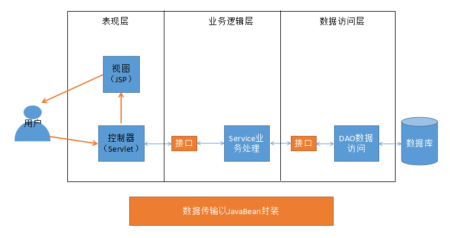
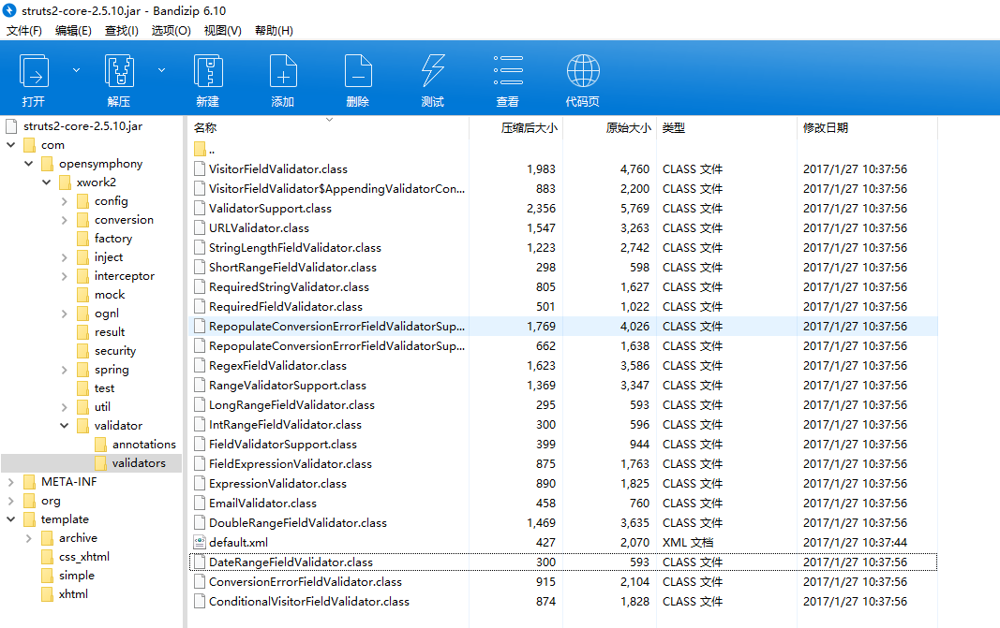

# 1. MVC和三层架构

## 1.1 基本概念

Java Web的开发中，基本原则就是MVC设计模式和使用三层架构进行开发。通过前面简单地介绍了“JSP和Servlet开发的最佳实践”、“MVC”和“三层架构”，我们对这种开发模式有了一定的了解。使用MVC和三层架构，Web开发结构更加清晰，分工清晰，利于合作和测试。

现在我们再详细介绍一下MVC和三层架构。

（1）MVC就是模型（Model）、视图（View）和控制器（Controller）。在目前我们学习的Java Web开发中，JavaBean用于封装模型数据，JSP用于视图展示，Servlet就是控制器（负责处理请求和响应）。如图所示：



即整体请求流程是这样的：用户（浏览器）向控制器发出请求，控制器拿到参数，并进行一系列的后台处理后，将得到的需要响应的数据返回给视图，最后视图显示这些数据给用户浏览。其中每个环节的业务数据，都被JavaBean封装成实体对象，以便后台使用和处理。

但是如果单纯采用MVC的设计模式，则会导致Servlet过于复杂，例如请求转发、业务逻辑和操作数据库的操作等都需要在Servlet类中处理。这样导致Servlet过于庞大、不便维护（就比如把所有的东西都写在JSP页面中类似，很不友好）。

为了解决上述的问题，我们对后台代码进行了三层架构的划分，即分为表现层（即包含了上述的MVC，只是Controller只负责请求转发和调用下一层方法）、业务逻辑层和数据访问层。且业务逻辑层和数据访问层都提供了接口，上层只要关注接口即可，这样更加灵活。如图所示：


MVC的部分并无大变化，只不过将后台处理分层了，这时MVC部分变为表现层，其中的控制器调用业务逻辑层代码，业务逻辑层再调用DAO（Data Access Object）层代码，虽然本质上后台执行的代码没变，但是分层后项目更加清晰易于维护。

目前我们表现层使用的技术是Servlet和JSP、将来，表现层还会使用Struts和SpringMVC这些符合MVC的处理框架，DAO层还会学习Hibernate和MyBatis等框架，而业务逻辑层都是自行写的业务层代码。

## 1.2 开发步骤

以上的分层比较明确了，那么项目是如何开发的呢？建议一定要先把握好下面两点：

1. 先吃透需求，建立Java Bean数据模型。之所以Java Bean这么重要，那是因为实际上项目的开发就是这些模型数据在各层之间“流来流去”。

2. 理解好业务需求，先写好业务层接口。

上述两点非常重要，写完成上面的工作，再写别的就比较容易了，就有头绪了。

在Java Web开发中，各层的包名一般按照如下名称起：

（1）实体的JavaBean存放在com.company.domain中。（也可以用entity，但没有domain常用）。

（2）Service接口存放在：com.company.service中。

（3）Service接口的实现类，存放在：com.company.service.impl中。

（4）DAO接口存放在：com.company.dao中。

（5）DAO接口的实现类，存放在：com.company.dao.impl中。

（6）Servlet控制器存放在：com.company.controller中。

当然还有其他的，例如工具类存放在com.company.util中，测试类存放在com.company.test中，而JSP页面可以放在“WEB-INF/jsp”目录中。

# 2. 用户注册和登录案例

这个案例很简单，就是实现用户注册和登录的小功能。用户注册时要输入姓名、邮箱、生日、密码和确认密码，如果出错，提交后要回显信息（例如用户已存在、重复密码不正确、各个字段不能为空等信息）。注册后可用这个账号登录，登录后显示注册时的信息即可。

由于现在还没学习数据库，因此先将数据保存到xml文件中。其余的部分都用我们的MVC和三层架构来做。

## 2.1 User实体类和UserService编写

按照我们之前的说法，先建立好实体模型和Service的接口。根据业务分析如下：

（1）User实体类中，我们需要保存的数据有：姓名（name, String）、邮箱（email, String）、生日（birthday, Date）和密码（pwd, String）。其中不包含确认密码（因为无需存储，只是网页注册时验证用的）。我们按照合适的类型写好Java Bean，并且放在com.webdemo.domain包下：

```java
package com.webdemo.domain;

import java.io.Serializable;
import java.util.Date;

// 实现序列化接口
public class User implements Serializable {
    private String name; // 姓名
    private String email; // 邮箱
    private Date birthday; // 生日
    private String pwd; // 密码
    // 下面写好getter和setter方法、toString方法

    public String getName() {
        return name;
    }

    public void setName(String name) {
        this.name = name;
    }

    public String getEmail() {
        return email;
    }

    public void setEmail(String email) {
        this.email = email;
    }

    public Date getBirthday() {
        return birthday;
    }

    public void setBirthday(Date birthday) {
        this.birthday = birthday;
    }

    public String getPwd() {
        return pwd;
    }

    public void setPwd(String pwd) {
        this.pwd = pwd;
    }

    @Override
    public String toString() {
        return "User{" +
                "name='" + name + '\'' +
                ", email='" + email + '\'' +
                ", birthday=" + birthday +
                ", pwd='" + pwd + '\'' +
                '}';
    }
}
```

（2）编写UserService接口。由于我们只要注册和登录，所以写好注册和登录的业务方法即可，其中注册的方法会抛出一个我们自定义的“UserAlreadyExistsException”异常。因为本业务中不允许存在相同的用户名，这样，调用者捕获这个异常，如果能捕获到，就说明用户名已经存在了，调用者就能进行相应的处理。

首先在com.webdemo.exception包中创建UserAlreadyExistsException异常：

```java
package com.webdemo.exception;

// 继承Exception异常，使其必须被处理。
public class UserAlreadyExistsException extends Exception {
    
    public UserAlreadyExistsException() {
        super();
    }
    public UserAlreadyExistsException(String message) {
        super(message);
    }

    public UserAlreadyExistsException(Throwable cause) {
        super(cause);
    }

    public UserAlreadyExistsException(String message, Throwable cause) {
        super(message, cause);
    }
}
```

然后在com.webdemo.service包下写UserService接口，建议这些接口写好详细的文档注释，以便被调用：

```java
package com.webdemo.service;

import com.webdemo.domain.User;
import com.webdemo.exception.UserAlreadyExistsException;

public interface UserService {

    /**
     * 用户注册
     * @param user 要注册的用户信息
     * @throws UserAlreadyExistsException 若注册的用户名已经存在了，就抛出此异常
     */
    void register(User user) throws UserAlreadyExistsException;

    /**
     * 用户登录
     * @param name 用户姓名
     * @param pwd 用户密码
     * @return 返回登录的用户信息。如果用户名或密码错误，则返回null。
     */
    User login(String name, String pwd);
}
```

## 2.2 DOM工具类、DAO层和异常处理

DAO层是直接跟数据打交道的，DAO不负责业务逻辑，只负责CRUD。因此DAO接口提供三个方法：findUser(String name)、findUser(String name, String pwd)和saveUser(User user)。类放在com.webdemo.dao包下。

```java
package com.webdemo.dao;

import com.webdemo.domain.User;

public interface UserDao {

    /**
     * 根据姓名查询用户
     * @param name 姓名
     * @return 返回用户信息。如果不存在则返回null
     */
    User findUser(String name);

    /**
     * 根据姓名和密码查询用户
     * @param name 姓名
     * @param pwd 密码
     * @return 返回用户信息。如果不存在则返回null
     */
    User findUser(String name, String pwd);

    /**
     * 保存用户信息
     * @param user 用户信息
     */
    void saveUser(User user);
}
```

在编写DAO的XML实现之前，先写好一个DOM4J的工具类，方便我们操作XML。

这个DOM4JUtil类就放在com.webdemo.util包下：

```java
package com.webdemo.util;

import org.dom4j.Document;
import org.dom4j.DocumentException;
import org.dom4j.io.SAXReader;
import org.dom4j.io.XMLWriter;

import java.io.*;

public class DOM4JUtil {
    // 禁止创建类对象
    private DOM4JUtil() {}

    // student.xml的路径
    public static String xmlFilePath;

    static {
        // 设置student.xml的路径（保存在字节码classes目录下）
        xmlFilePath = DOM4JUtil.class.getResource("/student.xml").getPath();
    }

    // 返回Document对象
    public static Document getDocument() throws DocumentException {
        SAXReader reader = new SAXReader();
        return reader.read(xmlFilePath);
    }
    
    // 将Document对象写入到文件中
    public static void write2XML(Document document) throws IOException {
        OutputStream out = new FileOutputStream(xmlFilePath);
        XMLWriter writer = new XMLWriter(out, OutputFormat.createPrettyPrint()
);
        writer.write(document);
        writer.close();
    }
}
```

说明，工具类出现的异常既可以抛出又可以在工具类中处理，这里选择抛出。

现在，实现UserDao接口，实现类为“UserDaoXMLImpl”，表示是XML的DAO，放入com.webdemo.dao.impl包下。类代码如下：

```java
package com.webdemo.dao.impl;

import com.webdemo.dao.UserDao;
import com.webdemo.domain.User;
import com.webdemo.util.DOM4JUtil;
import org.dom4j.Document;
import org.dom4j.DocumentException;
import org.dom4j.Element;
import org.dom4j.Node;
import java.io.IOException;
import java.text.ParseException;
import java.text.SimpleDateFormat;

public class UserDaoXMLImpl implements UserDao {
    @Override
    public User findUser(String name) {
        // 这里是根据name属性找到user节点，并封装成User对象返回。
        // 由于要处理异常，把下面的代码用try...catch包含起来处理。
        try {
            Document document = DOM4JUtil.getDocument();
            Node node = document.selectSingleNode("//user[@name='" + name + "']"); // 使用XPath语法
            if (node == null) {
                return null; // 找不到直接返回null
            } else {
                // 封装对象
                User user = new User();
                user.setName(node.valueOf("@name"));
                user.setPwd(node.valueOf("@pwd"));
                user.setEmail(node.valueOf("@email"));
                SimpleDateFormat sdf = new SimpleDateFormat("yyyy-MM-dd");
                user.setBirthday( sdf.parse(node.valueOf("@birthday")) );; // 转成Date对象存储
                return user;
            }
        } catch (ParseException | DocumentException e) {
            throw new RuntimeException(e);
        }
    }

    @Override
    public User findUser(String name, String pwd) {
        // 实现和上述方法类似
        try {
            Document document = DOM4JUtil.getDocument();
            Node node = document.selectSingleNode("//user[@name='" + name + "' and @pwd='" + pwd + "']");
            if (node == null) {
                return null; // 找不到直接返回null
            } else {
                // 封装对象
                User user = new User();
                user.setName(node.valueOf("@name"));
                user.setPwd(node.valueOf("@pwd"));
                user.setEmail(node.valueOf("@email"));
                SimpleDateFormat sdf = new SimpleDateFormat("yyyy-MM-dd");
                user.setBirthday( sdf.parse(node.valueOf("@birthday")) );; // 转成Date对象存储
                return user;
            }
        } catch (ParseException | DocumentException e) {
            throw new RuntimeException(e);
        }
    }

    @Override
    public void saveUser(User user) {
        // 保存user对象
        SimpleDateFormat sdf = new SimpleDateFormat("yyyy-MM-dd");
        try {
            Document document = DOM4JUtil.getDocument();
            Element root = document.getRootElement();
            root.addElement("user")
                    .addAttribute("name", user.getName())
                    .addAttribute("pwd", user.getPwd())
                    .addAttribute("email", user.getEmail())
                    .addAttribute("birthday", sdf.format( user.getBirthday() ));
            DOM4JUtil.write2XML(document);
        } catch (IOException | DocumentException e) {
            throw new RuntimeException(e);
        }
    }
}
```

这里就要讲异常转义与异常链。

### 2.2.1 关于异常

编程时如果需要处理异常，一般有两种方法：抛出异常和自行try-catch处理。至于选择哪一种方式，要看该异常是否应该由上层调用者处理，如果上层调用者也无法解决这个异常，则可考虑自行处理。如果在编写工具类时出现异常，抛出和处理异常都是可行的。

例如，我们上面在DAO层遇到异常时，选择了自行处理。为什么呢？因为显然上层的Service业务层是无法解决掉这个异常的，DAO层如果出现了这些异常，说明是DAO层代码或者是底层文件配置本身有问题，这需要修改DAO层代码或底层文件解决，而只关心业务的Service不应该解决该异常，因此DAO层不应该抛出这个异常。

在处理异常时，会涉及到异常转义与转义链。

什么是异常转义？将Exception异常转化成RuntimeException异常就是异常转义。比如上面的ParseException等是Exception异常，而Exception异常时必须要处理的，我们在catch中，把这些异常转成RuntimeException运行时异常抛出了，程序如果运行到这里就会因为这个异常而终止。但如果不转成RuntimeException运行时异常抛出，直接“throw e”的话，还是需要你处理“throw e”这个“异常”，是没办法搞定的，因此需要异常转义。当然，如果你不在catch中抛出运行时异常的话，程序是不会终止的，会经过异常处理继续走下去。代码中之所以抛出异常终止运行，是因为出现了这个异常不得不终止程序，因为该异常导致后续都无法进行，是致命的，开发中谨慎处理。

上面讲了异常转义，但如果仅仅使用“throw new RuntimeException()”的话，输出的异常信息是不详细的，因为我们的新的RuntimeException异常对象隐藏了具体的异常。例如下述代码：

```java
package ex.demo;

import java.text.ParseException;
import java.text.SimpleDateFormat;

public class ExMain {
    public static void main(String[] args) throws ParseException {
        testEx();
    }

    public static void testEx() {
        SimpleDateFormat sdf = new SimpleDateFormat("yyyy-MM-dd");
        try {
            sdf.parse("2017年08月09日");
        } catch (ParseException e) {
            throw new RuntimeException();
        }
    }
}
```

运行后输出的异常信息是：

```
Exception in thread "main" java.lang.RuntimeException
    at ex.demo.ExMain.testEx(ExMain.java:16)
    at ex.demo.ExMain.main(ExMain.java:8)
```

从异常信息中我们只能看到粗略的“RuntimeException”异常。为了能显示原本详细的、具体的异常，这时，应该把异常对象传入RuntimeException对象中，即这样写：

```java
throw new RuntimeException(e);
```

这样再运行程序，就会输出下面的异常信息：

```
Exception in thread "main" java.lang.RuntimeException: java.text.ParseException: Unparseable date: "2017年08月09日"
    at ex.demo.ExMain.testEx(ExMain.java:16)
    at ex.demo.ExMain.main(ExMain.java:8)
Caused by: java.text.ParseException: Unparseable date: "2017年08月09日"
    at java.text.DateFormat.parse(DateFormat.java:366)
    at ex.demo.ExMain.testEx(ExMain.java:14)
    ... 1 more
```

这样我们就能很好地定位到出现异常的地方，并且知道具体是什么异常。上述的异常信息形成的就是“异常链”，能够一层层地帮助我们查找异常。

## 2.3 Service层实现和单元测试

DAO已经完成了，现在在包com.webdemo.service.impl中实现UserServiceImpl类（不需要用UserServiceXMLImpl这个类名，因为业务层基本和数据访问无关了，所以不用指明XML）。其中调用DAO层，只要创建UserDao成员变量，用UserDaoXMLImpl类创建这个变量的示例即可使用（注意，接收类型是接口，这样接口才有意义，以后学完数据库后继续改进就会知道）。代码如下：

```java
package com.webdemo.service.impl;

import com.webdemo.dao.UserDao;
import com.webdemo.dao.impl.UserDaoXMLImpl;
import com.webdemo.domain.User;
import com.webdemo.exception.UserAlreadyExistsException;
import com.webdemo.service.UserService;

public class UserServiceImpl implements UserService {

    // 维护UserDao成员变量
    UserDao userDao = new UserDaoXMLImpl();

    @Override
    public void register(User user) throws UserAlreadyExistsException {
        // 首先，如果user是null，直接抛出非法参数异常。这是JDK提供的异常类型，可以直接使用。
        if (user == null) {
            throw new IllegalArgumentException("参数user不能为null");
            // 说明：虽然该方法签名声明的是抛出UserAlreadyExistsException，但方法体中主动抛出其他类型的异常也是没问题的。
            // 程序走到这里就会报出异常并停止，在这里这样处理并无不妥，因为参数为null这里显然是非法的，直接出错即可。
            // 这是调用者自然要注意的问题。而签名上的UserAlreadyExistsException则是提示调用者应该处理此异常，有此异常说明用户名重复，处理后程序也能正常运行。
        }
        // 查询用户名是否存在，如果存在则抛出UserAlreadyExistsException异常，否则保存user即可。
        if ( userDao.findUser(user.getName()) != null ) {
            throw new UserAlreadyExistsException("用户名：\"" + user.getName() + "\" 已经存在");
        } else {
            userDao.saveUser(user);
        }
    }

    @Override
    public User login(String name, String pwd) {
        return userDao.findUser(name, pwd);
    }
}
```

写好了Service，我们可对它进行单元测试。单元测试能保证底层代码的正确性。实际上每一层都应该进行测试，这里我们只测试service层。

新建一个UserServiceImplTest类，放在com.webdemo.test包下。测试之前，先在src目录下新建一个student.xml文件，内容为：

```xml
<?xml version="1.0" encoding="UTF-8" ?>
<users />
```

以便测试时能在classes字节码目录下找到资源文件。测试代码为：

```java
package com.webdemo.test;

import com.webdemo.domain.User;
import com.webdemo.exception.UserAlreadyExistsException;
import com.webdemo.service.UserService;
import com.webdemo.service.impl.UserServiceImpl;
import org.junit.Assert;
import org.junit.Test;
import java.util.Date;

public class UserServiceImplTest {

    // 维护UserService成员变量
    UserService userService = new UserServiceImpl();

    @Test
    public void registerTest() throws UserAlreadyExistsException {
        User user = new User();
        user.setName("张三");
        user.setBirthday(new Date());
        user.setEmail("zhangsan@demo.com");
        user.setPwd("123456");
        userService.register(user);
    }

    // 添加用户名重复就会抛出UserAlreadyExistsException异常。
    // 使用JUnit也能测试异常的发生
    @Test(expected = UserAlreadyExistsException.class) // 期望的异常
    public void registerTest2() throws UserAlreadyExistsException {
        User user = new User();
        user.setName("张三");
        user.setBirthday(new Date());
        user.setEmail("zhangsan@demo.com");
        user.setPwd("123456");
        userService.register(user);
    }

    // 测试登录
    @Test
    public void loginTest() {
        User zsUser = userService.login("张三", "123456");
        Assert.assertNotNull(zsUser); // 断言zsUser不为null
        User lsUser = userService.login("李四", "123456");
        Assert.assertNull(lsUser); // 断言lsUser为null
    }
}
```

上述测试运行成功，可以查看classes目录下的student.xml是否成功更改了。

## 2.4 表现层代码

现在就剩表现层的代码没有开发了。

说明：现在这些JSP都直接放在了开发目录下，没有放在WEB-INF文件夹下。对于Servlet类，放入了包com.webdemo.web.controller中。

（1）先完成首页的开发。如果是商城的首页，一般会显示商品信息，如果用户没有登录，就会提供“登录”和“注册”按钮，如果用户登录了，就会显示用户信息。

以后，我们会将登录信息（User对象）保存在“session.currentUser”中，那么首页index.jsp可以这样写：

```jsp
<%@ taglib prefix="c" uri="http://java.sun.com/jsp/jstl/core" %>
<%@ page contentType="text/html;charset=UTF-8" language="java" %>
<html>
<head>
    <title>Title</title>
</head>
<body>
    <c:choose>
        <c:when test="${empty sessionScope.currentUser}">
            <%-- 显示登录和注册按钮 --%>
            <a href="${pageContext.request.contextPath}/login.jsp">登录</a>
            <a href="${pageContext.request.contextPath}/register.jsp">注册</a>
        </c:when>
        <c:otherwise>
            <%-- 显示登录信息和注销按钮 --%>
            欢迎你：${sessionScope.currentUser.name}
            <a href="${pageContext.request.contextPath}/logoutServlet">注销</a>
        </c:otherwise>
    </c:choose>
</body>
</html>
```

（2）用户的登录和注销。

用户登录的jsp页面（遵循约定优于配置的原则，表单属性名和User属性名一致）：

```jsp
<%@ taglib prefix="c" uri="http://java.sun.com/jsp/jstl/core" %>
<%@ page contentType="text/html;charset=UTF-8" language="java" %>
<html>
<head>
    <meta charset="UTF-8" />
    <title>首页</title>
</head>
<body>
    <form action="${pageContext.request.contextPath}/loginServlet" method="POST">
        <%-- 约定优于配置的开发原则：表单的name属性值和实体的属性名称一致 --%>
        <c:if test="${!empty loginError}">
            <p>用户名或密码错误</p>
        </c:if>
        <p>用户名： <input type="text" name="name" /></p>
        <p>密码：<input type="password" name="pwd" /></p>
        <p><input type="submit" /> </p>
    </form>

</body>
</html>
```

对应的登录Servlet：

```java
package com.webdemo.web.controller;

import com.webdemo.domain.User;
import com.webdemo.service.UserService;
import com.webdemo.service.impl.UserServiceImpl;

import javax.servlet.ServletException;
import javax.servlet.annotation.WebServlet;
import javax.servlet.http.HttpServlet;
import javax.servlet.http.HttpServletRequest;
import javax.servlet.http.HttpServletResponse;
import java.io.IOException;

@WebServlet(urlPatterns = "/loginServlet")
public class LoginServlet extends HttpServlet {

    UserService userService = new UserServiceImpl();

    @Override
    protected void doPost(HttpServletRequest req, HttpServletResponse resp) throws ServletException, IOException {
        req.setCharacterEncoding("UTF-8");

        // 获得用户名和密码
        String name = req.getParameter("name");
        String pwd = req.getParameter("pwd");
        // 查询用户
        User user = userService.login(name, pwd);
        if (user != null) {
            req.getSession().setAttribute("currentUser", user);
            // 返回登录页面
            resp.sendRedirect(req.getContextPath() + "/index.jsp"); // 重定向要使用应用路径。而下面的转发不需要。
        } else {
            req.setAttribute("loginError", "用户名或密码错误");
            req.getRequestDispatcher("/login.jsp").forward(req, resp);
        }
    }
}
```

那么，现在也把注销的Servlet代码做了：

```java
package com.webdemo.web.controller;

import javax.servlet.ServletException;
import javax.servlet.annotation.WebServlet;
import javax.servlet.http.HttpServlet;
import javax.servlet.http.HttpServletRequest;
import javax.servlet.http.HttpServletResponse;
import java.io.IOException;

@WebServlet(urlPatterns = "/logoutServlet")
public class LogoutServlet extends HttpServlet {

    @Override
    protected void doGet(HttpServletRequest req, HttpServletResponse resp) throws ServletException, IOException {
        req.getSession().removeAttribute("currentUser"); // 删除session
        // 当然也可以req.getSession().invalidate(); 但是这样太“暴力”了
        resp.sendRedirect(req.getContextPath() + "/index.jsp"); // 返回首页
    }
}
```

（3）用户的注册。这是重点关注的功能。

在注册页面要提交用户信息，但是表单的信息和User类有区别，不是完全一样的。因此我们新建一个com.webdemo.web.bean包，此包中专门存放与表单相关的JavaBean类，用于数据传输。总之Java Web开发中需要用到很多不同用途的Java Bean。

这个Java Bean中数据类型都是String的，因为表单传递过来的都是字符串，并且在类中再提供两个小功能：

1. 提供一个验证方法，进行各个属性的验证，以确定表单提交无误；

2. 出现错误时，需要回显提交的信息和错误提示，因此在类中也封装错误消息属性，为一个Map对象，能够匹配表单的每个属性。

因此这个UserFormBean的类代码如下：

```java
package com.webdemo.web.bean;

import java.io.Serializable;
import java.text.DateFormat;
import java.text.ParseException;
import java.text.SimpleDateFormat;
import java.util.HashMap;
import java.util.Map;

public class UserFormBean implements Serializable {
    // 这里就是和表单提交的参数对应了。这里要包含重复密码这个属性
    // 并且，由于是表单数据，这些数据类型都为设置为String类型(包括生日)。
    private String name; // 姓名
    private String email; // 邮箱
    private String birthday; // 生日
    private String pwd; // 密码
    private String rePwd; // 重复密码

    // 由于提交的User表单数据需要验证和回显错误信息等，因此这里封装一个error错误消息
    // 类型是Map<String, String>，key-value，一个字段就可以对应一个错误消息
    // 必须要创建出这个对象。否则这个成员是null。因为一开始的时候，并没有错误消息封装，故而如果不创建对象，会一致是null，使用时就出现空指针异常
    private Map<String, String> errorMap = new HashMap<>(); // 错误消息

    public String getName() {
        return name;
    }

    public void setName(String name) {
        this.name = name;
    }

    public String getEmail() {
        return email;
    }

    public void setEmail(String email) {
        this.email = email;
    }

    public String getBirthday() {
        return birthday;
    }

    public void setBirthday(String birthday) {
        this.birthday = birthday;
    }

    public String getPwd() {
        return pwd;
    }

    public void setPwd(String pwd) {
        this.pwd = pwd;
    }

    public String getRePwd() {
        return rePwd;
    }

    public void setRePwd(String rePwd) {
        this.rePwd = rePwd;
    }

    public Map<String, String> getErrorMap() {
        return errorMap;
    }

    public void setErrorMap(Map<String, String> errorMap) {
        this.errorMap = errorMap;
    }

    @Override
    public String toString() {
        return "UserFormBean{" +
                "name='" + name + '\'' +
                ", email='" + email + '\'' +
                ", birthday=" + birthday +
                ", pwd='" + pwd + '\'' +
                ", rePwd='" + rePwd + '\'' +
                ", errorMap=" + errorMap +
                '}';
    }

    // 在这个实体类中加入字段的验证，如果出现错误，就在errorMap中添加消息，以便回显
    public boolean validate() {
        // name验证
        if (name.isEmpty()) {
            errorMap.put("name", "请输入用户名");
        }
        // 密码验证
        if (pwd.isEmpty()) {
            errorMap.put("pwd", "请输入密码");
        } else if (!pwd.matches("\\d{3,8}")) {
            errorMap.put("pwd", "密码必须是3-8位数字");
        }
        // 重复密码验证
        if (!rePwd.equals(pwd)) {
            errorMap.put("rePwd", "两次密码不一致");
        }
        // 邮箱验证
        if (email.isEmpty()) {
            errorMap.put("email", "请输入邮箱");
        } else if (!email.matches("\\b^['_a-z0-9-\\+]+(\\.['_a-z0-9-\\+]+)*@[a-z0-9-]+(\\.[a-z0-9-]+)*\\.([a-z]{2,6})$\\b")) {
            errorMap.put("email", "请输入正确的邮箱");
        }
        // 验证输入日期
        DateFormat df = new SimpleDateFormat("yyyy-MM-dd");
        if (birthday.isEmpty()) {
            errorMap.put("birthday", "请输入生日");
        } else {
            try {
                df.parse(birthday);
            } catch (ParseException e) {
                // 出现异常说明生日日期格式不符合要求
                errorMap.put("birthday", "生日日期格式必须满足yyyy-MM-dd的要求");
                throw new RuntimeException(e);
            }

        }
        // 最后返回值的时候，如何知道是否验证成功呢？实际上我们只要返回errorMap是否为空即可。
        // 因为所有验证情况都在上面考虑过了，如果验证不成功，errorMap中一定不是空的
        return errorMap.isEmpty();
    }

}
```

上述验证时使用了一个邮箱的正则表达式，这是经过验证的表达式，是在struts2框架中找到的，以后如果有邮箱验证使用这个验证即可。关于如何找到的，见本章附录。

接下来写RegisterServlet类。其中多次用到BeanUtils这个工具类用于属性的拷贝，因为要把UserFormBean拷贝到User中，等等。代码如下：

```java
package com.webdemo.web.controller;

import com.webdemo.domain.User;
import com.webdemo.exception.UserAlreadyExistsException;
import com.webdemo.service.UserService;
import com.webdemo.service.impl.UserServiceImpl;
import com.webdemo.util.SimpleDateConverter;
import com.webdemo.web.bean.UserFormBean;
import org.apache.commons.beanutils.BeanUtils;
import org.apache.commons.beanutils.ConvertUtils;
import org.apache.commons.beanutils.converters.DateConverter;
import org.apache.commons.lang3.StringUtils;

import javax.servlet.ServletException;
import javax.servlet.annotation.WebServlet;
import javax.servlet.http.HttpServlet;
import javax.servlet.http.HttpServletRequest;
import javax.servlet.http.HttpServletResponse;
import java.io.IOException;
import java.lang.reflect.InvocationTargetException;
import java.util.Date;

// 注册时编码的重点
@WebServlet(urlPatterns = "/registerServlet")
public class RegisterServlet extends HttpServlet {

    UserService userService = new UserServiceImpl();

    @Override
    protected void doPost(HttpServletRequest req, HttpServletResponse resp) throws ServletException, IOException {
        String encoding = "UTF-8";
        req.setCharacterEncoding(encoding);
        resp.setContentType("text/html;charset=" + encoding);

        // 获取表单数据，封装到UserFormBean这个表单对象中。
        // 由于约定，表单提交的属性名和User属性名一致，因此可以使用BeanUtils将表单的提交参数封装到UserFormBean中。
        UserFormBean userFormBean = new UserFormBean();
        try {
            BeanUtils.populate(userFormBean, req.getParameterMap());
            // 验证数据
            if (!userFormBean.validate()) {
                // 不通过则回显数据
                req.setAttribute("userFormBean", userFormBean);
                req.getRequestDispatcher("/register.jsp").forward(req, resp);
                return ; // 显式地指明方法结束了。程序员一看就知道执行到这里该分支结束了
            } else {
                // 可以保存User数据。
                User user = new User();
                // 先将userFormBean对象的属性数据拷贝到真正的User对象中。
                // 我们还是使用BeanUtils。
                // 但有一点，UserFormBean里的数据都是String类型的，
                // 对于基本类型，BeanUtils自动帮我们解决，但其中有一个birthday时间类型，这需要我们注册一个转换器。
                ConvertUtils.register(new SimpleDateConverter(), Date.class);
                // 拷贝对象
                BeanUtils.copyProperties(user, userFormBean); // 参数1是拷贝的目标对象，参数2是拷贝的原始对象数据
                // 调用service保存数据
                try {
                    userService.register(user);
                    // 保存成功
                    resp.getWriter().write("保存成功！2秒后跳转到首页");
                    resp.setHeader("Refresh", "2;URL=" + req.getContextPath() + "/index.jsp");
                } catch (UserAlreadyExistsException e) {
                    // 说明用户已经存在。进行数据回显和提示
                    userFormBean.getErrorMap().put("name", "用户名已存在");
                    req.setAttribute("userFormBean", userFormBean);
                    req.getRequestDispatcher("/register.jsp").forward(req, resp);
                    return;
                }
            }
        } catch (IllegalAccessException | InvocationTargetException e) {
            throw new RuntimeException(e);
        }
    }
}
```

其中还用到了一个自定义的SimpleDateConverter日期转换类，用于BeanUtils中将字符串转换成Date对象。它应该放入com.webdemo.utils包中，代码如下：

```java
package com.webdemo.util;

import org.apache.commons.beanutils.Converter;

import java.text.DateFormat;
import java.text.ParseException;
import java.text.SimpleDateFormat;

public class SimpleDateConverter implements Converter {
    @Override
    public <T> T convert(Class<T> aClass, Object obj) {
        try {
            DateFormat df = new SimpleDateFormat("yyyy-MM-dd");
            return (T) df.parse(obj.toString());
        } catch (ParseException e) {
            return null;
        }
    }
}
```

最后，register.jsp页面代码如下：

```jsp
<%@ page contentType="text/html;charset=UTF-8" language="java" %>
<html>
<head>
    <meta charset="UTF-8" />
    <title>注册</title>
</head>
<body>
    <form action="${pageContext.request.contextPath}/registerServlet" method="POST">
        <%-- 每行中，value属性值中和最后面的EL表达式是为了显示可能的回显信息和错误信息 --%>
        <p> 姓名：<input type="text" name="name" value="${userFormBean.name}"/> ${userFormBean.errorMap.name} </p>
        <p> 生日：<input type="date" name="birthday" value="${userFormBean.birthday}"/> ${userFormBean.errorMap.birthday} </p>
        <p> 邮箱：<input type="text" name="email" value="${userFormBean.email}"/> ${userFormBean.errorMap.email} </p>
        <p> 密码：<input type="password" name="pwd" value="${userFormBean.pwd}" /> ${userFormBean.errorMap.pwd} </p>
        <p> 确定密码：<input type="password" name="rePwd" value="${userFormBean.rePwd}" /> ${userFormBean.errorMap.rePwd} </p>
        <p> <input type="submit"> </p>
    </form>
</body>
</html>
```

就此，项目就开发完毕了。运行项目即可运行流程。需要说明的是，每次重新部署项目，项目中的文件就会覆盖Tomcat中的文件，这样student.xml文件可能就会被覆盖，这样之前注册的数据就消失了。在真实开发中，数据都是保存在数据库中的，重新部署项目不会丢失。因此如果项目有上传文件的需要，建议将文件保存在特定的服务器目录中。

说明：本项目完成代码已经上传在Github中，地址是：https://github.com/zhang13690/SimpleJavaWebDemo/tree/xml。

# 3. 附录

## 3.1 在Struts2中找到验证邮箱正则表达式

以struts2.5.10版本为例（其他版本可能不同）。在官网下载完整的struts2.5.10资源。
在struts2.5.10.jar中，找到如下目录：



打开其中的default.xml文件，发现有：

```xml
<validator name="email" class="com.opensymphony.xwork2.validator.validators.EmailValidator"/>
```

这个配置，因此我们在源码目录“src\core\src\main\java\com\opensymphony\xwork2\validator\validators”中，找到EmailValidator.java的源码，其中就有验证 Email的正则表达式。为：

```
\b^['_a-z0-9-\+]+(\.['_a-z0-9-\+]+)*@[a-z0-9-]+(\.[a-z0-9-]+)*\.([a-z]{2,6})$\b
```

这个就是“正规”的验证email的正则表达式。

## 3.2 关于SimpleDateFormat的日期字符串解析

以前我们都是用SimpleDateFormat来进行日期时间的解析与格式化的。但是，SimpleDateFormat在解析方便有一个小问题。

如果将“2017年2月31号”解析：

```java
DateFormat df = new SimpleDateFormat("yyyy年MM月dd日");
Date date = df.parse("2017年2月31日");
System.out.println(date);
```

得到的结果是：Fri Mar 03 00:00:00 CST 2017，即解析成了2017年3月3日的日期。

同样，别的“不正常”的日期也能解析，只要符合指定的“yyyy-MM-dd”即可，解析时自动加上“超出”的时间。这显然不符合一些要求。如果想用严格的日期时间解析怎么办呢？

我们可以使用Apache Commons下提供的“Commons Lang 3”库。该库是Apache为Java提供的lang包的扩展功能，其中有很多常用的功能。其中在“org.apache.commons.lang3.time”包下有DateUtils类。这个类中就提供了很多方法，例如解析日期时间字符串、操作Date对象等。

介绍两个解析的方法：

1. public static Date parseDate(String str, String... parsePatterns) throws ParseException;

2. public static Date parseDateStrictly(String str, String... parsePatterns) throws ParseException;

这两个方法都用于解析日期时间字符串，参数1就是要解析的字符串，参数2是一个可变数组，传递支持的解析格式即可。也就是说，该方法支持多种解析格式，这为我们提供了很大的方便，并且第二个带有Strictly的方法就是解析的严格模式，如果遇到“2017年2月31号”这种日期将会抛出“ParseException”异常。举例：

```java
package ex.demo;

import org.apache.commons.lang3.time.DateUtils;

import java.text.DateFormat;
import java.text.ParseException;
import java.text.SimpleDateFormat;
import java.util.Date;

public class ExMain {
    public static void main(String[] args) throws ParseException {
        Date normal = DateUtils.parseDateStrictly("2017年9月30日", "yyyy-MM-dd", "yyyy年MM月dd日");
        System.out.println(normal);

        Date abnormal = DateUtils.parseDateStrictly("2017年2月31日", "yyyy年MM月dd日"); // 会抛出异常
        System.out.println(abnormal);
    }
}
```

因此学会使用API为我们提供了很大便利。Common Lang 3下还有我们很多常用的功能，例如StringUtils.isBlank()、StringUtils.isEmpty()、DateFormatUtils.format()等等。

Java平台生态强大，有众多类库可以选择使用。Apache Commons下的组件库就是专门用Java提供了实用类库，大家可以学习，也可以学习Google开发的Guava，也是为Java基本扩展的工具类。

在实际前后端开发的数据验证中，最好是前后端都进行数据的验证，但是有时只做前端数据的验证，比如使用前端的JS日期控件确保用户输入的日期格式是正确的，这样后端有时就无需再处理了，这是一般的简单的情况。因为面面俱到虽然安全性高，但也必然带来开发效率和执行效率的降低。