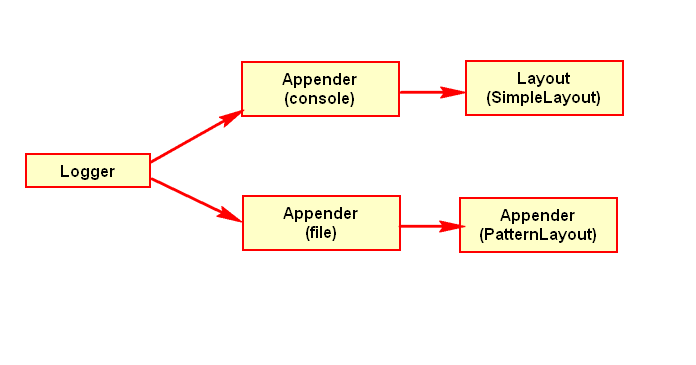
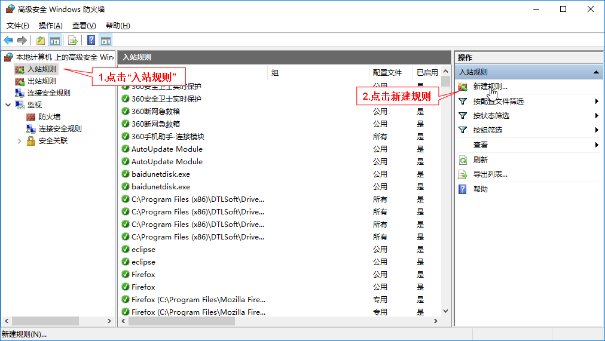
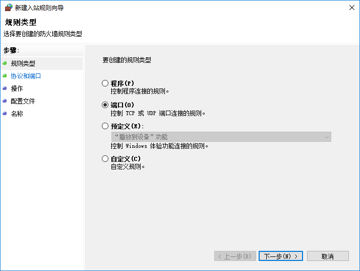
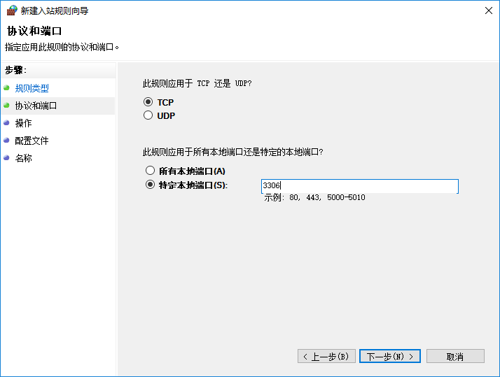
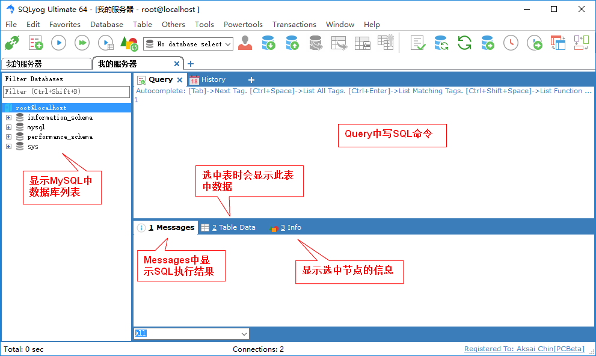
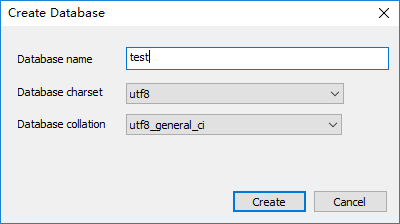

# 1. 数据库介绍和MySQL安装

## 1.1 数据库的概念和一些说明

　　顾名思义，数据库就是“存储数据的仓库”。数据的存储非常重要，可以说，数据就是企业的灵魂，如银行储户信息的存储、员工资料的存储、电商网站商品信息和订单信息的存储等等。我们以后学习的Java EE也是跟数据库打交道。

　　在数据库软件出现之前，程序中单纯用文件来存储需要永久保留的信息，但是当数据量大、并发性高等情况出现时，单纯用文件来存储信息会遇到很多问题。这才导致数据库的产生。数据库专门用于有效的管理数据，关于更多的内容，大家应该阅读书籍《数据库系统概念（本科教学版）》的前几章。

　　现在主流的大部分数据库都是关系型数据库，即数据存放在二维表中，然后表与表之间有一定的关系。通过数据库存储数据，我们就能使用SQL语言来准确迅速的操作数据表的数据和查询数据表的数据。因此我们也要学习SQL语句。

　　SQL语句是根据标准使用的，但是不同的数据库软件还是有微小的区别。常见的关系型数据库有：Oracle、SQL Server和MySQL。Oracle数据库是甲骨文公司开发的大型数据库，适合大型应用；SQL Server是微软开发的数据库软件，与Windows平台结合较好；MySQL的社区（Community）版是免费开源的产品，适合中小企业使用。

　　我们以MySQL数据库产品为例，推荐先学习《MySQL数据库应用：从入门到精通》这个入门书。本教程重点在于介绍用Java连接数据库来获取数据库中的数据，因此下面针对MySQL，讲解MySQL的安装，并且讲解在MySQL中使用常用的SQL语句和一些技术点，相当于是总结使用。还是推荐大家先学习《数据库系统概念》（只看前面几章即可，毕竟后面的太难，实际中也用不到）和《MySQL数据库应用：从入门到精通》，如果有数据库知识，可直接往下看。不排除以后单独推出数据库的教程，到时再做修改。

## 1.2 MySQL的安装

　　推荐在镜像网站上下载MySQL的Windows 64位MSI安装版本。地址：http://mirrors.sohu.com/mysql 。我们选择MySQL-5.7目录中的文件“mysql-5.7.17-winx64.msi”下载安装。这是目前的最新版本。

　　点击msi文件进行安装，注意选择合适的安装位置（我选择的位置是D:\DevTools\MySQL）。这里的安装过程只相当于解压文件了，具体的安装还需要我们手动执行。步骤如下：

　　（1）进入安装目录，在这里我就进入D:\DevTools\MySQL目录。将MySQL资源中提供的my.ini配置文件复制到此目录（此my.ini文件是按照官方安装工具安装后提取的，之所以我们这里不使用官方的一整套安装工具，是因为官方安装工具中很多东西是我们不需要的），并且在此目录新建一个文件夹名为“Uploads”。注意，如果你选择的安装目录在其他位置，则应修改my.ini文件中凡是出现“D:/DevTools/MySQL”的地方，换成自己的安装目录。

　　（2）进入MySQL安装目录的bin目录，并在此目录用“管理员”身份打开控制台。

　　（3）在控制台执行如下命令：mysqld --initialize --user=mysql --console。执行成功会出现以下信息：

```
2017-02-06T04:10:53.255285Z 0 [Warning] 'NO_ZERO_DATE', 'NO_ZERO_IN_DATE' and 'ERROR_FOR_DIVISION_BY_ZERO' sql modes should be used with strict mode. They will be merged with strict mode in a future release.
2017-02-06T04:10:55.472257Z 0 [Warning] InnoDB: New log files created, LSN=45790
2017-02-06T04:10:55.972246Z 0 [Warning] InnoDB: Creating foreign key constraint system tables.
2017-02-06T04:10:56.175407Z 0 [Warning] No existing UUID has been found, so we assume that this is the first time that this server has been started. Generating a new UUID: 41fff59c-ec22-11e6-a377-201a068ed52e.
2017-02-06T04:10:56.206670Z 0 [Warning] Gtid table is not ready to be used. Table 'mysql.gtid_executed' cannot be opened.
2017-02-06T04:10:56.222258Z 1 [Note] A temporary password is generated for root@localhost: hG#emkEaK1*:
```

　　注意最后一行，“A temporaty password is generated for root@localhost:...”，意思是为root用户用于生成了一个临时的密码，冒号后面就是生成的密码，要记住他，下面需要用到。而root就是MySQL数据库中的“超级管理员账户”，拥有最高的权限，需要谨慎对待。

　　（4）继续执行命令：mysqld --install MySQL，即安装MySQL服务。

　　（5）执行命令：net start MySQL：用于启动MySQL服务，只有启动了MySQL服务，才能成功连接MySQL服务器进行操作。

　　（6）使用root用户名和密码登录数据库。执行：mysql –u root -p，随后根据提示输入刚才生成的密码，即可登录系统。输出如下：

```
D:\DevTools\MySQL\bin>mysql -u root -p
Enter password: ************
Welcome to the MySQL monitor.  Commands end with ; or \g.
Your MySQL connection id is 3
Server version: 5.7.17-log MySQL Community Server (GPL)

Copyright (c) 2000, 2016, Oracle and/or its affiliates. All rights reserved.

Oracle is a registered trademark of Oracle Corporation and/or its
affiliates. Other names may be trademarks of their respective
owners.

Type 'help;' or '\h' for help. Type '\c' to clear the current input statement.

mysql>
```

　　光标会等待在mysql>的后面，等待输入指令以便操作数据库。如果想退出MySQL的“命令行”，直接输入exit回车即可。至此，MySQL已经安装成功。下一步需要修改临时的root密码。这时是在MySQL“命令行”中执行命令。

　　（7）修改root密码需要执行下面一系列操作：

　　执行命令：set password = password('你的密码'); 此命令将会设置root密码为自定义的密码。必须在行末输入分号或者\g才能执行，因为MySQL默认把分号或者\g当做一条语句的结束。

　　执行命令：flush privileges; 用来刷新权限以使设置生效。

　　这样，root密码就修改成功，可用exit命令退出MySQL，再重新用新密码登录。

## 1.3 允许外界远程连接本机MySQL

　　下面设置root用户可远程登录本机MySQL，并具有所有的权限。因为在有些时候，当本机作为服务器时，用其他客户机远程连接本机的MySQL进行操作，这将会非常方便。

　　操作的步骤如下：

　　（1）在MySQL中执行下面两条语句

```sql
grant all privileges on *.* to 'root'@'%' identified by '你的密码' with grant option;
```
　　和
```sql
flush privileges; #刷新权限。
```

　　说明：“grant all privileges on”用于更改用户对应某数据库表的远程权限。语法模板是：

```sql
grant all privileges on 数据库名.表名 to '用户名'@'IP地址' identified by '密码' with grant option;
```

　　在“数据库名”和“表名”中使用“*”表示针对所有的数据库或表；“用户名”表示要赋给远程访问权限的用户名称；“IP地址”表示可以远程访问的IP地址，其中使用“%”表示针对的是所有的地址；密码就是要赋给远程访问权限的用户对应使用的密码。再例如：

```sql
grant all privileges on testdb.* to 'xlb'@'172.16.52.225' identified by '123456' with grant option;
```

　　执行完后，当然还需要注意使用flush privileges;刷新下权限。

　　最后需要注意：最好注释掉MySQL配置文件（my.ini或my.cnf）中的“bindaddress”和“skip-networking”参数设置。因为“bindaddress”用于设定哪些IP地址被配置，使得MySQL服务器只回应这些IP地址的请求；而“skip-networking”参数将导致所有TCP/IP端口没有被监听，也就是说除了本机，其他客户端都无法用网络连接到本MySQL服务器。因此应该注释掉这些参数。

　　（2）在Windows上，还需要设置防火墙，否则Windows的防火墙默认阻止外界访问MySQL监听的3306端口。设置方法如下：

　　打开“高级安全Windows防火墙”程序。打开方式如下：控制台执行“firewall.cpl”命令，将打开“Windows防火墙”，然后点击右侧的“高级设置”即可打开。



　　需要在“高级安全Windows防火墙”中新建入站规则，即在“入站规则”中“新建规则”（因为目的是允许外界通过3306端口访问本机的MySQL，因此是“入站”）：



　　在弹出的窗口中选择“端口”，然后进行下一步：



　　在此步中默认选择TCP（因为数据库连接必须选择可靠的协议，而不能用UDP。这点可以用下面的命令验证：netstat -ano|findstr "3306"。此命令用于查看和端口3306相关的连接），在“特定端口中”指定3306这个端口，即：



　　然后在下面的配置中用默认的选项即可完成配置（默认选项即允许外部访问此端口）。最后一步是给这个规则起个名字和它的描述信息，这个自己写就好了。这样，我们就能在“入站规则”中看到我们建立的规则，此时外界连接本机的MySQL就可正常连接。

## 1.4 关于MySQL服务和卸载MySQL

　　默认MySQL服务会在开机时自启，所以我们可直接连上MySQL服务器。为了避免占用系统内存，建议在不使用MySQL时关闭MySQL服务。关闭的方式是执行命令：net stop MySQL。和启动MySQL服务命令类似。当然，若需要连接MySQL服务器，别忘了执行net start MySQL开启服务，否则无法连接服务器。

　　我们也可在Windows提供的“服务”程序中对系统中的各项服务进行管理，包括MySQL服务。可以在“服务”中开启和停止MySQL服务，也可以设置MySQL服务的启动类型为“手动”，这样MySQL不会在开机时自启，而是需要手动开启。

　　若想卸载MySQL服务器时，需要按照下述步骤进行：

　　（1）关闭MySQL服务；

　　（2）用管理员身份执行命令：sc delete MySQL，此命令用于删除MySQL服务；

　　（3）删除MySQL的整个安装目录。

# 2. 以MySQL为例总结数据库使用要点

　　前提还是希望大家有数据库概念的知识。

## 2.1 使用MySQL

　　在第一章学习中，已经安装好了MySQL。这样每次使用MySQL时，只需开启MySQL服务，然后使用root账号和密码登录MySQL进行操作即可。即使用mysql –u root –p命令在命令行中登录并进行操作。为了方便使用mysql命令，我们可以将MySQL安装目录下的bin目录添加到Path环境变量中。

　　但是在命令行中写命令操作数据库确实不方便，也不直观，我们可以使用友好的可视化软件连接数据库，然后在此工具中执行命令并看到结果。推荐的工具是SQLyog和官方提供的工具MySQL Workbench。我们以SQLyog为例。当然别忘了，在没有GUI软件可用时，命令行总是可用的工具。

　　安装好SQLyog后，出现以下界面：


　　默认地址是localhost，就是本机，也可以改为127.0.0.1,。默认用户名就是root，然后需要自己输入root的密码。端口就是默认的3306，Databases一项不需要填写。

　　写好密码后，可点击Connect按钮连接上数据库。如果弹出错误信息，则表示连接失败，应检查MySQL服务是否开启，并且检查密码是否正确。如果想新建一个连接信息，则点击左上角的“New...”按钮。

　　连上数据库后，软件界面如下：



　　以上介绍中的功能是最常用的也最方便。

## 2.2 数据库管理

　　可以在MySQL中创建多个数据库，一个数据库一般就用来存储一个系统所需要的所有数据。一个数据库中可创建多张表，每张表中可存储具体的数据。操作数据库的语言就是SQL。

　　现在讲基本的数据库的管理。

　　（1）查询MySQL中所有的数据库：show databases; 

　　该命令会显示MySQL中所有的数据库。即使我们现在没有创建一个数据库，还是会看到几个数据库，这几个数据库是MySQL自带的数据库，存储了MySQL的必要信息。

　　（2）创建数据库。使用“create database 数据库名”来创建一个数据库。比如create database test来创建一个名为test的数据库。

　　在创建数据库时，可以指定此数据库的默认字符集，现在一般使用通用的utf-8字符集，比如：create database test default set character utf-8; 但是我们也不用指定，因为我们安装MySQL时，配置文件就设置了MySQL默认使用utf-8编码。

　　在使用SQLyog时，在左侧右键“Create Database...”即可创建数据库，会让你选择编码和有关排序的选项，选择有关UTF-8的即可，即：



　　（3）使用“show create database 数据库名”可以查看数据库的创建细节，如字符集等信息。例如：show create database test;

　　（4）修改数据库编码，使用alter database...，比如将上述的test数据库编码改成gbk的：alter database test default character set gbk; 一般不需改变，统一用utf-8编码较方便和通用。

　　（5）删除数据库：使用“drop database 数据库名”，比如drop database test。注意谨慎使用，因为数据不可恢复。

## 2.3 数据表管理

　　在一个数据库中有多个表，表中存放数据，因此最常用的就是操作表数据的SQL语句。

　　首先，应该选定MySQL中的一个数据库，使用use命令切换选中的数据库，比如use test; 命令说明下面操作的都是test数据库中的表。

### 2.3.1 基本的表管理

　　（1）创建表。例子，新建一个学生表，可存储编号、姓名和年龄信息：

```sql
CREATE TABLE student (-- student是表名
  -- 括号中定义表的列名和对应的数据类型
  sid   INT, -- 编号一列是整型
  sname VARCHAR(20), -- 姓名是字符串
  sage  INT              -- 年龄是整型
)
```

　　SQL语句是不区分大小写的，MySQL中默认也不区分列名等大小写。MySQL使用“-- ”作为单行注释的开始。注意两个横线后至少要有一个空格。

　　（2）显示该数据库中所有表：show tables。即可显示刚刚我们创建的student表。

　　（3）查看表的结构，使用“desc 表名”，如desc student就能看到我们创建的表的结构。

　　（4）修改(alter)表：

-    添加一列：add column

　　alter table student add column sgender varchar(2); -- 给表加上sgender列，类型是字符串。

-    删除一列：drop column

　　alter table student drop column sgender; -- 删除sgender列。

-    修改列数据类型：modify column

　　alter table student modify column sage varchar(3); -- 将年龄列类型变为字符串。

-    修改列名称：change column，也需要写修改后列的类型

　　alter table student change column sage sgender varchar(3); -- 将年龄列改为性别列。

-    修改表名称：rename to

　　alter table student rename to teacher; -- 修改表名称为teacher。

　　（5）删除表：使用drop。比如drop table teacher就是删除teacher表。

### 2.3.2 表数据的增删改

　　数据管理就是数据的增删改查，即CRUD【Create、Read、Update和Delete】。这里先讲表数据的增删改。数据的查询需要详细的学习。

　　（1）插入：insert into...values

```sql
-- 在student中插入一条完整数据。括号中值要按序填写
insert into student values(1, '张三', 20);
-- 可只插入部分数据，要在表名后指明列名。values括号中也要按照表名括号中顺序插入
insert into student(sid, sname) values(1, '张三');
```

　　可以看出，MySQL中字符串要包含在单引号中。在insert into...语句中，into关键字是可以省略的。

　　（2）更新（修改）：update...set

```sql
-- 将表中所有人的年龄设置为25
update student set sage = 25;
-- 加上where子句指定条件。这里只修改名字为'张三'的人年龄为30
update student set sage = 30 where sname = '张三';
-- 也可同时修改多个列。
update student set sname = '李四', sage = 40 where sid = 1;
```

　　（3）删除：delete...from

```sql
-- 删除表中所有数据
delete from student;
-- 带where条件的删除
delete from student where sname = '张三';
```

　　以上所有语句的执行，都可用select * from student查看表中的数据变化。

### 2.3.3 MySQL中的注释

　　（1）行注释：从字符#开始到行尾；或者从“-- ”开始到行尾，此方式要求两个横线后至少有一个空格。

　　（2）多行注释：/*   */。

### 2.3.4 数据表的查询

#### 2.3.4.1 简单查询

　　例子：

```sql
-- 查询表中所有数据
select * from student;
-- 查询表中所有所有数据，这时指定了显示的列
select sid, sname from student;
-- 也可在查询时添加常量列。下面的常量列就是'专业'，值都是'计算机科学技术'
select sname, '计算机科学技术' as '专业' from student;
-- 查询时可合并列，适用于合并数值类型的字段。比如查询语数外的总成绩(需要给student表添加语数外成绩列)：
select sname, (math + english + chinese) as '总成绩' from student;
-- 使用distinct关键字，可去除查询结果中的重复元素
select distinct sage from student;
```

#### 2.3.4.2 条件查询

　　例子：

```sql
-- 使用where作为逻辑条件。
-- 可使用逻辑符号：=（等于。SQL中没有==）、>、<、!=（不等于，也可用<>）、<和>
select * from student where sname <> '张三';
-- 可在where中使用and或者or来加上附加条件
select * from student where math > 90 and english > 60;
-- 可使用between...and限定某列数据的范围(两端是包含的)
select * from student where math between 1 and 10 and english < 60;
```

#### 2.3.4.3 为空或空字符串判断

　　有时需要判断某条数据的某列是否为空。在数据库中，为空是null，和空字符串不同，空字符串是’’。

　　进行判空时，要使用“is null”或者“is not null”，比如：

　　select * from student where sage is not null。

　　千万不能使用“=null”或者“!=null”，因为在SQL标准中，规定“=null”和“!=null”的写法都只会返回0行数据，所以我们得不到期待的结果。

　　而对于空字符串的判断，直接使用“=’’”和“!=’’”即可，比如：

　　select * from student where sname = ‘’

　　可通过and来查询某列即不为空又不是空字符串：

　　select * from student where sage is not null and sage != ‘’

　　或者判断某列为空或者为空字符串：

　　select * from student where sage is null or sage = ‘’

#### 2.3.4.4 模糊查询

　　使用like关键字进行模糊查询。

　　%表示匹配任意多个字符，_表示匹配任意一个字符。比如：

```sql
-- 比如查询姓张的学生
select * from student where sname like '张%';
-- 查询姓李的，并且名字是两个字的学生
select * from student where sname like '李_';
```

#### 2.3.4.5 聚合查询

　　聚合函数有max()、min()、avg()、sum()和count(列)，分别用来查询符合条件数据的某列的最大值、最小值、平均值、总和和个数。除了count(列)外，其他函数适用于处理数值类型的列。

　　例子：

```sql
-- 查询学生的数学总分
select sum(math) as '数学总分' from student;
-- 查询数学平均分
select avg(math) as '数学平均分' from student;
-- count(列) 会扫描一列，返回该列不为空(NULL)的行数
select count(sname) from student;
-- 常用count(*)来统计一张表有多少行，因为count(*)会扫描表的所有列，最终返回最大的行数。
select count(*) from student;
-- 使用count(*)和使用count(表达式)的效果是一样的，比如count(1)、count(2)和count('any')等。只要表达式不为null，就会对整张表扫描。当然，若使用count(null)，结果总是0。
select count(1) from student;
select count(null) from student;
-- 所以count(*)和count(1)并无区别。为了提高效率，可用count(主键)来查询数据行数，因为这样只需要扫描主键，主键是不允许为空的。
-- 统计有多少学生，可用count(*)。
select count(NULL) from student;
```

#### 2.3.4.6 分页查询

　　在网页中，当数据量大时，常用到分页，因此在数据库端就要做到只查询该页的数据，不能一次性查询到全部的数据返回给程序，这样是“假”分页，“假”分页并不能减轻数据库的负载。

　　使用limit关键字实现分页，limit后面跟两个“参数”：一个是起始行，一个是查询几行，起始行从索引0开始。例子：

```sql
-- 查询第一页数据，每页显示两条
select * from student limit 0, 2;
-- 查询第二页数据，每页显示两条
select * from student limit 2, 2;
```

　　因此，分页查询当前页的SQL语句“公式”为：

　　select * from student limit (当前页-1) * 每页显示条数, 每页显示条数。

#### 2.3.4.7 查询排序

　　使用“order by 列”指定按照哪个列排序，用asc和desc表示是升序（默认）还是降序。

　　例子：

```sql
-- 按姓名升序排列学生。asc是默认的，可省略。
select * from student order by sname asc;
-- 多个条件排序。先按照math成绩升序排序，若有math成绩相同的数据，再按照chinese成绩降序排序
select * from student order by math asc, chinese desc;
```

#### 2.3.4.8 分组查询

　　分组查询使用“group by 列名”，将会把相同列名的数据分到一组，然后能获取组的信息。除了本列信息外，其他信息需要使用聚合函数。例如：

```sql
-- 查询该表中男生和女生各有多少人
select sgender, count(*) as '人数' from student group by sgender;
```

　　有时，需要在分组后再进行筛选，这时不能用where，而应该使用having来添加分组后的筛选条件。当然，分组之前需要使用条件时，还是使用where。

　　例如：

```sql
-- 查询出至少有两个人的性别
select sgender from student group by sgender having count(*) >= 2;
-- 查询出大于20岁人中，至少有两个人的性别
select sgender from student where sage > 20 group by sgender having count(*) >= 2;
```

# 3. 数据库的设计

## 3.1 数据的约束

　　数据库中需要对数据的存储进行约束，比如某字段不能为空，某字段值必须在某范围内等。数据库中进行约束主要有以下几种：默认值、非空、唯一、主键和外键。

### 3.1.1 默认值

　　创建表时可设置某字段的默认值，那么插入数据的时候，不过对此列不插入值，则此列就会用默认值。

```sql
create table student(
  sid int,
  sname varchar(20),
  saddress varchar(50) default '江苏' -- 设置默认地址为江苏
);
-- 插入时若不插入saddress字段，默认就为江苏
insert into student(sid, sname) values(1, '张三');
```

　　对默认值字段插入null是可以的，并不是不允许此列为空。

### 3.1.2 非空

　　设置某字段非空，就是限制该字段必须赋值，不能为NULL。比如学生的学号不能为空。

```sql
create table student(
  sid int not null, -- 学号不能为空，插入时必须填写
  sname varchar(20)
);
-- 执行此句会出错，因为sid必须插入。
insert into student(sname) values('张三');
```

### 3.1.3 唯一

　　设置唯一就是该字段的值不能在本表其他条数据的该列中再出现，即不能重复。

```sql
create table student(
  sid int unique, -- 学号不能重复
  sname varchar(20)
);
insert into student(sid) values(1);
-- 再执行此句就出错，因为不能重复
insert into student(sid) values(1);
```

　　上述中，执行多次：insert into student(sid) values(NULL)；是可以的，因为空值本身也不知道自己到底是什么值，因此可插入多次，并且唯一约并没有要求非空。

### 3.1.4 主键

　　主键约束就是要求此字段值非空且唯一。每个表只能有一个主键，用主键来唯一确定表中的一条数据。所以设计表时都要求有主键。

```sql
create table student(
  sid int primary key, -- 设置sid为主键
  sname varchar(20)
);
```

　　有时，可设置主键是“自增”的，即该列值是自动增长的，这样就不用手动维护表的主键。

```sql
create table student(
  sid int primary key auto_increment, -- 设置sid为主键自增
  sname varchar(20)
);
-- 插入
insert into student(sname) values('张三');
```

　　如果使用delete删除数据再插入，那么自增列的值还是会从上次的值开始自增，而不是从1开始。除非使用truncate table student删除表中数据，再插入才会从0开始。谨慎使用truncate。

### 3.1.5 外键

　　使用外键可约束表之间的数据，可解决数据冗余问题和不一致等问题。

　　例如： 员工表  和  部门表。当插入员工，填写员工所在部门的编号时，此编号必须是部门表的主键。只有这样才能使数据合理。

```sql
-- 部门表
create table dept(
  did int primary key,
  deptName varchar(20)
);
-- 员工表
create table employee(
  eid int primary key,
  empName varchar(20),
  deptId int, -- 这是对应的部门id，下面就是对deptId做外键约束
  constraint emp_dept_fk foreign key(deptId) references dept(did)
);
/*
声明外键约束的解释：
emp_dept_fk是给此外键约束起个名字，一般以fk结尾表示外键
foreign key(本表中的外键列)；
references表示参照，后面写上dept表和参照的did字段。表示参照此字段。
 */
```

　　说明：被外键约束的表称为副表（或从表），约束别人的表称为主表，外键设置在副表上。

　　添加数据时，应先添加主表数据，再添加副表数据；当修改或删除数据时，应先改动副表数据，再改动主表数据。

### 3.1.6 级联操作

　　添加了外键约束后，操作主表中数据时可能会受到制约。比如编号为EP001的员工在部门DP002中，那么此时删除部门DP002就会出错，因为有员工会“引用”它。

　　为了方便，有时希望可直接修改或删除主表中被外键关联的主键，那么可以使用级联操作。需谨慎使用。

　　若要使用级联修改，则使用关键字“on update cascade”，当主表的主键被修改时，副表相关的外键也会被修改；

　　若要使用级联删除，则使用关键字“on delete cascade”，当主表的主键被修改时，副表相关的外键也会被修改。

　　级联操作应设置在外键声明上。

　　例子：

```sql
-- 部门表
create table dept(
  did int primary key,
  deptName varchar(20)
);
-- 员工表
create table employee(
  eid int primary key,
  empName varchar(20),
  deptId int,
  constraint emp_dept_fk foreign key(deptId) references dept(did) on update cascade on delete cascade -- 使用级联修改和级联删除
);
```

　　级联操作必须在外键的基础上使用。

## 3.2 数据库设计的范式

　　设计数据库表时应尽量遵守范式，这样使得数据库的结构更好。

　　（1）第一范式：表的每个字段必须是不可分割的独立单元。比如在name字段中只存储人的真实姓名，不应存储人的昵称等信息。若需要存其他信息，应该新建字段存储。

　　（2）第二范式：在第一范式的基础上，要求每张表只表达一个意思。表的每个字段都和表的主键有依赖。

　　比如在员工表中，可存储员工的基本信息，如姓名、单位等信息，但是不能存储员工的订单信息。

　　（3）第三范式： 在第二范式基础上，要求每张表的主键之外的其他字段都只能和主键有直接决定依赖关系。

　　比如员工表：员工编号、姓名、部门编号、部门名。这就违反了第三范式（但符合第二范式），需要拆分表来降低数据冗余。可设计成员工表和部门表，即：

　　部门表：部门编号、部门名；员工表：员工编号、姓名、部门编号。

　　一般我们设计数据库都应该尽量遵守到第三范式，这意味着我们需要拆表。

# 4. 高级内容

## 4.1 关联查询（多表查询）

　　很多情况下，需要一次从多个表中查询到数据。比如上面讲到的部门表和员工表，我们需要查询该部门下所有的人员信息，或者查询一个员工所在的部门。

　　现在我们以查询所有员工和对应的部门名称为例。

　　（1）交叉连接查询。直接在多张表中查找数据。

```sql
select deptName, empName from dept, employee;
```

　　这种方式会查询到很多“错误”数据，因为直接选择两张表进行交叉连接，使用的是“笛卡尔乘积”。而且使用笛卡尔乘积产生的数据量会很大，效率低下。

　　为了正确查询到需要的数据，避免产生笛卡尔乘积，一般用以下步骤来进行多表查询：

-    确定需要查询哪些表，将这些表写在from后面；
-    确定要查询哪些字段，将这些字段写在select后面；
-    确定表与表之间的连接条件。连接条件数量是表的数量 - 1。比如若有三张表连接查询，则至少需要三张表之间的两个条件。条件写在where中。其余自定义的条件也写在where中。

　　（2）内连接查询。现按照上述步骤写查询语句。

```sql
SELECT deptName, empName -- 2.确定查询的字段
FROM dept, employee -- 1. 确定查询的表
WHERE dept.did = employee.eid; -- 确定表连接的条件
```

　　这样查询就会显示正确的数据了。使用多表查询，经常在字段前面指明表名，比如“dept.did”，这样防止多张表中有相同名称的字段会产生歧义，使得SQL无法执行。在dept和employee中，他们之间无相同名称的字段，因此也可不指明表名。

　　有时表名很长，写表名会很麻烦，所以在from后的表名中，用as定义表的别名以便使用，比如：

```sql
SELECT d.deptName, e.empName
FROM dept as d, employee as e -- 定义dept表别名为d，employee表别名为e然后就能在select后和where后使用
WHERE d.did = e.eid;
```

　　其中，as是可以省略的，直接在表名后写别名即可：

```sql
SELECT d.deptName, e.empName
FROM dept d, employee e
WHERE d.did = e.eid;
```

　　内连接查询只会显示满足条件的数据，如果一个部门下没有员工，该部门也不会显示。
内连接还常用以下的写法：

```sql
select empName, deptName
from employee inner join dept
on eid = did;
```

　　即在要连接的表之间写inner join，表的连接条件用on表示。当然，自定义的查询条件还是写在where中，比如（下面使用了别名）：

```sql
SELECT d.deptName, e.empName
FROM dept d INNER JOIN employee e
ON d.did = e.eid
where e.empName = '张三';
```

　　（3）左（外）连接查询

　　左连接查询就是使用左边表的数据按条件连接右边表的数据，除了会显示全部匹配的结果，还会显示左表中未能匹配的结果，此时右表结果显示NULL。

　　即左连接就是会显示左表中所有的数据，若右表中午匹配的，会显示NULL。比如员工表，若一个部门下无员工，当部门表作为左表时，还是会显示此部门，只是员工显示为NULL，和内连接稍有区别。左连接使用left outer join，其中outer可省略。在left outer join左边的就是左表，右边的就是右表。

　　例如：

```sql
select d.deptName, e.empName
from dept d left join employee e
on e.eid = d.did;
```

　　（4）右（外）连接查询

　　和左外连接类似，只不过总是显示右边表的数据，只是左右方向交换了而已，使用关键字right outer join，在此关键字右边的是右表。例子：

```sql
select d.deptName, e.empName
from employee e right outer join dept d
on e.eid = d.did;
```

## 4.2 存储过程

　　存储过程是具有逻辑处理的SQL语句。在存储过程中可以使用流程控制，如if、while等，和类C语言稍有区别。

　　使用存储过程注意下面两个特点：

　　（1）存储过程是在数据库服务器端执行，速度快，效率高；

　　（2）不同数据库的存储过程使用方法有不同，移植性差。

　　下面以简单的案例介绍存储过程的使用。

　　（1）简单的存储过程案例：

```sql
-- 声明存储过程的结束符为$
delimiter $;
-- 下面定义一个名为proceTest的存储过程
create procedure proceTest() -- 括号中可写参数列表，此例中没有
begin -- 以begin表示开始存储过程
  -- begin和end之间就写要执行的语句即可
  select * from student; -- 执行一个简单的查询
end $; -- 用end和结束符表示此存储过程定义的结束

-- 最后使用call来调用存储过程
call proceTest();
-- 可使用drop删除存储过程
drop procedure proceTest;
```

　　（2）带有参数的存储过程。

　　存储过程的参数也是写在存储过程名的小括号中，参数可标记为in、out或者inout。

　　in表示此参数是输入参数，参数数据可传递到存储过程中使用；

　　out表示此参数是输出参数，该参数用于从存储过程中返回结果；

　　inout表示此参数是输入输出参数，既可以输入，也可以输出。

　　例1：带有输入参数的存储过程。

```sql
delimiter $;
create procedure proTest(in empId int) -- 参数格式：in/out/inout 参数名 参数类型
begin
  select * from employee where eid = empId;
END $;

-- 调用
call proTest(1);
```

　　在使用输出参数之前，要介绍下MySQL中的变量。

　　MySQL中，已预先设置了很多变量，这些是全局变量，可以使用语句“show variables”查看所有的全局变量。

　　若想查看某个全局变量，使用“select @@全局变量名”，比如“select @@port”查看端口。再介绍两个全局变量：

　　character_set_client变量值表示MySQL服务器接收数据的编码；

　　character_set_results变量值表示MySQL服务器输出数据的编码；

　　目前两个变量值都是utf8。这也就说明了我们配置的MySQL默认就使用utf-8编码。这也就解释了为什么在Windows控制台中，使用SQL语句向表中插入中文数据时，会乱码的问题。这是因为中文Windows控制台默认使用GBK编码。这样编码不匹配，自然乱码。

　　可使用set命令给变量赋值，比如“set @@character_set_client=’gbk’”。

　　除了全局变量，用户可自己定义变量。用户自定义的变量有“会话变量”和“局部变量”之分。会话变量只存在于当前客户端与数据库的一次连接当中，如果连接断开，则会话变量就会丢失。而局部变量是仅仅在存储过程中定义和使用的变量，当存储过程执行完毕，局部变量就丢失。

　　为了区分，定义和使用会话变量是在变量前加上一个@，而局部变量什么也不加，查看和设置变量值还是使用select和set命令。

　　例2：带有输出参数的存储过程。

```sql
delimiter $;
create procedure proTest(out str varchar(20))
begin
  -- 给参数赋值。在这里，str是局部变量。
  set str = 'hello world';
END $;

-- 用一个会话变量来接收存储过程输出的str参数。
call proTest(@myStr); -- 直接用@变量即可“定义”并“使用”。
-- 显示得到值的会话变量
select @myStr;
```

　　例3：带有输入输出参数的存储过程。

```sql
delimiter $;
create procedure proTest(inout n int)
begin
  -- 先查看变量
  select n;
  -- 再设置值
  set n = 500;
END $;

-- 设置一个会话变量值
set @num = 10;
call proTest(@num); -- 调用
select @num; -- 显示结果
```

　　（3）带有流程控制的存储过程

　　例1：创建一个存储过程，若传递整数1，则返回“星期一”；若为2，则返回“星期二”，若为3，则返回“星期三”，否则返回“输入错误”。

```sql
delimiter $;
create procedure testIf(in num int, out str varchar(20))
begin
  if num = 1 then
    set str = '星期一';
  elseif num = 2 then
    set str = '星期二';
  elseif num = 3 then
    set str = '星期三';
  else
    set str = '输入错误';
  end if;
end $;

call testIf(4, @str);
select @str;
call testIf(2, @str);
select @str;
```

　　例2：输入一个整数，求1加到此整数的和。

```sql
delimiter $;
create procedure testWhile(in num int, out result int)
begin
  -- 使用局部变量时，要先定义，默认值为1
  declare i int default 1;
  -- 设置总和result开始为0
  set result = 0;
  while i <= num
    do
    set result = result + i; -- SQL中没有+=的用法
    set i = i + 1;
  end while;
end $;

call testWhile(100, @sum);
select @sum;
```

　　显示结果为5050。

　　（4）将查询的结果给out变量带回输出，使用into。

　　例子：

```sql
delimiter $;
create procedure findById(in id int, out eName varchar(20))
begin 
  select empName into eName from employee where eid = id;
end $;

call findById(1, @name);
select @name;
```

　　此方式只适用于select的结果只有一行结果集。其他的情况需要自己学习。

## 4.3 触发器

　　当操作某操作时，希望同时触发执行一些动作，可以使用触发器。例如：当向员工表插入一条记录时，希望同时往日志表中插入数据。

　　例子（需要自行创建日志表test_log，里面有content字段）：

```sql
-- 日志表
CREATE TABLE test_log (
  content VARCHAR(100)
);

-- 插入员工表时的触发器：
CREATE TRIGGER trigger_empAdd
AFTER INSERT ON employee
FOR EACH ROW
  INSERT INTO test_log (content) VALUES ('员工表插入了一条记录');
-- 更新员工信息时的触发器
CREATE TRIGGER trigger_empUpd
AFTER UPDATE ON employee
FOR EACH ROW
  INSERT INTO test_log (content) VALUES ('员工表更新了一条记录');
-- 删除员工信息时的触发器
CREATE TRIGGER trigger_empDelete
AFTER DELETE ON employee
FOR EACH ROW
  INSERT INTO test_log (content) VALUES ('员工表删除了一条记录');
```

## 4.4 MySQL权限管理

　　MySQL的root账户拥有所有权限。实际中，root用户不能随意使用，有时需要进行用户权限管理，比如新建一个用户，并给该用户分配适当的操作权限。

　　（1）修改用户密码

　　用户信息保存在mysql数据库的user表中，执行：

```sql
use mysql;
select * from user;
```

　　可看到账户表。其中可看到“authentication_string”就是用于保存密码的，但是这个密码是用MD5加密后显示的字符串。

　　那如何修改密码呢？我们只要用自定义密码的MD5形式替换当前的值即可。MySQL提供了password()函数来计算一个字符串的MD5值，比如执行“select password('love')”得到的就是love的MD5字符串。可用此函数来加密用户的密码信息。

　　因此这里可执行以下语句修改密码：

```sql
-- 修改密码
update user set authentication_string = password('我的密码') where user = '要修改的用户名';
-- 刷新权限使生效
flush PRIVILEGES ;
```

　　这样密码就会被修改。如果你不执行flush PRIVILEGES;的话，那么必须重启MySQL服务，新密码才会生效。

　　其他的权限管理自行学习。


