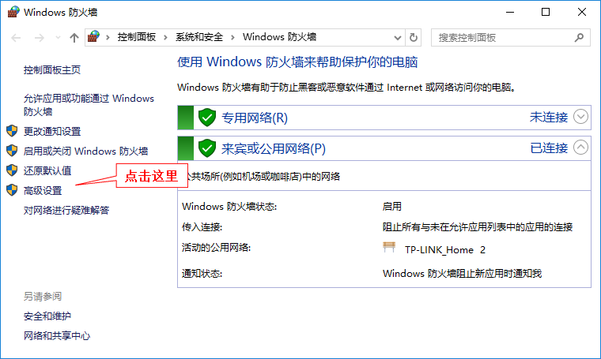
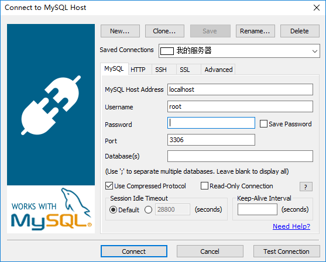
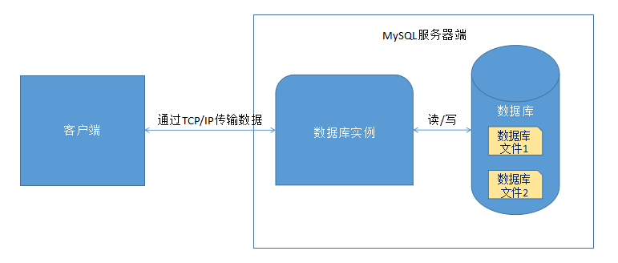
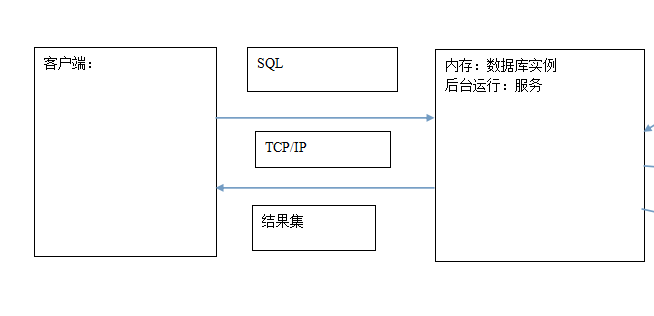

# 1. 数据库介绍和MySQL安装

## 1.1 数据库的概念和一些说明

　　顾名思义，数据库就是“存储数据的仓库”。数据的存储非常重要，可以说，数据就是企业的灵魂，如银行储户信息的存储、员工资料的存储、电商网站商品信息和订单信息的存储等等。Java EE程序基本都需要和数据库打交道。

　　在数据库软件出现之前，程序中单纯用文件来存储需要永久保留的信息，但是当数据量大、并发性高等情况出现时，单纯用文件来存储信息会遇到很多问题。这才导致数据库的产生。数据库专门用于有效的管理数据，关于更多的内容，大家应该阅读书籍《数据库系统概念（本科教学版）》的前几章。

　　现在主流的大部分数据库都是关系型数据库，即数据存放在二维表中，然后表与表之间有一定的关系。当主要的数据都存储在数据库中后，为了按需查询其中的数据，我们需要学习一种新的名叫SQL的数据库查询语言，SQL语言是查询关系型数据库的标准语言，因此SQL是我们下面学习的重点。

　　常见的关系型数据库有：Oracle、SQL Server和MySQL。Oracle数据库是甲骨文公司开发的大型数据库，适合大型应用；SQL Server是微软开发的数据库软件，与Windows平台结合较好；MySQL的社区（Community）版是免费开源的产品，适合中小企业使用。

　　我们以MySQL数据库产品为例进行讲解，可能下面的内容偏重于总结性的知识，因此也建议读者能专门再找一本讲解MySQL基础的书阅读。

## 1.2 MySQL的安装

　　推荐在镜像网站上下载MySQL的Windows 64位MSI安装版本。地址：http://mirrors.sohu.com/mysql 。我们选择MySQL-5.7目录中的文件“mysql-5.7.17-winx64.msi”下载安装。这是目前的最新版本。

　　点击msi文件进行安装，注意选择合适的安装位置（我选择的位置是D:\DevTools\MySQL）。这里的安装过程只相当于解压文件了，具体的安装还需要我们手动执行。步骤如下：

　　（1）进入安装目录，在这里我就进入D:\DevTools\MySQL目录。将MySQL资源中提供的my.ini配置文件复制到此目录（此my.ini文件是按照官方安装工具安装后提取的，之所以我们这里不使用官方的一整套安装工具，是因为官方安装工具中很多东西是我们不需要的），并且在此目录新建一个文件夹名为“Uploads”。注意，如果你选择的安装目录在其他位置，则应修改my.ini文件中凡是出现“D:/DevTools/MySQL”的地方，换成自己的安装目录。

　　（2）进入MySQL安装目录的bin目录，并在此目录用“管理员”身份打开控制台。

　　（3）在控制台执行如下命令：mysqld --initialize --user=mysql --console。执行成功会出现以下信息：

```
2017-02-06T04:10:53.255285Z 0 [Warning] 'NO_ZERO_DATE', 'NO_ZERO_IN_DATE' and 'ERROR_FOR_DIVISION_BY_ZERO' sql modes should be used with strict mode. They will be merged with strict mode in a future release.
2017-02-06T04:10:55.472257Z 0 [Warning] InnoDB: New log files created, LSN=45790
2017-02-06T04:10:55.972246Z 0 [Warning] InnoDB: Creating foreign key constraint system tables.
2017-02-06T04:10:56.175407Z 0 [Warning] No existing UUID has been found, so we assume that this is the first time that this server has been started. Generating a new UUID: 41fff59c-ec22-11e6-a377-201a068ed52e.
2017-02-06T04:10:56.206670Z 0 [Warning] Gtid table is not ready to be used. Table 'mysql.gtid_executed' cannot be opened.
2017-02-06T04:10:56.222258Z 1 [Note] A temporary password is generated for root@localhost: hG#emkEaK1*:
```

　　注意最后一行，“A temporaty password is generated for root@localhost:...”，意思是为root用户用于生成了一个临时的密码，冒号后面就是生成的密码，要记住他，下面需要用到。而root就是MySQL数据库中的“超级管理员账户”，拥有最高的权限，需要谨慎对待。

　　（4）继续执行命令：mysqld --install MySQL，即安装MySQL服务。

　　（5）执行命令：net start MySQL：用于启动MySQL服务，只有启动了MySQL服务，才能成功连接MySQL服务器进行操作。

　　（6）使用root用户名和密码登录数据库。执行：mysql –u root -p，随后根据提示输入刚才生成的密码，即可登录系统。输出如下：

```
D:\DevTools\MySQL\bin>mysql -u root -p
Enter password: ************
Welcome to the MySQL monitor.  Commands end with ; or \g.
Your MySQL connection id is 3
Server version: 5.7.17-log MySQL Community Server (GPL)

Copyright (c) 2000, 2016, Oracle and/or its affiliates. All rights reserved.

Oracle is a registered trademark of Oracle Corporation and/or its
affiliates. Other names may be trademarks of their respective
owners.

Type 'help;' or '\h' for help. Type '\c' to clear the current input statement.

mysql>
```

　　光标会等待在mysql>的后面，等待输入指令以便操作数据库。如果想退出MySQL的“命令行”，直接输入exit回车即可。至此，MySQL已经安装成功。下一步需要修改临时的root密码。这时是在MySQL“命令行”中执行命令。

　　（7）修改root密码需要执行下面一系列操作：

　　执行命令：set password = password('你的密码'); 此命令将会设置root密码为自定义的密码。必须在行末输入分号或者\g才能执行，因为MySQL默认把分号或者\g当做一条语句的结束。

　　执行命令：flush privileges; 用来刷新权限以使设置生效。

　　这样，root密码就修改成功，可用exit命令退出MySQL，再重新用新密码登录。

## 1.3 允许外界远程连接本机MySQL

　　下面设置root用户可远程登录本机MySQL，并具有所有的权限。因为在有些时候，当本机作为服务器时，用其他客户机远程连接本机的MySQL进行操作，这将会非常方便。

　　操作的步骤如下：

　　（1）在MySQL中执行下面两条语句

　　grant all privileges on *.* to 'root'@'%' identified by '你的密码' with grant option;和

　　flush privileges; 刷新权限。

　　说明：“grant all privileges on”用于更改用户对应某数据库表的远程权限。语法模板是：

```sql
grant all privileges on 数据库名.表名 to '用户名'@'IP地址' identified by '密码' with grant option;
```

　　在“数据库名”和“表名”中使用“*”表示针对所有的数据库或表；“用户名”表示要赋给远程访问权限的用户名称；“IP地址”表示可以远程访问的IP地址，其中使用“%”表示针对的是所有的地址；密码就是要赋给远程访问权限的用户对应使用的密码。再例如：

```sql
grant all privileges on testdb.* to 'xlb'@'172.16.52.225' identified by '123456' with grant option;
```

　　执行完后，当然还需要注意使用flush privileges;刷新下权限。

　　最后需要注意：最好注释掉MySQL配置文件（my.ini或my.cnf）中的“bindaddress”和“skip-networking”参数设置。因为“bindaddress”用于设定哪些IP地址被配置，使得MySQL服务器只回应这些IP地址的请求；而“skip-networking”参数将导致所有TCP/IP端口没有被监听，也就是说除了本机，其他客户端都无法用网络连接到本MySQL服务器。因此应该注释掉这些参数。

　　（2）在Windows上，还需要设置防火墙，否则Windows的防火墙默认阻止外界访问MySQL监听的3306端口。设置方法如下：

　　打开“高级安全Windows防火墙”程序。打开方式如下：控制台执行“firewall.cpl”命令，将打开“Windows防火墙”，然后点击右侧的“高级设置”即可打开。



　　需要在“高级安全Windows防火墙”中新建入站规则，即在“入站规则”中“新建规则”（因为目的是允许外界通过3306端口访问本机的MySQL，因此是“入站”）：


　　在弹出的窗口中选择“端口”，然后进行下一步：


　　在此步中默认选择TCP（因为数据库连接必须选择可靠的协议，而不能用UDP。这点可以用下面的命令验证：netstat -ano|findstr "3306"。此命令用于查看和端口3306相关的连接），在“特定端口中”指定3306这个端口，即：


　　然后在下面的配置中用默认的选项即可完成配置（默认选项即允许外部访问此端口）。最后一步是给这个规则起个名字和它的描述信息，这个自己写就好了。这样，我们就能在“入站规则”中看到我们建立的规则，此时外界连接本机的MySQL就可正常连接。

## 1.4 关于MySQL服务和卸载MySQL

　　默认MySQL服务会在开机时自启，所以我们可直接连上MySQL服务器。为了避免占用系统内存，建议在不使用MySQL时关闭MySQL服务。关闭的方式是执行命令：net stop MySQL。和启动MySQL服务命令类似。当然，若需要连接MySQL服务器，别忘了执行net start MySQL开启服务，否则无法连接服务器。

　　我们也可在Windows提供的“服务”程序中对系统中的各项服务进行管理，包括MySQL服务。可以在“服务”中开启和停止MySQL服务，也可以设置MySQL服务的启动类型为“手动”，这样MySQL不会在开机时自启，而是需要手动开启。

　　若想卸载MySQL服务器时，需要按照下述步骤进行：

　　（1）关闭MySQL服务；

　　（2）用管理员身份执行命令：sc delete MySQL，此命令用于删除MySQL服务；

　　（3）删除MySQL的整个安装目录。

# 2. 如何使用数据库

　　前提还是希望大家有数据库概念的知识。本章讲解简单的对于数据库的使用，这里全部是基于MySQL讲解的。

## 2.1 连接到MySQL

　　在第一章学习中，已经安装好了MySQL。这样每次使用MySQL时，需要先开启MySQL的服务。我们使用MySQL时，一般要用“客户端”，通过TCP/IP连接，使用账号和密码登录到MySQL服务器上。

　　之前我们都是用MySQL自带的“mysql”命令行客户端，完全在控制台通过命令行方式操作MySQL。登录时，我们使用命令：

```
mysql -u用户名 -p密码
```

　　进行登录，例如“mysql -uroot -p123456”，注意，“-u”与“用户名”之间、“-p”与“密码”之间是没有空格的（其中，“-u”与“用户名”之间可以有空格，但是“-p”与“密码”之间绝对不能有空格）。当然，也可以省略密码，这样MySQL命令行客户端稍后就会提示你输入密码。

　　同样，为了方便地在任意命令行目录都能使用mysql等命令，可以将MySQL安装目录下的bin目录添加到Path环境变量中。

　　但是完全通过命令行操作确实有些不便，且不直观，这时可以使用带GUI的可视化软件连接数据库进行操作。“SQLyog”就是一款可视化的MySQL客户端，安装好该软件后，其出现的连接界面如下：



　　默认地址是localhost，就是本机，也可以改为127.0.0.1,。默认用户名就是root，然后需要自己输入root的密码。端口就是默认的3306，Databases一项不需要填写。

　　写好密码后，可点击Connect按钮连接上数据库。如果弹出错误信息，则表示连接失败，应检查MySQL服务是否开启，并且检查密码是否正确。如果想新建一个连接信息，则点击左上角的“New...”按钮。

　　连上数据库后，软件界面如下：


　　以上介绍中的功能是最常用的也最方便。

　　当然还有其他的GUI工具，常用的还有官方的“MySQL Workbench”工具、Navicat等。别忘了，在没有GUI软件可用时，命令行总是可用的工具。

## 2.2 SQL——操作数据库的语言

　　前面说过，SQL语言是查询关系型数据库的标准语言。SQL的全称是“Structured Query Language”，意思是“结构化查询语言”，它用于定义、操作和管理关系数据库。SQL标准的制定是为了通用性，它有利于让数据库使用者只需要掌握SQL就能基本操作所有的关系型数据库。当然，这要各个关系型数据库本身支持标准SQL才行。

　　目前，所有的关系型数据库都对SQL标准有较好的支持，但是各种关系型数据库也都基于自己的产品对SQL进行了扩展，导致了不同数据库系统之间的SQL不能完全相互通用（特别是一些特殊的功能，至于一些基础性的功能差别很小）。而各个数据库系统中扩展的一部分，就称为该数据库系统的“方言（Dialect）”。

　　基础的SQL一般有分为DDL和DQL两种语句。DDL（Data Definition Language）是“数据定义语言”，它是用来创建、修改、删除数据库和数据库表的SQL语言；DML（Data Manipulation Language）是“数据操纵语言”，它用来对数据库表中的数据进行增加、删除、修改和查询等操作。

　　DDL和DML是重点学习的内容，其中对数据的查询时最常用的，因此也有人将数据查询语句专门提出来，叫做“数据查询语言（DQL，Data Query Language）”。

# 3. 使用SQL操作数据库

　　这里我们就学习使用SQL，以MySQL为例。其中大部分内容都是基础、标准的SQL，基本都能在各个数据库中完全通用。

## 3.1 数据定义语言DDL

　　DDL用于创建数据库和表、更改数据库和表的结构、删除数据库和表。常用的关键字有CREATE、ALTER、DROP和TRUNCATE。在下面SQL中，我们将关键字用大写来表示（SQL语句关键字不区分大小写）。

### 3.1.1 数据库管理

　　MySQL中可以创建多个数据库，一般一个数据库中就存储一个系统的业务数据。其中，一个数据库中又可创建多张表，表中再存储具体的数据。对于操作数据库，一般用到以下语句。

　　（1）查询MySQL中所有的数据库：

```sql
SHOW DATABASES;
```

　　该命令会显示MySQL中所有的数据库。即使目前我们没有创建过数据库，但还是能看到几个MySQL自带的数据库，例如mysql、test等数据库，它们用于存储MySQL本身的必要信息。

　　（2）创建数据库。

　　使用语句“CREATE DATABASE 数据库名”来创建一个数据库。例如：

```sql
CREATE DATABASE mydemo;
```

　　该语句会创建一个名为mydemo的数据库。此时我们再用“SHOW DATABASES;”命令就会看到这个数据库。

　　创建数据库时，可以指定此数据库使用的字符集，例如：

```sql
CREATE DATABASE mydemo CHARACTER SET utf8;
```

　　这时创建的mydemo数据库就会使用UTF-8字符集。如果不指定字符集，MySQL将会使用安装MySQL时配置的字符集。由于安装时，我们使用的配置是UTF-8编码的（我们提供的my.ini中也是使用了UTF-8字符集配置），因此即使不指定编码，该MySQL也会使用UTF-8。

　　同样，还能指定数据库使用的校对规则，可以简单理解为校对规则是用来对字符串进行排序的，一般也用不到。例如下面的语句创建的mydemo数据库就使用了GBK字符集，且校对规则为gbk_chinese_ci：

```sql
CREATE DATABASE mydemo CHARACTER SET gbk COLLATE gbk_chinese_ci; 
```

　　当然不指定校对规则时，就会用字符集对应的默认的校对规则。可以使用：

```sql
SHOW CHARACTER SET;
```

　　查看MySQL支持的字符集和对应的默认排序规则。

　　如果想了解更多信息，可直接查阅官方文档，其地址是“ https://dev.mysql.com/doc/ ”，其中的“MySQL Reference Manual”链接就是官方文档。官方文档详细介绍了关于MySQL的几乎所有内容。其实上面的SQL语句格式也是按照文档介绍的，可参见官方文档第十四章的内容（本教程基于MySQL 5.7的官方文档），该章讲述了SQL语法，例如“14.1.11 CREATE DATABASE Syntax”就讲了创建数据库的语法。官方文档也可下载为html和pdf形式以便在本机离线阅读。MySQL 5.7的官方文档只有英文，读者可借此提高英文阅读能力，如果实在觉得阅读困难，也可阅读本教程提供的中文文档，该文档是以前的开发者基于较老的MySQL 5.1版文档翻译的，其中大部分内容和现在没有什么变化（除了章节新增导致序号不同和部分更新内容外），可做参考阅读。

　　对于创建数据库，一般来说，我们只需要使用简单的“CREATE DATABASE 数据库名”即可。在使用GUI工具创建数据库时，有时也会让你选择字符集和校对规则。如果想了解更多关于字符集和校对规则的信息，可以自行研究官方文档和查阅网络资源。

　　（3）使用“SHOW CREATE DATABASE 数据库名”可以查看数据库的创建细节，如字符集等信息。

　　（4）修改数据库默认编码，使用“ALTER DATABASE 数据库名 DEFAULT CHARACTER SET 字符集名”。例如：

```sql
ALTER DATABASE mydemo DEFAULT CHARACTER SET gbk;
```

　　（5）删除数据库，使用“DROP DATABASE 数据库名”，例如：

```sql
DROP DATABASE mydemo;
```

　　注意谨慎使用，因为删除库后，该库中的所有数据都将被删除。

### 3.1.2 数据库表管理

　　一个数据库中可存储多张表，然后不同的表中再存储数据，因此我们再学习数据库表的管理。

　　管理表之前，应该先选择一个数据库。使用“USE 数据库名”来选定要使用的数据库，例如：

```sql
USE mydemo;
```

　　将选中mydemo数据库，意味着后续的表操作都是在mydemo数据库中操作的。我们可以使用：

```sql
SELECT database();
```

　　查询到当前选择的数据库（如果没有选择数据库，将显示空值NULL）。

　　（1）创建表。

　　创建表时需要定义表的每列的列名和该列数据的数据类型。因此，首先要了解MySQL中的数据类型。官方文档的第12章“Data Types”中详细解释了MySQL中的数据类型，这里我们选择简单常用的进行讲解。

　　1. 数值类型。

　　在数据库中，数值类型还需要进一步选择具体的整型、浮点数和定点数类型。

　　对于整型，常用以下几种，表格中一目了然：

|       数据类型       |   存储  |    默认表示范围    |
|:--------------------:|:-------:|:------------------:|
|        TINYINT       |  1字节  |     -128 ~ 127     |
|       SMALLINT       |  2字节  |   -32768 ~ 32767   |
|       MEDIUMINT      |  3字节  | -2^23 ~ (2^23 - 1) |
| INT（和INTEGER同义） |  4字节  | -2^31 ~ (2^31 - 1) |
|        BIGINT        |  8字节  | -2^63 ~ (2^63 - 1) |

　　按需选择类型，一般项目中会直接简单地使用INT类型。

　　对于浮点数，使用FLOAT或DOUBLE类型。存储FLOAT和DOUBLE类型的数据时，通常分别占用4个字节和8个字节的存储空间。FLOAT类型能保证6位的精度，DOUBLE类型能保证16位的精度，它们表示数的范围较大。

　　还能使用“FLOAT(M,D)”或者“DOUBLE(M,D)”的格式指定数据类型，其中M指定数据的长度（位数），D指定数据的小数部分的长度。例如“FLOAT(7,4)”能很好地保存数据“123.5678”，该数就是一共7位长度，其中小数部分是4位。存储的数据大小不能超过指定的长度，如果是小数部分超过指定的精度，则四舍五入。

　　最后，有时还需要使用定点数。定点数用于保存必须为确切精度的值。因为浮点数虽然表示的范围大，但是可能存在误差，如果希望数据的准确性，就需要使用定点数数据类型。这和Java中的Decimal含义相似。

　　在MySQL中，使用DECIMAL表示定点数，它和NUMERIC是同义词。DECIMAL也使用“DECIMAL(M,D)”的形式，M表示十进制总位数，D表示其中小数部分占用的长度。同样，存储的数据大小不能超过指定的长度，如果是小数部分超过指定的精度，则四舍五入。如果省略M和D，默认M是10，D是0，即DECIMAL相当于DECIMAL(10, 0)。

　　此外，数值类型还能使用UNSIGNED、ZEROFILL等关键字修饰，表示使用无符号类型、用0填充等的含义，可以自行了解。

　　2. 日期时间类型。

　　MySQL中有关日期时间类型的有DATETIME、TIMESTAMP、DATE、TIME和YEAR。

　　其中DATETIME和TIMESTAMP都能完全地表示日期和时间。保存时间时，SQL中一般是写符合日期时间的字符串来保存，推荐的格式是“YYYY-MM-DD HH:MM:SS”，例如'2017-11-28 20:51:11'，这个在后面也会见到，并且MySQL默认也是这样显示的。而datetime和timestamp的区别是：

　　A. DATETIME的日期范围是1000~9999年，TIMESTAMP的时间范围是1970~2038年。

　　B. DATETIME存储时间与时区无关，TIMESTAMP存储时间与时区有关，显示的值也依赖于时区。

　　C. DATETIME使用8字节的存储空间，TIMESTAMP的存储空间为4字节。

　　D. DATETIME的默认值为null；TIMESTAMP的默认值为当前时间。

　　那么DATE、TIME和YEAR这些数据类型呢？如果你只想存储日期（不含时间），就用DATE类型，同理，如果你只想存储时间（不含日期）或者年份，就可以直接使用TIME和YEAR。例如，可以将'2017-11-28'存储到DATE类型中，可以将'21:09:33'存储到TIME类型中。

　　如果将'YYYY-MM-DD HH:MM:SS'类似的日期时间DATETIME/TIMESTAMP数据存储到DATE中，则只会存储其中的日期，而如果将'YYYY-MM-DD'类似的日期DATE数据存储到DATETIME/TIMESTAMP中，则其中的时间部分就是'00:00:00'。

　　但是注意，如果TIME类型的数据，就不能像上面那样和DATETIME/TIMESTAMP/DATE“相互存储”了，这是因为实际上MySQL并不关注时间日期之前的分隔符，我们之前推荐的格式只是为了统一方便。例如，'2017:12:8:12:12:12'这样的数据也能正确的存储到DATETIME类型中，还是会表现为“2017-12-02 12:12:12”。因此如果将TIME数据存储到DATETIME中，MySQL会直接把它当做前面的日期进行存储，这样有可能出错，例如“23:23:21”就不能存储。相反，DATETIME、TIMESTAMP和DATE这些类型的数据也不能存到TIME中。

　　3. 字符串类型和二进制类型。

　　A. CHAR和VARCHAR类型

　　CHAR和VARCHAR都用于存储字符串，其中CHAR存储定长字符串，长度范围是0~255，即最大能存储255个字符。使用“CHAR(M)”指定存储字符串的长度，例如“CHAR(5)”只允许存储长度为5的字符串，如果不足5，就会在其后补充空格，因此有时查询后还需要去掉空格。

　　VARCHAR用于存储可变长度字符串，即可存储不同长度的字符串。VARCHAR最大能存储65535个字节的数据（注意是字节，不是字符长度，由于字符集不同，因此所能存储的字符个数是不同的）。也可以使用“VARCHAR(M)”格式，M指定存储的字符串最大的长度。在实际中，VARCHAR是最常用的。

　　B. BINARY和VARBINARY类型。

　　BINARY和VARBINARY类似于CHAR和VARCHAR，不同的是，它们存储的不是字符字符串数据，而是二进制串。因此，它们没有字符集。

　　C. TEXT和BLOB

　　当要存储大量的字符串或者二进制串时，可能会需要TEXT和BLOB，它们类似于VARCHAR和VARBINARY的区别。

　　TEXT用于存储大量的字符串，有四种TEXT类型：TINYTEXT、TEXT、MEDIUMTEXT和LONGTEXT。BLOB用于存储大的二进制对象（例如图片等），同样也有四种BLOB类型：TINYBLOB、BLOB、MEDIUMBLOB和LONGBLOB。

　　它们的最大存储范围如下：

　　TEXT：

|    类型    |  最大存储范围  |
|:----------:|:--------------:|
|  TINYTEXT  |    255个字符   |
|    TEXT    |   65535个字符  |
| MEDIUMTEXT | 2^24 - 1个字符 |
|  LONGTEXT  | 2^32 - 1个字符 |

　　BLOB：

|    类型    |          最大存储范围          |
|:----------:|:------------------------- ----:|
|  TINYBLOB  |        256B （2 ^ 8字节）      |
|    BLOB    |        64KB （2 ^ 16字节）     |
| MEDIUMBLOB |       16M （2 ^ 24 字节）      |
|  LONGBLOB  |        4G （2 ^ 32字节）       |

　　设计表的时候，应该为每列选择合适的数据类型，以便提高效率，不要一味地使用字符串类型。

　　创建表使用“CREATE TABLE”语句，格式是：

```sql
CREATE TABLE 表名(
  列名1 数据类型,
  列名2 数据类型,
  ......
)
```

　　例如，下面使用SQL创建一个员工（employee）表，该表可存储员工的编号（保证员工信息的唯一）、姓名、性别、生日、工资和简历等信息，SQL如下：

```sql
CREATE TABLE employee(
  eid INT,
  name VARCHAR(100),
  gender VARCHAR(10),
  birthday DATE,
  salary DECIMAL(12, 2),
  resume TEXT
)
```

　　运行上述SQL后，就能在选定的数据库中创建一张employee表。

　　有时创建表时，表名和字段名可能和关键字冲突，例如要创建一张订单（Order）表，就不能这样写SQL语句：“CREATE TABLE order (...)”，因为SQL中，“ORDER”是关键字，这样使用会出错。MySQL中的解决办法就是将这些表名或字段名用反引号“`”包含起来，让它们不再被MySQL“认为”是关键字。推荐写创建表的SQL时都将表名和字段名用反引号包含起来，例如：

```sql
CREATE TABLE `order` (
  `id` int,
  `name` varchar(100)
);
```

　　（2）显示该数据库中所有的表，使用语句：

```sql
SHOW TABLES;
```

　　这样就能查询到刚创建的employee表。

　　（3）查看表的结构，使用“DESC 表名”。例如使用：

```sql
DESC employee;
```

　　语句就能看到employee表的结构。DESC这个关键字在后面查询时还用别的用法。

　　（4）查看表的创建细节，使用“SHOW CREATE TABLE 表名”，例如：

```sql
SHOW CREATE TABLE employee;
```

　　可以查询表所用的编码等信息。

　　（5）修改表。一般是修改表的列和名称等，需要使用ALTER关键字。

　　A. 添加一列，使用“ADD COLUMN”，例如：

```sql
ALTER TABLE employee ADD COLUMN hobby VARCHAR(100);
```

　　表示给employee表加上hobby一列字段，其数据类型是VARCHAR(100)。

　　B. 删除一列，使用“DROP COLUMN”，例如：

```sql
ALTER TABLE employee DROP COLUMN hobby;
```

　　表示删除hobby字段。

　　C. 修改字段的数据类型，使用“MODIFY COLUMN”，例如：

```sql
ALTER TABLE employee MODIFY COLUMN salary VARCHAR(100);
```

　　表示将salary字段改成字符串类型。

　　D. 修改字段名称，使用“CHANGE COLUMN”，例如：

```sql
ALTER TABLE employee CHANGE COLUMN resume age INT;
```

　　表示将“resume”列改为“age”，且改变数据类型为INT，数据类型是不能省略的，即使不改变数据类型，也要写上。

　　E. 修改表名，使用“RENAME TO”，例如：

```sql
ALTER TABLE employee RENAME TO boss;
```

　　表示将employee表名修改为boss。

　　F. 修改表的字符集，如：

```sql
ALTER TABLE employee CHARACTER SET utf8;
```

　　上面的语句中，其中的“COLUMN”是可以省略的。

　　（6）删除表，使用“DROP TABLE 表名”，例如：

```sql
DROP TABLE employee;
```

　　将删除employee表。

## 3.2 简单的DML数据操纵语言

　　数据管理就是数据的增删改查，即CRUD【Create、Read、Update和Delete】。这里学习表数据的增删改操作和简单的查询。

　　（1）插入。向表中插入数据使用“insert into 表名(列) values(值)”的格式，列和值是一一对应的，例如插入数据到employee中：

```sql
INSERT INTO employee(eid, name, gender, birthday, salary, resume) VALUES(1, '张三', '男', '1995-01-02', 888888.88, 'Java爱好者');
```

　　如果每个字段都插入数据，则表名后可以省略指定列名，即：

```sql
INSERT INTO employee VALUES(1, '张三', '男', '1995-01-02', 888888.88, 'Java爱好者');
```

　　如果想查看表中的数据，则执行：

```sql
SELECT * FROM employee;
```

　　“SELECT 列名 FROM 表”是最简单的查询语句了，其中“*”表示查询所有列。

　　可以看出在SQL中，字符串和日期时间数据都要包含在单引号中（不能是双引号）。

　　（2）更新（修改）。使用“UPDATE 表名 SET 列名 = 值”，例如：

```sql
-- 将表中所有人的年龄设置为25
UPDATE student SET age = 25;
-- 加上WHERE子句指定条件。这里只修改名字为'张三'的人年龄为30
UPDATE student SET age = 30 WHERE name = '张三';
-- 也可同时修改多个列。
UPDATE student SET name = '李四', age = 40 WHERE id = 1;
```

　　从上面的例子中看出，MySQL中的单行注释以“--”（两个横杠）开头，需要注意的是，“--”后面必须有一个空格，否则不被认为是注释。

　　（3）删除。使用“DELETE FROM 表名”删除数据，例如：

```sql
-- 删除表中所有数据
delete from student;
-- 带where条件的删除
delete from student where sname = '张三';
```

　　如果想删除表中数据，之前说使用DELETE关键字，当使用DELETE删除全部数据再插入时，自增列的值还是会从删除前末次插入的自增值开始进行自增，而不是从0开始。这是因为DELETE只简单地删除表数据。删除表数据库还有一种方式就是使用TRUNCATE关键字，用法和DELETE相同，但TRUNCATE操作会重新建立表结构，插入新的自增值时会从0开始。

　　为了验证上述语句对数据的更改，都可以使用“SELECT * FROM student”查询。

# 4. 小知识库

## 4.1 MySQL中的大小写问题

　　首先SQL语句中（特别是关键字）是不区分大小写的。MySQL中，默认情况下，列名和数据表中的数据也是不区分大小写的。例如以后我们会把密码存储在数据库中，当我们利用数据库中的密码来验证用户时，即使用户输入的密码大小写不符合也是可以的。

　　当然，可以通过设置来控制MySQL是否对列名和数据区分大小写，读者可以查阅资料设置。

## 4.2 MySQL中注释的写法

　　（1）单行注释。之前讲过MySQL中使用“-- ”作为单行注释的开始（注意两个横杠后面至少要有一个空格）。实际上MySQL也支持以“#”作为单行注释的开头，使用“#”是不要求后面有一个空格的，例如：

```sql
SELECT * FROM student; #查询学生
```

　　（2）多行注释，和很多编程语言一样，使用“/*  */”即可，例如：

```sql
/* 这是多行注释
*/
```

## 4.3 服务器和客户端的编码问题

　　可以说MySQL分为服务器端和客户端。安装完MySQL并启动服务后，MySQL服务器端就一直在运行了。我们使用MySQL时，都是使用一个MySQL客户端连接到MySQL服务器端，使用TCP协议进行通信，也就是利用MySQL客户端来操作MySQL数据库。

　　在Windows中我们利用控制台，使用mysql命令连接到本机的MySQL服务端，实际上mysql.exe就是MySQL本身提供的MySQL客户端程序，便于我们直接在终端操作。（很明显，MySQL中提供的mysqld.exe相当于是服务器端程序，我们使用它创建MySQL服务，而mysql.exe就相当于客户端程序了）。

　　但是我们使用“控制台 + MySQL命令行客户端”时，如果存储中文数据再查询时，就会产生中文乱码问题。这是怎么回事呢？我们明明在安装配置MySQL时，均配置了UTF-8作为默认的编码啊！我们使用：

```sql
SHOW VARIABLES LIKE 'character_set%';
```

　　语句来查询MySQL使用的编码，结果显示：

|       Variable_name      |               Value               |
|:------------------------:|:---------------------------------:|
|   character_set_client   |              utf8mb4              |
| character_set_connection |              utf8mb4              |
|  character_set_database  |                utf8               |
| character_set_filesystem |               binary              |
|   character_set_results  |              utf8mb4              |
|   character_set_server   |                utf8               |
|   character_set_system   |                utf8               |
|    character_sets_dir    | E:\DevTools\MySQL\share\charsets\ |

　　其中，character_set_client表示客户端使用的编码，这里是utf8mb4（mb4是most bytes 4的意思，用来兼容四字节的unicode；uft8mb4是utf8的超集，因此utf8转换成utf8mb4是无需操作的，可认为utf8mb4兼容utf8）编码。客户端编码即表示MySQL认为客户端发送过来的数据的编码。character_set_connection表示数据库连接时使用的编码；character_set_database表示数据库使用的编码；character_set_results表示查询的结果集使用的编码；character_set_server表示服务器端使用的编码；character_set_system表示系统使用的编码。

　　纵观上述的编码设置，都是没问题的，因为都是兼容utf8编码，不应该出现乱码问题。实际上问题是出在Windows的控制台上。Windows控制台中的字符默认是使用本地系统的编码（中文系统使用的是GBK编码），这样就导致了我们从控制台发送给服务器的编码实际上是GBK编码的。而MySQL服务器内部和与客户端传输过程中，采用的编码都是UTF8，因此会出现中文乱码问题。

　　如何解决这个问题呢？方式一是在控制台中使用“chcp 65001”命令，将控制台使用的字符编码改为UTF（如果想改回GBK编码则使用“chcp 936”命令）；方式二是设置MySQL服务器的“character_set_client”和“character_set_results”为gbk编码，意思是告知MySQL服务器，客户端使用的编码和结果集编码是gbk。设置方法如下：

```sql
SET character_set_client=gbk; 
SET character_set_results=gbk;
```

　　这样就不会出现乱码了。但这种方式是暂时性的，只在本次会话中有效，每次登录MySQL都要重新设置。

　　但在实际中，不会直接在Windows上使用控制台（一般会在Linux系统中直接使用命令行操作，Linux是完全UTF8编码的），一般使用我们前面介绍的图形化MySQL客户端，这些可视化客户端就会默认完全使用UTF8编码，方便实用。而且就算在Windows上使用命令操作MySQL，也不推荐使用Windows控制台，可以使用第三方控制台软件，基本都会使用UTF8编码。

## 4.4 数据库和实例这两个概念的理解

　　数据库需要永久保存数据，因此实际上数据最终还是存储在硬盘的物理文件中的，所以数据库可以理解为硬盘上的文件（其中数据时怎么编码保存的，当然是数据库本身的事情，要考虑很多因素）。

　　那如果要使用数据库，查询、修改其中的数据应该怎么做呢？这时候还需要一个专门运行在内存中的程序，它负责接受客户端连接、读取和保存数据、保证响应速度等等操作（包括各种各样的管理功能），这个运行的程序就可理解为数据库的实例。之所以需要实例，是因为硬盘上的文件数据必须在内存中才能操作。

　　数据库实例就是一组后台进程，它相当于是数据库的运行环境。我们在本机上安装配置完MySQL后，数据库实例表现为：通过一个后台服务（例如Windows服务）向外界提供数据库服务。这个服务是一直运行的，它等待着客户端的连接。实例与客户端连接是通过可靠的TCP协议实现的（不可能用UDP协议，因为UDP是不可靠的，不适合数据库这种对稳定性、安全性要求高的应用），因此实例是需要占用端口的，比如MySQL默认占用的端口就是3306，通过该端口进行通信。

　　以上的内容可以用一个图示总结一下：



　　MySQL默认只创建了一个实例，但MySQL是单进程多线程的，因此一个MySQL服务可以为多个客户端提供服务。如果想在一台机器上运行多个MySQL实例，可以安装多个MySQL，分别配置不同的服务名和端口；当然也可以只安装一个MySQL程序，在这一个MySQL中配置多个服务和分配端口等，读者可自行研究。一般，一个实例可操作一个或多个数据库（Oracle是一个实例只对应一个数据库，且Oracle是多进程的），在集群情况下，多个实例操作一个或多个数据库。这段内容就显得比较高级了，需读者以后深入研究。

　　如果从应用开发者的角度来看，通过SQL操作数据库可以简单地用下图来示意：

